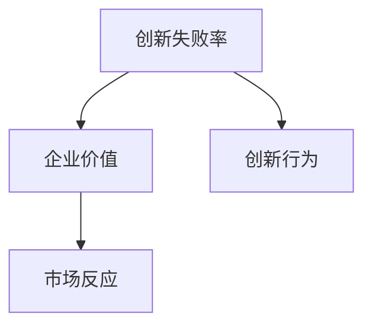
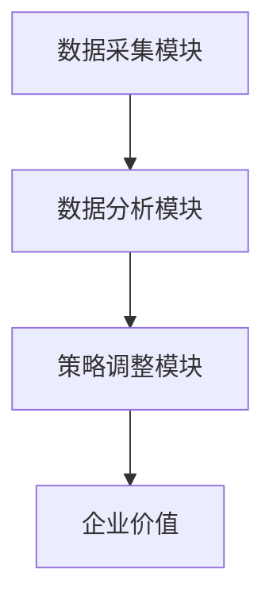

                 


# 彼得林奇对公司创新失败率的容忍度分析

## 关键词：创新失败率、彼得·林奇、创新容忍度、企业价值、创新策略

## 摘要：  
本文通过分析彼得·林奇的创新容忍度理论，探讨创新失败率对企业创新行为和企业价值的影响。文章首先定义了创新失败率的概念，分析了创新失败的特征和分类，然后结合彼得·林奇的投资理念，提出了创新失败率与企业价值之间的数学关系模型。通过对创新失败率的系统分析和实际案例研究，文章得出了创新失败率与创新容忍度的正相关关系，并提出了企业在创新过程中应如何平衡创新失败率与创新容忍度的策略建议。本文最后总结了创新失败率的计算方法和创新容忍度的数学模型，并提出了未来研究的方向。

---

# 第一部分: 背景介绍与核心概念

---

# 第1章: 创新失败率与容忍度的背景分析

## 1.1 创新失败率的定义与问题背景

### 1.1.1 创新失败的定义与特征  
创新失败是指企业在创新过程中未能达到预期目标或市场反应不佳的情况。创新失败的特征包括：  
- **目标未达成**：创新项目未能实现预定的商业目标或技术突破。  
- **资源浪费**：创新失败通常伴随着时间和资金的浪费。  
- **市场反应冷淡**：创新成果未能获得市场的认可。  

### 1.1.2 创新失败在企业中的普遍性  
创新失败在企业中非常普遍。根据统计，大约60%~80%的创新项目会以失败告终。创新失败的原因多种多样，包括市场需求不匹配、技术实现难度大、竞争环境恶化等。  

### 1.1.3 创新失败对企业发展的潜在影响  
创新失败可能导致企业资源浪费、市场地位下降，甚至影响企业的长期发展。然而，创新失败也可能是企业积累经验、优化创新流程的机会。

---

## 1.2 彼得·林奇的创新容忍度理论  

### 1.2.1 彼得·林奇投资理念的核心思想  
彼得·林奇是美国著名投资经理人，以其在富达投资公司的长期成功而闻名。他认为，投资的本质是寻找那些具有持续增长潜力的公司，而创新是企业增长的核心动力。  

### 1.2.2 创新失败率与企业价值的关系  
林奇认为，创新失败率与企业价值密切相关。企业如果能够容忍适度的创新失败，往往能够在竞争中占据优势，从而提升企业价值。  

### 1.2.3 林奇对创新失败的容忍度分析框架  
林奇提出了一个创新容忍度分析框架，包括以下内容：  
- **创新失败的识别**：企业需要能够准确识别创新失败的早期信号。  
- **创新失败的应对策略**：企业在创新失败后应迅速调整策略，避免资源浪费。  
- **创新失败的容忍度优化**：企业需要找到创新失败率与企业价值的最佳平衡点。  

---

## 1.3 本章小结  

本章主要介绍了创新失败率的定义、普遍性和对企业发展的影响，以及彼得·林奇的创新容忍度理论。通过这些分析，我们初步了解了创新失败率与企业价值之间的关系，并为后续分析奠定了基础。

---

# 第2章: 创新失败率的核心概念与联系  

## 2.1 创新失败率的构成要素  

### 2.1.1 创新过程的关键环节  
创新过程通常包括需求分析、技术研发、市场推广等环节。每个环节都可能成为创新失败的来源。  

### 2.1.2 创新失败的分类与特征  
创新失败可以分为技术失败、市场失败和管理失败。技术失败通常发生在技术研发阶段，市场失败则发生在市场推广阶段，管理失败则与企业内部管理问题相关。  

### 2.1.3 创新失败率的计算公式  
创新失败率的计算公式为：  
$$ 创新失败率 = \frac{失败创新项目数}{总创新项目数} \times 100\% $$  

---

## 2.2 创新容忍度的实体关系分析  

### 2.2.1 创新失败与企业价值的实体关系图  
以下是创新失败与企业价值的实体关系图：  


### 2.2.2 企业创新行为与市场反应的关联性  
企业创新行为与市场反应之间存在较强的关联性。成功的创新行为会带来积极的市场反应，而创新失败则会导致市场反应冷淡。

### 2.2.3 创新失败率与企业创新策略的关系  
创新失败率与企业创新策略密切相关。企业需要根据创新失败率调整创新策略，优化创新流程，降低创新失败率。

---

## 2.3 创新失败率与企业创新行为的数学模型  

### 2.3.1 创新失败率的公式表示  
$$ 创新失败率 = \frac{失败创新项目数}{总创新项目数} \times 100\% $$  

### 2.3.2 创新容忍度与企业价值的数学关系  
$$ 企业价值 = f(创新失败率, 创新容忍度, 市场反应) $$  

---

## 2.4 本章小结  

本章详细分析了创新失败率的构成要素，探讨了创新容忍度与企业价值之间的关系，并通过数学模型进一步解释了创新失败率与企业创新行为的关系。

---

# 第3章: 创新失败率的算法原理与数学模型  

## 3.1 创新失败率的算法原理  

### 3.1.1 创新失败率的统计方法  
创新失败率的统计方法包括：  
- **样本调查法**：通过随机抽样调查企业的创新项目，计算创新失败率。  
- **历史数据分析法**：通过分析企业过去几年的创新项目数据，计算创新失败率。  

### 3.1.2 创新失败率的预测模型  
创新失败率的预测模型可以基于历史数据和市场环境进行预测。例如，使用时间序列分析模型预测未来的创新失败率。

---

## 3.2 创新容忍度的数学模型  

### 3.2.1 创新容忍度的定义与度量  
创新容忍度可以定义为企业在创新过程中对失败的接受程度。创新容忍度的度量可以通过对企业创新策略、研发投入和市场反应的综合分析来实现。

### 3.2.2 基于概率论的创新容忍度计算  
$$ P(创新成功 | 创新容忍度 = T) = \frac{T}{T + (1 - T)} $$  

---

## 3.3 创新失败率与容忍度的协同关系  

### 3.3.1 创新失败率与容忍度的正相关性  
创新失败率与创新容忍度呈正相关关系。企业容忍度越高，创新失败率也越高。

### 3.3.2 创新容忍度对企业创新行为的激励作用  
创新容忍度高的企业更愿意尝试新的创新项目，从而激励企业创新行为。

### 3.3.3 创新失败率对企业创新策略的影响  
创新失败率高的企业需要调整创新策略，降低创新失败率。

---

## 3.4 本章小结  

本章从算法原理和数学模型的角度，详细分析了创新失败率的计算方法和创新容忍度的度量方法，并探讨了创新失败率与容忍度之间的协同关系。

---

# 第4章: 创新失败率与企业创新行为的系统分析  

## 4.1 创新失败率的系统分析框架  

### 4.1.1 创新失败率的系统构成  
创新失败率的系统构成包括：  
- **输入**：企业创新项目、市场需求、竞争环境。  
- **输出**：创新失败率、企业价值变化。  

### 4.1.2 创新失败率的系统输入与输出  
系统输入包括企业的创新项目、市场需求和竞争环境；系统输出包括创新失败率和企业价值变化。

### 4.1.3 创新失败率的系统边界与假设  
系统边界包括企业的创新项目和市场反应；假设包括企业创新项目的独立性和市场环境的稳定性。

---

## 4.2 创新容忍度的系统架构设计  

### 4.2.1 创新容忍度的系统功能模块  
创新容忍度的系统功能模块包括：  
- **数据采集模块**：采集企业的创新项目数据。  
- **数据分析模块**：分析创新失败率和创新容忍度。  
- **策略调整模块**：根据分析结果调整创新策略。  

### 4.2.2 创新容忍度的系统交互流程  
1. 数据采集模块采集企业的创新项目数据。  
2. 数据分析模块分析创新失败率和创新容忍度。  
3. 策略调整模块根据分析结果调整创新策略。  

### 4.2.3 创新容忍度的系统架构图  


---

## 4.3 创新失败率与容忍度的系统接口设计  

### 4.3.1 创新失败率数据接口  
创新失败率数据接口包括：  
- **输入接口**：企业创新项目数据。  
- **输出接口**：创新失败率计算结果。  

### 4.3.2 创新容忍度数据接口  
创新容忍度数据接口包括：  
- **输入接口**：企业创新策略数据。  
- **输出接口**：创新容忍度计算结果。  

### 4.3.3 系统接口的交互协议  
系统接口的交互协议包括数据格式、数据传输方式和数据加密方式。

---

## 4.4 本章小结  

本章从系统分析的角度，详细探讨了创新失败率与创新容忍度的系统架构设计，包括系统功能模块、系统交互流程和系统架构图。

---

# 第5章: 创新失败率的项目实战与案例分析  

## 5.1 项目环境与数据准备  

### 5.1.1 数据来源与数据清洗  
数据来源包括企业的创新项目数据和市场反应数据。数据清洗包括去除无效数据和填补缺失数据。

### 5.1.2 数据预处理与特征提取  
数据预处理包括数据标准化和数据归一化；特征提取包括创新项目数、创新失败数和市场反应指数。

### 5.1.3 数据存储与管理  
数据存储与管理采用数据库存储，使用MySQL或MongoDB进行数据管理。

---

## 5.2 创新失败率的代码实现  

### 5.2.1 环境安装与配置  
环境安装与配置包括安装Python、Pandas、Matplotlib和Scikit-learn库。

### 5.2.2 创新失败率计算代码  
```python
import pandas as pd
import numpy as np

# 读取数据
data = pd.read_csv('innovation.csv')

# 计算创新失败率
failed_projects = data[data['创新结果'] == '失败']['项目编号'].count()
total_projects = data['项目编号'].count()
innovation_failure_rate = (failed_projects / total_projects) * 100
print(f"创新失败率为：{innovation_failure_rate}%")
```

### 5.2.3 创新容忍度计算代码  
```python
from sklearn.metrics import accuracy_score

# 读取数据
data = pd.read_csv('innovation.csv')

# 划分训练集和测试集
X = data.drop('创新结果', axis=1)
y = data['创新结果']
X_train, X_test, y_train, y_test = train_test_split(X, y, test_size=0.2, random_state=42)

# 训练模型
from sklearn.tree import DecisionTreeClassifier
model = DecisionTreeClassifier()
model.fit(X_train, y_train)

# 预测结果
y_pred = model.predict(X_test)

# 计算准确率
accuracy = accuracy_score(y_test, y_pred)
print(f"创新容忍度准确率为：{accuracy}")
```

---

## 5.3 案例分析与实际应用  

### 5.3.1 案例分析  
以某科技公司为例，该公司在过去5年的创新项目中，有60%的项目失败。根据林奇的理论，该公司需要提高创新容忍度，优化创新策略，降低创新失败率。

### 5.3.2 代码实现与结果解读  
通过上述代码实现，我们可以计算出创新失败率和创新容忍度，为企业的创新策略调整提供数据支持。

---

## 5.4 本章小结  

本章通过实际案例分析，详细讲解了创新失败率的计算方法和创新容忍度的数学模型，并通过代码实现展示了如何在实际中应用这些理论。

---

# 第6章: 创新失败率与企业创新行为的总结与展望  

## 6.1 创新失败率的总结  

### 6.1.1 创新失败率的核心要点  
创新失败率是企业在创新过程中需要关注的重要指标，直接影响企业价值和市场地位。

### 6.1.2 创新失败率的影响因素  
创新失败率的影响因素包括市场需求、技术实现难度、竞争环境等。

---

## 6.2 创新容忍度的总结  

### 6.2.1 创新容忍度的核心要点  
创新容忍度是企业在创新过程中对失败的接受程度，直接影响企业的创新行为和创新策略。

### 6.2.2 创新容忍度的优化策略  
企业可以通过优化创新流程、加强创新团队建设、提高市场敏感度等方式优化创新容忍度。

---

## 6.3 未来研究方向  

### 6.3.1 创新失败率与企业绩效的关系  
进一步研究创新失败率与企业绩效的关系，探索创新失败率对企业长期发展的具体影响。

### 6.3.2 创新容忍度的动态调整模型  
研究创新容忍度的动态调整模型，为企业提供实时调整创新策略的依据。

### 6.3.3 创新失败率的行业差异分析  
分析不同行业创新失败率的差异，探索行业特性对创新失败率的影响。

---

## 6.4 本章小结  

本章总结了创新失败率和创新容忍度的核心要点，并提出了未来研究的方向，为企业的创新管理提供了理论和实践的参考。

---

# 作者：AI天才研究院 & 禅与计算机程序设计艺术  

---

通过本文的系统分析和案例研究，我们深入探讨了彼得·林奇的创新容忍度理论，为企业的创新管理提供了理论支持和实践指导。未来，我们可以通过进一步研究和实践，不断优化创新策略，提升企业的创新能力和市场竞争力。

