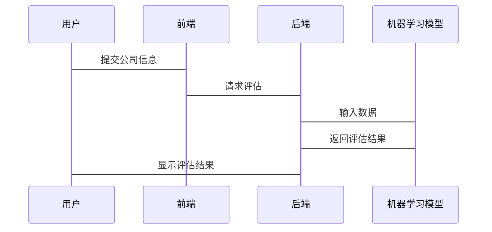

                 


# 彼得林奇对公司商业模式可扩展性的长期评估

## 关键词：彼得林奇、商业模式、可扩展性、长期评估、投资策略

## 摘要：本文深入探讨了彼得林奇对公司商业模式可扩展性的长期评估方法。通过分析商业模式的核心要素、可扩展性的定义与重要性，以及彼得林奇的评估标准，结合实际案例和数学模型，详细阐述了如何通过可扩展性评估来预测公司长期价值。文章还提供了系统架构设计和项目实战，帮助读者理解如何在实际投资中应用这些评估方法。

---

# 第一部分: 公司商业模式可扩展性评估的背景与核心概念

## 第1章: 公司商业模式可扩展性的概述

### 1.1 什么是公司商业模式

#### 1.1.1 公司商业模式的定义
商业模式是描述一个企业如何创造价值、传递价值和获取价值的逻辑结构。它包括核心产品或服务、目标客户、价值主张、资源分配和盈利方式等关键要素。

#### 1.1.2 商业模式的核心要素
- **核心产品或服务**：公司提供什么产品或服务来满足客户需求。
- **目标客户**：产品的目标用户或市场。
- **价值主张**：产品或服务为客户创造的价值。
- **资源与能力**：公司拥有的资源和能力。
- **盈利方式**：公司如何通过产品或服务实现盈利。

#### 1.1.3 商业模式的类型与特点
- **生产销售模式**：直接生产并销售产品。
- **订阅模式**：通过订阅制提供持续服务。
- **广告模式**：通过广告收入盈利。
- **平台模式**：搭建平台连接供需双方。

### 1.2 可扩展性的定义与重要性

#### 1.2.1 可扩展性的定义
可扩展性是指商业模式在保持盈利能力的同时，能够通过增加资源或优化流程来扩大产量或服务范围的能力。一个可扩展的商业模式可以在不显著增加边际成本的情况下实现收入增长。

#### 1.2.2 可扩展性在商业模式中的作用
- **支持公司增长**：通过可扩展性，公司可以在不大幅增加成本的情况下扩大收入。
- **提升市场竞争力**：可扩展性使公司能够快速响应市场需求。
- **增强投资吸引力**：可扩展性是投资者评估公司长期价值的重要指标。

#### 1.2.3 可扩展性对长期发展的意义
- 可扩展性决定了公司的增长潜力。
- 可扩展性好的公司更容易吸引投资。
- 可扩展性差的公司可能面临增长瓶颈。

## 第2章: 彼得林奇的公司评估方法

### 2.1 彼得林奇的投资理念

#### 2.1.1 彼得林奇的投资风格
彼得林奇以“基本面分析”和“深度研究”著称，他注重分析公司的财务状况、行业地位和管理团队。

#### 2.1.2 彼得林奇的成功案例
彼得林奇曾管理富达麦哲伦基金，创造了年化12.5%的回报率，投资组合以价值股为主。

#### 2.1.3 彼得林奇的长期投资策略
彼得林奇注重长期价值，避免短期市场波动，专注于选择具有可持续增长潜力的公司。

### 2.2 彼得林奇对商业模式可扩展性的关注点

#### 2.2.1 可扩展性评估的核心要素
- **市场需求**：产品或服务是否有持续需求。
- **生产效率**：公司是否能高效生产产品或提供服务。
- **成本结构**：公司的成本是否可控且可优化。
- **管理能力**：公司是否具备管理大规模扩展的能力。

#### 2.2.2 彼得林奇的评估标准
- **市场需求的可持续性**：公司产品是否具有长期市场需求。
- **商业模式的可复制性**：公司是否能将成功模式复制到其他市场或产品。
- **管理团队的能力**：团队是否具备扩展公司的能力。
- **财务健康状况**：公司是否具备健康的财务状况支持扩展。

#### 2.2.3 可扩展性与公司长期价值的关系
- 可扩展性好的公司具有更高的增长潜力。
- 可扩展性差的公司可能面临增长瓶颈，影响长期价值。

---

# 第二部分: 商业模式可扩展性评估的核心概念与联系

## 第3章: 商业模式可扩展性的核心要素

### 3.1 可扩展性的关键因素

#### 3.1.1 市场需求的可持续性
市场需求是商业模式可扩展性的基础，持续的需求确保公司可以扩大销售。

#### 3.1.2 产品的技术可行性
产品或服务的技术可行性决定了是否可以高效生产和交付。

#### 3.1.3 资源的可获得性
公司是否能够获得足够的资源支持扩展，包括资金、人才和技术。

#### 3.1.4 竞争环境的稳定性
竞争环境的稳定性影响公司扩展的难度和成本。

### 3.2 商业模式可扩展性的属性对比

#### 3.2.1 可扩展性与可复制性的区别
- **可扩展性**：指公司能否在现有模式下扩大规模。
- **可复制性**：指公司能否将成功模式复制到其他市场或产品。

#### 3.2.2 可扩展性与可盈利性的关系
- 可扩展性好的公司不一定能保证盈利能力，但可扩展性差的公司通常难以实现可持续盈利。

#### 3.2.3 可扩展性与风险控制的联系
- 可扩展性好的公司通常具备更强的风险控制能力，能够应对市场变化。

## 第4章: 商业模式可扩展性的实体关系图

### 4.1 实体关系图的构建

#### 4.1.1 实体关系图的定义
实体关系图（ER图）用于描述系统中各实体之间的关系，帮助分析系统的结构和交互。

#### 4.1.2 实体关系图的组成部分
- **实体**：系统中的关键对象，如公司、产品、客户。
- **属性**：实体的特征，如公司名称、产品类型。
- **关系**：实体之间的联系，如公司提供产品给客户。

#### 4.1.3 实体关系图的绘制方法
- 确定系统中的实体。
- 分析实体之间的关系。
- 绘制ER图，展示实体、属性和关系。

### 4.2 商业模式可扩展性的ER图示例

#### 4.2.1 实体关系图的展示
```mermaid
er
  company(C companyId, C name, C industry)
  product(P productId, P name, P type)
  customer(Cust customerId, Cust name, Cust type)
  company --> provides --> product: C provides P
  company --> serves --> customer: C serves Cust
```

#### 4.2.2 关系的属性与约束
- `provides`关系：公司提供产品给客户。
- `serves`关系：公司为客户提供服务。

#### 4.2.3 实体关系图的解释
通过ER图可以清晰地看到公司如何通过提供产品或服务来满足客户需求，从而实现商业模式的扩展。

---

# 第三部分: 商业模式可扩展性评估的算法原理

## 第5章: 商业模式可扩展性评估算法

### 5.1 评估算法的概述

#### 5.1.1 算法的输入与输出
- **输入**：公司财务数据、市场数据、行业分析报告。
- **输出**：商业模式可扩展性评分。

#### 5.1.2 算法的基本原理
算法基于彼得林奇的评估标准，结合定量分析和定性分析，对商业模式的可扩展性进行评分。

#### 5.1.3 算法的适用范围
适用于对公司商业模式进行长期评估，帮助投资者判断公司是否具有扩展潜力。

### 5.2 算法的实现步骤

#### 5.2.1 数据预处理
- 数据清洗：去除异常值和缺失数据。
- 数据标准化：统一数据格式。

#### 5.2.2 特征提取
- 提取公司财务指标、市场占有率、客户满意度等关键特征。

#### 5.2.3 模型训练
- 使用机器学习算法（如决策树、随机森林）对数据进行训练，生成可扩展性评分模型。

#### 5.2.4 结果分析
- 对模型输出的评分进行分析，判断公司商业模式的可扩展性。

## 第6章: 算法的数学模型与公式

### 6.1 数学模型的构建

#### 6.1.1 可扩展性评分公式
$$可扩展性评分 = \alpha \times 市场需求 + \beta \times 生产效率 + \gamma \times 财务状况$$
其中，$\alpha + \beta + \gamma = 1$，且$\alpha, \beta, \gamma > 0$。

#### 6.1.2 市场需求的计算公式
$$市场需求 = \frac{\text{历史增长率} + \text{未来增长率预测}}{2}$$

#### 6.1.3 生产效率的计算公式
$$生产效率 = \frac{\text{单位产品成本}}{\text{单位产品售价}} \times 100\%$$

#### 6.1.4 财务状况的计算公式
$$财务状况 = \frac{\text{净利润} + \text{经营活动现金流}}{\text{总资产}} \times 100\%$$

---

# 第四部分: 系统分析与架构设计方案

## 第7章: 系统分析与架构设计

### 7.1 问题场景介绍

#### 7.1.1 问题背景
我们需要一个系统来评估公司的商业模式可扩展性，帮助投资者做出决策。

#### 7.1.2 项目介绍
开发一个基于彼得林奇评估方法的商业模式可扩展性评估系统。

### 7.2 系统功能设计

#### 7.2.1 领域模型设计
```mermaid
classDiagram
    class Company {
        companyId: int
        companyName: string
        industry: string
    }
    class Product {
        productId: int
        productName: string
        productType: string
    }
    class Customer {
        customerId: int
        customerName: string
        customerType: string
    }
    Company --> provides --> Product
    Company --> serves --> Customer
```

#### 7.2.2 系统架构设计


#### 7.2.3 系统接口设计
- **前端接口**：用户输入公司信息。
- **后端接口**：接收数据，调用机器学习模型进行评估。
- **数据库接口**：存储公司数据和评估结果。

#### 7.2.4 系统交互设计


---

# 第五部分: 项目实战

## 第8章: 项目实战与案例分析

### 8.1 环境安装

#### 8.1.1 安装Python
```bash
# 安装Python
sudo apt-get install python3
```

#### 8.1.2 安装必要的库
```bash
# 安装Pandas、Scikit-learn等库
pip install pandas scikit-learn
```

### 8.2 系统核心实现源代码

#### 8.2.1 数据预处理代码
```python
import pandas as pd

# 读取数据
data = pd.read_csv('company_data.csv')

# 数据清洗
data.dropna(inplace=True)
data = data[~data.duplicated(keep='first')]
```

#### 8.2.2 特征提取与模型训练代码
```python
from sklearn.ensemble import RandomForestClassifier
from sklearn.model_selection import train_test_split
from sklearn.metrics import accuracy_score

# 特征提取
X = data[['market_growth', 'production_efficiency', 'financial_health']]
y = data['expandable']

# 划分训练集和测试集
X_train, X_test, y_train, y_test = train_test_split(X, y, test_size=0.2)

# 模型训练
model = RandomForestClassifier()
model.fit(X_train, y_train)

# 模型预测
y_pred = model.predict(X_test)

# 模型评估
print(accuracy_score(y_test, y_pred))
```

### 8.3 代码应用解读与分析

#### 8.3.1 数据预处理解读
数据清洗和去重是确保模型输入数据质量的重要步骤。

#### 8.3.2 特征提取与模型训练解读
通过随机森林算法，我们提取了市场需求、生产效率和财务状况三个关键特征，训练出一个分类模型，用于评估公司商业模式的可扩展性。

#### 8.3.3 模型评估解读
准确率是衡量模型性能的重要指标，越高表示模型的预测能力越强。

### 8.4 实际案例分析

#### 8.4.1 案例背景
某科技公司提供SaaS服务，市场需求增长稳定，生产效率较高，财务状况良好。

#### 8.4.2 模型预测结果
模型预测该公司的商业模式可扩展性评分为90分（满分100分），具有较高的扩展潜力。

---

# 第六部分: 总结与展望

## 第9章: 总结与展望

### 9.1 最佳实践与小结

- **最佳实践**：在进行商业模式可扩展性评估时，应综合考虑市场需求、生产效率和财务状况等因素。
- **小结**：本文通过理论分析和实际案例，详细阐述了如何通过可扩展性评估来判断公司商业模式的长期价值。

### 9.2 注意事项

- 投资者应结合市场变化和公司实际情况，动态调整评估标准。
- 模型结果仅供参考，需结合其他因素综合判断。

### 9.3 拓展阅读

- 《彼得林奇的成功投资法则》
- 《商业模式创新与价值创造》
- 《可扩展性商业模式的设计与优化》

---

# 作者

作者：AI天才研究院/AI Genius Institute & 禅与计算机程序设计艺术 /Zen And The Art of Computer Programming

