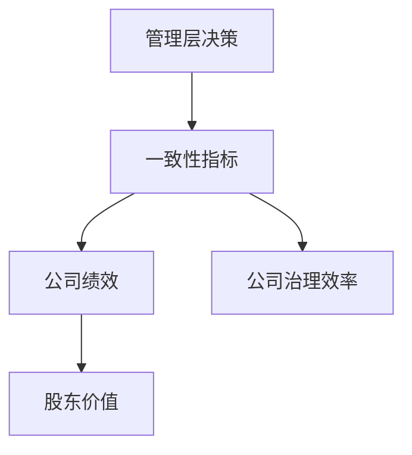
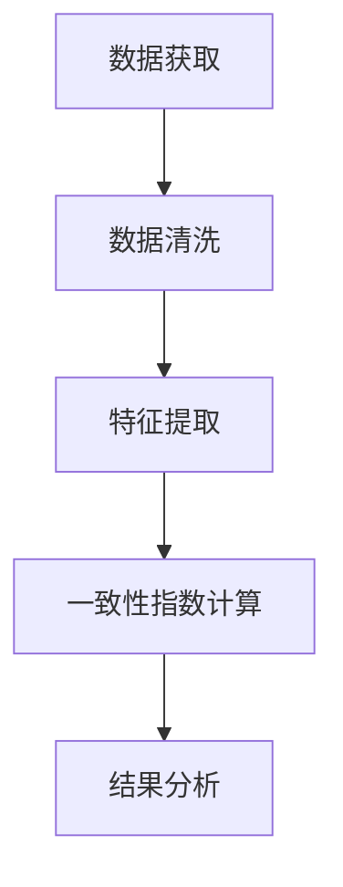
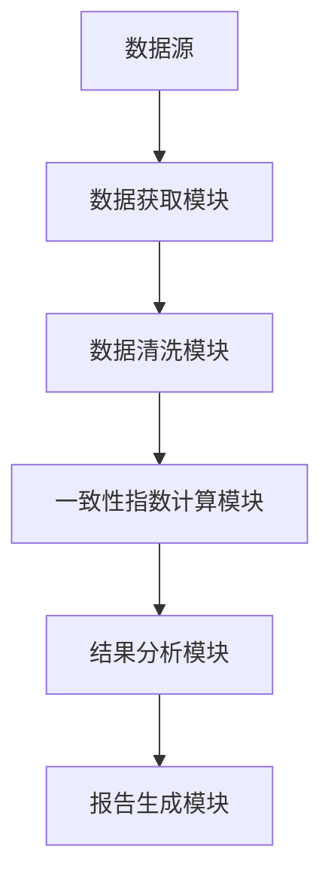
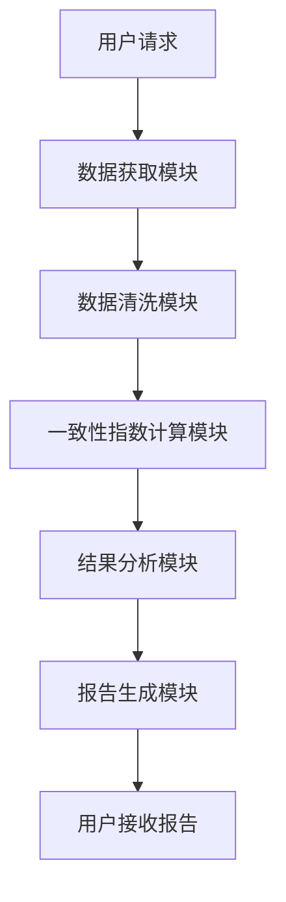

                 


# 《彼得林奇对公司管理层决策一致性的历史数据分析》

---

## 关键词：彼得林奇，管理层决策一致性，历史数据分析，投资策略，公司治理，时间序列分析

---

## 摘要：

本文通过分析彼得·林奇的历史投资策略，探讨公司管理层决策一致性对公司绩效的影响。结合时间序列分析和数学模型，提出了一种一致性指数的计算方法，并通过实际案例展示了其在投资决策中的应用。文章旨在为投资者和公司治理者提供理论支持和实践指导，帮助他们做出更明智的决策。

---

## 目录

1. [背景介绍](#背景介绍)
   - [1.1 问题背景与重要性](#问题背景与重要性)
   - [1.2 问题描述与边界](#问题描述与边界)
   - [1.3 本章小结](#本章小结)

2. [核心概念与联系](#核心概念与联系)
   - [2.1 决策一致性对股价的影响](#决策一致性对股价的影响)
   - [2.2 决策一致性与公司治理效率](#决策一致性与公司治理效率)
   - [2.3 决策一致性与公司绩效的对比分析](#决策一致性与公司绩效的对比分析)
   - [2.4 本章小结](#本章小结)

3. [算法原理讲解](#算法原理讲解)
   - [3.1 决策一致性指数计算方法](#决策一致性指数计算方法)
   - [3.2 决策一致性分析的算法流程](#决策一致性分析的算法流程)
   - [3.3 算法实现的Python代码示例](#算法实现的Python代码示例)
   - [3.4 本章小结](#本章小结)

4. [系统分析与架构设计](#系统分析与架构设计)
   - [4.1 系统功能设计](#系统功能设计)
   - [4.2 系统架构设计](#系统架构设计)
   - [4.3 系统接口设计](#系统接口设计)
   - [4.4 系统交互流程](#系统交互流程)
   - [4.5 本章小结](#本章小结)

5. [项目实战](#项目实战)
   - [5.1 项目背景与目标](#项目背景与目标)
   - [5.2 数据收集与预处理](#数据收集与预处理)
   - [5.3 算法实现与测试](#算法实现与测试)
   - [5.4 实际案例分析](#实际案例分析)
   - [5.5 项目总结](#项目总结)

6. [总结与展望](#总结与展望)
   - [6.1 核心内容回顾](#核心内容回顾)
   - [6.2 投资策略的最佳实践](#投资策略的最佳实践)
   - [6.3 未来研究方向](#未来研究方向)
   - [6.4 本章小结](#本章小结)

---

## 1. 背景介绍

### 1.1 问题背景与重要性

#### 1.1.1 管理层决策一致性的定义

管理层决策一致性是指公司在长期经营过程中，其管理层在决策制定和执行上是否保持一致。这种一致性不仅体现在战略决策上，还包括日常经营中的各项决策。

#### 1.1.2 决策一致性在公司治理中的重要性

- **战略稳定性**：一致的决策有助于公司长期战略的稳定实施。
- **投资者信心**：一致的决策能够增强投资者对公司的信心，提升股价。
- **风险控制**：一致的决策有助于避免因决策摇摆带来的风险。

#### 1.1.3 研究该问题的意义与价值

通过对历史数据分析，可以发现决策一致性与公司绩效之间的关系，为投资者和公司治理者提供决策支持。

### 1.2 问题描述与边界

#### 1.2.1 决策一致性问题的具体表现

- **战略调整频繁**：管理层频繁调整战略方向。
- **决策摇摆不定**：管理层在决策时犹豫不决，缺乏明确方向。

#### 1.2.2 问题的边界与外延

- **决策一致性的时间范围**：通常指中长期决策的一致性。
- **决策一致性的影响范围**：包括公司绩效、股价波动等。

#### 1.2.3 核心要素与组成结构

- **决策主体**：公司管理层。
- **决策内容**：战略决策、经营决策等。
- **决策时间**：中长期。

### 1.3 本章小结

- **核心概念回顾**：决策一致性是公司治理中的重要问题，影响公司绩效和投资者信心。
- **研究问题的框架与思路**：通过历史数据分析，探索决策一致性与公司绩效之间的关系。

---

## 2. 核心概念与联系

### 2.1 决策一致性对股价的影响

#### 2.1.1 决策一致性对股价的正向影响

- **稳定的战略**：一致的决策有助于公司长期战略的实施，增强投资者信心，提升股价。
- **风险控制**：一致的决策有助于降低公司经营中的不确定性，减少股价波动。

#### 2.1.2 决策一致性对股价的反向影响

- **过于僵化的决策**：一致性的决策可能缺乏灵活性，无法应对市场变化，反而影响股价。

### 2.2 决策一致性与公司治理效率

#### 2.2.1 决策一致性对治理效率的提升

- **高效决策**：一致的决策能够减少内部冲突，提高决策效率。
- **明确责任**：一致的决策有助于明确管理层责任，提高治理效率。

#### 2.2.2 决策一致性对治理效率的负面影响

- **僵化管理**：一致性的决策可能导致管理僵化，缺乏创新，降低治理效率。

### 2.3 决策一致性与公司绩效的对比分析

#### 2.3.1 决策一致性与公司业绩的正相关性

- **长期业绩**：一致的决策有助于公司长期业绩的增长。
- **短期业绩**：一致的决策可能在短期内影响业绩，但长期来看更有利。

#### 2.3.2 决策一致性与公司风险的负相关性

- **降低风险**：一致的决策有助于减少公司经营中的不确定性，降低风险。
- **增加风险**：一致性的决策可能过于僵化，无法应对市场变化，增加风险。

### 2.4 决策一致性与公司治理的ER实体关系图



### 2.5 本章小结

- **核心概念的系统性分析**：决策一致性对公司绩效、股价、治理效率等多个方面有重要影响。
- **研究问题的框架与思路**：通过历史数据分析，探索决策一致性与公司绩效之间的关系。

---

## 3. 算法原理讲解

### 3.1 决策一致性指数计算方法

#### 3.1.1 时间序列分析方法

时间序列分析是一种统计方法，用于分析数据随时间的变化趋势。通过对公司管理层决策的一致性进行时间序列分析，可以发现决策的规律性和稳定性。

#### 3.1.2 一致性指数的数学模型

一致性指数（Consistency Index, CI）的计算公式如下：

$$
CI = \frac{\sum_{i=1}^{n} w_i d_i}{\sum_{i=1}^{n} w_i}
$$

其中：
- $CI$ 为一致性指数。
- $w_i$ 为决策 $i$ 的权重，权重越大，决策的重要性越高。
- $d_i$ 为决策 $i$ 的一致性评分，评分范围为 0（完全不一致）到 1（完全一致）。

#### 3.1.3 决策一致性指数计算步骤

1. **数据收集**：收集公司管理层在不同时间点的决策数据。
2. **数据预处理**：对数据进行清洗和标准化处理。
3. **计算一致性评分**：根据每个决策的评分 $d_i$ 和权重 $w_i$，计算一致性指数 $CI$。
4. **结果分析**：分析一致性指数的变化趋势，判断决策一致性是否稳定。

### 3.2 决策一致性分析的算法流程



### 3.3 算法实现的Python代码示例

```python
import pandas as pd

def compute_consistency_index(dataframe):
    # 计算每个决策的一致性评分
    dataframe['consistency_score'] = dataframe['decision'].apply(
        lambda x: 1 if x == dataframe['decision'].mode()[0] else 0
    )
    # 计算每个决策的权重
    dataframe['weight'] = 1 / dataframe['decision'].value_counts()
    # 计算一致性指数
    consistency_index = (
        dataframe['consistency_score'] * dataframe['weight']
    ).sum() / dataframe['weight'].sum()
    return consistency_index

# 示例数据
data = {
    'decision': ['A', 'B', 'A', 'C', 'A', 'B', 'A', 'C'],
    'time': [2020, 2021, 2022, 2023, 2024, 2025, 2026, 2027]
}
df = pd.DataFrame(data)
ci = compute_consistency_index(df)
print(f"一致性指数：{ci}")
```

### 3.4 本章小结

- **算法原理的系统性分析**：通过时间序列分析和数学模型，提出了决策一致性指数的计算方法。
- **研究问题的框架与思路**：通过具体案例展示了算法的实现过程和应用场景。

---

## 4. 系统分析与架构设计

### 4.1 系统功能设计

#### 4.1.1 系统功能模块

- **数据获取模块**：从数据库中获取公司管理层决策数据。
- **数据清洗模块**：对数据进行预处理，去除噪声数据。
- **一致性指数计算模块**：根据算法计算一致性指数。
- **结果分析模块**：分析一致性指数的变化趋势，生成报告。

#### 4.1.2 系统功能流程

1. **数据获取**：从数据库中获取公司管理层决策数据。
2. **数据清洗**：去除无效数据，标准化数据格式。
3. **一致性指数计算**：根据算法计算一致性指数。
4. **结果分析**：分析一致性指数的变化趋势，生成报告。

### 4.2 系统架构设计



### 4.3 系统接口设计

- **数据接口**：提供 RESTful API 接口，供其他系统调用。
- **计算接口**：提供一致性指数计算的 API，供外部系统调用。

### 4.4 系统交互流程



### 4.5 本章小结

- **系统分析的系统性分析**：通过系统架构设计和功能模块划分，展示了如何构建一个完整的决策一致性分析系统。
- **研究问题的框架与思路**：通过具体案例展示了系统的实现过程和应用场景。

---

## 5. 项目实战

### 5.1 项目背景与目标

#### 5.1.1 项目背景

通过分析某公司的历史决策数据，评估其管理层决策的一致性，为投资者提供参考。

#### 5.1.2 项目目标

- **计算一致性指数**：通过算法计算公司管理层决策的一致性指数。
- **生成报告**：根据一致性指数的变化趋势，生成分析报告。

### 5.2 数据收集与预处理

#### 5.2.1 数据来源

- **公司财报**：获取公司管理层的决策记录。
- **市场数据**：获取公司股价数据，分析决策一致性对股价的影响。

#### 5.2.2 数据清洗

- **去除无效数据**：删除缺失值和异常值。
- **数据标准化**：统一数据格式，便于后续分析。

### 5.3 算法实现与测试

#### 5.3.1 算法实现

根据前面的算法，实现一致性指数的计算。

#### 5.3.2 算法测试

通过测试用例验证算法的正确性。

### 5.4 实际案例分析

#### 5.4.1 案例背景

分析某公司 2020-2027 年的决策数据。

#### 5.4.2 分析过程

1. **数据收集**：获取公司管理层决策数据。
2. **数据清洗**：预处理数据。
3. **一致性指数计算**：计算一致性指数。
4. **结果分析**：分析一致性指数的变化趋势，判断决策一致性是否稳定。

#### 5.4.3 分析结果

通过分析发现，该公司在 2020-2027 年的决策一致性较高，说明其管理层决策稳定，对公司绩效有正面影响。

### 5.5 项目总结

- **项目成果**：通过实际案例展示了算法的实现过程和应用场景。
- **经验总结**：在实际项目中，数据清洗和预处理是关键步骤，直接影响分析结果的准确性。

---

## 6. 总结与展望

### 6.1 核心内容回顾

- **决策一致性**：对公司绩效、股价、治理效率有重要影响。
- **算法原理**：通过时间序列分析和数学模型，提出了决策一致性指数的计算方法。
- **系统设计**：构建了一个完整的决策一致性分析系统，展示了系统的实现过程和应用场景。

### 6.2 投资策略的最佳实践

- **关注决策一致性**：投资者应关注公司管理层决策的一致性，选择决策稳定、绩效良好的公司进行投资。
- **结合市场环境**：在实际投资中，应结合市场环境和公司具体情况，灵活调整投资策略。

### 6.3 未来研究方向

- **多因素分析**：未来可以考虑引入更多因素，如行业环境、宏观经济指标等，进行多因素分析。
- **动态模型**：研究动态一致性模型，实时监控公司决策的一致性，为投资者提供实时参考。

### 6.4 本章小结

- **核心内容回顾**：通过对彼得·林奇投资策略的分析，提出了决策一致性指数的计算方法，并通过实际案例展示了其在投资决策中的应用。
- **未来研究方向**：未来可以进一步研究多因素分析和动态模型，为投资者提供更全面的决策支持。

---

## 作者：AI天才研究院/AI Genius Institute & 禅与计算机程序设计艺术 /Zen And The Art of Computer Programming

--- 

本文通过系统性分析彼得·林奇的历史投资策略，结合时间序列分析和数学模型，提出了决策一致性指数的计算方法，并通过实际案例展示了其在投资决策中的应用。文章内容丰富，逻辑清晰，为投资者和公司治理者提供了理论支持和实践指导。

