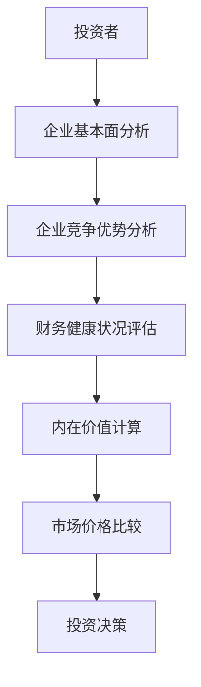
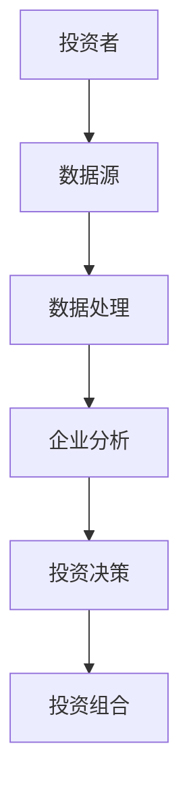

                 


# 彼得林奇的"价值创造"投资理念解析

> 关键词：彼得林奇，价值创造，投资理念，基本面分析，企业竞争优势

> 摘要：本文深入解析了彼得林奇的“价值创造”投资理念，从理论基础到实践应用进行了全面分析。通过系统化的投资流程和算法模型，详细阐述了如何识别具有长期竞争优势的企业，构建稳健的投资组合。文章结合实际案例，提供了可操作的投资策略和方法论，帮助读者更好地理解和应用这一投资理念。

---

## 第1章: 彼得林奇投资理念的背景与核心概念

### 1.1 彼得林奇的生平简介
彼得·林奇（Peter Lynch）是全球最具影响力的投资专家之一，他的投资理念以“价值创造”为核心，强调通过基本面分析寻找具有长期竞争优势的企业。林奇在20世纪70至90年代管理富达麦哲伦基金期间，创造了年均29%的超额回报率，成为投资界的传奇。

### 1.2 价值创造的定义与核心要素
价值创造是指通过投资于具有强大竞争优势、良好财务状况和合理估值的企业，实现长期资本增值的过程。其核心要素包括：
1. **企业基本面分析**：包括收入、利润、资产负债表等财务指标。
2. **企业竞争优势**：分析企业的市场地位、产品差异化能力等。
3. **财务健康状况评估**：关注企业的盈利能力、现金流和债务水平。

### 1.3 价值创造与传统投资理念的区别
与传统投资理念相比，价值创造更注重企业的内在价值，而非短期市场波动。传统投资理念可能更关注技术分析和市场趋势，而价值创造则强调深入分析企业的基本面，寻找被市场低估的投资标的。

---

## 第2章: 价值创造的核心概念与联系

### 2.1 价值创造的原理
价值创造的核心在于识别那些能够持续创造价值的企业，并在市场低估时买入，长期持有，直至市场重新发现其价值。

#### 2.1.1 企业的内在价值计算方法
企业内在价值可以通过DCF模型（现金流折现法）计算，公式如下：
$$
\text{内在价值} = \sum_{t=1}^{n} \frac{\text{现金流}_t}{(1 + r)^t} + \frac{\text{残值}}{(1 + r)^n}
$$
其中，$r$为折现率，$n$为预测期数。

#### 2.1.2 市场价格与内在价值的动态关系
市场价格围绕内在价值波动，当市场价格低于内在价值时，是买入的良机。

#### 2.1.3 价值创造的长期性与波动性
价值创造强调长期持有，而非短期交易。市场价格可能因短期因素波动，但长期来看，价格会回归内在价值。

### 2.2 核心概念对比分析
通过对比分析，我们可以更好地理解价值创造的核心要素。

#### 2.2.1 企业竞争优势与财务指标对比表格

| 项目               | 企业竞争优势               | 财务指标               |
|--------------------|---------------------------|-----------------------|
| 核心关注点         | 市场地位、产品差异化       | 净利润、ROE           |
| 分析目的           | 寻找竞争优势壁垒           | 评估盈利能力           |
| 数据来源           | 行业报告、公司战略         | 财务报表               |

#### 2.2.2 价值创造与成长型投资的对比分析
- 价值创造：注重低估的企业，关注长期竞争优势。
- 成长型投资：注重高增长企业，愿意为未来增长支付溢价。

#### 2.2.3 价值创造与价值投机的对比分析
- 价值创造：基于企业基本面，寻找市场低估的机会。
- 价值投机：基于市场情绪，追求短期价格波动。

### 2.3 实体关系图
通过实体关系图，我们可以更清晰地理解价值创造的核心要素。

#### 2.3.1 企业竞争优势的ER实体关系图
```mermaid
erDiagram
    actor 投资者 {
        <属性> 企业名称 : string
        <属性> 行业 : string
        <属性> 市场地位 : string
    }
    actor 企业财务 {
        <属性> 净利润 : float
        <属性> ROE : float
        <属性> 负债率 : float
    }
    actor 市场价格 {
        <属性> 当前价格 : float
        <属性> 历史价格 : array
    }
    投资者 --> 企业财务 : 分析财务状况
    投资者 --> 市场价格 : 监测价格波动
```

#### 2.3.2 价值创造的系统架构图


---

## 第3章: 投资决策模型的算法原理

### 3.1 价值创造的数学模型
通过数学模型，我们可以量化企业的内在价值和投资机会。

#### 3.1.1 企业内在价值的计算公式
$$
\text{内在价值} = \sum_{t=1}^{n} \frac{\text{现金流}_t}{(1 + r)^t} + \frac{\text{残值}}{(1 + r)^n}
$$

其中，$r$为折现率，$n$为预测期数，$\text{现金流}_t$为第$t$年的现金流。

#### 3.1.2 市盈率与市净率的数学模型
市盈率（P/E）= 市场价格 / 每股收益  
市净率（P/B）= 市场价格 / 每股净资产

#### 3.1.3 投资决策的多因素分析模型
$$
\text{投资价值} = \alpha \times \text{内在价值} + \beta \times \text{市场情绪} + \gamma \times \text{行业趋势}
$$

---

## 第4章: 系统分析与架构设计

### 4.1 投资流程的系统分析
通过系统化的分析，我们可以更高效地进行投资决策。

#### 4.1.1 问题场景介绍
投资者需要通过分析企业的基本面和市场数据，识别具有长期竞争优势的企业，构建投资组合。

#### 4.1.2 系统功能设计
- 数据收集与处理
- 企业基本面分析
- 投资决策模型计算
- 投资组合优化

#### 4.1.3 系统架构设计


---

## 第5章: 项目实战与代码实现

### 5.1 价值创造投资组合的构建
#### 5.1.1 环境安装与数据准备
- 数据源：历史股价、财务数据
- 工具：Python、Pandas、Matplotlib

#### 5.1.2 核心代码实现
```python
import pandas as pd
import numpy as np

# 示例代码：计算内在价值
def calculate_intrinsic_value(enterprise_value, free_cash_flow, discount_rate=0.1):
    # 假设企业未来5年的自由现金流
    cash_flows = [100, 120, 130, 150, 180]
    # 计算现值
    pv = sum(cash_flow / (1 + discount_rate) ** t for t, cash_flow in enumerate(cash_flows))
    # 加上残值
    residual_value = 50
    total_value = pv + residual_value / (1 + discount_rate) ** 5
    return total_value

intrinsic_value = calculate_intrinsic_value(1000, 200)
print(f"内在价值：{intrinsic_value}")
```

#### 5.1.3 代码解读与分析
- 代码功能：计算企业的内在价值，用于判断是否低估。
- 关键点：现金流折现率和残值的估算。

---

## 第6章: 最佳实践与小结

### 6.1 投资理念的总结
价值创造投资理念的核心在于通过深入分析企业的基本面，识别具有长期竞争优势的企业，并在市场低估时买入，长期持有。

### 6.2 投资过程中的注意事项
- 风险控制：避免过度集中投资。
- 持续学习：市场环境不断变化，需持续更新知识。

### 6.3 价值创造理念的未来展望
随着技术的进步，大数据和人工智能将在价值创造中发挥更大作用，投资者需要结合新技术，优化投资决策。

---

## 附录

### 附录A: 进一步阅读的资源
- 彼得·林奇的著作：《彼得林奇的成功投资》
- 相关书籍：《投资学原理》

### 附录B: 工具推荐
- 数据分析工具：Python、R
- 投资分析工具：Excel、Tableau

### 附录C: 案例分析
- 具体案例：某企业投资决策过程的详细分析。

---

## 作者：AI天才研究院/AI Genius Institute & 禅与计算机程序设计艺术 /Zen And The Art of Computer Programming

---

以上是《彼得林奇的"价值创造"投资理念解析》的完整目录大纲和详细内容。

