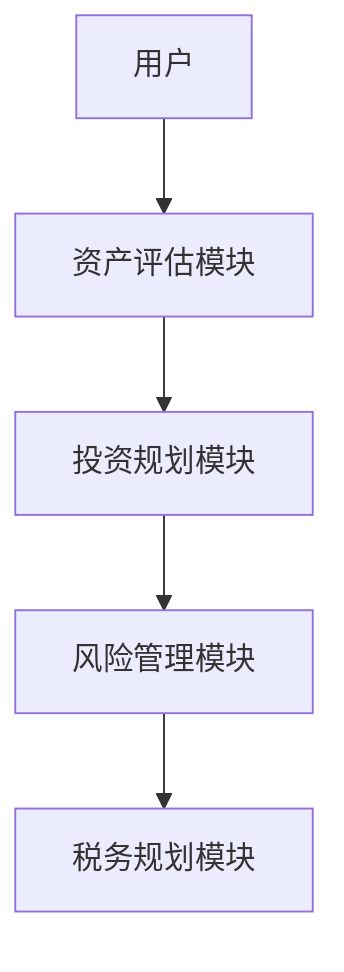

                 


---

# 彼得林奇的"家庭股票"在跨代财富传承中的作用

> 关键词：财富传承，家庭股票，彼得林奇，投资策略，跨代传承，资产配置

> 摘要：本文探讨彼得林奇的“家庭股票”概念在跨代财富传承中的作用。通过分析家庭股票的定义、特点，以及其在财富传承中的优势，结合数学模型和系统设计，详细阐述家庭股票在跨代传承中的实现方式，帮助读者理解如何通过投资家庭股票实现财富保值与增值。

---

## 第一章：跨代财富传承的现状与挑战

### 1.1 财富传承的定义与重要性

财富传承是指通过法律、金融或其他手段，将财富从一代人传递到下一代或其他受益人。它不仅涉及资产的转移，还包括对财富的保值和增值。财富传承的重要性体现在保障家族财富的延续性，避免财富流失，同时确保家族成员的经济安全。

### 1.2 跨代财富传承的现状

当前社会财富积累迅速增加，但财富传承面临诸多挑战。常见的问题包括财富分配不均、继承人缺乏管理能力、税务负担加重等。这些问题可能导致财富流失或家族内部矛盾。

### 1.3 彼得林奇的投资理念

彼得·林奇是美国著名的基金经理，以其长期的投资经验和卓越的业绩闻名。他认为长期投资于优质企业是实现财富增长的关键。他的“家庭股票”理念强调投资于家族企业或相关股票，以实现财富的长期保值和增值。

---

## 第二章：“家庭股票”的定义与特点

### 2.1 家庭股票的定义

家庭股票是指投资于家族企业或与家族相关的股票。这种投资方式将家族财富与企业价值紧密相连，通过企业的发展实现财富的增值。

### 2.2 家庭股票的特点

- **长期性**：家庭股票强调长期投资，避免短期波动带来的风险。
- **稳定性**：投资于家族企业，能够确保财富的稳定性，减少外部市场波动的影响。
- **风险可控性**：通过分散投资和长期持有，降低投资风险。

### 2.3 家庭股票与财富传承的关系

家庭股票在财富传承中的作用显著。通过投资于家族企业，财富可以逐步积累，同时为下一代提供稳定的经济基础。家庭股票的优势在于其可持续性和稳定性，能够在跨代传承中保持财富的完整性。

---

## 第三章：家庭股票与其他财富传承方式的对比

### 3.1 传统财富传承方式

- **遗嘱**：通过遗嘱分配财产，但过程复杂且可能引发继承纠纷。
- **赠与**：提前赠与财产可减少税务负担，但需考虑赠与人的经济能力。
- **法定继承**：按法律规定分配财产，可能引发家族内部矛盾。

### 3.2 其他投资方式

- **信托**：通过信托机构管理财产，但设立和维护成本较高。
- **公司股权**：投资于公司股权，但需要具备管理能力或专业团队。
- **基金投资**：通过基金实现财富增值，但缺乏对资产的控制权。

### 3.3 家庭股票的优势

家庭股票结合了传统传承方式和投资方式的优点，具备以下优势：

- **资产控制**：家族企业股东对资产有较大控制权。
- **税务优化**：通过合理规划税务，降低传承过程中的负担。
- **财富延续**：投资于家族企业，财富可以长期积累和增值。

---

## 第四章：财富传承的数学模型与公式

### 4.1 财富传承的优化模型

财富传承的优化目标是在确保财富保值的前提下实现最大化增值。数学模型如下：

$$ \text{最大化} \quad V(t+1) $$
$$ \text{约束} \quad V(t+1) = V(t) \times (1 + r) $$

其中，\( V(t) \) 表示第 \( t \) 年的财富值，\( r \) 表示投资回报率。

### 4.2 家庭股票的收益计算

家庭股票的收益可以通过以下公式计算：

$$ \text{收益} = V(t) \times r - \text{管理费用} $$

其中，管理费用是投资于家庭股票的必要支出。

---

## 第五章：系统分析与架构设计

### 5.1 系统功能设计

家庭股票的财富传承系统包括以下几个功能模块：

1. **资产评估模块**：评估家族企业的价值。
2. **投资规划模块**：制定投资计划和目标。
3. **风险管理模块**：监控和管理投资风险。
4. **税务规划模块**：优化税务负担。

### 5.2 系统架构设计

以下是系统架构的Mermaid图：



---

## 第六章：项目实战

### 6.1 环境配置

安装必要的软件和工具，如Python、Jupyter Notebook等。

### 6.2 代码实现

以下是财富传承模型的Python代码示例：

```python
def calculate_future_value(current_value, rate, years):
    return current_value * (1 + rate) ** years

# 示例
initial_value = 1000000  # 初始财富
rate = 0.05  # 年回报率
years = 10  # 年数

future_value = calculate_future_value(initial_value, rate, years)
print(f"未来财富值为：{future_value}")
```

### 6.3 案例分析

以一个家族企业为例，假设初始投资100万元，年回报率5%，10年后的财富值为：

$$ 1000000 \times (1 + 0.05)^{10} \approx 1628895 $$

---

## 第七章：最佳实践

### 7.1 小结

彼得林奇的“家庭股票”在跨代财富传承中具有显著优势。通过长期投资于家族企业，可以实现财富的保值和增值。

### 7.2 注意事项

- 投资需谨慎，确保企业具备长期发展潜力。
- 合理规划税务，降低传承负担。
- 定期评估和调整投资策略。

### 7.3 拓展阅读

建议阅读彼得林奇的书籍《彼得林奇的股票投资策略》深入了解家庭股票的投资策略。

---

## 作者：AI天才研究院

通过本文的分析，读者可以理解彼得林奇的“家庭股票”在跨代财富传承中的重要作用，并掌握相关投资策略。

