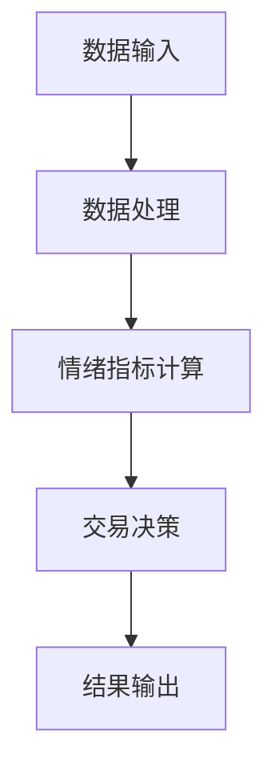

                 


# 彼得林奇的"市场情绪"指标在交易决策中的应用

> 关键词：市场情绪，彼得林奇，交易决策，投资策略，情绪指标，市场波动

> 摘要：本文深入探讨了彼得林奇提出的市场情绪指标在交易决策中的应用，从理论基础到算法实现，再到系统设计和项目实战，全面解析了市场情绪指标的核心概念、计算方法、系统架构及实际案例。通过本文，读者可以掌握如何利用市场情绪指标优化投资决策，提升交易效率。

---

## 第一部分：彼得林奇市场情绪指标的理论基础

### 第1章：市场情绪指标的定义与背景

#### 1.1 市场情绪指标的定义

市场情绪指标是用来量化市场参与者情绪的工具，反映了投资者在特定时间段内的乐观或悲观程度。彼得林奇认为，市场情绪是影响投资决策的重要因素，尤其是在市场波动剧烈时，情绪指标可以帮助投资者更好地把握市场节奏。

- **市场情绪的内涵**：市场情绪指标通常通过交易量、价格波动等数据来衡量，反映了市场参与者的心理状态。
- **彼得林奇的相关理论**：彼得林奇强调，市场情绪的变化往往预示着市场的转折点，投资者可以通过分析情绪指标来捕捉投资机会。
- **市场情绪指标的作用**：情绪指标可以帮助投资者识别市场超买或超卖状态，从而制定更科学的交易策略。

#### 1.2 市场情绪指标的背景

- **投资者情绪与市场波动的关系**：投资者情绪的波动直接影响市场的买卖行为，从而引发价格波动。当市场情绪过于乐观时，价格可能被推高；反之，情绪低落时，价格可能被压低。
- **彼得林奇的投资理念**：彼得林奇认为，市场情绪指标是投资者决策的重要参考，尤其是在市场波动加剧时，情绪指标能够帮助投资者避免情绪化决策。
- **市场情绪指标的发展历程**：从传统的统计方法到现代的机器学习算法，市场情绪指标的计算方法不断完善，为投资者提供了更精确的决策依据。

### 第2章：市场情绪指标的核心概念

#### 2.1 投资者情绪的构成

- **理性情绪与非理性情绪**：理性情绪基于基本面分析，而非理性情绪则更多受到市场情绪的影响。彼得林奇认为，市场情绪指标主要反映的是非理性情绪。
- **市场参与者情绪的分类**：市场参与者可以分为散户、机构投资者等不同类别，不同参与者的情绪指标可能有所不同。
- **市场情绪的周期性特征**：市场情绪通常呈现周期性波动，投资者可以通过分析情绪指标的变化趋势来预测市场走势。

#### 2.2 市场情绪指标的属性特征对比

- **不同市场情绪指标的对比表格**：通过对比不同的情绪指标，可以帮助投资者选择最适合自己的工具。
- **市场情绪指标的ER实体关系图**：通过实体关系图，可以清晰地展示市场情绪指标与其他市场变量之间的关系。

### 第3章：市场情绪指标的数学模型与公式

#### 3.1 市场情绪指标的计算方法

- **基于统计学的市场情绪模型**：通过统计学方法，如均值、标准差等，计算市场情绪指标。
- **基于机器学习的市场情绪模型**：利用机器学习算法，如支持向量机、神经网络等，预测市场情绪。

#### 3.2 市场情绪指标的数学公式

- **情绪强度公式**：$$情绪强度 = \frac{交易量}{价格波动}$$
- **市场情绪指数公式**：$$市场情绪指数 = \sum (情绪强度 \times 时间窗口)$$

### 第4章：市场情绪指标的算法原理

#### 4.1 市场情绪指标的算法流程

- **数据采集与预处理**：从数据源获取市场数据，并进行清洗和标准化处理。
- **情绪指标计算**：基于预处理后的数据，计算市场情绪指标。
- **交易决策关联**：将情绪指标与交易决策相结合，制定投资策略。

#### 4.2 市场情绪指标的算法实现

- **基于统计学的算法实现**：使用Python编写统计学模型，计算市场情绪指标。
- **基于机器学习的算法实现**：利用机器学习库（如scikit-learn）训练情绪预测模型。

---

## 第二部分：市场情绪指标在交易决策中的应用

### 第5章：市场情绪指标的系统分析与架构设计

#### 5.1 系统功能设计

- **系统功能模块划分**：包括数据采集、情绪指标计算、交易决策等功能模块。
- **系统功能流程图（Mermaid）**



#### 5.2 系统架构设计

- **系统架构设计图（Mermaid）**


### 第6章：市场情绪指标的项目实战

#### 6.1 环境安装

- **安装Python和相关库**：如numpy、pandas、scikit-learn等。

#### 6.2 系统核心实现源代码

```python
import numpy as np
import pandas as pd
from sklearn.svm import SVC

# 数据预处理
data = pd.read_csv('market_data.csv')
data = data.dropna()
data = (data - data.mean()) / data.std()

# 计算情绪指标
def calculate_sentiment(data):
    return data['交易量'] / data['价格波动']

sentiment = calculate_sentiment(data)

# 交易决策模型
model = SVC()
model.fit(sentiment.reshape(-1, 1), data['label'])
```

#### 6.3 实际案例分析

- **案例分析与结果解读**：通过具体案例，展示情绪指标在交易决策中的实际应用。

### 第7章：总结与最佳实践

#### 7.1 总结

- **市场情绪指标的核心思想**：市场情绪指标是投资者决策的重要参考，通过分析情绪指标，投资者可以更好地把握市场节奏。
- **彼得林奇的理论贡献**：彼得林奇提出的市场情绪指标为投资者提供了一种新的决策工具。

#### 7.2 最佳实践 tips

- **小结**：情绪指标可以帮助投资者避免情绪化决策，提高交易效率。
- **注意事项**：情绪指标并非万能药，需结合其他因素进行综合分析。
- **拓展阅读**：进一步学习市场情绪指标的其他应用，如结合技术分析进行交易决策。

---

## 作者

作者：AI天才研究院/AI Genius Institute & 禅与计算机程序设计艺术 /Zen And The Art of Computer Programming

