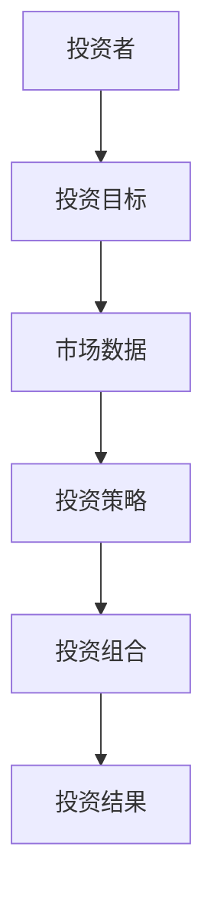

                 


# 彼得林奇的"常识投资"在人工智能投顾时代的价值重估

## 关键词：
- 彼得林奇
- 常识投资
- 人工智能投顾
- 投资策略优化
- 数据驱动决策
- 机器学习算法
- 风险管理

## 摘要：
本文探讨了彼得林奇的"常识投资"理念在人工智能投顾时代的价值重估。通过分析传统投资策略与人工智能技术的结合，本文揭示了AI如何优化投资决策过程，并提出了在新技术环境下如何实现投资策略的现代化。文章详细介绍了人工智能投顾的基本原理，分析了机器学习算法在投资决策中的应用，并结合实际案例展示了AI如何提升投资效率和风险管理能力。同时，本文还探讨了AI投顾的伦理与法律问题，为读者提供了全面的视角来理解新技术对投资顾问行业的影响。

---

## 第一部分：背景介绍

### 第1章：常识投资与人工智能投顾的背景

#### 1.1 常识投资的定义与核心要素
- **1.1.1 常识投资的基本概念**  
  常识投资是一种基于基本面分析和长期价值投资的策略，强调对企业的深入了解和对市场趋势的把握。  
- **1.1.2 常识投资的核心要素**  
  包括对公司财务状况、行业地位、管理层能力的分析，以及对市场周期和宏观经济环境的判断。  
- **1.1.3 常识投资的边界与外延**  
  讨论常识投资的适用范围和局限性，尤其是在复杂市场环境下的表现。

#### 1.2 人工智能投顾的定义与特点
- **1.2.1 人工智能投顾的基本概念**  
  利用机器学习和大数据分析技术，为投资者提供智能化的投资建议和服务。  
- **1.2.2 人工智能投顾的核心特点**  
  数据驱动、自动化、实时性、个性化服务。  
- **1.2.3 人工智能投顾与传统投顾的区别**  
  对比传统的人工投顾服务，分析AI投顾在效率、成本和决策能力上的优势与不足。

#### 1.3 人工智能投顾的背景与发展趋势
- **1.3.1 人工智能技术的发展现状**  
  介绍AI技术在金融领域的应用现状和未来趋势。  
- **1.3.2 投资顾问行业的数字化转型**  
  分析传统投资顾问行业如何通过技术手段实现数字化转型。  
- **1.3.3 人工智能投顾的未来发展趋势**  
  预测AI投顾在金融市场的普及和应用前景。

### 第2章：常识投资与人工智能投顾的核心概念对比

#### 2.1 常识投资的核心概念原理
- **2.1.1 基于基本面分析的投资策略**  
  通过分析企业的财务数据和行业状况制定投资决策。  
- **2.1.2 长期投资与价值发现的逻辑**  
  强调长期持有优质资产，追求稳定的收益。  
- **2.1.3 常识投资的边界与适用场景**  
  讨论常识投资在不同市场环境下的表现和适用性。

#### 2.2 人工智能投顾的核心概念原理
- **2.2.1 数据驱动的投资决策**  
  通过海量数据的分析和建模，实现自动化投资决策。  
- **2.2.2 机器学习算法在投资中的应用**  
  介绍回归分析、分类算法、聚类分析等技术在投资中的具体应用。  
- **2.2.3 智能投顾平台的运作机制**  
  描述AI投顾平台从数据采集到策略生成的完整流程。

#### 2.3 常识投资与人工智能投顾的概念属性特征对比
- **2.3.1 投资策略的灵活性对比**  
  对比传统策略与AI策略在应对市场变化时的灵活性。  
- **2.3.2 数据依赖性对比**  
  分析两种策略对数据的依赖程度及其影响。  
- **2.3.3 风险控制能力对比**  
  比较传统策略与AI策略在风险管理上的优劣。

#### 2.4 ER实体关系图架构


### 第3章：人工智能投顾的基本原理

#### 3.1 数据采集与处理
- **3.1.1 数据来源**  
  包括历史市场数据、企业财务数据、新闻资讯等。  
- **3.1.2 数据清洗与预处理**  
  介绍数据清洗的必要性及具体方法。  
- **3.1.3 数据特征提取**  
  分析如何从数据中提取有用的特征用于投资决策。

#### 3.2 机器学习模型训练
- **3.2.1 监督学习与无监督学习**  
  对比两种学习方法在投资中的应用。  
- **3.2.2 模型选择与调优**  
  讨论如何选择合适的算法并优化模型性能。  
- **3.2.3 模型评估与验证**  
  介绍常用的评估指标及交叉验证方法。

#### 3.3 投资策略生成与优化
- **3.3.1 策略生成算法**  
  介绍基于机器学习的策略生成方法。  
- **3.3.2 策略优化方法**  
  讨论如何通过优化算法提升投资策略的表现。  
- **3.3.3 策略执行与监控**  
  分析策略执行中的监控机制及风险控制。

#### 3.4 人工智能投顾的数学模型
- **3.4.1 线性回归模型**  
  $$y = \beta_0 + \beta_1x + \epsilon$$  
  用于预测资产价格的变化趋势。  
- **3.4.2 支持向量机模型**  
  $$\text{maximize } \frac{1}{2}\|w\|^2 \text{ subject to } y_i(w\cdot x_i + b) \geq 1$$  
  用于分类问题，如判断市场趋势。  
- **3.4.3 随机森林模型**  
  使用决策树的集成方法进行资产评级和风险评估。

---

## 第二部分：基于彼得林奇策略的AI投顾实现

### 第4章：彼得林奇策略的AI实现

#### 4.1 彼得林奇策略的核心要素
- **4.1.1 长期投资与价值发现**  
  强调长期持有优质资产的策略。  
- **4.1.2 行业分析与企业基本面分析**  
  讨论如何通过基本面分析筛选优质企业。  
- **4.1.3 风险管理与投资组合优化**  
  分析如何通过分散投资降低风险。

#### 4.2 AI驱动的彼得林奇策略实现
- **4.2.1 数据驱动的企业基本面分析**  
  利用大数据技术对企业的财务数据进行深度挖掘。  
- **4.2.2 市场趋势预测与投资机会识别**  
  通过机器学习算法预测市场趋势并识别投资机会。  
- **4.2.3 自动化投资决策与执行**  
  结合AI算法实现自动化的投资决策和交易执行。

#### 4.3 彼得林奇策略的AI优化
- **4.3.1 数据驱动的策略优化**  
  通过历史数据优化投资策略的表现。  
- **4.3.2 算法驱动的风险控制**  
  利用AI技术实时监控风险并调整投资组合。  
- **4.3.3 智能化投资组合管理**  
  通过动态调整投资组合提升收益并降低风险。

### 第5章：AI投顾的核心算法实现

#### 5.1 常见机器学习算法及其在投资中的应用
- **5.1.1 线性回归**  
  用于预测资产价格的变化趋势。  
- **5.1.2 支持向量机（SVM）**  
  用于分类问题，如判断市场趋势。  
- **5.1.3 随机森林**  
  用于资产评级和风险评估。  
- **5.1.4 神经网络与深度学习**  
  用于复杂市场模式的识别和预测。

#### 5.2 算法实现与优化
- **5.2.1 数据预处理与特征选择**  
  介绍如何通过数据预处理提升模型性能。  
- **5.2.2 模型训练与调优**  
  讨论如何选择合适的算法并优化模型参数。  
- **5.2.3 模型评估与验证**  
  通过回测和交叉验证评估模型的性能。

#### 5.3 投资策略生成与优化
- **5.3.1 基于机器学习的策略生成**  
  介绍如何利用机器学习算法生成投资策略。  
- **5.3.2 策略优化方法**  
  讨论如何通过优化算法提升策略的表现。  
- **5.3.3 策略执行与监控**  
  分析策略执行中的监控机制及风险控制。

### 第6章：传统投资策略与AI模型的对比与融合

#### 6.1 传统投资策略的局限性
- **6.1.1 数据依赖性**  
  传统策略对数据的依赖程度较高，但数据质量和完整性可能影响决策。  
- **6.1.2 人工判断的主观性**  
  人的主观判断可能会影响投资决策的客观性。  
- **6.1.3 风险控制能力**  
  传统策略在应对市场波动和突发事件时的灵活性有限。

#### 6.2 AI模型的优势与挑战
- **6.2.1 数据处理能力**  
  AI模型能够处理海量数据，发现传统方法难以察觉的模式。  
- **6.2.2 自动化决策能力**  
  AI模型能够实现自动化投资决策，提高效率和降低成本。  
- **6.2.3 模型的可解释性**  
  部分AI模型的黑箱特性可能影响决策的透明性和可解释性。

#### 6.3 传统策略与AI模型的融合
- **6.3.1 战略层面上的融合**  
  将传统策略的核心思想与AI模型的优势结合，实现更优的投资决策。  
- **6.3.2 操作层面上的融合**  
  利用AI模型辅助传统策略的实施，提高操作效率和决策准确性。  
- **6.3.3 风险控制上的融合**  
  结合传统策略的风险管理方法和AI模型的实时监控能力，构建更稳健的投资组合。

---

## 第三部分：案例分析与未来展望

### 第7章：AI投顾的实际应用案例

#### 7.1 案例背景与目标
- **7.1.1 案例背景**  
  介绍案例所涉及的市场环境和投资目标。  
- **7.1.2 案例目标**  
  验证AI投顾在实际投资中的表现和效果。

#### 7.2 案例实施过程
- **7.2.1 数据采集与处理**  
  描述如何从市场数据中提取有用特征。  
- **7.2.2 模型选择与训练**  
  选择合适的算法并进行模型训练。  
- **7.2.3 策略生成与优化**  
  基于模型输出生成投资策略并进行优化。

#### 7.3 案例分析与结果解读
- **7.3.1 模型预测结果**  
  展示AI模型在预测市场趋势和资产评级方面的表现。  
- **7.3.2 投资组合表现**  
  分析基于AI模型的投资组合在实际市场中的收益与风险表现。  
- **7.3.3 案例启示**  
  总结案例中的经验教训，为未来的投资决策提供参考。

### 第8章：未来趋势与投资策略优化

#### 8.1 AI投顾的未来发展趋势
- **8.1.1 技术进步对AI投顾的影响**  
  预测AI技术在投资顾问领域的进一步应用和发展。  
- **8.1.2 数据驱动决策的普及**  
  随着数据量的增加和算法的优化，数据驱动决策将更加普遍。  
- **8.1.3 个性化投资服务的兴起**  
  基于AI技术的个性化投资服务将更加受到重视。

#### 8.2 投资策略的持续优化
- **8.2.1 数据驱动的策略优化**  
  利用大数据技术不断优化投资策略的表现。  
- **8.2.2 算法驱动的风险管理**  
  通过AI技术实时监控风险并动态调整投资组合。  
- **8.2.3 智能化投资组合管理**  
  利用AI技术实现投资组合的智能化管理和优化。

#### 8.3 传统策略与AI策略的融合
- **8.3.1 战略层面上的融合**  
  结合传统策略的核心思想与AI模型的优势，实现更优的投资决策。  
- **8.3.2 操作层面上的融合**  
  利用AI模型辅助传统策略的实施，提高操作效率和决策准确性。  
- **8.3.3 风险控制上的融合**  
  结合传统策略的风险管理方法和AI模型的实时监控能力，构建更稳健的投资组合。

---

## 第四部分：AI投顾的伦理与法律问题

### 第9章：AI投顾的伦理与法律问题

#### 9.1 数据隐私与安全
- **9.1.1 数据隐私保护**  
  讨论投资者数据的隐私保护问题。  
- **9.1.2 数据安全风险**  
  分析数据泄露和滥用的风险及应对措施。

#### 9.2 算法的公平性与透明性
- **9.2.1 算法的公平性**  
  讨论AI模型是否存在偏见和不公平性。  
- **9.2.2 算法的透明性**  
  分析如何提高AI模型的透明性和可解释性。

#### 9.3 投资者的权益保护
- **9.3.1 投资者教育**  
  提高投资者对AI投顾的理解和使用能力。  
- **9.3.2 投资者权益保护机制**  
  建立完善的投资者权益保护机制，确保投资者的合法权益不受侵害。

---

## 附录

### 附录A：相关技术术语解释
- **机器学习**：  
  一种人工智能技术，通过数据训练模型以实现特定任务。  
- **神经网络**：  
  一种模拟人脑神经网络的计算模型，用于处理复杂的数据模式。  
- **随机森林**：  
  一种基于决策树的集成学习方法，用于分类和回归问题。

### 附录B：代码示例
#### 代码示例1：线性回归模型
```python
import numpy as np
from sklearn.linear_model import LinearRegression

# 生成数据
X = np.array([[1], [2], [3], [4], [5]])
y = np.array([2, 4, 5, 4, 6])

# 训练模型
model = LinearRegression()
model.fit(X, y)

# 预测结果
print(model.predict([[6]]))
```

#### 代码示例2：随机森林模型
```python
import pandas as pd
from sklearn.ensemble import RandomForestClassifier

# 加载数据
data = pd.read_csv('data.csv')

# 分割数据
X = data.drop('target', axis=1)
y = data['target']

# 训练模型
model = RandomForestClassifier(n_estimators=100)
model.fit(X, y)

# 预测结果
print(model.predict(X))
```

### 附录C：相关文献与参考链接
- Peter Lynch, *The Intelligent Investor*.  
- 加里·贝克尔, *人工智能与金融：投资顾问的未来*.  
- John C. Hull, *机器学习在金融中的应用*.  

---

## 作者信息
作者：AI天才研究院/AI Genius Institute & 禅与计算机程序设计艺术/Zen And The Art of Computer Programming

