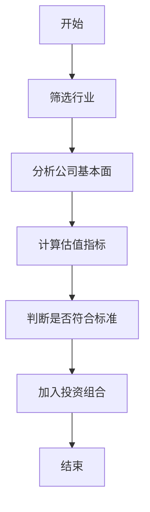
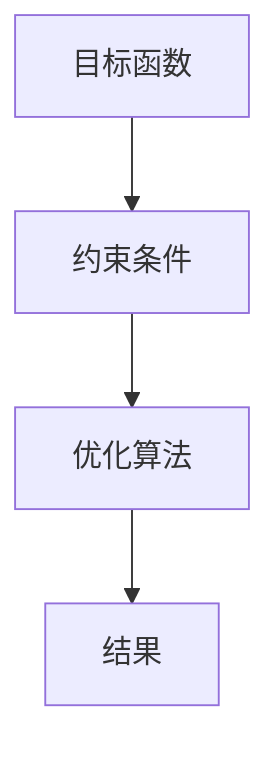

                 


```markdown
# 彼得林奇的"成长型价值股"在不同行业的表现

> 关键词：成长型价值股，彼得林奇，投资策略，行业分析，股票评估

> 摘要：本文深入分析了彼得林奇的成长型价值股投资理论，并探讨了该策略在不同行业中的表现。通过详细阐述成长型价值股的核心概念、评估标准和投资策略，结合具体行业的案例分析，本文揭示了如何在不同行业中识别和投资成长型价值股，为投资者提供了实用的指导。

---

## 第一部分：成长型价值股的核心概念

### 第1章：成长型价值股的定义与特点

#### 1.1 成长型股票的定义
- 成长型股票的特点：高增长潜力，高市盈率，适合长期投资。
- 成长型股票的分类：超级成长股、稳定成长股、适度成长股。

#### 1.2 价值股的定义与特征
- 价值股的特点：低市盈率，低市净率，被市场低估。
- 价值股的分类：纯价值股、周期性价值股、防御性价值股。

#### 1.3 成长型价值股的结合与平衡
- 成长型与价值股的结合：寻找兼具成长性和估值合理的企业。
- 平衡成长与估值的重要性：避免过高估值的风险，抓住成长潜力。

### 第2章：彼得林奇的成长型价值股投资理念

#### 2.1 彼得林奇的投资哲学
- 投资理念：寻找具有持续增长潜力的公司，长期持有。
- 投资风格：注重基本面分析，寻找被市场忽视的潜力股。

#### 2.2 成长型价值股的核心要素
- 公司基本面：盈利能力、成长性、财务健康。
- 行业地位：行业龙头、竞争优势。
- 估值指标：市盈率、市净率、PEG（市盈率相对盈利增长比率）。

#### 2.3 投资策略与长期收益的关系
- 长期投资与复利效应：持续增长带来的收益。
- 短期波动与长期趋势：如何应对市场的短期波动。

---

## 第二部分：成长型价值股的评估标准

### 第3章：成长型价值股的评估标准

#### 3.1 市盈率与市净率分析

##### 3.1.1 市盈率的计算与意义
- 市盈率公式：$$市盈率 = \frac{股票价格}{每股净利润}$$
- 市盈率的意义：衡量股票价格相对于盈利能力的高低。

##### 3.1.2 市净率的计算与意义
- 市净率公式：$$市净率 = \frac{股票价格}{每股净资产}$$
- 市净率的意义：衡量股票价格相对于资产价值的高低。

##### 3.1.3 两者的对比与应用
- 市盈率与市净率的适用场景：市盈率适用于盈利稳定的公司，市净率适用于资产密集型行业。

#### 3.2 盈利能力与成长性分析

##### 3.2.1 净利润增长率
- 净利润增长率的计算：$$净利润增长率 = \frac{本年净利润 - 上年净利润}{上年净利润} \times 100\%$$
- 判断公司盈利能力是否持续增长。

##### 3.2.2 营业收入增长率
- 营业收入增长率的计算：$$营业收入增长率 = \frac{本年营业收入 - 上年营业收入}{上年营业收入} \times 100\%$$
- 衡量公司业务扩展能力。

##### 3.2.3 净资产收益率（ROE）
- ROE的计算：$$ROE = \frac{净利润}{净资产} \times 100\%$$
- 评估公司使用股东资金的效率。

#### 3.3 行业比较与竞争优势分析

##### 3.3.1 行业地位的评估
- 行业集中度分析：垄断行业 vs 竞争激烈的行业。
- 公司在行业中的排名和市场份额。

##### 3.3.2 竞争优势的判断
- 技术优势：专利、研发能力。
- 成本优势：规模化生产、原材料成本。
- 品牌优势：品牌知名度和客户忠诚度。

##### 3.3.3 行业周期的影响
- 行业周期：成长期、成熟期、衰退期。
- 周期性行业与非周期性行业的区别。

---

## 第三部分：成长型价值股的投资策略

### 第4章：成长型价值股的投资策略

#### 4.1 选股标准与筛选流程

##### 4.1.1 选股的三大核心标准
- 盈利能力：净利润增长率 > 行业平均水平。
- 成长性：PEG < 1.5。
- 估值合理性：市盈率 < 行业平均市盈率。

##### 4.1.2 筛选股票的流程图



##### 4.1.3 筛选工具与方法
- 财务报表分析工具：Excel、财务分析软件。
- 股票筛选软件：Zacks、Morningstar。

#### 4.2 投资组合的构建与优化

##### 4.2.1 投资组合的构建原则
- 多样化：分散投资不同行业和公司。
- 长期持有：避免频繁交易。

##### 4.2.2 组合优化的数学模型



- 数学模型：$$Maximize \sum w_i r_i$$
  其中，$$\sum w_i = 1$$
  $$w_i \geq 0$$
- 约束条件：$$\sum w_i = 1$$
- 优化算法：现代投资组合理论（MPT）。

##### 4.2.3 风险管理与止损策略
- 风险管理：设定止损点，控制回撤。
- 分散投资：降低单一股票的风险。

#### 4.3 投资时机与风险管理

##### 4.3.1 市场周期的判断
- 牛市、熊市、震荡市的判断。
- 市场情绪分析：投资者行为、市场波动率。

##### 4.3.2 投资时机的选择
- 成长型价值股在牛市中的表现。
- 在熊市中寻找被低估的成长股。

##### 4.3.3 风险管理与止损策略
- 止损点的设置：通常为买入价的8%~10%。
- 风险分散：通过投资不同行业和股票降低风险。

---

## 第四部分：不同行业中的成长型价值股表现

### 第5章：高科技行业的成长型价值股

#### 5.1 科技行业的特点与机会
- 高速增长：技术创新、市场需求。
- 高风险：技术更新快，竞争激烈。

#### 5.2 典型企业的分析与案例

##### 5.2.1 苹果公司
- 公司基本面：净利润增长率稳定，ROE高。
- 估值指标：PEG < 1.5，市盈率合理。

##### 5.2.2 微软公司
- 成长性：云计算业务增长迅速。
- 估值指标：市净率低于行业平均。

#### 5.3 投资策略的调整与优化
- 关注技术创新和市场需求。
- 选择具有强大研发能力和市场地位的公司。

### 第6章：医疗行业的成长型价值股

#### 6.1 医疗行业的特点与机会
- 人口老龄化：医疗需求增加。
- 技术创新：生物技术、医疗器械。

#### 6.2 典型企业的分析与案例

##### 6.2.1 辉瑞制药
- 公司基本面：净利润增长稳定。
- 估值指标：市盈率合理，PEG < 1.5。

##### 6.2.2 美敦力公司
- 成长性：医疗器械市场增长快。
- 估值指标：市净率低于行业平均。

#### 6.3 投资策略的调整与优化
- 关注老龄化趋势和技术创新。
- 选择具有强大研发能力和市场地位的公司。

### 第7章：消费行业的成长型价值股

#### 7.1 消费行业的特点与机会
- 稳定需求：日常生活消费品。
- 市场潜力：新兴市场消费增长。

#### 7.2 典型企业的分析与案例

##### 7.2.1 可口可乐公司
- 公司基本面：净利润增长稳定。
- 估值指标：PEG < 1.5，市盈率合理。

##### 7.2.2 麦当劳公司
- 成长性：全球扩张潜力。
- 估值指标：市净率低于行业平均。

#### 7.3 投资策略的调整与优化
- 关注消费趋势和市场扩张潜力。
- 选择具有强大品牌影响力和渠道优势的公司。

---

## 第五部分：总结与展望

### 第8章：总结与展望

#### 8.1 成长型价值股投资的核心要点
- 理解成长型与价值股的结合。
- 把握行业趋势和公司基本面。

#### 8.2 不同行业的投资策略差异
- 高科技行业：高增长，高风险。
- 医疗行业：稳定增长，技术创新。
- 消费行业：稳定需求，市场潜力。

#### 8.3 未来投资趋势
- 新兴行业：人工智能、生物技术。
- 全球化投资：关注国际市场机会。

---

## 附录

### 附录A：成长型价值股的筛选指标

| 指标名称       | 计算公式                          | 重要性 |
|----------------|-----------------------------------|--------|
| 市盈率（PE）    | 股价 / 每股净利润                | 高     |
| 市净率（PB）    | 股价 / 每股净资产                | 中     |
| 净利润增长率    | (本年净利润 - 上年净利润) / 上年净利润 * 100% | 高     |
| 营业收入增长率  | (本年营收 - 上年营收) / 上年营收 * 100%       | 中     |
| PEG            | 市盈率 / 净利润增长率             | 高     |

### 附录B：彼得林奇的经典投资书籍
- 《彼得林奇的选股标准》
- 《彼得林奇的投资策略》

---

## 作者

作者：AI天才研究院/AI Genius Institute & 禅与计算机程序设计艺术/Zen And The Art of Computer Programming
```

