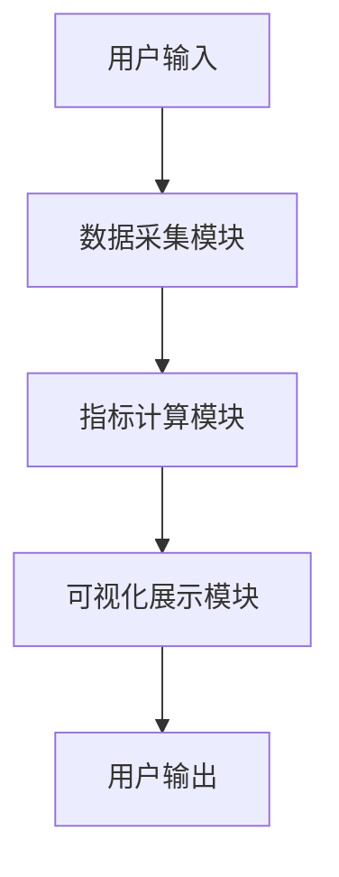

                 


# 彼得林奇的"竞争优势"评估体系

## 关键词：竞争优势，彼得·林奇，投资评估，财务分析，系统设计

## 摘要：  
彼得·林奇是全球著名投资家，其竞争优势评估体系是投资领域的重要理论。本文通过详细分析竞争优势的核心概念、评估方法、数学模型、系统架构和实战案例，全面解读彼得·林奇的竞争优势评估体系，并结合技术语言进行深度剖析。文章最后结合实际项目，展示如何将竞争优势评估体系应用于投资分析。

---

## 第1章: 竞争优势的定义与背景

### 1.1 竞争优势的核心概念

#### 1.1.1 什么是竞争优势  
竞争优势是指企业在市场中相对于竞争对手的独特优势，这些优势可以是成本、技术、品牌、资源、管理等多个方面的优势。竞争优势的核心在于为企业创造超额利润的能力。  

**竞争优势 = 独特价值 + 可持续性**  

竞争优势不仅关乎企业的生存，更是决定企业长期发展的关键因素。  

#### 1.1.2 竞争优势的背景与重要性  
在现代市场经济中，企业之间的竞争日益激烈。竞争优势是企业在市场中立足的关键，尤其是在技术驱动和全球化背景下，竞争优势的评估显得尤为重要。  

竞争优势的评估可以帮助投资者识别出具有长期增长潜力的企业，从而做出更明智的投资决策。  

#### 1.1.3 竞争优势与投资的关系  
竞争优势是投资的核心逻辑。投资者通过评估企业的竞争优势，可以判断企业的长期盈利能力，从而做出更精准的投资决策。  

---

### 1.2 竞争优势的分类与特征

竞争优势的分类可以从多个维度进行划分，以下是主要的分类方式：

| **分类维度** | **具体内容** |
|--------------|--------------|
| 成本优势      | 企业通过规模化生产、技术创新等方式降低成本，从而获得价格优势。 |
| 品牌优势      | 强大的品牌影响力可以帮助企业吸引更多的客户，提升市场地位。 |
| 技术优势      | 独特的技术或专利可以为企业的核心竞争力提供保障。 |
| 市场优势      | 企业在特定市场或区域内的领先地位，包括市场份额和渠道优势。 |

竞争优势的特征包括：  
1. **独特性**：竞争优势必须是竞争对手难以复制的。  
2. **可持续性**：竞争优势能够长期为企业创造价值。  
3. **可衡量性**：竞争优势可以通过量化指标进行评估。  

---

## 第2章: 彼得·林奇的竞争优势评估方法

### 2.1 彼得·林奇的“三重过滤法”

彼得·林奇的竞争优势评估方法以“三重过滤法”为核心，具体包括：  

#### 1. 第一重过滤：行业分析  
行业分析是竞争优势评估的第一步，主要分析以下内容：  
- **行业生命周期**：判断行业是否处于成长期或成熟期。  
- **行业竞争结构**：分析行业内主要竞争对手的数量和市场份额。  
- **行业前景**：评估行业的未来发展趋势。  

**行业分析的关键指标**：  
- 行业增长率  
- 行业利润率  
- 行业集中度  

#### 2. 第二重过滤：公司基本面分析  
基本面分析是竞争优势评估的核心，主要分析企业的财务状况和经营能力。  

**基本面分析的关键指标**：  
- **盈利能力**：ROE（净资产收益率）、净利润率  
- **成长能力**：收入增长率、净利润增长率  
- **财务健康性**：资产负债率、现金流  

#### 3. 第三重过滤：管理层分析  
管理层是企业发展的关键，优秀的管理层能够带领企业持续创造价值。  

**管理层分析的关键点**：  
- 管理层的背景和经验  
- 管理层的决策风格  
- 管理层的透明度  

### 2.2 竞争优势的量化评估

竞争优势的量化评估需要结合财务指标和市场指标，具体包括：  

#### 1. 财务指标分析  
财务指标是评估竞争优势的重要工具，常用的财务指标包括：  

| **指标名称**         | **计算公式**                          | **意义**                 |
|----------------------|---------------------------------------|--------------------------|
| 净资产收益率（ROE）    | 净利润 / 平均股东权益                | 衡量企业的盈利能力       |
| 毛利率                 | (营业收入 - 营业成本) / 营业收入     | 衡量企业的成本控制能力   |
| 净利润增长率           | (本年净利润 - 上年净利润) / 上年净利润 | 衡量企业的成长能力       |

#### 2. 市场指标分析  
市场指标是评估市场竞争地位的重要工具，常用的市场指标包括：  

| **指标名称**         | **计算公式**                          | **意义**                 |
|----------------------|---------------------------------------|--------------------------|
| 市场份额              | 企业的市场份额 / 行业总市场份额      | 衡量企业在行业中的地位   |
| 市盈率（P/E）        | 每股市价 / 每股收益                  | 衡量市场的预期收益       |

---

## 第3章: 竞争优势评估的数学模型

### 3.1 竞争优势指数的构建

竞争优势指数是将多个评估指标综合起来，形成一个综合评分系统。以下是竞争优势指数的构建逻辑：  

#### 1. 竞争优势指数的逻辑  
竞争优势指数的构建基于以下原则：  
1. **权重分配**：根据指标的重要性，分配不同的权重。  
2. **评分标准**：将每个指标的评分标准化，确保不同指标之间可以比较。  
3. **加权计算**：将标准化后的评分按权重加权求和，得到最终的竞争优势指数。  

#### 2. 竞争优势指数的公式  
$$
\text{竞争优势指数} = \sum_{i=1}^{n} w_i \times f_i
$$  
其中，\( w_i \) 是第 \( i \) 个指标的权重，\( f_i \) 是第 \( i \) 个指标的评分。  

### 3.2 竞争优势指数的数学模型

以下是一个简单的竞争优势指数计算示例：  

#### 1. 权重分配  
| **指标名称**         | **权重** |
|----------------------|----------|
| 净资产收益率（ROE）    | 30%      |
| 毛利率                 | 30%      |
| 净利润增长率           | 20%      |
| 市场份额              | 20%      |

#### 2. 评分标准  
| **指标名称**         | **评分标准**               |
|----------------------|---------------------------|
| 净资产收益率（ROE）    | 90分（高于行业平均水平）  |
| 毛利率                 | 80分（低于行业平均水平）  |
| 净利润增长率           | 70分（高于行业平均水平）  |
| 市场份额              | 85分（行业前三）           |

#### 3. 竞争优势指数计算  
$$
\text{竞争优势指数} = 0.3 \times 90 + 0.3 \times 80 + 0.2 \times 70 + 0.2 \times 85 = 27 + 24 + 14 + 17 = 82
$$  

---

## 第4章: 竞争优势评估的系统架构

### 4.1 系统功能设计

竞争优势评估系统的功能设计包括以下模块：  

#### 1. 数据采集模块  
- 采集企业的财务数据、行业数据和市场数据。  

#### 2. 指标计算模块  
- 计算企业的各项竞争优势指标。  

#### 3. 可视化展示模块  
- 将计算结果以图表形式展示，便于用户理解和分析。  

### 4.2 系统架构图  

以下是一个简单的竞争优势评估系统架构图：  



---

## 第5章: 项目实战——竞争优势评估系统实现

### 5.1 环境安装与配置

#### 1. Python环境搭建  
- 安装Python和相关库（如Pandas、Matplotlib）。  

#### 2. 数据库安装与配置  
- 使用MySQL或MongoDB存储企业数据。  

#### 3. 开发工具安装  
- 安装PyCharm或VS Code作为开发工具。  

### 5.2 核心代码实现

#### 1. 数据采集代码  
```python
import pandas as pd

def collect_data():
    # 从CSV文件中读取数据
    data = pd.read_csv('enterprise_data.csv')
    return data

# 示例调用
data = collect_data()
print(data.head())
```

#### 2. 竞争优势指数计算代码  
```python
def calculate_competitive_edge(data):
    # 计算竞争优势指数
    weights = [0.3, 0.3, 0.2, 0.2]
    indicators = ['ROE', '毛利率', '净利润增长率', '市场份额']
    scores = []
    for idx, row in data.iterrows():
        score = 0
        for i in range(len(weights)):
            weight = weights[i]
            indicator = indicators[i]
            if row[indicator] >= 80:
                score += weight * (row[indicator] / 100)
        scores.append(score)
    data['竞争优势指数'] = scores
    return data

# 示例调用
result = calculate_competitive_edge(data)
print(result[['企业名称', '竞争优势指数']])
```

#### 3. 可视化展示代码  
```python
import matplotlib.pyplot as plt

def visualize_competitive_edge(data):
    plt.figure(figsize=(10, 6))
    plt.bar(data['企业名称'], data['竞争优势指数'], color='blue')
    plt.title('竞争优势指数')
    plt.xlabel('企业名称')
    plt.ylabel('竞争优势指数')
    plt.show()

# 示例调用
visualize_competitive_edge(result)
```

---

## 第6章: 总结与最佳实践

### 6.1 小结

竞争优势是投资分析的核心，彼得·林奇的三重过滤法为我们提供了一个系统的评估框架。通过结合财务指标、市场指标和管理层分析，我们可以更全面地评估企业的竞争优势。

### 6.2 注意事项

1. **数据准确性**：竞争优势评估依赖于高质量的数据，确保数据来源可靠。  
2. **模型适用性**：竞争优势评估模型需要根据实际情况进行调整，避免生搬硬套。  
3. **动态调整**：市场环境不断变化，竞争优势也需要动态评估。  

### 6.3 拓展阅读

1. 彼得·林奇的《彼得·林奇的投资哲学》  
2. 投资分析相关的书籍和论文  
3. 竞争优势评估的其他理论和方法  

---

## 作者：AI天才研究院/AI Genius Institute & 禅与计算机程序设计艺术 /Zen And The Art of Computer Programming

