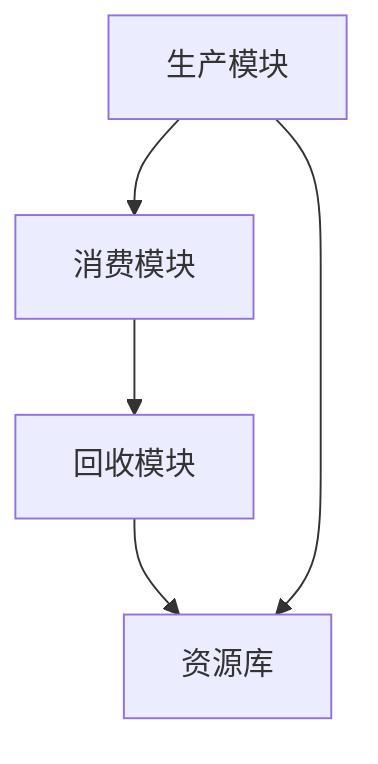
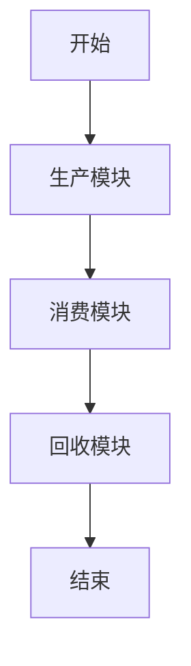
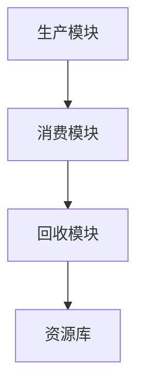

                 


# 循环经济商业模式的可扩展性与投资机会

> 关键词：循环经济，商业模式，可扩展性，投资机会，资源优化，可持续发展

> 摘要：本文系统分析了循环经济商业模式的可扩展性及其投资机会，探讨了循环经济的定义、核心概念、商业模式的分类与对比，以及如何通过技术驱动、市场需求和政策环境实现扩展。文章还详细阐述了循环经济商业模式的可扩展性评估指标，包括资源利用率、经济效益和社会效益，并通过实际案例分析，展示了循环经济商业模式在不同行业的应用及其投资回报潜力。

---

## 第1章: 循环经济商业模式的背景与核心概念

### 1.1 循环经济的定义与特征

#### 1.1.1 循环经济的定义
循环经济是以资源高效利用和循环再生为核心，通过减少资源消耗和环境污染，实现经济可持续发展的模式。它强调“从摇篮到摇篮”的理念，将废弃物视为资源，通过设计和技术创新，使资源在整个生命周期内循环流动。

#### 1.1.2 循环经济的核心特征
循环经济的核心特征包括：
1. **资源高效利用**：通过技术手段最大化资源利用率，减少浪费。
2. **闭环流动**：资源在生产、消费和回收之间形成闭环，避免一次性使用。
3. **多利益相关方协同**：企业、政府、消费者和社会组织共同参与，形成协同效应。

#### 1.1.3 循环经济与传统经济的区别
| **维度**       | **传统经济**                     | **循环经济**                     |
|----------------|----------------------------------|----------------------------------|
| 资源利用       | 单向消耗资源                   | 循环利用资源                   |
| 环境影响       | 高度依赖自然资源，环境压力大     | 环境压力小，资源再生             |
| 经济模式       | 以生产为导向                   | 以服务和资源共享为导向           |

### 1.2 循环经济商业模式的形成与发展

#### 1.2.1 循环经济商业模式的起源
循环经济商业模式的形成源于对环境问题的关注。随着资源短缺和环境污染问题的加剧，企业开始探索更可持续的商业模式，如共享经济和产品服务系统。

#### 1.2.2 循环经济商业模式的典型特征
循环经济商业模式的典型特征包括：
1. **产品服务化**：企业从销售产品转向提供服务，如租赁、维修和升级服务。
2. **资源再生利用**：通过回收和再利用资源，降低原材料依赖。
3. **技术驱动**：依赖技术创新实现资源高效利用和循环流动。

### 1.3 循环经济商业模式的核心要素

#### 1.3.1 资源流分析
资源流分析包括：
- **物质流**：原材料在生产、消费和回收过程中的流动。
- **能量流**：能源在系统中的转换和利用。
- **信息流**：数据在各个环节中的传递和处理。

#### 1.3.2 价值流分析
价值流分析关注：
- **产品价值重构**：通过服务化和资源共享提升产品价值。
- **服务价值提升**：提供增值服务以增强客户粘性。
- **资源价值再利用**：通过回收和再生创造新价值。

#### 1.3.3 利益相关者分析
利益相关者包括：
- **企业**：作为循环经济的主要参与者，负责产品的设计、生产和回收。
- **消费者**：参与产品的使用和回收，改变传统的消费方式。
- **政府与非营利组织**：提供政策支持和监管，推动循环经济的发展。

---

## 第2章: 循环经济商业模式的可扩展性分析

### 2.1 循环经济商业模式的可扩展性框架

#### 2.1.1 可扩展性的影响因素
循环经济商业模式的可扩展性受以下因素影响：
1. **技术可行性**：技术创新是实现资源循环利用的关键。
2. **市场需求**：消费者对循环经济产品和服务的接受程度。
3. **政策环境**：政府政策的支持力度和法规的完善程度。

#### 2.1.2 可扩展性评估指标
可扩展性评估指标包括：
- **资源利用率**：单位产品或服务的资源消耗量。
- **经济效益**：商业模式的盈利能力和社会效益。
- **社会效益**：对环境保护和就业机会的影响。

#### 2.1.3 可扩展性扩展路径
扩展路径包括：
- **技术创新驱动**：通过技术手段优化资源利用。
- **市场需求驱动**：满足消费者对绿色产品的需求。
- **政策支持驱动**：借助政策支持扩大商业模式的应用范围。

### 2.2 循环经济商业模式的可扩展性评估

#### 2.2.1 资源利用率分析
资源利用率是衡量循环经济商业模式的重要指标。通过优化生产过程和回收系统，可以显著提高资源利用率。例如，通过线性规划模型优化生产计划，以最小化资源消耗。

#### 2.2.2 经济效益分析
经济效益分析包括成本降低和收入增加两个方面。循环经济模式通过减少原材料依赖和提高产品附加值，实现经济效益的提升。例如，通过融资租赁模式，企业可以降低初始投资成本，同时获得稳定的收益。

#### 2.2.3 社会效益分析
社会效益主要体现在环境保护和就业机会的增加。循环经济模式减少了废弃物产生，缓解了环境污染问题，同时创造了新的就业机会，如回收工人和绿色技术工程师。

### 2.3 循环经济商业模式的扩展路径

#### 2.3.1 技术创新驱动
技术创新是循环经济模式扩展的关键。例如，通过智能传感器和大数据分析，企业可以实时监控资源使用情况，优化生产和回收流程。

#### 2.3.2 市场需求驱动
消费者对绿色产品和服务的需求日益增加，为企业提供了扩展循环经济模式的机会。例如，共享经济模式在交通、住宿和办公等领域得到了广泛应用。

#### 2.3.3 政策支持驱动
政府政策的支持是循环经济模式扩展的重要保障。例如，通过税收优惠和补贴政策，鼓励企业采用循环经济模式，降低初始投资成本。

---

## 第3章: 循环经济商业模式的投资机会分析

### 3.1 投资机会的识别与评估

#### 3.1.1 投资机会的识别
循环经济商业模式的投资机会主要集中在以下几个领域：
1. **资源再生利用**：如废金属、塑料和电子废弃物的回收与再利用。
2. **产品服务化**：如产品租赁、维修和升级服务。
3. **共享经济**：如共享办公空间、共享交通和共享住宿。

#### 3.1.2 投资机会的评估
评估投资机会时，需要考虑以下几个方面：
- **市场需求**：目标市场的规模和增长潜力。
- **竞争环境**：市场上的竞争对手情况。
- **政策环境**：政府政策的支持力度和法规的完善程度。

### 3.2 投资回报分析

#### 3.2.1 经济回报
循环经济商业模式的投资回报主要体现在成本降低和收入增加两个方面。例如，通过资源再生利用，企业可以显著降低原材料成本，同时通过提供增值服务获得额外收入。

#### 3.2.2 社会回报
循环经济模式的社会回报体现在环境保护和就业机会的增加。例如，通过减少废弃物产生，企业可以降低环境污染风险，同时创造新的就业机会，如回收工人和绿色技术工程师。

### 3.3 投资策略与风险管理

#### 3.3.1 投资策略
投资者可以采用以下策略：
- **技术创新投资**：投资于技术创新型企业，推动资源高效利用。
- **市场拓展投资**：通过市场拓展进入新兴市场，扩大业务规模。
- **政策支持投资**：利用政府政策支持，降低投资风险。

#### 3.3.2 风险管理
风险管理包括：
- **市场风险**：通过多元化投资降低市场波动风险。
- **政策风险**：密切关注政策变化，制定应对策略。
- **技术风险**：通过技术创新和合作降低技术失败风险。

---

## 第4章: 循环经济商业模式的系统设计与实现

### 4.1 系统架构设计

#### 4.1.1 系统模块划分
循环经济商业模式的系统架构通常包括以下几个模块：
- **生产模块**：负责产品的设计和制造。
- **消费模块**：负责产品的使用和管理。
- **回收模块**：负责产品的回收和再利用。

#### 4.1.2 系统架构图


### 4.2 系统功能设计

#### 4.2.1 功能模块
功能模块包括：
- **产品生命周期管理**：跟踪产品的整个生命周期，从生产到回收。
- **资源流管理**：监控资源的流动情况，优化资源利用。
- **利益相关者管理**：管理企业、消费者和社会组织之间的关系。

#### 4.2.2 功能流程图


### 4.3 系统接口设计

#### 4.3.1 接口定义
接口定义包括：
- **生产模块接口**：与消费模块交互，提供产品和服务。
- **消费模块接口**：与回收模块交互，处理产品的使用和回收。
- **回收模块接口**：与资源库交互，处理资源的回收和再利用。

#### 4.3.2 接口交互流程图


### 4.4 系统实现

#### 4.4.1 核心代码实现
以下是循环经济商业模式的核心代码实现：
```python
def resource_loop(producer, consumer, recycler):
    # 生产模块
    product = producer.produce()
    # 消费模块
    consumer.use(product)
    # 回收模块
    recycler.recycle(product)
```

#### 4.4.2 系统实现流程
系统实现流程包括：
1. **需求分析**：明确系统功能需求。
2. **系统设计**：设计系统架构和功能模块。
3. **代码实现**：根据设计编写代码。
4. **测试与优化**：测试系统功能，优化性能。
5. **部署与维护**：部署系统，进行日常维护。

---

## 第5章: 循环经济商业模式的案例分析与投资机会

### 5.1 案例分析

#### 5.1.1 案例背景
以电子产品行业为例，循环经济模式可以通过产品租赁和回收再利用实现资源循环。

#### 5.1.2 案例分析
某电子产品公司采用循环经济模式，通过租赁模式销售电子产品，同时建立回收体系，对废旧电子产品进行拆解和再利用。这种模式不仅降低了企业的生产成本，还提高了产品的附加值。

### 5.2 投资机会分析

#### 5.2.1 投资潜力
循环经济模式在多个行业具有广阔的投资潜力，如电子废弃物回收、共享经济和绿色供应链管理。

#### 5.2.2 投资回报分析
通过案例分析，可以看出循环经济模式的投资回报较高，尤其是在资源再生利用和产品服务化领域。

### 5.3 投资策略建议

#### 5.3.1 投资策略
投资者可以采用以下策略：
- **技术驱动投资**：投资于技术创新型企业，推动资源高效利用。
- **市场拓展投资**：通过市场拓展进入新兴市场，扩大业务规模。
- **政策支持投资**：利用政府政策支持，降低投资风险。

#### 5.3.2 风险管理
风险管理包括：
- **市场风险**：通过多元化投资降低市场波动风险。
- **政策风险**：密切关注政策变化，制定应对策略。
- **技术风险**：通过技术创新和合作降低技术失败风险。

---

## 第6章: 循环经济商业模式的未来展望与投资建议

### 6.1 未来发展趋势

#### 6.1.1 技术创新
未来，循环经济模式将更加依赖技术创新，如人工智能和物联网技术的应用，实现资源的高效利用和循环流动。

#### 6.1.2 市场扩展
随着消费者对绿色产品和服务需求的增加，循环经济模式将在更多行业得到应用，市场将进一步扩大。

#### 6.1.3 政策支持
政府将继续出台支持循环经济模式的政策，为企业提供更多的发展机会。

### 6.2 投资建议

#### 6.2.1 关注技术创新
投资者应关注技术创新型企业，尤其是那些在循环经济领域具有核心技术优势的企业。

#### 6.2.2 投资可持续发展项目
投资于那些具有可持续发展潜力的项目，如绿色供应链管理和资源再生利用项目。

#### 6.2.3 多元化投资
通过多元化投资降低风险，同时抓住循环经济模式在不同行业的应用机会。

---

## 作者：AI天才研究院/AI Genius Institute & 禅与计算机程序设计艺术 /Zen And The Art of Computer Programming

