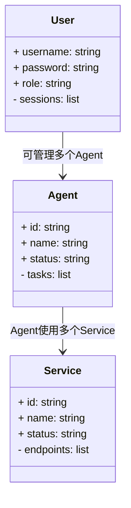

                 


# 微服务架构：构建模块化的AI Agent系统

---

## 关键词：微服务架构, AI Agent, 模块化设计, 服务通信, 系统设计

---

## 摘要：  
随着人工智能技术的快速发展，AI Agent（智能代理）在各个领域的应用越来越广泛。为了提高AI Agent系统的可扩展性、可维护性和灵活性，微服务架构成为了一个理想的选择。本文详细探讨了如何通过微服务架构构建模块化的AI Agent系统，从核心概念到系统设计，再到项目实战，全面解析了这一技术的实现细节和实际应用。

---

## 第1章: 微服务架构与AI Agent概述

### 1.1 微服务架构的核心概念

#### 1.1.1 微服务架构的定义  
微服务架构是一种将应用程序分解为多个小型、独立服务的架构风格。每个服务都是一个独立的进程，通过轻量级通信机制（如HTTP或消息队列）进行通信。

#### 1.1.2 微服务架构的特点  
- **独立性**：每个服务独立运行，互不干扰。  
- **可扩展性**：可以根据需求单独扩展服务。  
- **松耦合**：服务之间通过接口通信，耦合度低。  
- **技术多样性**：不同服务可以使用不同的技术栈。  

#### 1.1.3 微服务架构与传统单体架构的区别  
| 特性           | 微服务架构                     | 单体架构                     |  
|----------------|-------------------------------|------------------------------|  
| 独立性         | 高                            | 低                            |  
| 可扩展性       | 高                            | 低                            |  
| 服务粒度       | 细粒度                        | 粗粒度                        |  

---

### 1.2 AI Agent的基本概念

#### 1.2.1 AI Agent的定义  
AI Agent是一种能够感知环境、自主决策并执行任务的智能实体。它可以理解用户需求、推理解决方案并执行操作。

#### 1.2.2 AI Agent的核心功能  
- **感知**：通过传感器或API获取环境信息。  
- **推理**：基于知识库进行逻辑推理，制定决策。  
- **执行**：通过API或外部系统执行操作。  

#### 1.2.3 AI Agent与传统软件的区别  
| 特性           | AI Agent                     | 传统软件                     |  
|----------------|-------------------------------|------------------------------|  
| 智能性         | 高                            | 低                            |  
| 自主性         | 高                            | 低                            |  
| 学习能力       | 高                            | 无                            |  

---

### 1.3 微服务架构与AI Agent的结合

#### 1.3.1 微服务架构在AI Agent中的应用  
- **模块化设计**：AI Agent的功能模块（如感知、推理、执行）可以分解为独立的服务。  
- **服务通信**：通过微服务架构实现模块之间的高效通信。  

#### 1.3.2 模块化设计的意义  
- **提高可维护性**：每个模块独立，便于修改和扩展。  
- **增强灵活性**：可以根据需求快速调整模块。  

#### 1.3.3 微服务架构与AI Agent的协同工作模式  
- **服务发现**：AI Agent通过服务发现机制找到所需服务。  
- **任务分解**：AI Agent将任务分解为多个子任务，分别调用不同的微服务。  

---

## 第2章: 微服务架构的核心原理

### 2.1 微服务架构的核心原理

#### 2.1.1 分布式系统的基本概念  
分布式系统是将功能分布在多个独立的节点上，通过通信机制实现协作。

#### 2.1.2 微服务的通信机制  
- **HTTP RESTful API**：基于HTTP协议的RESTful接口。  
- **消息队列**：如Kafka、RabbitMQ等。  

#### 2.1.3 微服务的容错机制  
- **断路器模式**：防止服务故障扩散。  
- **重试机制**：处理网络波动或临时故障。  

---

### 2.2 微服务架构的设计原则

#### 2.2.1 单一职责原则  
每个服务只负责一个功能模块。  

#### 2.2.2 界面对等原则  
服务之间通过统一的接口通信，避免依赖关系混乱。  

#### 2.2.3 隔离变化原则  
将变化的部分（如数据库、外部API）封装为独立的服务。  

---

### 2.3 微服务架构的实现方式

#### 2.3.1 服务发现与注册  
- **服务注册**：服务启动后向注册中心注册。  
- **服务发现**：客户端通过注册中心获取服务实例。  

#### 2.3.2 服务调用与通信  
- **客户端调用**：直接调用服务接口。  
- **服务网关**：通过网关统一入口。  

#### 2.3.3 服务治理与监控  
- **服务治理**：管理服务的生命周期。  
- **服务监控**：监控服务的运行状态。  

---

## 第3章: AI Agent系统的核心原理

### 3.1 AI Agent的基本设计原则

#### 3.1.1 目标驱动设计  
AI Agent以目标为导向，分解任务并执行。  

#### 3.1.2 知识表示与推理  
- **知识表示**：使用符号逻辑或知识图谱表示知识。  
- **逻辑推理**：基于知识库进行推理，制定决策。  

#### 3.1.3 行为规划与执行  
- **行为规划**：制定执行任务的步骤。  
- **行为执行**：通过API调用或其他方式执行操作。  

---

### 3.2 AI Agent的核心实现技术

#### 3.2.1 任务分解与分配  
- **任务分解**：将复杂任务分解为子任务。  
- **任务分配**：将子任务分配给不同的服务。  

#### 3.2.2 知识库的构建与管理  
- **知识表示**：使用RDF（Resource Description Framework）或图数据库。  
- **知识推理**：基于逻辑推理引擎进行推理。  

#### 3.2.3 多 Agent 协作机制  
- **协作协议**：定义Agent之间的协作规则。  
- **通信机制**：通过消息队列或HTTP API进行通信。  

---

### 3.3 AI Agent的通信协议

#### 3.3.1 Agent 间通信的基本协议  
- **请求-响应模式**：Agent主动发送请求，接收方返回响应。  
- **发布-订阅模式**：通过消息队列发布事件，订阅方接收处理。  

#### 3.3.2 基于消息队列的通信机制  
- **生产者-消费者模式**：一个Agent作为生产者发布消息，其他Agent作为消费者处理消息。  

#### 3.3.3 基于 RESTful API 的通信方式  
- **HTTP 请求**：通过HTTP协议调用远程服务。  

---

## 第4章: 模块化设计与AI Agent的结合

### 4.1 模块化设计的基本概念

#### 4.1.1 模块化设计的定义  
将系统划分为多个独立模块，每个模块负责特定功能。  

#### 4.1.2 模块化设计的优势  
- **提高可维护性**：模块独立，便于修改和扩展。  
- **增强灵活性**：可以根据需求快速调整模块。  

---

### 4.2 模块化设计在AI Agent中的应用

#### 4.2.1 AI Agent的功能模块划分  
- **感知模块**：负责数据采集和环境感知。  
- **推理模块**：负责逻辑推理和决策制定。  
- **执行模块**：负责任务执行和结果反馈。  

#### 4.2.2 模块之间的依赖关系  
- **模块间依赖**：模块之间通过接口进行通信。  

#### 4.2.3 模块化的扩展与维护  
- **模块扩展**：可以根据需求增加新的模块。  
- **模块维护**：可以独立维护每个模块。  

---

### 4.3 模块化设计的实现案例

#### 4.3.1 某AI Agent系统的模块划分  
- **用户界面模块**：负责用户交互。  
- **数据处理模块**：负责数据预处理。  
- **模型推理模块**：负责任务推理和决策。  

#### 4.3.2 模块之间的通信机制  
- **模块间通信**：通过HTTP API或消息队列进行通信。  

---

## 第5章: 微服务架构与AI Agent的结合

### 5.1 微服务架构在AI Agent系统中的应用

#### 5.1.1 系统设计原则  
- **模块化设计**：AI Agent的功能模块分解为独立的服务。  
- **服务通信**：通过微服务架构实现模块之间的高效通信。  

#### 5.1.2 系统实现步骤  
1. **需求分析**：明确系统功能模块。  
2. **模块划分**：将功能模块分解为独立的服务。  
3. **服务实现**：为每个模块实现独立的服务。  
4. **服务集成**：通过通信机制将服务集成到系统中。  

---

### 5.2 AI Agent系统的设计与实现

#### 5.2.1 系统功能设计  
- **功能模块划分**：感知、推理、执行模块。  
- **功能流程设计**：用户输入请求 → 感知模块获取数据 → 推理模块制定决策 → 执行模块执行操作。  

#### 5.2.2 系统架构设计  
- **分层架构**：感知层、推理层、执行层。  
- **通信机制**：通过HTTP API或消息队列实现模块间通信。  

---

## 第6章: 项目实战

### 6.1 项目介绍

#### 6.1.1 项目背景  
一个基于微服务架构的AI Agent系统，用于实现任务自动化。  

#### 6.1.2 项目目标  
构建一个模块化的AI Agent系统，实现任务分解、推理和执行功能。  

---

### 6.2 系统设计

#### 6.2.1 领域模型设计  


#### 6.2.2 系统架构设计  
```mermaid
service
[
  {
    "name": "API Gateway",
    "type": "service"
  },
  {
    "name": "User Service",
    "type": "service"
  },
  {
    "name": "Agent Service",
    "type": "service"
  },
  {
    "name": "Knowledge Base",
    "type": "service"
  }
]
```

#### 6.2.3 系统接口设计  
- **API Gateway**：统一的API入口。  
- **User Service**：管理用户信息。  
- **Agent Service**：管理Agent实例。  
- **Knowledge Base**：提供知识推理服务。  

---

### 6.3 代码实现

#### 6.3.1 环境安装  
- **Python 3.8+**  
- **Flask** 或其他微服务框架。  

#### 6.3.2 核心代码实现  
```python
from flask import Flask
from flask_restful import Resource, Api

app = Flask(__name__)
api = Api(app)

class AgentResource(Resource):
    def get(self):
        return {"status": "success", "message": "AI Agent系统运行正常"}

api.add_resource(AgentResource, '/api/agent')

if __name__ == '__main__':
    app.run(debug=True)
```

---

### 6.4 项目小结

---

## 第7章: 总结与展望

### 7.1 本章小结  
本文详细探讨了如何通过微服务架构构建模块化的AI Agent系统，从核心概念到系统设计，再到项目实战，全面解析了这一技术的实现细节和实际应用。

### 7.2 未来展望  
随着人工智能技术的不断发展，微服务架构与AI Agent系统的结合将更加紧密，模块化设计也将成为构建智能系统的重要方法。

---

## 作者：AI天才研究院/AI Genius Institute & 禅与计算机程序设计艺术 /Zen And The Art of Computer Programming

---

**文章结束**

