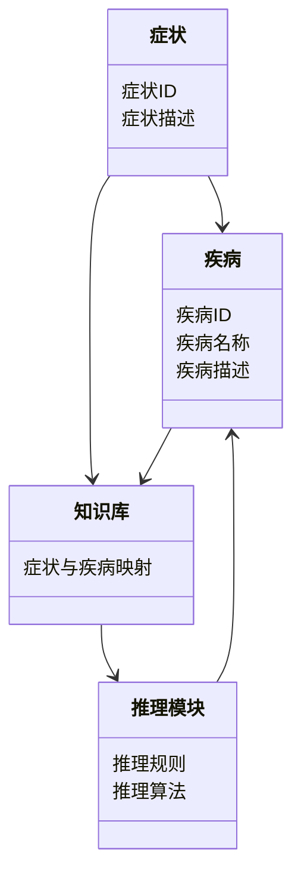

                 


# 思维链：提升AI Agent的推理能力

---

## 关键词

- AI Agent
- 推理能力
- 逻辑推理
- 知识图谱
- 思维链

---

## 摘要

思维链是提升AI Agent推理能力的关键技术，通过逻辑推理、知识表示和符号推理，AI Agent能够更好地理解和解决复杂问题。本文详细探讨了思维链的原理、算法、数学模型、系统架构及实际应用，结合案例分析和代码实现，为读者提供了全面的指导。

---

## 第1章：思维链的基本概念

### 1.1 问题背景与描述

AI Agent（智能体）在现代人工智能系统中扮演着重要角色，负责感知环境、处理信息并做出决策。然而，现有的AI Agent在推理能力方面仍存在不足，特别是在处理复杂逻辑和不确定性问题时表现有限。思维链作为一种创新的推理方法，为提升AI Agent的推理能力提供了新的思路。

#### 1.1.1 AI Agent的基本概念

AI Agent是具有感知、决策和行动能力的智能实体，能够根据环境信息做出自主决策。常见的AI Agent包括聊天机器人、推荐系统和自动驾驶系统。

#### 1.1.2 思维链在AI Agent中的作用

思维链通过构建逻辑推理链路，帮助AI Agent逐步推导出结论，提升其在复杂问题中的决策能力。

#### 1.1.3 当前AI推理能力的挑战与需求

当前AI Agent在推理能力方面面临以下挑战：
- **复杂逻辑推理**：处理多步逻辑推理时容易出错。
- **知识表示**：知识表示方式单一，难以应对复杂场景。
- **不确定性处理**：在不确定性环境中推理能力不足。

思维链通过优化逻辑推理和知识表示，帮助AI Agent克服这些挑战。

### 1.2 思维链的核心要素

思维链的核心要素包括：
- **逻辑推理**：通过符号逻辑进行推理。
- **知识表示**：使用知识图谱表示知识。
- **符号推理**：基于符号规则进行推理。

这些要素共同构成了思维链的核心机制。

---

## 第2章：思维链的原理与机制

### 2.1 逻辑推理原理

逻辑推理是思维链的核心，通过符号逻辑进行推理。

#### 2.1.1 命题逻辑基础

命题逻辑是逻辑推理的基础，涉及命题的真假和逻辑运算。

#### 2.1.2 谓词逻辑与规则推理

谓词逻辑扩展了命题逻辑，引入谓词和量词，用于描述更复杂的逻辑关系。

### 2.2 知识图谱与符号推理

知识图谱为符号推理提供了知识基础，符号推理基于规则进行推理。

---

## 第3章：逻辑推理算法

### 3.1 基于一阶逻辑的推理算法

#### 3.1.1 算法步骤与流程

一阶逻辑推理算法的步骤如下：
1. 建立知识库。
2. 提出查询。
3. 应用推理规则进行推理。
4. 得出结论。

#### 3.1.2 实例分析：医疗诊断系统

在医疗诊断系统中，一阶逻辑推理算法可以帮助诊断疾病。

---

## 第4章：逻辑推理的数学模型

### 4.1 命题逻辑公式

命题逻辑公式示例：
$$p \land q$$

### 4.2 概率推理模型

概率推理模型示例：
$$P(A|B) = \frac{P(B|A)P(A)}{P(B)}$$

---

## 第5章：AI Agent的系统架构

### 5.1 系统功能设计

#### 5.1.1 领域模型：医疗诊断系统的类图



### 5.2 系统架构设计

#### 5.2.1 分层架构：感知层、推理层、决策层


---

## 第6章：AI Agent推理系统实现

### 6.1 环境安装与配置

#### 6.1.1 开发工具：Python、TensorFlow、Keras

安装步骤：
1. 安装Python。
2. 安装TensorFlow和Keras。

### 6.2 核心代码实现

#### 6.2.1 知识表示模块

```python
class KnowledgeBase:
    def __init__(self):
        self.knowledge = {}

    def add_fact(self, fact):
        if isinstance(fact, tuple):
            self.knowledge[fact[0]] = fact[1]
```

---

## 第7章：总结与未来方向

### 7.1 本章小结

本文详细探讨了思维链在提升AI Agent推理能力中的应用，通过逻辑推理、知识图谱和符号推理，AI Agent的推理能力得到了显著提升。

### 7.2 未来研究方向

未来的研究方向包括更复杂的推理算法和多模态数据融合的推理方法。

---

## 作者

作者：AI天才研究院/AI Genius Institute & 禅与计算机程序设计艺术 /Zen And The Art of Computer Programming

---

希望这篇文章能为读者提供关于AI Agent推理能力提升的全面指导和启发。

