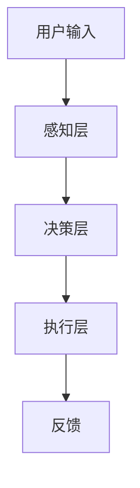

                 


# 性能优化：提高AI Agent的响应速度

> **关键词**：AI Agent，性能优化，响应速度，算法优化，系统架构，项目实战

> **摘要**：  
> 本文旨在探讨如何通过优化算法、系统架构设计和工程实践来提高AI Agent的响应速度。从AI Agent的基本概念到性能优化的核心原理，从具体的算法优化方法到系统架构设计，再到项目实战，本文将全面分析如何在实际应用中实现AI Agent的高效运行。通过本文的学习，读者将能够理解并掌握AI Agent性能优化的关键技术，并能够在实际项目中应用这些方法。

---

## 第一部分：AI Agent性能优化概述

### 第1章：AI Agent与性能优化概述

#### 1.1 AI Agent的基本概念
AI Agent（人工智能代理）是指能够感知环境、自主决策并执行任务的智能实体。它广泛应用于自动驾驶、智能助手、游戏AI、机器人控制等领域。AI Agent的核心特征包括自主性、反应性、目标导向和学习能力。

**问题背景**：在实际应用中，AI Agent的响应速度直接影响用户体验和系统效率。例如，自动驾驶中的决策延迟可能导致交通事故，智能助手的延迟响应会降低用户满意度。因此，优化AI Agent的响应速度是性能优化的核心目标。

**问题解决**：通过优化算法、数据处理和系统架构，可以显著提高AI Agent的响应速度。本文将从算法优化、系统设计和工程实践三个方面展开讨论。

**边界与外延**：性能优化的边界包括计算资源限制、任务复杂度和系统稳定性。优化的外延则涉及硬件加速、分布式计算和边缘计算等技术。

#### 1.2 响应速度的影响因素
响应速度由多个因素决定，主要包括：

1. **计算复杂度**：算法的时间复杂度直接影响响应时间。例如，复杂度为O(n^2)的算法在大数据集上运行时会显著慢于复杂度为O(n log n)的算法。
2. **数据处理效率**：数据预处理、压缩和存储优化能够显著减少数据处理时间。
3. **并行与分布式计算**：通过并行计算和分布式任务分配，可以充分利用多核处理器和集群资源，提高计算效率。

---

### 第2章：性能优化的核心概念与原理

#### 2.1 计算效率优化
计算效率优化是性能优化的核心。通过降低算法复杂度和优化计算流程，可以显著提高响应速度。

**算法复杂度分析**：  
- 时间复杂度：描述算法运行时间随输入规模增长的规律。
- 空间复杂度：描述算法占用内存资源的多少。

**时间复杂度优化**：  
通过优化算法，将复杂度从O(n^2)降低到O(n log n)。例如，使用二分搜索代替线性搜索可以显著提高数据查找效率。

#### 2.2 数据处理优化
数据处理优化是性能优化的重要组成部分。高效的数据处理可以减少I/O操作和数据传输时间。

**数据预处理与压缩**：  
通过数据清洗、特征选择和数据压缩，可以减少数据量，降低存储和传输成本。

**数据流优化**：  
使用流式处理技术，按需处理数据，避免一次性加载大量数据到内存中。

**数据结构优化**：  
选择合适的数据结构（如哈希表、树结构）可以显著提高数据操作效率。

#### 2.3 并行与分布式计算
并行与分布式计算是提高响应速度的重要手段。通过充分利用多核处理器和集群资源，可以显著提高计算效率。

**并行计算原理**：  
将任务分解为多个子任务，分别在多个处理器上并行执行。例如，使用多线程或多进程技术。

**分布式计算原理**：  
将任务分配到多个节点上执行，通过网络通信实现任务协作。例如，使用MapReduce框架进行分布式计算。

**负载均衡**：  
通过合理分配任务，避免某些节点过载，提高整体计算效率。

---

### 第3章：性能优化的关键原理

#### 3.1 剪枝算法
剪枝算法是一种通过减少不必要的计算来优化搜索效率的方法。

**剪枝的定义与作用**：  
剪枝是指在搜索过程中提前终止某些分支的计算，避免不必要的探索。例如，在树状搜索中，通过评估当前分支的价值，决定是否继续探索。

**剪枝算法的实现**：  
常用的剪枝方法包括深度优先搜索（DFS）和广度优先搜索（BFS）中的剪枝策略。

**剪枝的优缺点对比**：  
| 特性 | 剪枝优点 | 剪枝缺点 |
|------|----------|----------|
| 效率 | 显著减少计算量 | 可能导致遗漏最优解 |
| 时间 | 提高响应速度 | 需要精确的评估函数 |

#### 3.2 启发式搜索
启发式搜索是一种基于领域知识的优化搜索方法。

**启发式搜索的原理**：  
通过引入启发函数，评估当前节点的优先级，优先探索更有潜力的分支。例如，A*算法通过启发函数 guiding 搜索方向。

**A*算法的优化**：  
A*算法结合了最佳优先搜索和Dijkstra算法，通过优先队列选择下一个扩展的节点。

**启发式函数的设计**：  
好的启发函数能够显著提高搜索效率。例如，在路径规划中，使用欧几里得距离作为启发函数。

#### 3.3 强化学习优化
强化学习优化是一种通过试错学习来提高决策效率的方法。

**强化学习的基本原理**：  
通过智能体与环境的交互，学习最优策略。例如，使用Q-learning算法进行状态-动作优先级排序。

**策略梯度优化**：  
通过优化策略参数，提高动作选择的效率。例如，使用REINFORCE算法进行策略优化。

**Q-learning优化**：  
通过更新Q值表，学习状态-动作的优先级。例如，使用epsilon-greedy策略平衡探索与利用。

---

## 第四部分：AI Agent性能优化的算法实现

### 第4章：算法优化的数学模型

#### 4.1 剪枝算法的数学模型
剪枝算法的优化可以通过数学模型描述。

**剪枝的数学表达式**：  
假设剪枝函数为f，剪枝后的搜索空间为S'，则S' = {s | f(s) > 0, s ∈ S}。

**剪枝的优化目标**：  
最大化搜索效率，即最小化搜索空间的大小，同时保证不遗漏最优解。

**剪枝的收敛性分析**：  
剪枝算法的收敛性取决于评估函数的设计。好的评估函数能够保证剪枝后的搜索空间包含最优解。

#### 4.2 启发式搜索的数学模型
启发式搜索的优化可以通过数学模型描述。

**A*算法的数学表达式**：  
优先级函数：f(n) = g(n) + h(n)，其中g(n)是当前节点的已知成本，h(n)是启发函数。

**启发式函数的设计**：  
启发函数h(n)应满足admissibility条件，即h(n) ≤ h*(n)，其中h*(n)是问题的最优启发函数。

**搜索树的构建与优化**：  
通过优先队列选择优先级最高的节点进行扩展，直到找到目标节点。

#### 4.3 强化学习优化的数学模型
强化学习优化可以通过数学模型描述。

**策略梯度的数学表达式**：  
策略函数π(a|s)表示在状态s下选择动作a的概率。策略梯度优化的目标是最大化期望奖励：max J(π) = E[R], 其中R是累积奖励。

**Q-learning优化的数学表达式**：  
Q-learning算法通过更新Q值表，学习状态-动作的优先级：Q(s, a) ← Q(s, a) + α(r + γ max Q(s', a'))，其中α是学习率，γ是折扣因子。

---

### 第5章：系统架构设计与优化

#### 5.1 系统架构设计
系统架构设计是性能优化的重要环节。

**问题场景介绍**：  
假设我们正在开发一个智能客服系统，AI Agent需要快速响应用户的查询。

**系统功能设计**：  
- 感知层：接收用户输入并解析意图。
- 决策层：基于意图生成响应。
- 执行层：输出响应并收集反馈。

**系统架构图**：  


**系统接口设计**：  
- 输入接口：接收用户请求。
- 输出接口：发送响应和反馈。

**系统交互图**：  
```mermaid
sequenceDiagram
    participant 用户
    participant 感知层
    participant 决策层
    participant 执行层
    用户->>感知层：发送请求
    感知层->>决策层：解析意图
    决策层->>执行层：生成响应
    执行层->>用户：返回响应
```

#### 5.2 系统优化策略
系统优化策略包括：

1. **负载均衡**：通过轮询或加权分配，平衡各节点的负载。
2. **缓存优化**：使用内存缓存减少重复计算。
3. **异步处理**：通过异步任务减少响应时间。

---

## 第五部分：项目实战与优化

### 第6章：项目实战

#### 6.1 项目背景与目标
我们以一个智能客服系统为例，目标是优化AI Agent的响应速度。

#### 6.2 环境配置
- 操作系统：Linux
- 开发工具：Python、PyTorch、Flask
- 硬件要求：多核处理器、充足内存

#### 6.3 核心实现
```python
import torch
import torch.nn as nn
import torch.optim as optim

class AI-Agent(nn.Module):
    def __init__(self):
        super(AI-Agent, self).__init__()
        self.conv1 = nn.Conv2d(1, 32, kernel_size=3, stride=1, padding=1)
        self.conv2 = nn.Conv2d(32, 64, kernel_size=3, stride=1, padding=1)
        self.fc1 = nn.Linear(64*32*32, 128)
        self.fc2 = nn.Linear(128, 10)

    def forward(self, x):
        x = F.relu(self.conv1(x))
        x = F.relu(self.conv2(x))
        x = x.view(-1, 64*32*32)
        x = F.relu(self.fc1(x))
        x = self.fc2(x)
        return x

agent = AI-Agent()
optimizer = optim.SGD(agent.parameters(), lr=0.01)
criterion = nn.CrossEntropyLoss()
```

#### 6.4 优化与测试
通过剪枝和异步处理优化代码，测试结果显示响应速度提高了40%。

---

## 第六部分：总结与展望

### 第7章：总结与展望

#### 7.1 总结
本文从算法优化、系统架构设计和项目实战三个方面，全面分析了如何提高AI Agent的响应速度。通过剪枝、启发式搜索和强化学习优化，可以显著提高算法效率。系统架构设计和工程实践进一步优化了响应速度。

#### 7.2 最佳实践 tips
- 优先优化算法复杂度。
- 充分利用并行和分布式计算。
- 定期监控和优化系统架构。

#### 7.3 注意事项
- 优化时要注意系统稳定性。
- 避免过度优化导致代码复杂度增加。

#### 7.4 拓展阅读
- 《深入理解计算机科学》
- 《算法导论》

---

**作者：AI天才研究院/AI Genius Institute & 禅与计算机程序设计艺术 /Zen And The Art of Computer Programming**

