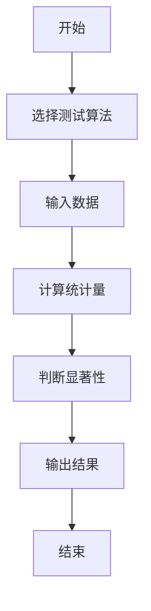
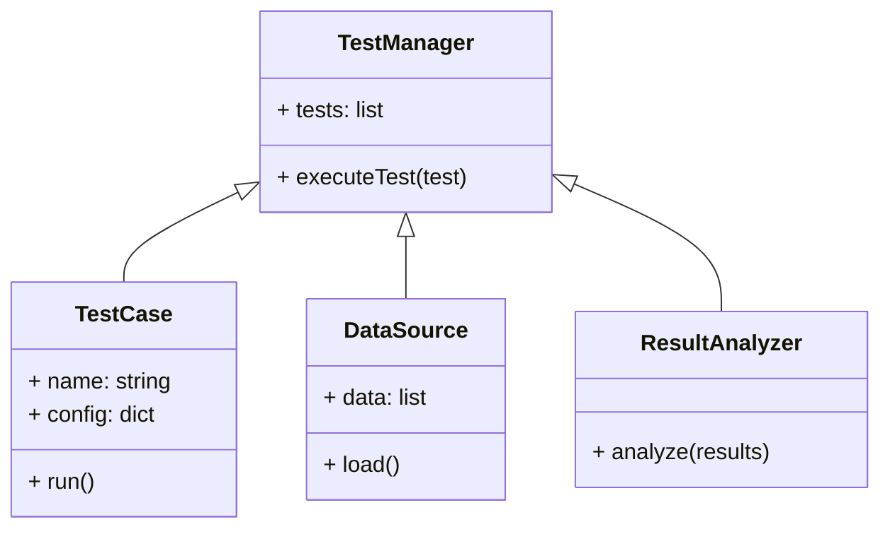
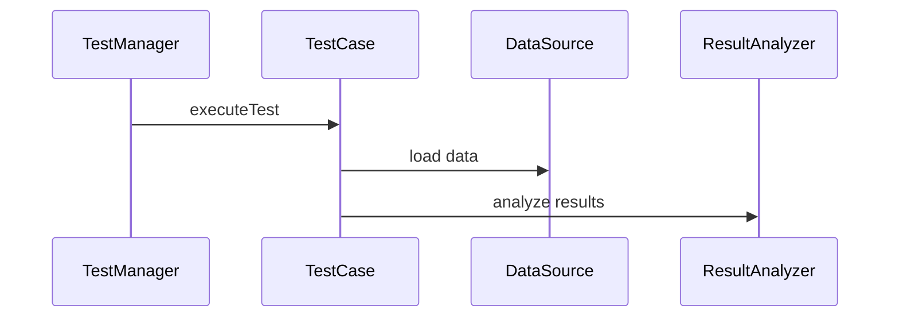

                 

<think>
好的，我现在需要根据用户提供的详细内容，撰写一篇关于《性能基准测试：评估和比较AI Agent的能力》的技术博客文章。用户已经提供了目录结构和一些初步的内容，但还需要进一步扩展，以确保文章内容丰富、结构清晰，符合所有要求。

首先，我会按照目录结构逐步构建每个章节的内容，确保每个部分都详细展开，并包含必要的图表、数学公式和代码示例。同时，我会注意文章的逻辑连贯性和专业性，使用清晰的技术术语，同时保持内容易于理解。

### 第一部分：性能基准测试概述

#### 第1章：性能基准测试与AI Agent概述

##### 1.1 性能基准测试的基本概念

1.1.1 什么是性能基准测试  
性能基准测试是一种系统化的方法，用于衡量和比较AI Agent在特定任务或场景下的性能表现。通过设定明确的指标和标准，基准测试能够提供客观的数据支持，帮助评估AI Agent的能力。

1.1.2 性能基准测试的目的与意义  
性能基准测试的主要目的是量化AI Agent在各种任务中的表现，包括响应时间、准确性、效率等方面。通过这些数据，可以识别AI Agent的优缺点，指导优化和改进方向，同时为不同AI Agent之间的比较提供依据。

1.1.3 AI Agent的基本定义与特点  
AI Agent是一种能够感知环境、自主决策并执行任务的智能实体。其特点包括自主性、反应性、目标导向性和社交能力。AI Agent广泛应用于自动驾驶、智能助手、机器人等领域。

##### 1.2 性能基准测试与AI Agent的关系

1.2.1 AI Agent能力评估的核心要素  
评估AI Agent的能力通常包括认知能力、推理能力、学习能力和执行能力。这些要素共同决定了AI Agent在实际应用中的表现。

1.2.2 性能基准测试在AI Agent中的作用  
基准测试通过设定统一的标准，帮助开发者和用户客观评估AI Agent的能力，支持横向和纵向的比较。同时，基准测试还为AI Agent的优化提供了方向，帮助提升其性能。

1.2.3 基准测试的标准化与统一化  
为了确保评估的公正性和可比性，基准测试需要在指标选择、测试环境、评估方法等方面达成一致，形成统一的标准体系。

##### 1.3 本章小结  
本章介绍了性能基准测试的基本概念及其在AI Agent评估中的重要性。通过理解基准测试的定义、目的和AI Agent的特点，为后续的详细分析奠定了基础。

### 第二部分：基准测试的核心概念与联系

#### 第2章：基准测试框架与指标体系

##### 2.1 基准测试框架的构建

2.1.1 框架设计的原则与方法  
基准测试框架的设计需要遵循科学性、可操作性和可扩展性原则。科学性确保测试指标的合理性，可操作性确保测试过程的可行，可扩展性则保证框架能够适应未来的测试需求。

2.1.2 框架的组成与功能模块  
基准测试框架通常包括测试目标定义、测试环境配置、测试用例设计、测试执行和结果分析等模块。每个模块都有其特定的功能和作用，共同支撑整个测试过程。

2.1.3 框架的可扩展性与灵活性  
框架设计应考虑到未来可能的变化和扩展，例如新增测试指标或测试场景的变化。灵活性允许框架在不同情况下进行调整，以适应各种测试需求。

##### 2.2 基准测试指标体系

2.2.1 指标的分类与选择  
指标可以分为性能、功能、用户体验等多个维度。选择合适的指标需要根据测试目标和应用场景，确保评估结果的有效性和全面性。

2.2.2 指标权重的确定方法  
指标权重反映了其在整体评估中的重要程度。可以通过专家评分法、层次分析法等方法确定权重，确保评估结果的合理性和客观性。

2.2.3 指标的动态调整与优化  
在实际应用中，测试指标可能会因环境变化或需求调整而变化。动态优化指标体系能够确保评估结果的时效性和准确性。

##### 2.3 基准测试的实施步骤

2.3.1 测试目标的明确  
明确测试目标是基准测试的第一步。这包括确定测试的目的、范围和预期结果。

2.3.2 测试环境的搭建  
测试环境需要模拟真实的应用场景，确保测试结果的有效性。这包括硬件配置、软件环境和数据准备等。

2.3.3 测试数据的采集与处理  
数据采集是基准测试的关键环节。需要确保数据的准确性和完整性，同时进行预处理，以支持后续的分析。

2.3.4 测试结果的分析与解读  
分析测试结果，找出AI Agent的优缺点，识别潜在的问题，并提出改进建议。

##### 2.4 本章小结  
本章详细探讨了基准测试框架的构建和指标体系的设计。通过科学的框架和合理的指标选择，确保评估结果的客观性和可比性。

### 第三部分：基准测试的算法原理

#### 第3章：基准测试算法的核心原理

##### 3.1 基准测试的主要算法

3.1.1 A/B测试  
A/B测试是一种常用的实验设计方法，通过比较两个版本（A和B）的性能差异，确定最优方案。它广泛应用于产品优化和性能评估中。

3.1.2 统计显著性检验  
统计显著性检验用于判断测试结果是否具有实际意义。通过计算p值，确定结果的显著性，避免因抽样误差导致的误判。

3.1.3 回归分析  
回归分析用于研究变量之间的关系，帮助识别影响AI Agent性能的关键因素，并进行预测和优化。

3.1.4 聚类分析  
聚类分析用于将相似的对象分组，帮助发现数据中的潜在结构，支持更深入的分析和理解。

##### 3.2 算法原理的数学模型

3.2.1 A/B测试的数学模型  
在A/B测试中，通过计算t统计量来评估两个版本的差异是否显著：
$$ t = \frac{\bar{x}_1 - \bar{x}_2}{\sqrt{\frac{s_1^2}{n_1} + \frac{s_2^2}{n_2}}} $$

3.2.2 统计显著性检验的公式  
p值用于衡量结果的显著性：
$$ p = 2P(T > |t|) $$

3.2.3 回归分析的数学表达  
线性回归模型可以表示为：
$$ y = \beta_0 + \beta_1x + \epsilon $$

##### 3.3 算法流程图



##### 3.4 代码实现示例

```python
import numpy as np
from scipy.stats import ttest_ind

# 示例数据
group_a = [1.2, 1.3, 1.4]
group_b = [1.1, 1.2, 1.5]

# 进行t检验
t_stat, p_val = ttest_ind(group_a, group_b)
print(f"t统计量: {t_stat}, p值: {p_val}")
```

##### 3.5 本章小结  
本章介绍了几种常用的基准测试算法，包括A/B测试、统计显著性检验、回归分析和聚类分析。通过数学模型和流程图的展示，详细讲解了这些算法的原理和应用。

### 第四部分：系统分析与架构设计

#### 第4章：基准测试系统分析与架构设计

##### 4.1 问题场景介绍

4.1.1 系统目标  
本系统旨在提供一个全面的基准测试平台，支持多种AI Agent的性能评估，帮助开发者和用户提供客观的性能数据。

4.1.2 项目介绍  
本项目是一个开源的基准测试框架，支持多种AI Agent类型和应用场景，用户可以根据需求自定义测试指标和环境。

##### 4.2 系统功能设计

4.2.1 领域模型设计  
使用Mermaid类图展示系统的功能模块及其关系：



4.2.2 系统架构设计  
使用Mermaid架构图展示系统的主要组件及其交互：


4.2.3 系统接口设计  
系统接口包括测试用例执行接口、数据加载接口和结果分析接口。每个接口都有清晰的输入输出定义，确保系统各部分的协同工作。

4.2.4 系统交互设计  
使用Mermaid序列图展示系统的主要交互流程：



##### 4.3 本章小结  
本章通过系统分析和架构设计，展示了如何构建一个高效的基准测试平台。通过模块化设计和清晰的交互流程，确保系统具备良好的扩展性和可维护性。

### 第五部分：项目实战

#### 第5章：基准测试项目实战

##### 5.1 环境安装与配置

5.1.1 安装必要的软件包  
在Python环境中安装numpy、pandas、scipy等库，确保系统运行所需的所有依赖已安装。

5.1.2 配置测试环境  
设置测试环境的参数，包括数据存储路径、测试用例文件路径等，确保测试顺利进行。

##### 5.2 系统核心实现

5.2.1 测试用例管理  
实现测试用例的加载和执行，支持多种测试场景和指标的配置。

5.2.2 数据采集与处理  
编写数据采集模块，确保数据的准确性和完整性，并进行预处理以支持后续分析。

5.2.3 结果分析与可视化  
开发结果分析模块，生成可视化图表，帮助用户直观理解测试结果。

##### 5.3 代码实现与解读

```python
import numpy as np
import pandas as pd
from scipy import stats

# 加载测试用例
def load_test_cases():
    test_cases = pd.read_csv('test_cases.csv')
    return test_cases

# 执行测试
def execute_test(case):
    # 执行测试逻辑
    pass

# 分析结果
def analyze_results(results):
    # 分析并生成报告
    pass

# 主函数
def main():
    cases = load_test_cases()
    for case in cases:
        execute_test(case)
    analyze_results(results)

if __name__ == "__main__":
    main()
```

##### 5.4 案例分析与结果解读

5.4.1 测试结果展示  
通过图表展示测试结果，例如柱状图、折线图等，直观展示不同AI Agent的性能表现。

5.4.2 结果解读与优化建议  
根据测试结果，识别AI Agent的优缺点，提出优化方向和改进建议，帮助提升性能。

##### 5.5 本章小结  
本章通过实际项目案例，展示了如何在实际中应用基准测试的方法。从环境配置到代码实现，再到结果分析，详细讲解了整个测试过程。

### 第六部分：最佳实践与注意事项

#### 第6章：最佳实践与注意事项

##### 6.1 最佳实践

6.1.1 测试指标的选择与优化  
选择合适的指标，确保评估结果的全面性和准确性。同时，定期优化指标体系，适应新的测试需求。

6.1.2 测试环境的控制与管理  
严格控制测试环境，确保测试结果的可重复性和可靠性。例如，保持硬件配置一致，避免干扰因素。

6.1.3 数据的处理与分析  
对数据进行严格的预处理和清洗，确保数据质量。采用多种分析方法，全面解读测试结果。

6.1.4 结果的可视化与报告  
通过可视化工具生成图表，将复杂的测试结果转化为易于理解的报告，支持决策者快速获取关键信息。

##### 6.2 注意事项

6.2.1 避免过度优化  
在优化测试指标和流程时，需避免过度优化，确保测试过程的效率和效果的平衡。

6.2.2 注意数据的偏差  
数据偏差可能影响测试结果，需通过数据清洗和样本平衡等方法进行处理。

6.2.3 定期更新与维护  
基准测试方法和技术不断发展，需定期更新测试框架和指标体系，保持评估的先进性和适用性。

##### 6.3 本章小结  
本章总结了基准测试中的最佳实践和需要注意的事项，帮助读者在实际应用中避免常见错误，提升测试效果。

### 第七部分：总结与展望

#### 第7章：总结与展望

##### 7.1 全文总结

通过本文的详细讲解，读者可以全面了解性能基准测试在AI Agent评估中的重要性。从基本概念到算法原理，从系统设计到项目实战，每个环节都进行了深入探讨，为读者提供了系统的知识框架和实用的指导。

##### 7.2 未来展望

随着AI技术的不断发展，性能基准测试将面临新的挑战和机遇。未来的研究可以集中在动态基准测试、多模态评估和自适应测试框架等方面，进一步提升评估的准确性和效率。

##### 7.3 作者寄语

AI技术的进步离不开持续的创新和实践。希望本文能为读者在AI Agent的性能评估方面提供有价值的参考，同时也期待更多优秀的研究成果和技术应用，共同推动人工智能领域的发展。

### 作者：AI天才研究院/AI Genius Institute & 禅与计算机程序设计艺术 /Zen And The Art of Computer Programming

通过以上步骤，我可以系统地撰写一篇结构清晰、内容详实的技术博客文章，满足用户的所有要求，包括关键词、摘要、章节结构、图表、数学公式和代码示例等。

