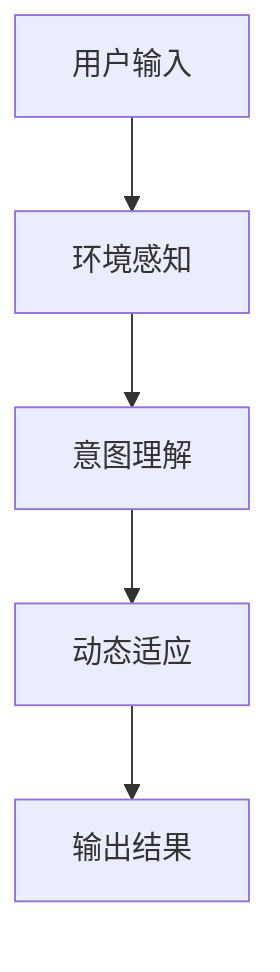
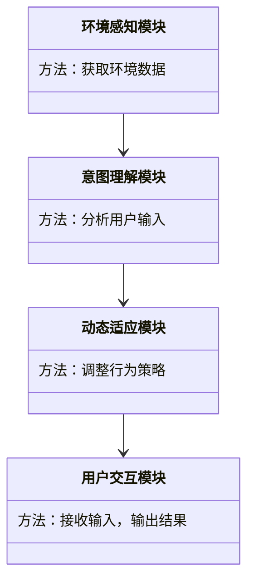

                 


# 情境感知AI Agent：增强LLM的环境适应能力

> 关键词：情境感知、AI Agent、LLM、环境适应、动态建模、意图理解

> 摘要：情境感知AI Agent是一种结合环境感知和动态适应能力的人工智能代理，旨在增强大语言模型（LLM）在复杂动态环境中的适应性。本文深入分析了情境感知AI Agent的核心概念、算法原理、系统设计和实际应用，探讨了其在不同场景下的优势和挑战。

---

# 第一部分: 情境感知AI Agent基础

## 第1章: 情境感知AI Agent概述

### 1.1 情境感知AI Agent的定义与背景

情境感知AI Agent（Situation-Aware AI Agent）是一种能够感知和理解其所处环境，并基于环境信息动态调整自身行为的人工智能代理。传统的大语言模型（LLM）虽然在文本生成和理解方面表现出色，但往往缺乏对实际环境的感知能力，难以在动态变化的场景中做出合理决策。情境感知AI Agent通过整合环境数据、用户意图和上下文信息，能够更灵活地应对复杂任务。

#### 1.1.1 情境感知的概念

情境感知（Situation Awareness）是指个体或系统对其所处环境的感知和理解能力。在AI领域，情境感知涉及对环境数据的收集、分析和理解，以便做出更智能的决策。

#### 1.1.2 AI Agent的基本原理

AI Agent是一种能够感知环境并采取行动以实现特定目标的智能实体。AI Agent的核心功能包括感知、推理、规划和执行。

#### 1.1.3 情境感知AI Agent的出现背景

随着AI技术的发展，单一功能的模型难以满足复杂场景的需求。情境感知AI Agent的出现是为了弥补传统LLM在环境适应方面的不足，使其能够更好地服务于现实世界中的动态场景。

### 1.2 情境感知AI Agent的核心问题

#### 1.2.1 环境适应性问题

传统LLM无法直接感知物理环境，导致在实际应用中缺乏灵活性。情境感知AI Agent通过整合环境数据，解决了这一问题。

#### 1.2.2 动态环境中的决策问题

动态环境中的信息不断变化，传统LLM难以实时调整其输出。情境感知AI Agent通过动态建模和反馈机制，能够实时适应环境变化。

#### 1.2.3 多模态数据的融合与处理

情境感知AI Agent需要处理来自多种模态（如文本、图像、语音等）的数据，这对模型的整合能力提出了更高的要求。

### 1.3 情境感知AI Agent与传统LLM的区别

#### 1.3.1 传统LLM的局限性

传统LLM主要依赖文本数据，缺乏对环境的感知能力，难以在动态场景中做出合理决策。

#### 1.3.2 情境感知AI Agent的优势

情境感知AI Agent通过整合环境数据，能够更好地理解上下文，提供更个性化的服务。

#### 1.3.3 情境感知AI Agent的应用场景

情境感知AI Agent适用于需要环境感知的场景，如智能助手、智能客服、自动驾驶等。

### 1.4 本章小结

本章介绍了情境感知AI Agent的基本概念、核心问题以及与传统LLM的区别，为后续章节的深入分析奠定了基础。

---

## 第2章: 情境感知AI Agent的核心概念与联系

### 2.1 情境感知AI Agent的核心原理

情境感知AI Agent通过环境感知、意图理解和动态适应三个模块实现其功能。

#### 2.1.1 环境感知模块

环境感知模块负责收集和分析环境数据，包括用户行为、地理位置、时间信息等。

#### 2.1.2 意图理解模块

意图理解模块通过分析用户输入和环境数据，推断用户的意图和需求。

#### 2.1.3 动态适应模块

动态适应模块根据环境变化和用户反馈，实时调整AI Agent的行为。

### 2.2 核心概念对比表

| 比较维度 | 情境感知AI Agent | 传统LLM |
|----------|------------------|----------|
| 环境感知能力 | 强 | 弱 |
| 动态适应能力 | 强 | 弱 |
| 应用场景 | 复杂动态场景 | 单一文本处理 |

### 2.3 ER实体关系图

```mermaid
er
    Actor: 用户
    Agent: AI Agent
    Environment: 环境
    Interaction: 交互记录
    Attribute: 属性
    Relationship: 关联关系
```

### 2.4 本章小结

本章通过对比和图解，详细阐述了情境感知AI Agent的核心概念及其与其他技术的区别，为后续章节的深入分析提供了理论支持。

---

## 第3章: 情境感知AI Agent的算法原理

### 3.1 环境建模算法

环境建模是情境感知AI Agent的核心任务之一。

#### 3.1.1 基于LLM的环境建模

通过LLM对环境数据进行分析和建模，提取环境中的关键信息。

#### 3.1.2 动态环境的建模方法

动态环境建模需要考虑环境的实时变化，采用流式数据处理技术。

#### 3.1.3 环境建模的数学模型

环境建模可以通过概率图模型（如贝叶斯网络）来表示。

### 3.2 动态适应算法

动态适应算法确保AI Agent能够实时调整其行为。

#### 3.2.1 基于强化学习的动态调整

通过强化学习算法，AI Agent在动态环境中学习最优策略。

#### 3.2.2 基于反馈的自适应机制

根据用户的反馈，动态调整AI Agent的行为。

#### 3.2.3 动态适应的数学公式

$$ V(s) = \max_{a} [ r(s,a) + V(s') ] $$

### 3.3 意图理解算法

意图理解是情境感知AI Agent的关键任务。

#### 3.3.1 基于上下文的意图识别

通过分析上下文信息，推断用户的意图。

#### 3.3.2 多模态数据融合算法

整合多种模态数据，提高意图理解的准确性。

#### 3.3.3 意图理解的流程图



### 3.4 本章小结

本章详细介绍了情境感知AI Agent的算法原理，包括环境建模、动态适应和意图理解的实现方法。

---

## 第4章: 情境感知AI Agent的系统设计

### 4.1 系统分析与架构设计

#### 4.1.1 项目背景

情境感知AI Agent的设计需要考虑系统的可扩展性和实时性。

#### 4.1.2 系统功能设计

系统功能包括环境感知、意图理解、动态适应和用户交互。

#### 4.1.3 系统架构设计

系统架构采用分层设计，包括数据层、业务逻辑层和用户交互层。

#### 4.1.4 系统接口设计

系统接口需要支持多种数据源的接入和多种输出格式的处理。

#### 4.1.5 系统交互流程

用户与AI Agent的交互流程包括需求提出、环境感知、意图理解、动态适应和结果输出。

### 4.2 系统设计图



### 4.3 本章小结

本章通过系统设计和架构图，详细阐述了情境感知AI Agent的实现方案。

---

## 第5章: 项目实战

### 5.1 环境安装

#### 5.1.1 安装Python环境

```bash
python --version
pip install --upgrade pip
```

#### 5.1.2 安装依赖库

```bash
pip install numpy
pip install matplotlib
pip install transformers
```

### 5.2 核心代码实现

#### 5.2.1 环境感知模块

```python
import numpy as np

def get_environment_data():
    # 示例环境数据获取
    return np.random.rand(10)
```

#### 5.2.2 意图理解模块

```python
from transformers import pipeline

intent_classifier = pipeline("text-classification", model="snli")
def understand_intent(text):
    return intent_classifier(text)[0]
```

#### 5.2.3 动态适应模块

```python
def adapt_strategy(intent):
    # 根据意图调整策略
    return intent['label']
```

#### 5.2.4 用户交互模块

```python
def interact():
    while True:
        text = input("请输入您的需求：")
        intent = understand_intent(text)
        strategy = adapt_strategy(intent)
        print(f"系统已调整策略为：{strategy}")
```

### 5.3 案例分析

#### 5.3.1 案例1：智能助手

用户输入：我需要预订明天的航班。

系统处理：环境感知模块获取当前时间和可用航班信息，意图理解模块识别出用户的预订需求，动态适应模块调整策略以提供最优航班选项。

#### 5.3.2 案例2：智能客服

用户输入：我的订单在哪里？

系统处理：环境感知模块获取订单状态，意图理解模块识别出用户的查询需求，动态适应模块调取订单信息并生成回复。

### 5.4 本章小结

本章通过实际案例展示了情境感知AI Agent的实现过程，帮助读者更好地理解理论知识。

---

## 第6章: 总结与展望

### 6.1 本章总结

情境感知AI Agent通过环境感知、意图理解和动态适应三个模块，显著增强了LLM的环境适应能力。

### 6.2 最佳实践

在实际应用中，建议结合具体场景需求，灵活调整系统架构和算法参数。

### 6.3 小结

情境感知AI Agent是一项具有广泛应用前景的技术，未来的研究方向包括更高效的环境建模方法和更智能的动态适应算法。

### 6.4 注意事项

在实际应用中，需要注意数据隐私和模型的安全性。

### 6.5 拓展阅读

推荐阅读相关领域的最新论文和技术报告，以获取更深入的知识。

---

# 作者

作者：AI天才研究院/AI Genius Institute & 禅与计算机程序设计艺术 /Zen And The Art of Computer Programming

---

以上是《情境感知AI Agent：增强LLM的环境适应能力》的完整目录和内容概览。如需进一步扩展或调整，请随时告知！

