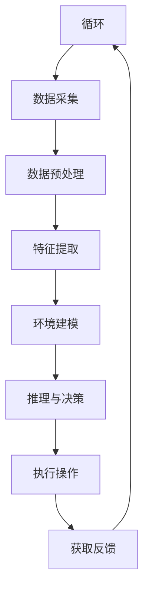
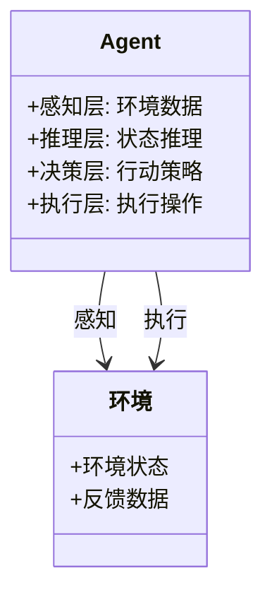
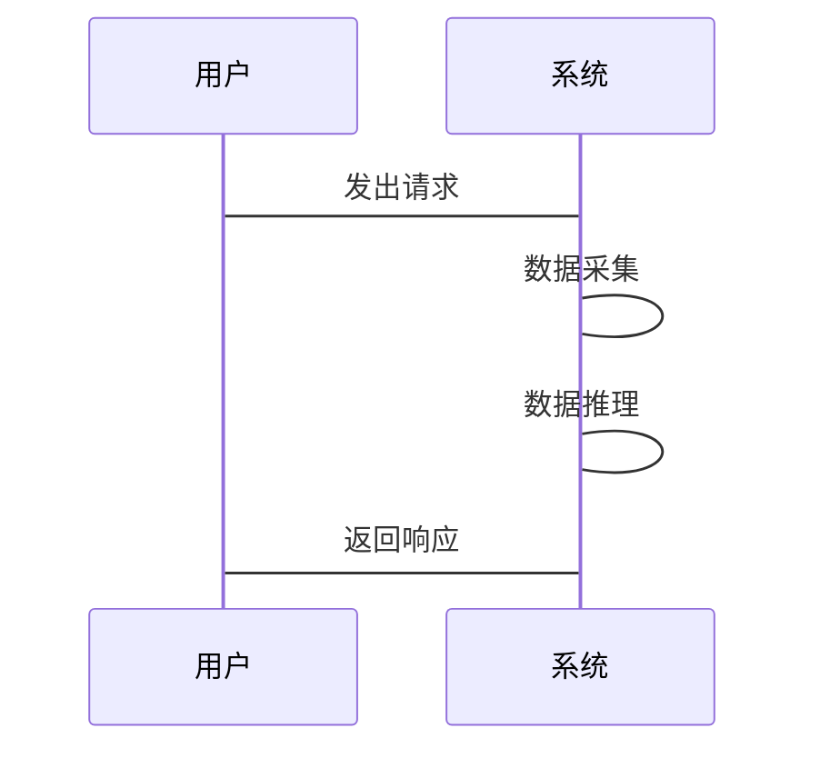

                 


# 情境感知AI Agent：适应动态环境

> 关键词：情境感知、AI Agent、动态环境、算法原理、系统架构、项目实战

> 摘要：情境感知AI Agent是一种能够感知并适应动态环境的智能代理，通过实时感知、推理、决策和执行，实现对复杂动态环境的高效应对。本文从核心概念、算法原理、系统架构到项目实战，全面探讨情境感知AI Agent的设计与实现，结合具体案例分析，总结最佳实践。

---

## 第1章: 情境感知AI Agent概述

### 1.1 情境感知AI Agent的定义与背景

#### 1.1.1 什么是情境感知
情境感知（Situation Awareness）是指智能系统能够感知当前环境的状态，并理解其对目标的影响。AI Agent通过整合多源数据，实时了解环境中的关键要素，从而做出适应性决策。

#### 1.1.2 情境感知的背景与重要性
在动态环境中，传统静态规则无法应对快速变化的情况。情境感知AI Agent通过实时感知和自适应策略，能够有效应对不确定性，提高系统的灵活性和鲁棒性。

#### 1.1.3 AI Agent的基本概念
AI Agent是一种智能实体，能够感知环境、执行任务、与用户交互。情境感知AI Agent在传统AI Agent的基础上，增加了对环境动态变化的感知和适应能力。

### 1.2 情境感知与动态环境

#### 1.2.1 动态环境的定义
动态环境是指环境状态随时间和空间变化的环境，具有不确定性、复杂性和不可预测性。情境感知AI Agent需要在这种环境中实时调整策略。

#### 1.2.2 情境感知在动态环境中的作用
通过实时感知和动态推理，情境感知AI Agent能够快速响应环境变化，优化决策过程，提高系统性能。

#### 1.2.3 情境感知与静态环境的区别
静态环境中的决策基于固定规则，而动态环境中的决策需要实时感知和动态调整。情境感知AI Agent在动态环境中的表现显著优于静态规则系统。

### 1.3 情境感知的核心问题

#### 1.3.1 情境感知的目标与挑战
目标：准确感知环境状态，理解其影响，做出最优决策。挑战：环境不确定性、数据异构性、计算资源限制。

#### 1.3.2 动态环境中的不确定性
不确定性来源：环境变化、数据噪声、模型局限性。情境感知AI Agent需要通过概率推理和鲁棒设计来应对不确定性。

#### 1.3.3 情境感知的边界与外延
情境感知的边界：感知范围、数据来源、决策范围。外延：与其他技术（如强化学习、边缘计算）的结合。

---

## 第2章: 情境感知的核心概念与联系

### 2.1 情境感知的核心要素

#### 2.1.1 感知层
感知层负责采集和处理环境数据，包括传感器数据、用户输入、上下文信息。

#### 2.1.2 推理层
推理层基于感知数据，构建环境模型，进行逻辑推理和概率计算。

#### 2.1.3 决策层
决策层根据推理结果，制定行动策略，优化决策过程。

#### 2.1.4 执行层
执行层负责将决策转化为具体行动，与环境交互。

### 2.2 情境感知的核心概念对比表

| 比较维度 | 感知能力 | 推理能力 | 决策能力 | 执行能力 |
|----------|----------|----------|----------|----------|
| 输入     | 环境数据 | 知识库   | 状态模型 | 行动指令 |
| 输出     | 特征提取 | 状态推理 | 行动策略 | 系统操作 |
| 依赖     | 传感器   | 知识库   | 状态模型 | 执行器   |

### 2.3 情境感知的ER实体关系图

```mermaid
erdiagram
actor(Agent) -|> role(感知层): 实现数据采集和预处理
role(感知层) -|> entity(环境数据): 存储感知数据
actor(Agent) -|> role(推理层): 基于环境数据进行推理
role(推理层) -|> entity(环境模型): 构建环境模型
actor(Agent) -|> role(决策层): 制定行动策略
role(决策层) -|> entity(决策结果): 输出行动指令
actor(Agent) -|> role(执行层): 执行具体操作
role(执行层) -|> entity(环境反馈): 获取环境反馈
```

---

## 第3章: 情境感知的算法原理

### 3.1 情境感知的基本算法

#### 3.1.1 数据流处理
数据流处理包括数据采集、预处理和特征提取。使用滑动窗口方法处理实时数据，提取关键特征。

#### 3.1.2 模型训练
模型训练采用监督学习或无监督学习方法，训练环境感知模型。使用深度学习框架（如TensorFlow）进行模型优化。

#### 3.1.3 推理过程
推理过程包括基于规则的推理和基于概率的推理。规则推理用于确定性场景，概率推理用于处理不确定性。

### 3.2 情境感知的数学模型

#### 3.2.1 概率推理公式
$$P(e|o) = \frac{P(o|e)P(e)}{P(o)}$$

其中：
- \(e\) 表示环境状态
- \(o\) 表示观测数据
- \(P(e|o)\) 是在观测\(o\)下环境状态\(e\)的概率

#### 3.2.2 决策优化公式
$$V(s) = \max_{a} [r(s,a) + \gamma V(next\_state)]$$

其中：
- \(V(s)\) 是状态\(s\)的价值
- \(r(s,a)\) 是在状态\(s\)下采取动作\(a\)的奖励
- \(\gamma\) 是折扣因子
- \(next\_state\) 是下一个状态

### 3.3 算法实现

#### 3.3.1 使用Mermaid绘制算法流程图



#### 3.3.2 使用Python代码实现核心算法

```python
import numpy as np
from sklearn import linear_model

# 数据预处理
X = np.array([...])  # 特征数据
y = np.array([...])  # 标签

# 训练模型
model = linear_model.LinearRegression()
model.fit(X, y)

# 推理过程
def infer(X_test):
    y_pred = model.predict(X_test)
    return y_pred

# 决策优化
def optimize_decision(state):
    # 假设状态是输入
    # 返回最优动作
    pass
```

---

## 第4章: 情境感知的系统架构设计

### 4.1 情境感知系统的应用场景

#### 4.1.1 智能助手
智能助手通过情境感知理解用户的上下文，提供个性化服务。

#### 4.1.2 自动驾驶
自动驾驶系统实时感知环境，做出驾驶决策。

#### 4.1.3 智慧城市
智慧城市系统感知城市运行状态，优化资源配置。

### 4.2 情境感知系统的功能设计

#### 4.2.1 领域模型设计
领域模型包括环境模型、用户模型和任务模型。

#### 4.2.2 系统架构设计
采用分层架构，包括感知层、推理层、决策层和执行层。

#### 4.2.3 接口设计
定义标准接口，便于模块化开发和集成。

#### 4.2.4 交互流程设计
设计清晰的交互流程，确保系统高效运行。

### 4.3 使用Mermaid绘制系统架构图



### 4.4 使用Mermaid绘制交互序列图



---

## 第5章: 情境感知AI Agent的项目实战

### 5.1 项目环境安装

#### 5.1.1 安装Python环境
使用Anaconda或虚拟环境，安装Python 3.8+。

#### 5.1.2 安装相关库
安装TensorFlow、Keras、Scikit-learn、Mermaid等库。

#### 5.1.3 配置开发环境
配置IDE（如PyCharm、VS Code），安装必要的插件。

### 5.2 核心代码实现

#### 5.2.1 数据预处理代码

```python
import pandas as pd

# 读取数据
data = pd.read_csv('data.csv')

# 数据清洗
data.dropna(inplace=True)

# 特征提取
features = data[['feature1', 'feature2']]
labels = data['label']
```

#### 5.2.2 训练模型代码

```python
from sklearn.model_selection import train_test_split
from sklearn.metrics import accuracy_score

# 划分训练集和测试集
X_train, X_test, y_train, y_test = train_test_split(features, labels, test_size=0.2)

# 训练模型
model = linear_model.LogisticRegression()
model.fit(X_train, y_train)

# 模型评估
y_pred = model.predict(X_test)
print('准确率:', accuracy_score(y_test, y_pred))
```

#### 5.2.3 推理与决策代码

```python
def predict_and_decide(X_new):
    y_pred = model.predict(X_new)
    # 根据预测结果制定决策
    return '决策结果'

# 示例输入
X_new = X_test.iloc[0].values.reshape(1, -1)
print('预测结果:', predict_and_decide(X_new))
```

### 5.3 案例分析与总结

#### 5.3.1 案例分析
以智能助手为例，展示如何通过情境感知理解用户的上下文，提供个性化服务。

#### 5.3.2 项目小结
总结项目中的关键点，强调情境感知在实际应用中的重要性。

---

## 第6章: 最佳实践与注意事项

### 6.1 情境感知的设计原则

#### 6.1.1 简单有效的感知模型
选择适合的感知方法，避免过度复杂化。

#### 6.1.2 可扩展的系统架构
设计模块化架构，便于后续扩展和优化。

#### 6.1.3 灵敏的反馈机制
建立有效的反馈机制，及时调整系统行为。

### 6.2 情境感知的注意事项

#### 6.2.1 数据质量的重要性
确保数据的准确性和完整性，避免噪声干扰。

#### 6.2.2 系统的实时性要求
在动态环境中，实时性是关键，需优化算法和架构。

#### 6.2.3 安全与隐私保护
确保数据处理过程中的安全性和用户隐私。

### 6.3 进一步阅读与学习

#### 6.3.1 推荐书籍
- 《强化学习：算法与应用》
- 《分布式系统：概念与设计》

#### 6.3.2 推荐论文
- "Situation Awareness in Dynamic Environments"
- "Adaptive AI Agents in Real-time Systems"

---

## 作者：AI天才研究院 & 禅与计算机程序设计艺术

---

以上是《情境感知AI Agent：适应动态环境》的技术博客文章，希望对您有所帮助！

