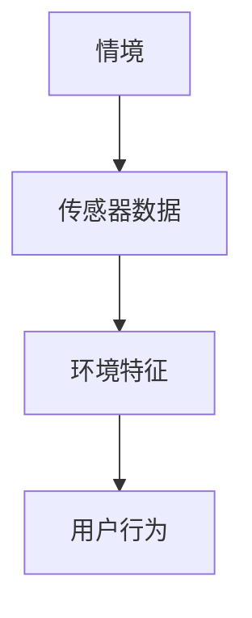
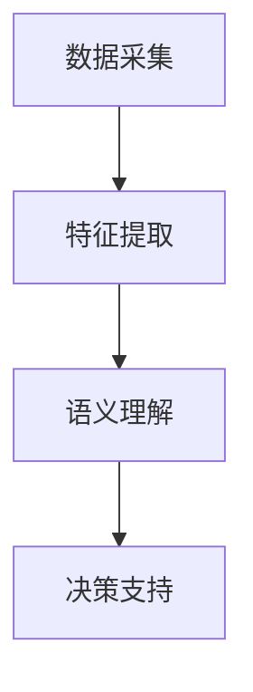
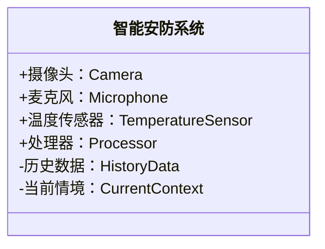
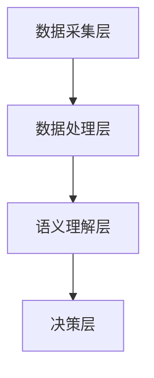
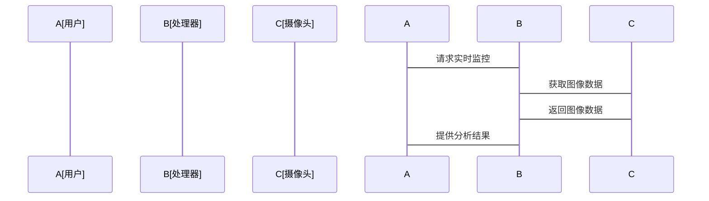

                 


# 情境感知技术的应用

## 关键词：情境感知、多模态数据融合、智能系统、传感器数据、语义理解、实时性

## 摘要：  
情境感知技术通过融合多模态数据，利用先进的算法和系统架构，实现对环境、用户行为及目标对象的智能理解和决策支持。本文从情境感知的核心概念、算法原理、系统架构到实际应用案例，全面解析情境感知技术的应用场景、实现方法及优化策略。

---

## 第一部分：情境感知技术的背景与核心概念

### 第1章：情境感知技术的背景介绍

#### 1.1 情境感知的定义与问题背景  
情境感知（Contextual Awareness）是一种技术，旨在通过感知环境、用户行为和目标对象的状态，提供与场景相关的智能理解和决策支持。其核心目标是使系统能够“理解”当前的情境，并基于此做出更智能的响应。

##### 1.1.1 问题背景  
在智能系统中，传统方法往往依赖于单一数据源或固定的规则，难以适应动态变化的环境。例如，在智能安防系统中，仅依赖摄像头图像难以识别复杂场景中的潜在威胁；在自动驾驶中，单一传感器的数据不足以应对复杂的道路情况。

##### 1.1.2 问题描述  
情境感知的核心问题在于如何有效融合多模态数据（如图像、文本、传感器数据等），并基于这些数据理解当前情境，从而做出更准确的决策。

##### 1.1.3 问题解决  
通过情境感知技术，系统能够整合多模态数据，利用先进的算法（如深度学习、概率图模型）进行语义理解和关联推理，从而提高系统的智能性和适应性。

##### 1.1.4 边界与外延  
情境感知的边界在于其应用场景的限制，例如在室内环境中的物体识别，但不包括全局环境的建模。其外延则包括与之相关的技术，如计算机视觉、自然语言处理等。

##### 1.1.5 概念结构与核心要素  
情境感知的核心要素包括：  
1. **数据源**：多模态传感器数据（图像、语音、位置等）  
2. **特征提取**：从数据中提取有意义的特征  
3. **语义理解**：基于特征理解情境  
4. **决策支持**：根据情境提供智能响应  

---

### 第2章：情境感知的核心概念与联系

#### 2.1 情境感知的核心原理  
情境感知的核心在于将多模态数据进行融合，并通过语义理解提取场景中的关键信息。

##### 2.1.1 数据采集与处理  
情境感知的数据来源多样，包括：  
- 图像数据（RGB、深度）
- 语音数据
- 传感器数据（加速度、温度等）
- 文本数据

数据处理的关键在于如何将这些异构数据统一到一个语义空间中。

##### 2.1.2 特征提取与语义理解  
- **基于规则的方法**：通过预定义的规则提取特征（如颜色、形状）。
- **基于模型的方法**：利用深度学习模型（如CNN、RNN）提取高层次特征并进行语义理解。

#### 2.2 核心概念对比分析

##### 2.2.1 基于规则与基于模型的对比  
| 特征 | 基于规则 | 基于模型 |
|------|----------|----------|
| 准确性 | 高       | 中等     |
| 实时性 | 好       | 较差     |
| 可解释性 | 高       | 中等     |

##### 2.2.2 ER实体关系图  


---

## 第二部分：情境感知的算法原理

### 第3章：情境感知的算法原理

#### 3.1 算法流程  
情境感知的算法流程如下：  
1. 数据采集与预处理  
2. 特征提取  
3. 语义理解与关联推理  
4. 决策支持  

##### 3.1.1 数据采集与预处理  
- 数据采集：通过多种传感器获取数据（如RGB图像、深度图像、语音数据）。  
- 数据预处理：对数据进行归一化、降维等处理，以便后续特征提取。

##### 3.1.2 特征提取  
- **基于规则的方法**：提取低层次特征（如颜色、纹理）。  
- **基于模型的方法**：利用深度学习模型提取高层次语义特征。

##### 3.1.3 语义理解与关联推理  
- 语义理解：通过模型（如BERT、Transformer）理解数据的语义含义。  
- 关联推理：基于概率图模型（如马尔可夫随机场）进行多模态数据的关联推理。

##### 3.1.4 决策支持  
- 根据语义理解的结果，结合上下文信息，生成智能决策。

#### 3.2 算法实现  

##### 3.2.1 算法流程图  


##### 3.2.2 数学模型  
- **条件概率公式**：  
  $$ P(A|B) = \frac{P(B|A)P(A)}{P(B)} $$  
  其中，$A$ 表示目标事件，$B$ 表示观测数据。

---

## 第三部分：系统分析与架构设计

### 第4章：系统分析与架构设计

#### 4.1 问题场景介绍  
以智能安防系统为例，情境感知技术可以用于实时监控和异常检测。

#### 4.2 系统功能设计  

##### 4.2.1 领域模型  


#### 4.3 系统架构设计  

##### 4.3.1 分层架构  


#### 4.4 系统接口设计  

##### 4.4.1 接口描述  
- 数据采集接口：接收传感器数据并进行预处理。  
- 语义理解接口：提供上下文信息供决策层调用。  

#### 4.5 系统交互  

##### 4.5.1 交互序列图  


---

## 第四部分：项目实战

### 第5章：项目实战

#### 5.1 环境安装  

##### 5.1.1 系统环境  
- 操作系统：Linux/Windows  
- 开发工具：PyCharm/VS Code  
- 依赖库：TensorFlow、OpenCV、Numpy  

#### 5.2 核心代码实现  

##### 5.2.1 数据采集与预处理  
```python
import cv2
import numpy as np

# 数据采集
cap = cv2.VideoCapture(0)
while cap.isOpened():
    ret, frame = cap.read()
    if not ret:
        break
    # 数据预处理
    gray = cv2.cvtColor(frame, cv2.COLOR_BGR2GRAY)
    cv2.imshow('Gray Image', gray)
    if cv2.waitKey(1) & 0xFF == ord('q'):
        break
cap.release()
cv2.destroyAllWindows()
```

##### 5.2.2 特征提取与语义理解  
```python
import tensorflow as tf
from tensorflow.keras import layers

model = tf.keras.Sequential([
    layers.Conv2D(32, (3,3), activation='relu', input_shape=(224, 224, 3)),
    layers.MaxPooling2D(),
    layers.Conv2D(64, (3,3), activation='relu'),
    layers.MaxPooling2D(),
    layers.Flatten(),
    layers.Dense(128, activation='relu'),
    layers.Dense(10, activation='softmax')
])
model.compile(optimizer='adam', loss='sparse_categorical_crossentropy', metrics=['accuracy'])
model.fit(x_train, y_train, epochs=10)
```

#### 5.3 代码应用解读与分析  
- 以上代码展示了如何通过OpenCV进行图像采集和预处理，以及如何利用深度学习模型进行特征提取和语义理解。

#### 5.4 实际案例分析  
以智能安防为例，通过上述代码可以实时检测异常行为，如入侵检测。

---

## 第五部分：最佳实践与总结

### 第6章：最佳实践与总结

#### 6.1 数据质量的重要性  
- 数据的多样性和准确性是情境感知技术的关键。  

#### 6.2 模型可解释性  
- 在实际应用中，模型的可解释性非常重要，尤其是在需要用户信任的场景中。  

#### 6.3 算法扩展性  
- 根据实际需求，可以逐步扩展算法的功能，如增加更多的传感器数据类型或优化模型的性能。

#### 6.4 小结  
情境感知技术通过融合多模态数据，能够显著提升智能系统的感知能力和决策能力。在实际应用中，需要注重数据质量、模型优化和系统架构设计。

#### 6.5 注意事项  
- 数据隐私和安全问题需要特别关注。  
- 算法的实时性和稳定性需要在实际场景中进行充分验证。  

#### 6.6 拓展阅读  
- 《Deep Learning》  
- 《Probabilistic Graphical Models》  
- 《Computer Vision: Algorithms and Applications》  

---

## 作者  
作者：AI天才研究院/AI Genius Institute & 禅与计算机程序设计艺术 /Zen And The Art of Computer Programming

