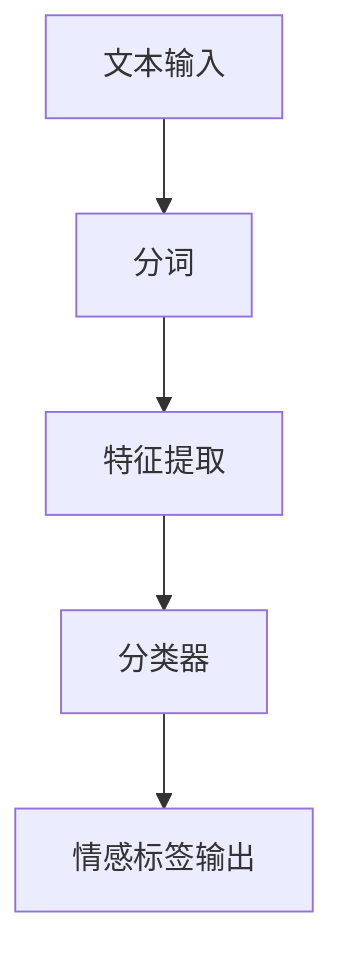

                 


# 情感分析在投资决策中的应用

> **关键词**：情感分析，投资决策，自然语言处理，金融投资，深度学习

> **摘要**：本文探讨了情感分析在投资决策中的应用，从情感分析的基本概念到其在金融领域的实际应用，结合算法原理、系统设计和项目实战，深入分析了情感分析如何帮助投资者做出更明智的决策。文章还探讨了高级应用、最佳实践和未来展望，为读者提供了全面的技术视角。

---

## 第一部分：情感分析与投资决策的背景

### 第1章：情感分析与投资决策概述

#### 1.1 情感分析的定义与核心概念

情感分析（Sentiment Analysis）是自然语言处理（NLP）领域的重要分支，旨在通过分析文本数据，判断作者的情感倾向（如正面、负面、中性）或情感强度（如非常积极、略微消极）。在投资决策中，情感分析可以帮助投资者理解市场情绪、分析投资者行为，并预测资产价格的变化趋势。

- **情感分析的基本概念**：情感分析通过对文本的情感倾向进行分类，帮助投资者识别市场情绪的变化。例如，社交媒体上的投资者评论、新闻标题的情绪分析可以帮助投资者判断市场 sentiment。
  
- **投资决策中的情感因素**：投资者的情绪和行为对市场有直接影响。例如，恐慌性抛售或乐观性买入会引发资产价格的短期波动。情感分析通过捕捉这些情绪变化，为投资者提供决策支持。

- **情感分析在投资中的应用背景**：随着社交媒体和金融新闻的普及，投资者可以通过分析大量的文本数据来获取市场情绪，从而辅助投资决策。情感分析技术的进步使得这种分析更加高效和准确。

#### 1.2 投资决策中的情感因素

- **投资者情绪对市场的影响**：投资者的情绪是市场波动的重要驱动因素。例如，市场恐慌可能导致抛售，而乐观情绪可能导致买入。情感分析通过识别这些情绪变化，帮助投资者预测市场趋势。

- **市场情绪与资产价格的关系**：市场情绪（如恐慌、乐观）通常与资产价格波动密切相关。情感分析可以通过分析新闻、社交媒体等文本数据，量化市场情绪，进而预测价格变化。

- **情感分析在投资中的潜在价值**：情感分析可以帮助投资者识别市场情绪的变化，优化投资组合，降低风险。例如，通过分析社交媒体上的投资者情绪，投资者可以提前发现市场趋势，做出更明智的投资决策。

#### 1.3 情感分析在投资中的应用场景

- **金融新闻与社交媒体分析**：通过分析新闻标题、财经评论和社交媒体上的投资者评论，情感分析可以帮助投资者了解市场情绪的变化趋势。例如，如果社交媒体上大量出现负面情绪，可能预示着市场下跌。

- **机构投资者情绪监测**：机构投资者的情绪可以通过分析他们的研究报告、投资者关系活动等文本数据进行量化。这种情绪监测可以帮助机构投资者调整投资策略，优化投资组合。

- **个人投资者行为分析**：通过分析个人投资者在社交媒体上的评论和交易行为，情感分析可以帮助投资者了解个人情绪和行为模式，从而制定更有效的投资策略。

#### 1.4 本章小结

本章介绍了情感分析的基本概念和其在投资决策中的应用背景。情感分析通过分析文本数据，帮助投资者识别市场情绪，优化投资决策。接下来的章节将深入探讨情感分析的核心算法及其在投资中的具体应用。

---

## 第二部分：情感分析的核心算法与原理

### 第2章：情感分析的算法基础

#### 2.1 情感分析的传统机器学习方法

- **基于特征的分类方法**：传统情感分析通常依赖特征工程，通过提取文本中的关键词、句法结构等特征，构建分类模型。例如，使用支持向量机（SVM）或朴素贝叶斯（Naive Bayes）进行分类。

  - **常见特征提取技术**：
    - 词袋模型（Bag of Words，BoW）：将文本表示为单词的频率向量。
    - 词语嵌入（Word Embedding）：如Word2Vec、GloVe，将单词映射为低维向量，捕捉单词语义信息。

  - **传统算法的优缺点**：
    - 优点：特征工程简单，计算效率高。
    - 缺点：难以捕捉复杂的语义信息，特征选择可能不够精细。

- **情感分析的分类任务**：情感分类通常分为二分类（如正面/负面）或多分类（如非常正面、中性、非常负面）。例如，使用逻辑回归（Logistic Regression）进行二分类。

  $$ P(y=1|x) = \frac{1}{1 + e^{-\beta x}} $$
  
  其中，$\beta$ 是模型参数，$x$ 是输入特征向量。

- **案例分析**：以Twitter上的推文为例，假设我们提取了推文中的关键词和情感倾向，使用SVM进行分类。

  ```python
  from sklearn.svm import SVC
  from sklearn.feature_extraction.text import TfidfVectorizer
  
  vectorizer = TfidfVectorizer()
  X = vectorizer.fit_transform(tweets)
  model = SVC()
  model.fit(X, y)
  ```

- **优缺点总结**：
  - 优点：实现简单，适合小规模数据。
  - 缺点：难以处理复杂的语义信息，对数据预处理要求较高。

#### 2.2 深度学习在情感分析中的应用

- **基于循环神经网络（RNN）和长短期记忆网络（LSTM）的情感分析**：
  
  - **RNN与LSTM在情感分析中的应用**：
    - RNN擅长处理序列数据，但在处理长序列时容易出现梯度消失问题。
    - LSTM通过引入记忆单元（Memory Cell）和遗忘门（Forget Gate），能够更好地捕捉长距离依赖关系。
  
  - **LSTM模型结构**：
    ```mermaid
    graph TD
    Input --> LSTM_Cell
    LSTM_Cell --> Output
    LSTM_Cell --> Hidden_State
    ```
  
  - **情感分类任务**：使用LSTM提取文本特征后，通过全连接层和Softmax进行多分类。

  $$ P(y|x) = \text{Softmax}(Wx + b) $$
  
  其中，$W$ 是权重矩阵，$b$ 是偏置项。

- **基于Transformer的情感分析**：
  
  - **Transformer模型的引入**：
    - Transformer由Google于2017年提出，基于自注意力机制（Self-Attention）和位置编码（Positional Encoding）。
    - 优势：并行计算效率高，能够捕捉长距离依赖关系。
  
  - **Transformer模型结构**：
  
  ```mermaid
  graph TD
  Input --> MultiHeadAttention
  MultiHeadAttention --> AddNorm
  AddNorm --> FeedForwardNetwork
  ```
  
  - **预训练语言模型（如BERT）的应用**：
    - BERT（Bidirectional Encoder Representations from Transformers）是一种预训练的双向Transformer模型，广泛应用于情感分析任务。
    - 使用BERT进行情感分类的步骤：
      1. 将文本输入BERT模型，获取隐藏层的输出。
      2. 使用全连接层和Softmax进行分类。

- **深度学习的优缺点**：
  
  - 优点：能够捕捉复杂的语义信息，适合大规模数据。
  - 缺点：计算资源需求高，模型训练时间长。

#### 2.3 情感分析的算法流程图



#### 2.4 本章小结

本章介绍了情感分析的传统机器学习方法和深度学习方法，重点讲解了RNN、LSTM和Transformer模型的原理及应用。情感分析算法的选择取决于数据规模和复杂度要求。接下来的章节将探讨情感分析在投资决策中的具体应用。

---

## 第三部分：情感分析在投资决策中的应用

### 第3章：投资决策中的情感数据采集与处理

#### 3.1 情感数据的来源

- **金融新闻与评论**：
  
  - 数据来源：金融新闻网站（如Reuters、Bloomberg）、财经博客等。
  - 数据特点：内容专业，但可能存在主观性。

- **社交媒体数据（如Twitter、Reddit）**：
  
  - 数据来源：社交媒体平台上的投资者评论和讨论。
  - 数据特点：数据量大，情绪表达丰富，但可能存在噪声。

- **机构研究报告**：
  
  - 数据来源：券商、投行的研究报告。
  - 数据特点：内容权威，但可能需要付费获取。

#### 3.2 情感数据的预处理

- **文本清洗与分词**：
  
  - 清洗步骤：去除停用词、标点符号、特殊字符。
  - 分词方法：使用jieba、nltk等工具进行分词。

  ```python
  import jieba
  text = "市场表现不佳，投资者情绪低落"
  words = jieba.lcut(text)
  ```

- **停用词处理与词干提取**：
  
  - 常见停用词：如“的”、“是”、“在”等。
  - 词干提取：保留单词的核心部分，去除词缀。

- **数据标注与情感分类**：
  
  - 数据标注：人工标注情感倾向（如正面、负面、中性）。
  - 情感分类：使用监督学习模型进行分类。

#### 3.3 情感数据的特征提取

- **基于词袋模型的特征提取**：
  
  - 词袋模型：将文本表示为单词的频率向量。
  - 例如，文本“市场情绪乐观”可以表示为向量（市场：1，情绪：1，乐观：1）。

- **基于词嵌入的特征表示**：
  
  - 词嵌入模型（如Word2Vec、GloVe）：将单词映射为低维向量，捕捉语义信息。
  - 例如，向量表示为：
  
  $$ \text{乐观} = [0.2, 0.5, -0.1] $$
  
  $$ \text{悲观} = [-0.3, 0.2, 0.7] $$

- **高阶特征（如情感强度、情绪倾向）**：
  
  - 情感强度：量化情绪的强烈程度（如非常正面、略微负面）。
  - 情绪倾向：判断情绪是积极还是消极。

---

### 第4章：情感分析在投资决策中的模型构建

#### 4.1 投资决策模型的构建流程

- **数据集的划分与训练**：
  
  - 数据集划分：将数据划分为训练集、验证集和测试集。
  - 训练步骤：使用训练数据训练情感分类模型。
  
- **模型训练**：
  
  - 使用训练数据进行模型训练，调整模型参数，优化分类性能。
  
- **模型评估**：
  
  - 评估指标：准确率（Accuracy）、精确率（Precision）、召回率（Recall）、F1值。
  
  $$ F1 = \frac{2 \times \text{Precision} \times \text{Recall}}{\text{Precision} + \text{Recall}} $$
  
  - 案例分析：以社交媒体上的投资者评论为例，假设模型在测试集上的准确率为85%，F1值为0.82。

#### 4.2 系统功能设计

- **领域模型（Domain Model）**：
  
  ```mermaid
  graph TD
  User --> Market_Mood[市场情绪]
  Market_Mood --> Investment_Decision[投资决策]
  Investment_Decision --> Portfolio_Adjustment[投资组合调整]
  ```

- **系统架构设计**：
  
  ```mermaid
  graph TD
  Input --> Text_Processing[文本处理]
  Text_Processing --> Feature_Extraction[特征提取]
  Feature_Extraction --> Sentiment_Classifier[情感分类器]
  Sentiment_Classifier --> Decision_Support[决策支持]
  ```

---

## 第五部分：高级应用与未来展望

### 第5章：情感分析的高级应用

#### 5.1 时间序列分析与情感预测

- **时间序列分析**：
  
  - 使用ARIMA、LSTM等模型预测市场情绪的时间序列变化。
  
  $$ ARIMA(p, d, q) $$
  
  其中，p为自回归阶数，d为差分阶数，q为移动平均阶数。

#### 5.2 多模态情感分析

- **多模态数据融合**：
  
  - 结合文本、图像、视频等多种数据源，进行多模态情感分析。
  
  ```mermaid
  graph TD
  Text --> Sentiment_Text
  Image --> Sentiment_Image
  Video --> Sentiment_Video
  Sentiment_Text --> Multi_Sentiment
  Sentiment_Image --> Multi_Sentiment
  Sentiment_Video --> Multi_Sentiment
  ```

#### 5.3 情感网络与社会网络分析

- **情感网络构建**：
  
  - 使用情感分析结果构建情感网络，分析投资者之间的关系和情感传播。
  
  ```mermaid
  graph TD
  I1[投资者1] --> I2[投资者2]
  I2 --> I3[投资者3]
  ```

---

## 第六部分：最佳实践与注意事项

### 第6章：最佳实践与注意事项

#### 6.1 数据采集与处理

- **数据来源的多样性**：
  
  - 综合使用新闻、社交媒体、机构报告等多种数据源，提高分析的准确性。
  
- **数据清洗与预处理**：
  
  - 精心设计数据清洗流程，确保数据质量，减少噪声。

#### 6.2 模型选择与优化

- **模型选择**：
  
  - 根据数据规模和复杂度选择合适的模型（如传统机器学习、深度学习）。
  
- **模型调优**：
  
  - 使用交叉验证、网格搜索等方法优化模型参数。

#### 6.3 实际应用中的注意事项

- **模型的鲁棒性**：
  
  - 确保模型在不同市场环境下的鲁棒性，避免过度拟合。
  
- **投资者行为的理解**：
  
  - 深入理解投资者行为，避免模型误判。

---

## 第七部分：总结与展望

### 第7章：总结与展望

#### 7.1 总结

- 情感分析作为一种强大的NLP技术，已经在投资决策中展现了巨大潜力。通过分析市场情绪、投资者行为，情感分析可以帮助投资者做出更明智的决策。

#### 7.2 未来展望

- **技术进步**：
  
  - 随着AI和NLP技术的进步，情感分析将更加智能化，能够处理更复杂的情感信息。
  
- **应用场景扩展**：
  
  - 情感分析将应用于更多投资领域，如外汇交易、加密货币等。

---

## 作者：AI天才研究院/AI Genius Institute & 禅与计算机程序设计艺术 /Zen And The Art of Computer Programming

