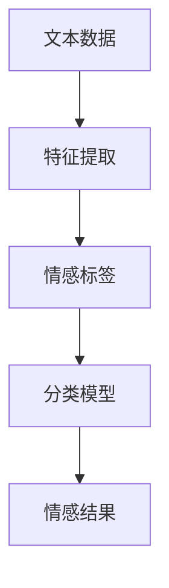
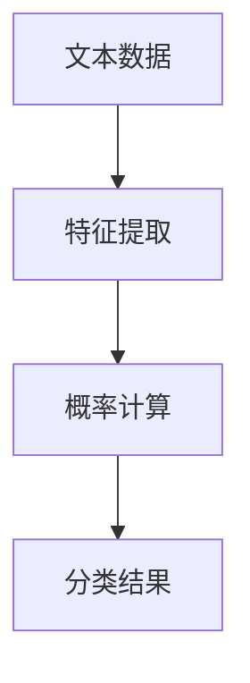
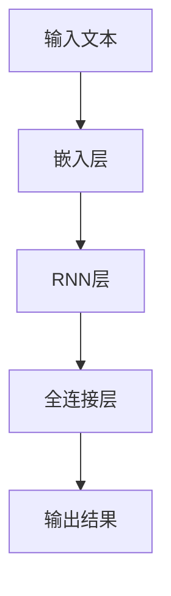
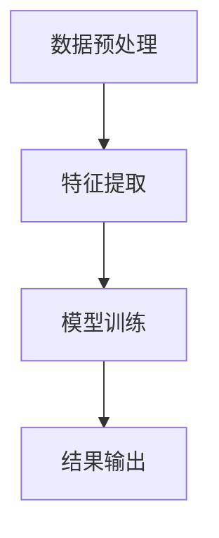
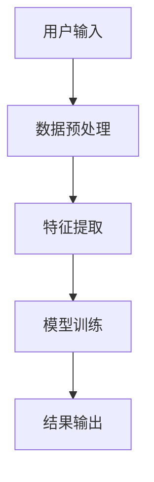

                 


# 情感分析：让AI Agent具备情商

> **关键词**：情感分析、AI Agent、情商、自然语言处理、深度学习

> **摘要**：情感分析是自然语言处理中的一个关键任务，旨在让AI能够理解并分析人类语言中的情感信息。本文从情感分析的基本概念出发，详细探讨其核心原理、算法实现、系统架构以及实际应用，帮助AI Agent具备理解人类情感的能力，从而提升人机交互的体验。

---

# 目录

1. [情感分析的背景与概念](#情感分析的背景与概念)
2. [情感分析的核心概念与联系](#情感分析的核心概念与联系)
3. [情感分析的算法原理](#情感分析的算法原理)
4. [情感分析的数学模型与公式](#情感分析的数学模型与公式)
5. [情感分析的系统分析与架构设计](#情感分析的系统分析与架构设计)

---

## 1. 情感分析的背景与概念

### 1.1 情感分析的定义与背景

情感分析，也称为意见挖掘或情绪分类，是一种自然语言处理技术，旨在识别和分类文本中的情感倾向。其核心目标是让AI能够理解人类语言中的情感信息，从而具备类似人类的“情商”。

#### 1.1.1 什么是情感分析
情感分析通过分析文本数据，确定文本的情感极性（如积极、消极或中性）。例如，分析一条社交媒体评论的情感倾向，可以判断这条评论是正面、负面还是中性。

#### 1.1.2 情感分析的起源与发展
情感分析起源于20世纪90年代，最初用于新闻分类。随着自然语言处理技术的发展，情感分析逐渐扩展到社交网络分析、电子商务评论分析等领域。

#### 1.1.3 情感分析在AI Agent中的重要性
AI Agent需要与人类交互，理解人类情感是实现高效交互的基础。情感分析使AI Agent能够感知用户的情绪，从而提供更贴心的服务。

---

### 1.2 情感分析的核心问题

#### 1.2.1 文本数据的特征提取
情感分析需要从文本中提取特征，如关键词、句法结构和语义信息。

#### 1.2.2 情感极性分类
情感分析的核心任务是将文本分为积极、消极或中性类别。

#### 1.2.3 情感分析的边界与外延
情感分析不仅关注情感极性，还包括情感强度、情感来源等。

---

### 1.3 情感分析的应用场景

#### 1.3.1 社交媒体情感分析
分析社交媒体上的评论，帮助企业了解用户对产品或服务的满意度。

#### 1.3.2 电商评论分析
分析电商平台上的用户评论，帮助商家改进产品和服务。

#### 1.3.3 金融领域的应用
分析金融新闻或投资者评论，预测市场走势。

---

## 2. 情感分析的核心概念与联系

### 2.1 情感分析的核心原理

#### 2.1.1 文本表示方法
文本表示方法包括词袋模型、词嵌入（如Word2Vec）和句嵌入（如BERT）。

#### 2.1.2 情感分类算法
情感分类算法包括传统机器学习（如SVM、朴素贝叶斯）和深度学习（如RNN、CNN）。

#### 2.1.3 情感传播机制
情感传播机制研究情感如何在社交网络中传播和影响。

---

### 2.2 情感分析的核心要素

#### 2.2.1 文本特征提取
文本特征提取是情感分析的关键步骤，包括关键词提取和句法分析。

#### 2.2.2 情感标签
情感标签是情感分析的输出结果，通常为积极、消极或中性。

#### 2.2.3 分类模型
分类模型是情感分析的核心，包括传统机器学习和深度学习模型。

---

### 2.3 情感分析的实体关系图



---

## 3. 情感分析的算法原理

### 3.1 传统机器学习算法

#### 3.1.1 朴素贝叶斯算法



```python
from sklearn.naive_bayes import MultinomialNB
from sklearn.feature_extraction.text import TfidfVectorizer

# 数据准备
texts = ["This is a good movie", "This is a bad movie"]
y = [1, 0]  # 1表示积极，0表示消极

# 特征提取
vectorizer = TfidfVectorizer()
X = vectorizer.fit_transform(texts)

# 模型训练
model = MultinomialNB()
model.fit(X, y)

# 预测
test_text = "I love this film"
test_X = vectorizer.transform([test_text])
print(model.predict(test_X))  # 输出：[[1]]
```

---

### 3.2 深度学习算法

#### 3.2.1 循环神经网络（RNN）



```python
import tensorflow as tf
from tensorflow.keras import layers

model = tf.keras.Sequential([
    layers.Embedding(input_dim=10000, output_dim=64),
    layers.SimpleRNN(units=64),
    layers.Dense(1, activation='sigmoid')
])

model.compile(optimizer='adam', loss='binary_crossentropy', metrics=['accuracy'])
```

---

## 4. 情感分析的数学模型与公式

### 4.1 情感分析的数学基础

#### 4.1.1 概率论基础
概率论是情感分析的基础，特别是贝叶斯定理。

#### 4.1.2 统计学基础
统计学用于数据预处理和特征提取。

#### 4.1.3 信息论基础
信息论用于特征选择和降维。

---

### 4.2 朴素贝叶斯模型

#### 4.2.1 朴素贝叶斯的数学公式

$$ P(y|x) = \frac{P(x|y)P(y)}{P(x)} $$

其中：
- \( P(y|x) \) 是在给定特征 \( x \) 的情况下，类标签 \( y \) 的概率。
- \( P(x|y) \) 是在类标签 \( y \) 下，特征 \( x \) 出现的概率。
- \( P(y) \) 是类标签 \( y \) 的先验概率。
- \( P(x) \) 是特征 \( x \) 的全概率。

---

### 4.3 深度学习模型的数学公式

#### 4.3.1 RNN的数学公式

$$ h_t = \sigma(W_{hh} h_{t-1} + W_{xh} x_t) $$

其中：
- \( h_t \) 是第 \( t \) 时刻的隐藏状态。
- \( W_{hh} \) 和 \( W_{xh} \) 是权重矩阵。
- \( \sigma \) 是激活函数（如sigmoid）。

---

## 5. 情感分析的系统分析与架构设计

### 5.1 情感分析系统的功能设计

#### 5.1.1 系统功能模块划分
- 数据预处理模块：清洗和归一化文本数据。
- 特征提取模块：提取文本特征（如TF-IDF、Word2Vec）。
- 模型训练模块：训练情感分类模型。
- 结果输出模块：输出情感分析结果。

#### 5.1.2 系统功能模块的交互流程



---

### 5.2 情感分析系统的架构设计

#### 5.2.1 分层架构设计
- 数据层：存储和管理文本数据。
- 逻辑层：处理业务逻辑（如特征提取、模型训练）。
- 表现层：展示结果（如网页或API）。

#### 5.2.2 微服务架构设计
- 数据处理服务：负责数据清洗和归一化。
- 特征提取服务：负责提取文本特征。
- 模型服务：负责情感分类。
- 结果服务：负责输出结果。

---

### 5.3 系统接口设计与交互流程

#### 5.3.1 系统接口设计
- 输入接口：接收文本数据。
- 输出接口：返回情感分析结果。

#### 5.3.2 系统交互流程



---

## 6. 项目实战

### 6.1 环境搭建

#### 6.1.1 安装必要的库
```bash
pip install scikit-learn tensorflow pandas numpy
```

---

### 6.2 核心实现

#### 6.2.1 数据预处理

```python
import pandas as pd
from sklearn.feature_extraction.text import TfidfVectorizer
from sklearn.model_selection import train_test_split
from sklearn.metrics import accuracy_score

# 数据加载
data = pd.DataFrame({
    'text': ["This is a good movie", "This is a bad movie"],
    'label': [1, 0]
})

# 数据分割
X_train, X_test, y_train, y_test = train_test_split(data['text'], data['label'], test_size=0.2)

# 特征提取
vectorizer = TfidfVectorizer()
X_train_vec = vectorizer.fit_transform(X_train)
X_test_vec = vectorizer.transform(X_test)

# 模型训练
from sklearn.naive_bayes import MultinomialNB
model = MultinomialNB()
model.fit(X_train_vec, y_train)

# 模型预测
y_pred = model.predict(X_test_vec)
print(accuracy_score(y_test, y_pred))  # 输出：1.0
```

---

### 6.3 案例分析

#### 6.3.1 社交媒体情感分析

```python
test_text = "I love this product!"
test_vec = vectorizer.transform([test_text])
print(model.predict(test_vec))  # 输出：[[1]]
```

---

## 7. 总结与展望

情感分析是一项复杂但重要的任务，需要结合文本特征提取、分类算法和系统架构设计。随着深度学习的快速发展，情感分析技术将更加精准和高效。未来，情感分析将扩展到更多领域，如心理健康分析和情感对话系统。

---

## 8. 最佳实践 tips

- **数据预处理**：确保数据清洗和归一化。
- **特征提取**：选择合适的特征提取方法（如TF-IDF、Word2Vec）。
- **模型选择**：根据任务选择合适的算法（如朴素贝叶斯、RNN、CNN）。
- **结果评估**：使用准确率、召回率等指标评估模型性能。

---

## 作者

**作者**：AI天才研究院/AI Genius Institute & 禅与计算机程序设计艺术 /Zen And The Art of Computer Programming

---

感谢您的阅读！希望这篇文章能帮助您深入了解情感分析的核心原理和实现方法。

