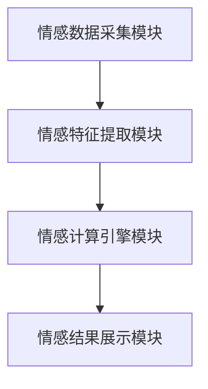
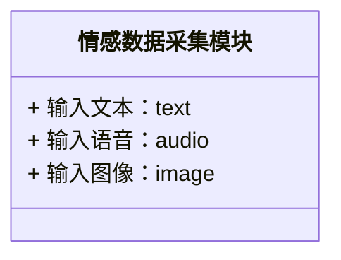
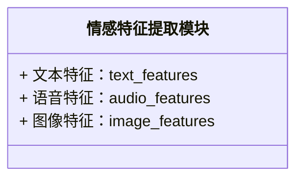
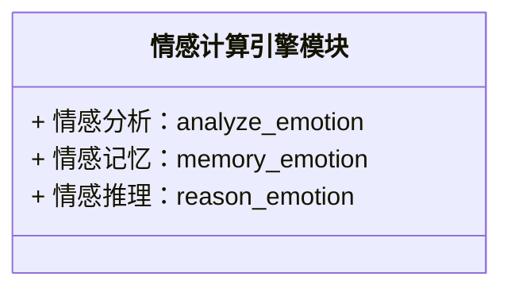
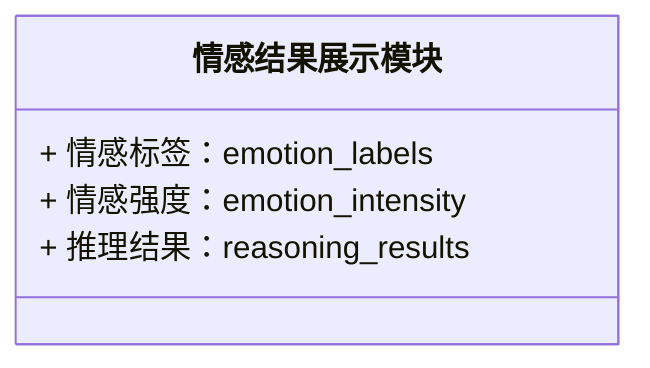
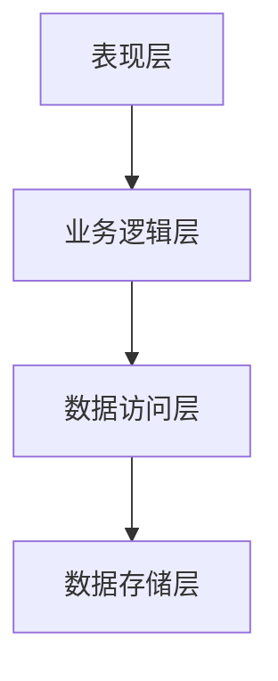
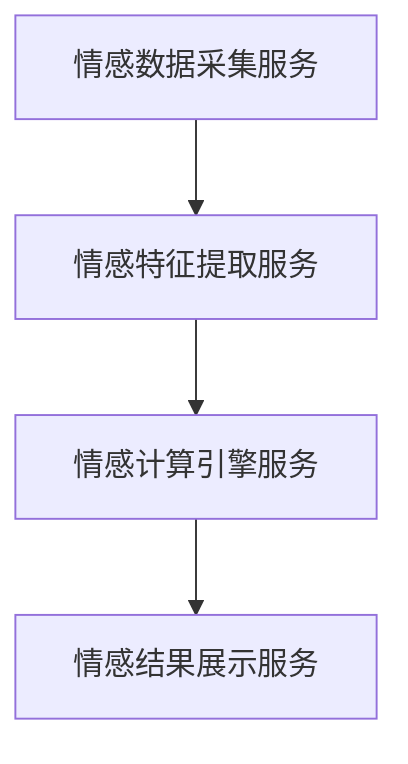

                 

# 情感计算：增强AI Agent的情感智能

> 关键词：情感计算，AI Agent，情感智能，情感识别，情感记忆，情感推理

> 摘要：情感计算是通过分析和理解人类情感，增强AI Agent的情感智能，使其能够更好地与人类交互。本文从情感计算的定义、核心模型、算法原理、系统架构到项目实战，全面探讨如何实现情感计算，提升AI Agent的智能水平。

---

# 第1章: 情感计算的定义与背景

## 1.1 情感计算的定义

### 1.1.1 情感计算的核心概念

情感计算（Affective Computing）是计算机科学与心理学交叉领域的重要研究方向，旨在通过分析和理解人类情感，增强计算机系统的智能性。情感计算的核心目标是使AI Agent能够感知、理解和回应人类的情感，从而实现更自然的交互。

### 1.1.2 情感计算与AI Agent的关系

AI Agent是具备自主决策能力的智能体，其核心功能包括感知、推理、学习和行动。情感计算为AI Agent增加了情感感知和情感推理的能力，使其能够理解人类情感，并在交互过程中做出更符合人类情感需求的决策。

### 1.1.3 情感计算的应用场景

情感计算的应用场景广泛，包括：

1. **人机交互**：提升用户体验，使AI Agent更加自然地与人类对话。
2. **心理健康支持**：通过情感分析帮助用户缓解压力。
3. **教育技术**：根据学生情绪调整教学策略。
4. **商业应用**：通过情感分析优化客户服务。

---

## 1.2 情感计算的理论基础

### 1.2.1 情感心理学基础

情感心理学研究人类情感的产生、表达和影响。情感计算的基础理论包括：

- **情感维度模型**：如PAFC（ Pleasant-Arousal- Dominance ）模型，将情感分解为基本维度。
- **情感分类**：如快乐、悲伤、愤怒等基本情感。

### 1.2.2 计算机科学中的情感建模

在计算机科学中，情感建模主要通过数学模型描述情感状态。常见的模型包括：

- **情感向量空间模型**：将情感表示为多维向量。
- **情感状态机模型**：描述情感状态的转换过程。

### 1.2.3 情感计算的研究现状

目前，情感计算的研究主要集中在以下方面：

1. **情感识别**：通过文本、语音和面部表情识别情感。
2. **情感记忆**：研究如何存储和调用情感信息。
3. **情感推理**：基于情感信息进行推理和决策。

---

## 1.3 情感数据的采集与分析

### 1.3.1 文本情感分析

文本情感分析是情感计算的重要应用，通过自然语言处理技术分析文本中的情感倾向。常用方法包括：

- **基于规则的方法**：利用情感词典进行情感分析。
- **机器学习方法**：使用 SVM、随机森林等算法进行情感分类。
- **深度学习方法**：使用 LSTM、BERT 等模型进行情感分析。

### 1.3.2 声音情感识别

声音情感识别通过分析语音特征（如音调、语速、停顿）来识别情感状态。常用算法包括：

- **基于特征提取的方法**：提取语音特征并进行分类。
- **基于深度学习的方法**：使用 CNN、RNN 等模型进行情感分类。

### 1.3.3 面部表情识别

面部表情识别通过分析面部特征（如面部表情、微表情）来识别情感状态。常用技术包括：

- **基于计算机视觉的方法**：使用 OpenCV 等工具进行图像处理。
- **基于深度学习的方法**：使用 CNN 进行面部表情分类。

---

# 第2章: 情感计算的核心概念与联系

## 2.1 情感计算的核心模型

### 2.1.1 情感识别模型

情感识别模型通过输入情感数据（如文本、语音、图像）输出情感标签。常见的模型包括：

- **文本情感识别模型**：如 TextBlob、 VaderSentiment。
- **语音情感识别模型**：如 EmoConv。
- **图像情感识别模型**：如 FaceNet。

### 2.1.2 情感记忆模型

情感记忆模型用于存储和调用情感信息。常见的模型包括：

- **基于规则的情感记忆模型**：通过预定义规则存储情感信息。
- **基于知识图谱的情感记忆模型**：将情感信息存储在知识图谱中，支持复杂的情感推理。

### 2.1.3 情感推理模型

情感推理模型基于情感信息进行推理和决策。常见的模型包括：

- **基于逻辑推理的情感推理模型**：通过逻辑规则进行情感推理。
- **基于深度学习的情感推理模型**：如 Transformer 模型。

---

## 2.2 情感计算的数学模型

### 2.2.1 情感向量空间模型

情感向量空间模型将情感表示为向量空间中的点。例如，使用词嵌入技术（如 Word2Vec）将情感词表示为向量。

$$
\text{情感向量} = \text{输入文本的词嵌入向量}
$$

### 2.2.2 情感分类模型

情感分类模型通过分类算法将情感数据分为不同类别。例如，使用支持向量机（SVM）进行情感分类。

$$
y = \text{argmax}_{c} \text{score}(x, c)
$$

其中，$x$ 是输入样本，$c$ 是类别。

### 2.2.3 情感记忆网络模型

情感记忆网络模型用于存储和调用情感信息。例如，使用 LSTM 进行情感记忆建模。

$$
f(t) = \text{LSTM}(f(t-1), x_t)
$$

---

## 2.3 情感计算的系统架构

### 2.3.1 系统功能模块

情感计算系统的功能模块包括：

1. **情感数据采集模块**：采集文本、语音、图像等情感数据。
2. **情感特征提取模块**：提取情感特征（如情感词、语音特征）。
3. **情感计算引擎模块**：进行情感分析、情感记忆和情感推理。
4. **情感结果展示模块**：展示情感计算结果。

### 2.3.2 系统架构设计

情感计算系统的架构设计可以采用模块化设计，各模块之间通过接口进行通信。

### 2.3.3 系统接口设计

情感计算系统的接口设计包括：

1. **数据接口**：提供情感数据的输入接口。
2. **模型接口**：提供情感计算模型的调用接口。
3. **用户接口**：提供用户与系统交互的界面。

---

# 第3章: 情感计算的算法原理

## 3.1 情感分类算法

### 3.1.1 基于机器学习的情感分类

基于机器学习的情感分类算法包括：

- **SVM**：支持向量机。
- **随机森林**：随机森林分类器。
- **K-近邻**：K-近邻算法。

### 3.1.2 基于深度学习的情感分类

基于深度学习的情感分类算法包括：

- **CNN**：卷积神经网络。
- **RNN**：循环神经网络。
- **LSTM**：长短期记忆网络。

### 3.1.3 情感分类的评估指标

情感分类的评估指标包括：

- **准确率**：分类正确的比例。
- **精确率**：预测为正类的样本中实际为正类的比例。
- **召回率**：实际为正类的样本中预测为正类的比例。

---

## 3.2 情感记忆与推理算法

### 3.2.1 情感记忆网络的构建

情感记忆网络的构建包括：

1. **情感信息存储**：将情感信息存储在知识图谱中。
2. **情感信息检索**：根据当前情感状态检索相关的情感信息。

### 3.2.2 情感推理的逻辑框架

情感推理的逻辑框架包括：

1. **情感状态获取**：获取当前情感状态。
2. **情感推理规则**：根据预定义的推理规则进行推理。
3. **情感结果输出**：输出推理结果。

### 3.2.3 情感记忆与推理的结合

情感记忆与推理的结合可以通过知识图谱和推理引擎实现。

$$
\text{推理结果} = \text{推理引擎}(\text{情感信息})
$$

---

# 第4章: 情感计算的系统架构与设计

## 4.1 情感计算系统的功能模块

### 4.1.1 情感数据采集模块

情感数据采集模块负责采集情感数据，包括文本、语音和图像数据。

### 4.1.2 情感特征提取模块

情感特征提取模块负责从情感数据中提取特征。

### 4.1.3 情感计算引擎模块

情感计算引擎模块负责进行情感分析、情感记忆和情感推理。

### 4.1.4 情感结果展示模块

情感结果展示模块负责展示情感计算结果。

---

## 4.2 情感计算系统的架构设计

### 4.2.1 模块化设计

模块化设计将系统划分为多个独立模块，每个模块负责特定功能。

### 4.2.2 分层架构设计

分层架构设计将系统划分为多个层次，每个层次负责特定功能。

### 4.2.3 微服务架构设计

微服务架构设计将系统划分为多个微服务，每个微服务负责特定功能。

---

## 4.3 情感计算系统的接口设计

### 4.3.1 数据接口

数据接口包括：

1. **文本接口**：提供文本数据的输入和输出接口。
2. **语音接口**：提供语音数据的输入和输出接口。
3. **图像接口**：提供图像数据的输入和输出接口。

### 4.3.2 模型接口

模型接口包括：

1. **情感分析接口**：提供情感分析模型的调用接口。
2. **情感记忆接口**：提供情感记忆模型的调用接口。
3. **情感推理接口**：提供情感推理模型的调用接口。

### 4.3.3 用户接口

用户接口包括：

1. **命令行接口**：提供命令行操作的接口。
2. **图形用户界面**：提供图形化的用户界面。
3. **API接口**：提供API接口供其他系统调用。

---

## 4.4 情感计算系统的交互设计

### 4.4.1 交互流程

情感计算系统的交互流程包括：

1. **用户输入**：用户输入情感数据。
2. **数据处理**：系统对输入数据进行处理。
3. **情感计算**：系统进行情感计算。
4. **结果展示**：系统展示情感计算结果。

### 4.4.2 交互界面

情感计算系统的交互界面包括：

1. **输入界面**：用户输入情感数据。
2. **输出界面**：系统展示情感计算结果。

---

# 第5章: 情感计算的项目实战

## 5.1 项目环境与工具安装

### 5.1.1 开发环境配置

开发环境配置包括：

1. **操作系统**：建议使用 Linux 或 macOS。
2. **开发工具**：建议使用 PyCharm 或 VS Code。
3. **依赖管理**：使用 pip 管理 Python 依赖。

### 5.1.2 数据集准备

数据集准备包括：

1. **文本数据集**：如 IMDB 情感分析数据集。
2. **语音数据集**：如情感语音数据集。
3. **图像数据集**：如面部表情数据集。

### 5.1.3 模型训练工具安装

模型训练工具安装包括：

1. **深度学习框架**：安装 TensorFlow 或 PyTorch。
2. **自然语言处理工具**：安装 NLTK 或 SpaCy。
3. **语音处理工具**：安装 librosa 或 pyAudio。

---

## 5.2 情感计算系统的核心实现

### 5.2.1 情感数据预处理

情感数据预处理包括：

1. **文本清洗**：去除停用词、标点符号等。
2. **语音特征提取**：提取语音特征（如 MFCC）。
3. **图像特征提取**：提取图像特征（如面部表情特征）。

### 5.2.2 情感特征提取与建模

情感特征提取与建模包括：

1. **文本特征提取**：使用 TF-IDF 或词嵌入技术提取文本特征。
2. **语音特征提取**：使用 MFCC 提取语音特征。
3. **图像特征提取**：使用 OpenCV 提取图像特征。

### 5.2.3 情感计算结果展示

情感计算结果展示包括：

1. **情感标签展示**：展示情感标签（如积极、消极）。
2. **情感强度展示**：展示情感强度（如 0.8 表示高度积极）。
3. **推理结果展示**：展示情感推理结果。

---

## 5.3 项目案例分析

### 5.3.1 情感分析在客服系统中的应用

情感分析在客服系统中的应用包括：

1. **客户情绪识别**：识别客户情绪。
2. **自动回复**：根据客户情绪自动回复。
3. **情绪监控**：监控客户情绪变化。

### 5.3.2 情感记忆在智能助手中的应用

情感记忆在智能助手中的应用包括：

1. **用户情绪记忆**：记忆用户情绪状态。
2. **个性化服务**：根据用户情绪提供个性化服务。
3. **情绪反馈**：根据用户情绪反馈服务结果。

### 5.3.3 情感推理在社交网络中的应用

情感推理在社交网络中的应用包括：

1. **情感分析**：分析社交网络中的情感信息。
2. **情感传播**：分析情感传播路径。
3. **情感预测**：预测未来情感趋势。

---

# 第6章: 情感计算的最佳实践与注意事项

## 6.1 情感计算的实践技巧

### 6.1.1 数据质量

数据质量是情感计算的关键，需要确保数据的多样性和代表性。

### 6.1.2 模型选择

模型选择需要根据具体任务选择合适的模型，如深度学习模型适合复杂任务，而基于规则的模型适合简单任务。

### 6.1.3 情感推理的复杂性

情感推理的复杂性需要考虑情感记忆和情感推理的结合，避免模型过于复杂导致性能下降。

### 6.1.4 情感计算的伦理问题

情感计算的伦理问题需要考虑数据隐私和情感信息的滥用。

---

## 6.2 小结

情感计算是增强AI Agent情感智能的重要技术，通过情感计算，AI Agent能够更好地理解和回应人类情感，实现更自然的交互。在实际应用中，需要注意数据质量和模型选择，同时关注伦理问题。

---

## 6.3 注意事项

1. **数据隐私**：确保情感数据的隐私和安全。
2. **模型泛化能力**：避免模型过于依赖训练数据，提升泛化能力。
3. **情感计算的伦理问题**：避免情感计算技术的滥用。

---

## 6.4 拓展阅读

1. **《情感计算：人工智能的情感智能》**：深入探讨情感计算的核心概念和应用。
2. **《深度学习中的情感分析》**：详细讲解深度学习在情感分析中的应用。
3. **《情感记忆网络：构建智能体的情感记忆系统》**：介绍如何构建情感记忆网络。

---

# 作者：AI天才研究院/AI Genius Institute & 禅与计算机程序设计艺术 /Zen And The Art of Computer Programming

