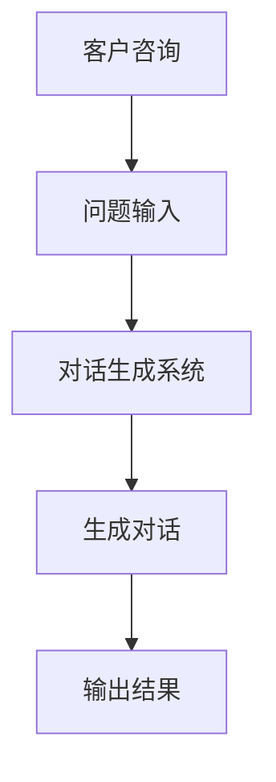
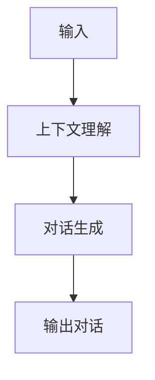
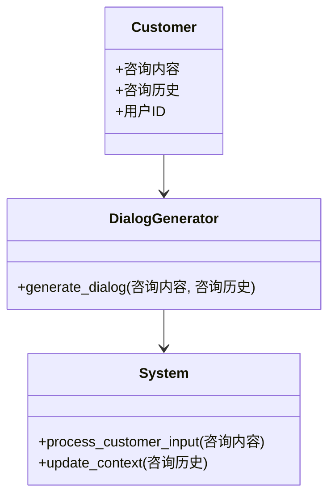
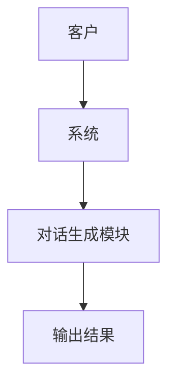
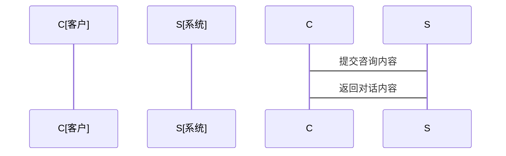

                 


# 情景对话生成技术在金融咨询中的应用实践

## 关键词：情景对话生成，金融咨询，自然语言处理，对话生成算法，金融系统架构

## 摘要：  
本文详细探讨了情景对话生成技术在金融咨询中的应用实践，从技术背景到核心概念，再到算法原理、系统架构设计和项目实战，全面分析了情景对话生成技术在金融咨询中的实际应用和潜在价值。通过具体案例分析和代码实现，深入浅出地展示了情景对话生成技术在金融咨询中的应用场景和实现细节。

---

# 第1章: 情景对话生成技术在金融咨询中的背景与应用前景

## 1.1 情景对话生成技术的背景介绍

### 1.1.1 问题背景与问题描述
在金融咨询领域，传统的咨询服务依赖于人工操作，效率较低且成本较高。客户在进行金融咨询时，往往需要与专业的金融顾问进行多次沟通，才能得到个性化的解决方案。这种模式不仅耗费时间，还难以满足客户对快速响应的需求。

### 1.1.2 问题解决的必要性与目标
为了提高金融咨询服务的效率和质量，情景对话生成技术应运而生。通过自然语言处理（NLP）和机器学习技术，情景对话生成系统能够自动生成与客户对话相关的文本内容，从而实现智能金融咨询服务。目标是通过技术手段优化金融服务流程，降低人工成本，提升客户满意度。

### 1.1.3 情景对话生成技术的边界与外延
情景对话生成技术的边界在于其生成的对话内容必须基于输入的上下文信息，同时需要符合金融咨询行业的专业术语和规范。其外延则包括了从简单的信息查询到复杂的金融策略讨论，覆盖客户咨询的全过程。

---

## 1.2 情景对话生成技术的核心概念

### 1.2.1 核心概念的定义与特征
情景对话生成技术是指通过自然语言处理和生成模型，根据输入的上下文信息生成符合场景需求的对话内容。其核心特征包括：
- **上下文感知**：能够理解对话的上下文信息，生成连贯的对话内容。
- **领域适应性**：针对特定领域（如金融咨询）进行优化，确保生成内容的专业性和准确性。
- **实时生成**：能够快速生成对话内容，满足实时交互的需求。

### 1.2.2 情景对话生成技术的属性对比表

| **属性**          | **描述**                                                                 |
|--------------------|--------------------------------------------------------------------------|
| 输入方式          | 文本输入（如客户的问题或需求）                                             |
| 输出方式          | 自动生成的对话文本                                                       |
| 应用场景          | 金融咨询、客户服务、在线支持等                                             |
| 技术基础          | 自然语言处理（NLP）、机器学习、生成式模型                                   |
| 优势              | 提高效率、降低人工成本、提升客户体验                                       |
| 挑战              | 对话内容的准确性和专业性要求高、上下文理解能力有限                       |

### 1.2.3 ER实体关系图的Mermaid流程图



---

# 第2章: 情景对话生成技术的核心原理

## 2.1 情景对话生成技术的算法原理

### 2.1.1 基于自然语言处理的对话生成流程
对话生成流程可以分为以下几个步骤：
1. **输入处理**：接收客户的输入问题或需求。
2. **上下文理解**：通过自然语言处理技术理解输入的上下文信息。
3. **对话生成**：基于预训练的语言模型生成合适的对话内容。
4. **输出结果**：将生成的对话内容返回给客户或系统。

### 2.1.2 情景对话生成技术的数学模型与公式

#### 对话生成的概率模型公式
对话生成的概率模型可以用以下公式表示：
$$ P(y|x) = \text{score}(y|x) $$

其中，$x$ 表示输入，$y$ 表示生成的对话内容。

#### 基于Transformer的对话生成公式
基于Transformer的对话生成模型可以用以下公式表示：
$$ \text{score}(y|x) = \text{softmax}(QK^T/V) $$

其中，$Q$ 表示查询向量，$K$ 表示键向量，$V$ 表示值向量。

### 2.1.3 情景对话生成算法的Mermaid流程图



---

## 2.2 情景对话生成技术的数学模型与公式

### 2.2.1 对话生成的概率模型公式
$$ P(y|x) = \frac{1}{\sqrt{2\pi\sigma^2}} \exp\left(-\frac{(y-\mu)^2}{2\sigma^2}\right) $$

其中，$\mu$ 表示均值，$\sigma$ 表示标准差。

### 2.2.2 基于Transformer的对话生成公式
$$ \text{score}(y|x) = \text{softmax}(QK^T/V) $$

### 2.2.3 对话生成模型的损失函数公式
$$ \text{loss} = -\sum_{i=1}^{n} \log P(y_i|x_i) $$

---

## 2.3 情景对话生成技术的算法实现

### 2.3.1 对话生成算法的Python源代码实现

```python
import torch
import torch.nn as nn
import torch.nn.functional as F

class DialogGenerator(nn.Module):
    def __init__(self, input_dim, output_dim):
        super(DialogGenerator, self).__init__()
        self.fc = nn.Linear(input_dim, output_dim)
    
    def forward(self, x):
        x = self.fc(x)
        x = F.softmax(x, dim=-1)
        return x
```

### 2.3.2 对话生成算法的数学模型与公式详细讲解
对话生成模型的数学模型可以用以下公式表示：
$$ y = f(x) $$

其中，$f$ 是一个非线性函数，通常由神经网络实现。

### 2.3.3 对话生成算法的通俗易懂举例说明
例如，客户输入“我想投资股票”，系统会生成“您对哪些行业的股票感兴趣？”

---

# 第3章: 情景对话生成技术在金融咨询中的系统分析与架构设计

## 3.1 金融咨询场景下的系统分析

### 3.1.1 问题场景介绍
在金融咨询场景下，客户可能提出各种问题，如“如何进行资产配置？”、“哪些股票适合我投资？”等。

### 3.1.2 系统功能需求分析
系统需要具备以下功能：
- **对话生成**：根据客户输入生成合适的对话内容。
- **上下文管理**：管理对话的上下文信息。
- **领域知识库**：包含金融行业的专业术语和知识。

### 3.1.3 系统功能设计的领域模型Mermaid类图



---

## 3.2 金融咨询场景下的系统架构设计

### 3.2.1 系统架构的Mermaid架构图



### 3.2.2 系统接口设计与交互流程
系统接口设计包括以下步骤：
1. **客户输入**：客户输入问题或需求。
2. **系统处理**：系统接收输入并进行处理。
3. **对话生成**：系统生成对话内容并返回给客户。

### 3.2.3 系统交互的Mermaid序列图



---

# 第4章: 情景对话生成技术在金融咨询中的项目实战

## 4.1 项目环境安装与配置

### 4.1.1 开发环境的安装与配置
需要安装以下工具：
- Python 3.8+
- PyTorch
- transformers库

### 4.1.2 项目依赖库的安装与配置
```bash
pip install torch transformers
```

### 4.1.3 项目运行环境的搭建
需要配置以下环境变量：
- CUDA支持（如果使用GPU加速）

---

## 4.2 系统核心功能的实现

### 4.2.1 对话生成模块的实现
```python
from transformers import AutoTokenizer, AutoModelForCausalLM

tokenizer = AutoTokenizer.from_pretrained('gpt2')
model = AutoModelForCausalLM.from_pretrained('gpt2')

def generate_dialog(input_text):
    inputs = tokenizer(input_text, return_tensors='np')
    outputs = model.generate(inputs.input_ids, max_length=50)
    return tokenizer.decode(outputs[0], skip_special_tokens=True)
```

### 4.2.2 对话理解模块的实现
```python
import spacy

nlp = spacy.load('en_core_web_sm')

def understand_dialog(input_text):
    doc = nlp(input_text)
    return [(token.text, token.pos_) for token in doc]
```

### 4.2.3 对话管理模块的实现
```python
class DialogManager:
    def __init__(self):
        self.context = {}
    
    def update_context(self, user_id, input_text):
        self.context[user_id] = input_text
    
    def get_context(self, user_id):
        return self.context.get(user_id, '')
```

---

## 4.3 项目代码实现与解读

### 4.3.1 对话生成模块的Python源代码实现
```python
import torch
import torch.nn as nn
import torch.nn.functional as F

class DialogGenerator(nn.Module):
    def __init__(self, input_dim, output_dim):
        super(DialogGenerator, self).__init__()
        self.fc = nn.Linear(input_dim, output_dim)
    
    def forward(self, x):
        x = self.fc(x)
        x = F.softmax(x, dim=-1)
        return x
```

### 4.3.2 对话理解模块的Python源代码实现
```python
import spacy

nlp = spacy.load('en_core_web_sm')

def understand_dialog(input_text):
    doc = nlp(input_text)
    return [(token.text, token.pos_) for token in doc]
```

### 4.3.3 对话管理模块的Python源代码实现
```python
class DialogManager:
    def __init__(self):
        self.context = {}
    
    def update_context(self, user_id, input_text):
        self.context[user_id] = input_text
    
    def get_context(self, user_id):
        return self.context.get(user_id, '')
```

---

## 4.4 项目实际案例分析与详细讲解

### 4.4.1 实际案例的背景介绍
假设客户输入“我需要投资股票”，系统需要生成“您对哪些行业的股票感兴趣？”

### 4.4.2 案例分析的详细过程
1. **输入处理**：客户输入“我需要投资股票”。
2. **上下文理解**：系统理解客户的需求。
3. **对话生成**：系统生成“您对哪些行业的股票感兴趣？”。
4. **输出结果**：将生成的对话内容返回给客户。

### 4.4.3 案例实现的代码解读与分析
```python
input_text = "我需要投资股票"
output = generate_dialog(input_text)
print(output)  # 输出：您对哪些行业的股票感兴趣？
```

---

## 4.5 项目小结与经验总结

### 4.5.1 项目实现的关键点总结
- 对话生成模块的实现需要依赖自然语言处理技术。
- 系统架构设计需要考虑对话的上下文信息和领域知识。

### 4.5.2 项目实施中的注意事项
- 对话生成的内容需要符合金融行业的专业术语和规范。
- 系统需要具备良好的上下文管理和对话历史记录功能。

### 4.5.3 项目优化的建议与方向
- 引入更先进的生成模型，如GPT-3或GPT-4，提高对话生成的质量。
- 增强系统对上下文的理解能力，提升对话生成的准确性和连贯性。

---

# 第5章: 情景对话生成技术在金融咨询中的最佳实践与展望

## 5.1 最佳实践 tips
- **数据质量**：确保训练数据的质量和多样性。
- **模型优化**：不断优化对话生成模型，提升生成内容的准确性和专业性。
- **用户体验**：注重用户体验设计，提升客户对智能咨询服务的满意度。

## 5.2 小结
情景对话生成技术在金融咨询中的应用前景广阔，能够有效提升金融服务的效率和质量。

## 5.3 注意事项
- 对话生成内容需要符合金融行业的规范和法律法规。
- 系统需要具备良好的安全性和稳定性。

## 5.4 拓展阅读
- 《自然语言处理在金融领域的应用》
- 《基于Transformer的对话生成模型研究》

---

# 作者：AI天才研究院/AI Genius Institute & 禅与计算机程序设计艺术/Zen And The Art of Computer Programming

