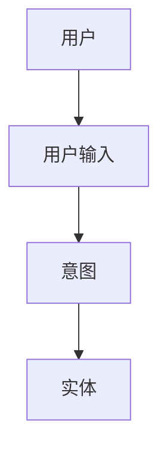
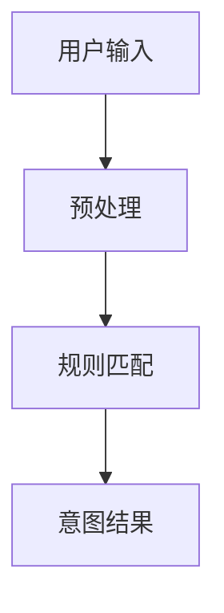
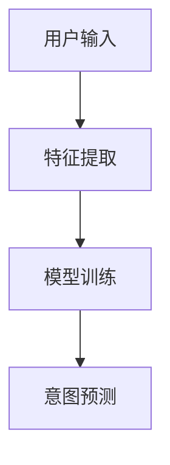
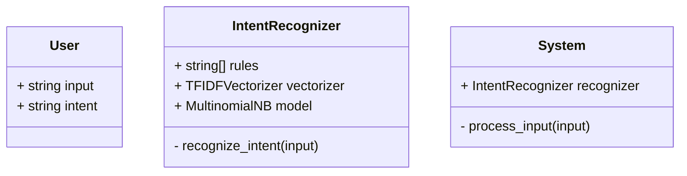
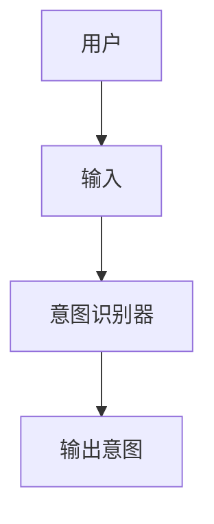

                 


# 意图识别：准确把握用户需求

> 关键词：意图识别，自然语言处理，用户需求分析，机器学习，对话系统设计

> 摘要：意图识别是自然语言处理领域的重要任务，旨在准确理解用户的深层需求。本文从意图识别的基本概念出发，详细探讨其核心算法原理、系统架构设计及实际应用案例，帮助读者全面掌握意图识别的核心技术与实践方法。

---

# 第1章: 意图识别的背景与概念

## 1.1 意图识别的背景介绍

### 1.1.1 问题背景与问题描述

在人机交互领域，准确理解用户的意图是实现高效对话系统的核心挑战。用户通过自然语言表达需求时，其语言可能包含歧义、模糊或隐含的意思，这些都需要系统进行准确解析。例如，用户输入“我需要预订一张去北京的机票”，系统需要识别出“预订机票”这一意图，并进一步提取“目的地为北京”的实体信息。

### 1.1.2 意图识别的核心目标与解决路径

意图识别的核心目标是将用户输入的文本映射到特定的意图类别上。实现这一目标通常需要结合文本预处理、特征提取和模型训练等步骤。常见的解决路径包括基于规则的方法、统计模型和深度学习方法。

### 1.1.3 意图识别的边界与外延

意图识别的边界在于仅关注用户输入的“意图”，而非具体的实体信息。其外延则包括与之相关的自然语言理解（NLU）、情感分析和文本分类等任务。

## 1.2 意图识别的核心概念与联系

### 1.2.1 意图识别的核心概念原理

意图识别通过分析用户输入的文本，提取其背后的意图信息。常见的意图包括“查询天气”、“预订酒店”、“搜索信息”等。

### 1.2.2 意图识别的核心属性特征对比表格

| 属性 | 描述 |
|------|------|
| 输入类型 | 文本、语音 |
| 输出类型 | 意图类别 |
| 算法类型 | 基于规则、统计模型、深度学习 |
| 评估指标 | 准确率、召回率、F1值 |

### 1.2.3 意图识别的ER实体关系图架构



## 1.3 意图识别与其他相关概念的区别与联系

### 1.3.1 意图识别与自然语言理解（NLU）的区别

意图识别是NLU的一个子任务，专注于识别用户意图，而NLU还包括实体识别和情感分析。

### 1.3.2 意图识别与实体识别（NER）的联系

实体识别关注提取文本中的具体实体信息，而意图识别则关注整体意图的分类。

### 1.3.3 意图识别与情感分析的差异

情感分析关注用户情感倾向，而意图识别关注用户的操作需求。

## 1.4 本章小结

本章介绍了意图识别的基本概念、核心目标、核心概念及其与相关任务的区别与联系，为后续内容奠定了基础。

---

# 第2章: 意图识别的算法原理

## 2.1 基于规则的意图识别算法

### 2.1.1 基于规则的意图识别流程



### 2.1.2 基于规则的意图识别实现代码

```python
import re

def rule_based_intent Recognition(text):
    # 预处理
    processed_text = text.lower().strip()
    # 规则匹配
    for pattern, intent in rules:
        if re.match(pattern, processed_text):
            return intent
    return "unknown"
```

### 2.1.3 基于规则的意图识别优缺点分析

| 优点 | 缺点 |
|------|------|
| 实现简单 | 需要大量人工规则 |
| 适用于简单场景 | 难以处理复杂语义 |
| 可解释性强 | 对数据依赖性低 |

## 2.2 基于统计模型的意图识别算法

### 2.2.1 统计模型的意图识别流程



### 2.2.2 统计模型的数学公式与实现代码

#### 数学公式

$$ P(intent|text) = \frac{P(text|intend) \cdot P(intent)}{P(text)} $$

#### 实现代码

```python
from sklearn.feature_extraction.text import TfidfVectorizer
from sklearn.naive_bayes import MultinomialNB

# 特征提取
vectorizer = TfidfVectorizer()
X = vectorizer.fit_transform(corpus)

# 模型训练
model = MultinomialNB()
model.fit(X, labels)

# 意图预测
test_text = "我需要预订一张去北京的机票"
test_X = vectorizer.transform([test_text])
predicted_intent = model.predict(test_X)[0]
print(predicted_intent)
```

---

# 第3章: 意图识别的数学模型

## 3.1 概率论基础

### 3.1.1 贝叶斯定理

$$ P(A|B) = \frac{P(B|A) \cdot P(A)}{P(B)} $$

### 3.1.2 拉普拉斯修正

$$ P(w|c) = \frac{\text{count}(w,c) + \alpha}{\text{sum}(\text{count}(*,c)) + \alpha \cdot \text{V}} $$

## 3.2 自然语言处理中的数学模型

### 3.2.1 TF-IDF公式

$$ \text{TF}(t, d) = \frac{\text{count}(t, d)}{\text{len}(d)} $$

$$ \text{IDF}(t) = \log\left(\frac{\text{N}}{\text{DF}(t)}\right) $$

### 3.2.2 余弦相似度

$$ \text{similarity} = \frac{\vec{A} \cdot \vec{B}}{|\vec{A}| \cdot |\vec{B}|} $$

---

# 第4章: 意图识别的系统架构设计

## 4.1 系统功能设计

### 4.1.1 领域模型



### 4.1.2 系统架构设计



## 4.2 系统接口设计

### 4.2.1 API接口

```python
class IntentRecognizer:
    def __init__(self):
        self.vectorizer = TfidfVectorizer()
        self.model = MultinomialNB()

    def train(self, corpus, labels):
        self.vectorizer.fit(corpus)
        self.model.fit(self.vectorizer.transform(corpus), labels)

    def predict(self, text):
        return self.model.predict(self.vectorizer.transform([text]))
```

---

# 第5章: 项目实战

## 5.1 电商客服系统中的意图识别

### 5.1.1 环境搭建

```bash
pip install scikit-learn
pip install nltk
pip install mermaid
```

### 5.1.2 核心代码实现

```python
from sklearn.feature_extraction.text import TfidfVectorizer
from sklearn.naive_bayes import MultinomialNB

# 训练数据
corpus = [
    "我需要查询订单状态",
    "我要取消订单",
    "请为我提供退货流程",
    "我想联系客服"
]
labels = ["查询订单", "取消订单", "退货流程", "联系客服"]

# 模型训练
vectorizer = TfidfVectorizer()
X = vectorizer.fit_transform(corpus)
model = MultinomialNB()
model.fit(X, labels)

# 意图识别
test_text = "请帮我查询订单状态"
test_X = vectorizer.transform([test_text])
predicted_intent = model.predict(test_X)[0]
print(predicted_intent)
```

### 5.1.3 案例分析与结果解读

通过上述代码，系统能够准确识别用户的意图，例如输入“请帮我查询订单状态”会被识别为“查询订单”意图。

---

# 第6章: 意图识别的最佳实践

## 6.1 实践中的注意事项

- 数据质量：确保训练数据的多样性和代表性
- 特征选择：合理选择特征提取方法
- 模型选择：根据场景选择合适算法
- 性能优化：通过交叉验证和超参数调优提升模型性能

## 6.2 拓展阅读

- 《自然语言处理实战：基于Python的机器学习与深度学习》
- 《机器学习实战》

---

# 作者

作者：AI天才研究院/AI Genius Institute & 禅与计算机程序设计艺术 /Zen And The Art of Computer Programming

---

以上是《意图识别：准确把握用户需求》的技术博客文章内容，涵盖了意图识别的核心概念、算法原理、系统设计和实际应用案例，帮助读者全面理解意图识别的技术细节与实践方法。

