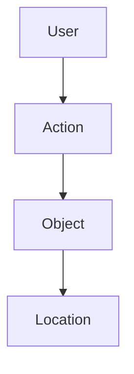

                 


---

# 意图识别：准确把握用户需求的关键

## 关键词：意图识别、用户需求、自然语言处理、机器学习、深度学习

## 摘要：意图识别是自然语言处理中的关键任务，旨在准确理解用户的深层需求。本文从背景与概念入手，详细探讨意图识别的核心原理、算法实现、系统架构以及项目实战，结合实际案例，帮助读者掌握意图识别的核心技术与应用方法。

---

## 第1章: 意图识别的背景与概念

### 1.1 什么是意图识别
- 意图识别的定义
- 意图识别的核心目标
- 意图识别的应用场景

### 1.2 意图识别的背景与问题背景
- 自然语言处理的发展历程
- 当前意图识别的挑战
- 意图识别与用户体验优化

### 1.3 意图识别的核心要素
- 用户需求的层次化分析
- 意图识别的关键特征
- 意图识别的边界与外延

### 1.4 意图识别的分类与结构
- 意图识别的分类方式
- 意图识别的层次结构
- 意图识别的核心要素组成

---

## 第2章: 意图识别的核心概念与联系

### 2.1 意图识别的特征提取
- 文本特征提取方法
- 用户行为特征提取
- 多模态特征的融合

### 2.2 意图识别的分类器设计
- 分类器的基本原理
- 常见分类器的对比
- 分类器的优化策略

### 2.3 意图识别的实体关系分析
- 实体识别与关系抽取
- 实体关系图的构建
- 实体关系图的应用

### 2.4 意图识别的数学模型
- 概率论基础
- 统计学模型
- 机器学习模型

---

## 第3章: 意图识别的算法原理与实现

### 3.1 常见意图识别算法
- 支持向量机（SVM）
- 决策树
- 随机森林
- 神经网络

### 3.2 深度学习模型的意图识别
- 卷积神经网络（CNN）
- 循环神经网络（RNN）
- 变量长度序列的处理
- 注意力机制的应用

### 3.3 意图识别的算法流程
- 数据预处理
- 特征提取
- 模型训练
- 模型评估

---

## 第4章: 意图识别的系统分析与架构设计

### 4.1 意图识别系统的功能需求
- 用户输入的接收与解析
- 数据存储与管理
- 模型训练与部署
- 结果输出与反馈

### 4.2 系统架构设计
- 领域模型设计（Mermaid类图）
- 系统架构图（Mermaid架构图）
- 系统接口设计
- 系统交互流程（Mermaid序列图）

---

## 第5章: 意图识别的项目实战

### 5.1 项目环境安装
- 安装Python和相关库（如TensorFlow、Keras）
- 安装工具链和依赖项

### 5.2 项目核心实现
- 特征提取的代码实现
- 分类器设计的代码实现
- 模型训练与评估的代码实现

### 5.3 实际案例分析
- 案例背景介绍
- 数据收集与预处理
- 模型训练与结果分析

---

## 第6章: 意图识别的优化与扩展

### 6.1 算法优化策略
- 参数调优
- 模型融合
- 迁移学习

### 6.2 系统扩展方案
- 多模态数据的整合
- 实时意图识别
- 高可用性和高扩展性设计

### 6.3 最佳实践Tips
- 数据质量的重要性
- 模型选择的注意事项
- 系统部署的建议

---

## 第7章: 意图识别的总结与展望

### 7.1 本章小结
- 意图识别的核心内容回顾
- 重点知识的总结

### 7.2 意图识别的未来展望
- 新技术的发展趋势
- 意图识别的未来应用场景

### 7.3 注意事项与建议
- 开发中的常见问题
- 解决方案与建议

### 7.4 扩展阅读推荐
- 推荐书籍
- 推荐论文
- 推荐技术博客

---

## 作者：AI天才研究院 & 禅与计算机程序设计艺术

---

### 附录：部分代码示例

#### 1. 特征提取代码
```python
def extract_features(text):
    # 词袋模型
    from sklearn.feature_extraction.text import CountVectorizer
    vectorizer = CountVectorizer()
    X = vectorizer.fit_transform([text])
    return X.toarray()[0]
```

#### 2. 深度学习模型代码
```python
import tensorflow as tf
from tensorflow.keras import layers

model = tf.keras.Sequential([
    layers.Embedding(input_dim=10000, output_dim=50),
    layers.LSTM(64),
    layers.Dense(1, activation='sigmoid')
])
model.compile(optimizer='adam', loss='binary_crossentropy', metrics=['accuracy'])
```

#### 3. 实体关系图（Mermaid）


---

希望这篇目录和内容能满足您的需求。如果需要进一步调整或补充，请随时告诉我！

