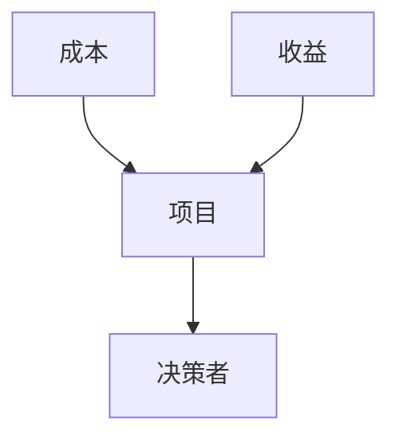
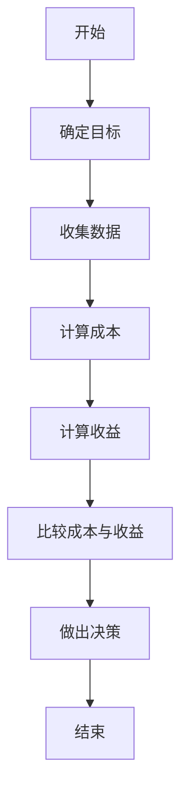
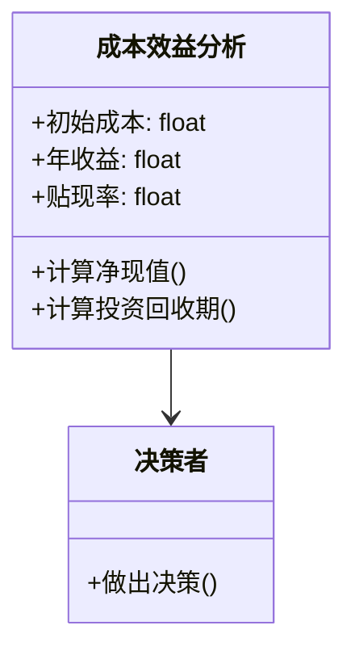
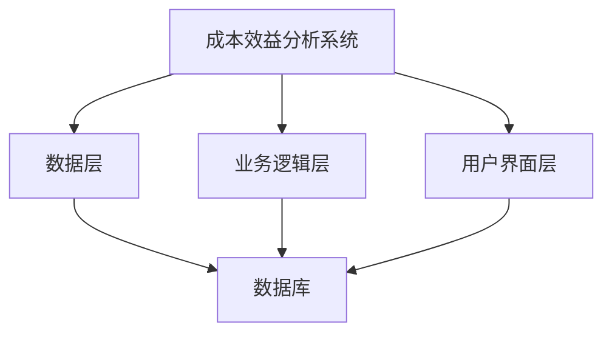
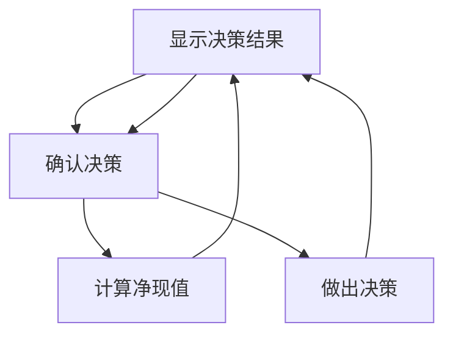

                 


# 成本效益分析

## 关键词：成本效益分析、项目管理、经济效益、数学模型、系统架构、投资决策

## 摘要：  
成本效益分析是项目管理和经济学中的核心工具，用于评估项目的可行性和经济合理性。本文从基础概念入手，结合数学模型和实际案例，深入分析成本效益分析的原理、方法及其在项目管理中的应用。通过系统架构设计和项目实战，帮助读者掌握成本效益分析的技巧和最佳实践。

---

# 第一部分: 成本效益分析概述

## 第1章: 成本效益分析的背景与概念

### 1.1 成本效益分析的定义与背景

#### 1.1.1 成本效益分析的定义
成本效益分析（Cost-Benefit Analysis, CBA）是一种评估项目或决策的经济合理性的方法，通过比较项目的总成本与总收益，判断其是否值得实施。

#### 1.1.2 成本效益分析的背景与重要性
在项目管理中，成本效益分析是决策者评估投资回报的重要工具，尤其在资源有限的情况下，帮助组织优先选择高效益的项目。

#### 1.1.3 成本效益分析的核心要素
- 成本（Cost）：项目的投入资源，包括人力、时间和资金。
- 收益（Benefit）：项目的产出价值，通常以经济利益或社会效益衡量。
- 贴现率（Discount Rate）：用于调整未来收益现值的参数，反映资金的时间价值。

### 1.2 成本效益分析的基本原理

#### 1.2.1 成本与收益的定义
- 成本：项目的直接和间接支出。
- 收益：项目的直接和间接收入。

#### 1.2.2 机会成本的概念
机会成本是指放弃某项决策而失去的潜在收益，是成本效益分析中不可忽视的一部分。

#### 1.2.3 成本效益分析的基本假设
- 财务数据的可量化性：收益和成本必须能够用货币量化。
- 贴现率的合理性：贴现率的选择影响未来收益的现值计算。
- 项目的独立性：假设各项目互不影响。

---

## 第2章: 成本效益分析的核心概念与联系

### 2.1 成本效益分析的理论基础

#### 2.1.1 经济学基础
- 边际成本与边际收益：分析成本和收益的变化对决策的影响。
- 市场均衡：供需关系对成本和收益的影响。

#### 2.1.2 管理学基础
- 资源分配：如何在有限资源中选择最优项目。
- 绩效评估：通过成本效益分析评估项目绩效。

#### 2.1.3 项目管理基础
- 项目可行性分析：成本效益分析是项目可行性研究的重要组成部分。
- 投资决策：通过成本效益分析判断项目是否值得投资。

### 2.2 成本与收益的对比分析

#### 2.2.1 成本的分类与特征
- 固定成本：项目初期的一次性投入，如设备购置。
- 变动成本：随产量变化的成本，如原材料采购。

#### 2.2.2 收益的分类与特征
- 直接收益：项目直接产生的收入，如销售收入。
- 间接收益：项目带来的社会效益，如就业机会增加。

#### 2.2.3 成本与收益的对比表格
| 类别 | 成本 | 收益 |
|------|------|------|
| 时间范围 | 现在和未来 | 现在和未来 |
| 影响范围 | 项目本身 | 项目和相关方 |
| 计量方式 | 货币和非货币 | 货币和非货币 |

### 2.3 实体关系图与流程图

#### 2.3.1 成本效益分析的ER实体关系图


#### 2.3.2 成本效益分析的流程图


---

# 第三部分: 成本效益分析的数学模型与算法原理

## 第3章: 成本效益分析的数学模型

### 3.1 成本-收益分析模型

#### 3.1.1 成本-收益分析的基本公式
$$ \text{净收益} = \text{收益} - \text{成本} $$

#### 3.1.2 成本-收益分析的数学模型
$$ \text{净现值} = \sum_{t=0}^{n} \frac{\text{现金流}_t}{(1 + r)^t} $$
其中，\( r \) 是贴现率，\( n \) 是项目周期。

### 3.2 投资回收期模型

#### 3.2.1 投资回收期的定义
投资回收期是指项目用净收益收回初始投资所需的时间。

#### 3.2.2 投资回收期的计算公式
$$ \text{投资回收期} = \frac{\text{初始投资}}{\text{年均净收益}} $$

### 3.3 盈利能力分析模型

#### 3.3.1 净利润公式
$$ \text{净利润} = \text{收入} - \text{总成本} $$

#### 3.3.2 投资回报率公式
$$ \text{ROI} = \frac{\text{净利润}}{\text{初始投资}} \times 100\% $$

---

## 第4章: 成本效益分析的算法原理

### 4.1 成本-收益分析的算法流程


### 4.2 算法实现

#### 4.2.1 算法代码示例

```python
def cost_benefit_analysis(initial_cost, annual_benefit, discount_rate, period):
    net_present_value = 0
    for t in range(period):
        cash_flow = annual_benefit * (1 + discount_rate) ** t
        net_present_value += cash_flow / (1 + discount_rate) ** t
    return net_present_value - initial_cost

initial_cost = 1000
annual_benefit = 500
discount_rate = 0.1
period = 5

net_present_value = cost_benefit_analysis(initial_cost, annual_benefit, discount_rate, period)
print(f"净现值: {net_present_value}")
```

#### 4.2.2 代码解读
1. 函数 `cost_benefit_analysis` 计算项目的净现值。
2. 初始成本为1000，年收益为500，贴现率为10%，项目周期为5年。
3. 使用循环计算每一年的现金流现值，并累加。
4. 净现值为收益现值减去初始成本。

---

# 第四部分: 系统分析与架构设计方案

## 第5章: 成本效益分析的系统架构设计

### 5.1 系统功能设计

#### 5.1.1 领域模型（Mermaid 类图）


#### 5.1.2 系统架构设计（Mermaid 架构图）


#### 5.1.3 系统接口设计
- 输入接口：用户输入初始成本、年收益、贴现率。
- 输出接口：系统输出净现值和投资回收期。

### 5.2 系统交互设计（Mermaid 序列图）


---

# 第五部分: 项目实战

## 第6章: 成本效益分析的项目实战

### 6.1 环境安装

#### 6.1.1 安装Python
- 下载并安装Python 3.x。
- 配置环境变量。

#### 6.1.2 安装依赖库
- 使用 pip 安装 `mermaid` 和 `matplotlib`。

### 6.2 核心代码实现

#### 6.2.1 成本效益分析代码

```python
import matplotlib.pyplot as plt

def plot_cost_benefit(initial_cost, annual_benefit, discount_rate, period):
    net_present_values = []
    for t in range(period):
        npv = annual_benefit * (1 + discount_rate) ** t
        net_present_values.append(npv / (1 + discount_rate) ** t)
    plt.plot(range(period), net_present_values, 'b-')
    plt.xlabel('年份')
    plt.ylabel('净现值')
    plt.title('成本效益分析图')
    plt.show()

plot_cost_benefit(1000, 500, 0.1, 5)
```

#### 6.2.2 代码解读
1. 函数 `plot_cost_benefit` 绘制净现值随时间变化的折线图。
2. 使用 matplotlib 绘制图形，并展示净现值的变化趋势。

### 6.3 案例分析

#### 6.3.1 案例背景
假设某公司计划投资一个新项目，初始成本为1000万元，预计年收益500万元，贴现率为10%，项目周期为5年。

#### 6.3.2 数据计算
$$ \text{净现值} = \sum_{t=0}^{4} \frac{500}{(1 + 0.1)^t} - 1000 = 129.504 - 1000 = -870.496 $$

#### 6.3.3 决策建议
由于净现值为负，该项目不可行。

### 6.4 项目小结

#### 6.4.1 成本效益分析的关键点
- 准确的数据输入。
- 合理的贴现率选择。
- 模型的适用性。

#### 6.4.2 项目管理中的注意事项
- 定期更新成本和收益数据。
- 考虑通货膨胀对贴现率的影响。

---

# 第六部分: 总结与展望

## 第7章: 总结与展望

### 7.1 最佳实践 Tips

#### 7.1.1 数据准确性
确保输入数据的准确性和可靠性。

#### 7.1.2 模型选择
根据项目特点选择合适的分析模型。

#### 7.1.3 决策透明性
向利益相关者清晰地解释分析结果。

### 7.2 小结

成本效益分析是项目管理中的重要工具，能够帮助决策者科学评估项目的可行性。通过数学模型和系统架构设计，可以提高分析的准确性和效率。

### 7.3 注意事项

- 贴现率的选择对结果影响较大。
- 需要考虑项目的外部性因素。
- 分析结果仅供参考，需结合实际情况调整。

### 7.4 拓展阅读

- 《项目管理知识体系指南》
- 《成本效益分析方法与应用》

---

# 作者

作者：AI天才研究院/AI Genius Institute & 禅与计算机程序设计艺术/Zen And The Art of Computer Programming

---

# 结语

通过本文的详细讲解，读者可以全面掌握成本效益分析的基本概念、数学模型和实际应用。希望本文能为项目管理者和决策者提供有价值的参考和指导。

