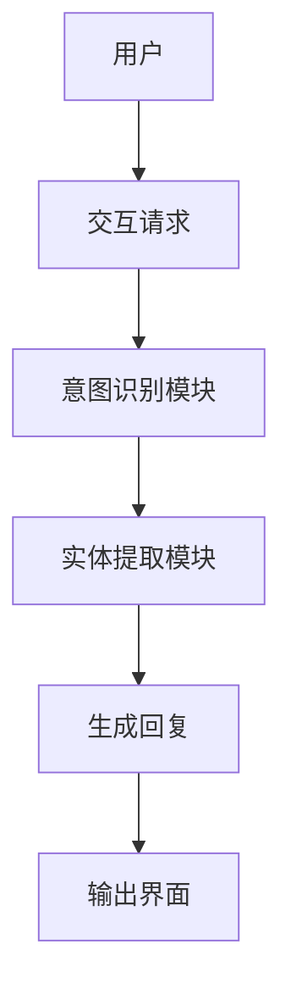
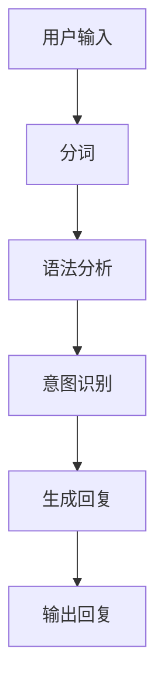
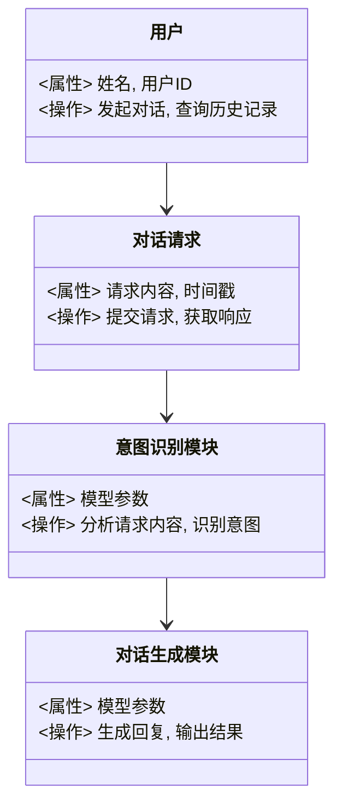
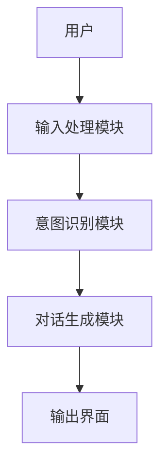

                 


# 打造用户友好的AI Agent交互界面

**关键词**：AI Agent、人机交互、自然语言处理、用户界面设计、交互算法、系统架构、用户体验

**摘要**：  
在人工智能迅速发展的今天，AI Agent（智能体）作为人机交互的核心形式，其交互界面设计直接影响用户体验和应用效果。本文从AI Agent的基本概念出发，详细探讨其交互界面设计的核心原理、算法实现、系统架构及最佳实践，旨在为开发者提供一套打造用户友好的AI Agent交互界面的方法论。文章通过逻辑清晰的章节划分，结合实际案例和代码示例，全面解析AI Agent交互界面的设计过程，帮助读者从理论到实践掌握相关技术。

---

## 第一部分：AI Agent交互界面的背景与挑战

### 第1章：AI Agent交互界面的背景与挑战

#### 1.1 AI Agent的基本概念

##### 1.1.1 AI Agent的定义  
AI Agent（人工智能代理）是一种能够感知环境并采取行动以实现目标的智能系统。它可以理解用户需求、执行任务并提供反馈，是连接用户与AI技术的桥梁。

##### 1.1.2 AI Agent的类型  
AI Agent可以分为以下几类：  
- **基于规则的AI Agent**：通过预定义的规则进行决策，适用于简单任务。  
- **基于统计的AI Agent**：利用概率模型进行预测和决策，适用于数据驱动的任务。  
- **基于学习的AI Agent**：通过机器学习模型不断优化行为，适用于复杂场景。  

##### 1.1.3 AI Agent的应用场景  
AI Agent广泛应用于智能助手、客服系统、智能家居、自动驾驶等领域，为用户提供智能化服务。

#### 1.2 用户交互界面的重要性

##### 1.2.1 交互界面的基本概念  
交互界面是用户与AI Agent之间的媒介，直接影响用户的操作体验和满意度。

##### 1.2.2 用户友好的界面特征  
- 简洁直观：界面设计简洁，操作逻辑清晰。  
- 反馈及时：系统能够快速响应用户输入并提供反馈。  
- 个性化：根据用户需求提供定制化服务。  

##### 1.2.3 AI Agent交互界面的独特性  
AI Agent的交互界面不仅是信息的展示窗口，更是自然语言处理和智能决策的结合体。

#### 1.3 当前AI Agent交互界面的挑战

##### 1.3.1 用户体验的问题  
- 交互延迟：AI Agent对用户输入的响应速度不够快。  
- 意图理解错误：AI Agent无法准确理解用户的意图。  
- 反馈不明确：系统反馈的信息不够直观，用户难以理解。  

##### 1.3.2 技术实现的难点  
- **自然语言处理**：如何提高意图识别的准确率。  
- **对话生成**：如何生成自然且符合上下文的回复。  
- **实时性**：如何在高并发场景下保证交互的实时性。  

##### 1.3.3 市场需求的变化  
随着市场竞争的加剧，用户对AI Agent交互界面的要求越来越高，推动技术不断优化。

#### 1.4 本章小结  
本章从AI Agent的基本概念出发，分析了交互界面的重要性及其面临的挑战，为后续章节的深入讨论奠定了基础。

---

## 第二部分：AI Agent交互界面的核心概念与联系

### 第2章：AI Agent交互界面的核心概念与联系

#### 2.1 人机交互的核心原理

##### 2.1.1 人机交互的基本模型  
人机交互的基本模型包括输入、处理、输出三个阶段。AI Agent作为中间层，负责接收用户输入、处理请求并生成输出。

##### 2.1.2 用户需求分析方法  
- **用户画像**：通过用户调研和数据分析，构建用户画像。  
- **需求优先级**：根据用户需求的紧急性和重要性进行排序。  

##### 2.1.3 交互设计的流程  
1. **需求分析**：明确用户需求和使用场景。  
2. **设计草图**：绘制交互流程图和界面原型。  
3. **用户测试**：收集用户反馈并优化设计。  

#### 2.2 自然语言处理在交互中的作用

##### 2.2.1 NLP的基本原理  
自然语言处理（NLP）通过词法分析、句法分析和语义理解，帮助AI Agent理解用户输入的内容。

##### 2.2.2 NLP在对话中的应用  
- **意图识别**：识别用户的意图，例如“查询天气”或“预订机票”。  
- **实体识别**：提取用户输入中的关键信息，例如日期、地点等。  
- **对话管理**：根据上下文生成连贯的对话。

##### 2.2.3 NLP的挑战与优化  
- **数据稀疏性**：如何处理数据不足的情况。  
- **语境理解**：如何在复杂场景下准确理解用户意图。  

#### 2.3 AI Agent的交互机制

##### 2.3.1 交互流程的分解  
1. 用户输入：用户通过文本或语音形式发送请求。  
2. 输入处理：AI Agent接收输入并进行解析。  
3. 意图识别：系统分析用户的意图。  
4. 生成回复：系统根据意图生成回复内容。  
5. 反馈输出：系统将回复返回给用户。  

##### 2.3.2 交互中的反馈机制  
- **即时反馈**：用户输入后，系统立即响应。  
- **上下文记忆**：系统记录对话历史，提供连贯的交互体验。  

##### 2.3.3 交互中的错误处理  
- **错误检测**：识别用户输入中的错误或歧义。  
- **错误提示**：向用户明确提示错误并提供解决方案。  

#### 2.4 核心概念对比分析

##### 2.4.1 交互界面与传统界面的对比  
| 特性               | 传统界面                     | AI Agent交互界面         |  
|--------------------|------------------------------|--------------------------|  
| 输入方式           | 文本输入                     | 文本/语音输入           |  
| 响应方式           | 静态展示                     | 动态交互                 |  
| 智能性             | 无                          | 高                      |  

##### 2.4.2 AI Agent与传统软件的对比  
| 特性               | 传统软件                     | AI Agent                 |  
|--------------------|------------------------------|--------------------------|  
| 核心功能           | 固定功能                     | 动态交互                 |  
| 用户交互           | 单向操作                     | 双向交互                 |  
| 智能性             | 无                          | 高                      |  

##### 2.4.3 不同交互模式的优缺点  
| 模式               | 优点                         | 缺点                       |  
|--------------------|------------------------------|--------------------------|  
| 基于规则的交互     | 实现简单                     | 适应性差                 |  
| 基于统计的交互     | 适应性强                     | 需大量数据训练           |  
| 基于学习的交互     | 高度智能                     | 开发复杂                 |  

#### 2.5 ER实体关系图  


#### 2.6 本章小结  
本章通过分析人机交互的核心原理、NLP的作用以及AI Agent的交互机制，帮助读者理解AI Agent交互界面的设计要点。

---

## 第三部分：AI Agent交互界面的算法原理

### 第3章：AI Agent交互界面的算法原理

#### 3.1 自然语言处理算法

##### 3.1.1 分词算法  
分词是将用户输入的文本分割成有意义的词语或短语。常用的分词算法包括基于规则的分词和基于统计的分词。

##### 3.1.2 语法分析算法  
语法分析是对文本的语法结构进行分析，帮助系统理解句子的结构和关系。

##### 3.1.3 意图识别算法  
意图识别是通过分析用户的输入内容，确定用户的意图。常用的算法包括基于规则的意图识别和基于机器学习的意图识别。

#### 3.2 对话生成算法

##### 3.2.1 基于规则的对话生成  
基于规则的对话生成是通过预定义的规则和模板生成回复内容，适用于简单的对话场景。

##### 3.2.2 基于统计的对话生成  
基于统计的对话生成是通过统计学方法，分析大量的对话数据，生成符合统计规律的回复。

##### 3.2.3 基于深度学习的对话生成  
基于深度学习的对话生成是利用神经网络模型（如Transformer、GPT）生成回复内容，能够实现更自然的对话。

#### 3.3 基于深度学习的交互算法

##### 3.3.1 Transformer模型  
Transformer模型是一种基于注意力机制的神经网络模型，广泛应用于自然语言处理任务。

##### 3.3.2 BERT模型  
BERT模型是一种基于自监督学习的预训练模型，能够通过上下文理解生成连贯的回复。

##### 3.3.3 GPT模型  
GPT模型是一种基于生成式预训练的模型，能够生成高质量的自然语言文本。

#### 3.4 算法实现的流程图  


#### 3.5 代码实现示例

##### 3.5.1 使用Python实现简单的对话生成  
```python
import transformers

model = transformers.GPT2LMHeadModel.from_pretrained('gpt2')
tokenizer = transformers.GPT2Tokenizer.from_pretrained('gpt2')

def generate_response(input_text):
    inputs = tokenizer.encode(input_text, return_tensors='pt')
    outputs = model.generate(inputs, max_length=50, num_beams=5, temperature=0.7)
    response = tokenizer.decode(outputs[0], skip_special_tokens=True)
    return response

print(generate_response("今天天气怎么样？"))
```

##### 3.5.2 使用数学公式解释注意力机制  
$$\text{Attention}(Q, K, V) = \text{softmax}\left(\frac{QK^T}{\sqrt{d_k}}\right)V$$  
其中，$Q$、$K$、$V$分别是查询、键和值向量，$d_k$是键的维度。

#### 3.6 本章小结  
本章通过分析自然语言处理算法和对话生成算法，结合代码示例和数学公式，详细讲解了AI Agent交互界面的算法实现过程。

---

## 第四部分：AI Agent交互界面的系统架构设计

### 第4章：AI Agent交互界面的系统架构设计

#### 4.1 问题场景介绍

##### 4.1.1 项目背景  
本项目旨在设计一个用户友好的AI Agent交互界面，实现自然语言对话功能。

##### 4.1.2 项目目标  
- 提供高效的用户交互体验。  
- 实现准确的意图识别和对话生成。  
- 支持多种交互方式（文本/语音）。  

#### 4.2 系统功能设计

##### 4.2.1 领域模型设计  


##### 4.2.2 系统架构设计  


##### 4.2.3 系统接口设计  
- **输入接口**：接收用户的文本或语音输入。  
- **输出接口**：向用户展示系统的回复内容。  

#### 4.3 系统交互流程图  


#### 4.4 本章小结  
本章通过系统功能设计和架构设计，详细讲解了AI Agent交互界面的实现过程。

---

## 第五部分：AI Agent交互界面的项目实战

### 第5章：AI Agent交互界面的项目实战

#### 5.1 环境搭建

##### 5.1.1 安装必要的库  
```bash
pip install transformers
pip install numpy
pip install matplotlib
```

#### 5.2 核心代码实现

##### 5.2.1 对话生成模块的实现  
```python
import transformers

model = transformers.GPT2LMHeadModel.from_pretrained('gpt2')
tokenizer = transformers.GPT2Tokenizer.from_pretrained('gpt2')

def generate_response(input_text):
    inputs = tokenizer.encode(input_text, return_tensors='pt')
    outputs = model.generate(inputs, max_length=50, num_beams=5, temperature=0.7)
    response = tokenizer.decode(outputs[0], skip_special_tokens=True)
    return response

print(generate_response("今天天气怎么样？"))
```

##### 5.2.2 意图识别模块的实现  
```python
from sklearn.feature_extraction.text import TfidfVectorizer
from sklearn.naive_bayes import MultinomialNB

# 假设已经训练好意图分类模型
model = MultinomialNB()
vectorizer = TfidfVectorizer()

def predict_intent(text):
    X = vectorizer.fit_transform([text])
    y_pred = model.predict(X)
    return y_pred[0]

print(predict_intent("我需要预订一张去北京的机票。"))
```

#### 5.3 案例分析与详细解读

##### 5.3.1 案例分析  
以用户输入“我需要预订一张去北京的机票。”为例，系统首先通过意图识别模块识别出用户的意图是“预订机票”，然后调用对话生成模块生成回复内容：“请提供您的出发日期和返回日期。”

##### 5.3.2 代码实现解读  
- **输入处理**：接收用户的输入并进行预处理。  
- **意图识别**：使用TF-IDF和朴素贝叶斯算法进行意图分类。  
- **对话生成**：基于GPT模型生成回复内容。  

#### 5.4 项目小结  
本章通过实际案例和代码实现，详细讲解了AI Agent交互界面的设计和实现过程，帮助读者掌握项目实战技巧。

---

## 第六部分：AI Agent交互界面的最佳实践

### 第6章：AI Agent交互界面的最佳实践

#### 6.1 设计原则

##### 6.1.1 简洁性原则  
界面设计应简洁直观，避免过多的功能堆砌。

##### 6.1.2 一致性原则  
保持界面风格和操作逻辑的一致性，降低用户的认知负担。

##### 6.1.3 可扩展性原则  
设计时应考虑未来的扩展需求，便于功能的增加和优化。

#### 6.2 开发注意事项

##### 6.2.1 性能优化  
- **模型压缩**：通过模型剪枝和量化技术优化模型性能。  
- **缓存机制**：利用缓存技术减少重复计算。  

##### 6.2.2 错误处理  
- **输入校验**：在用户输入前进行校验，避免无效请求。  
- **异常处理**：在系统出现异常时，提供友好的错误提示。  

#### 6.3 未来发展趋势

##### 6.3.1 更智能的交互方式  
随着技术的进步，AI Agent的交互方式将更加智能化，支持更复杂的对话场景。

##### 6.3.2 更个性化的服务  
AI Agent将提供更多个性化的服务，满足用户的多样化需求。

##### 6.3.3 更广泛的应用场景  
AI Agent的应用场景将进一步扩展，涵盖更多的领域和行业。

#### 6.4 本章小结  
本章总结了AI Agent交互界面的设计原则和开发注意事项，并展望了未来的发展趋势。

---

## 附录：AI Agent交互界面开发工具推荐

- **NLP工具**：spaCy、NLTK  
- **深度学习框架**：TensorFlow、PyTorch  
- **对话生成库**：Hugging Face Transformers  

---

**作者：AI天才研究院/AI Genius Institute & 禅与计算机程序设计艺术 /Zen And The Art of Computer Programming**

