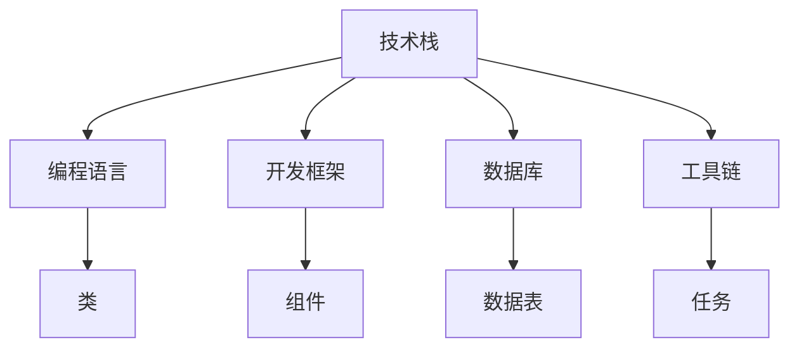
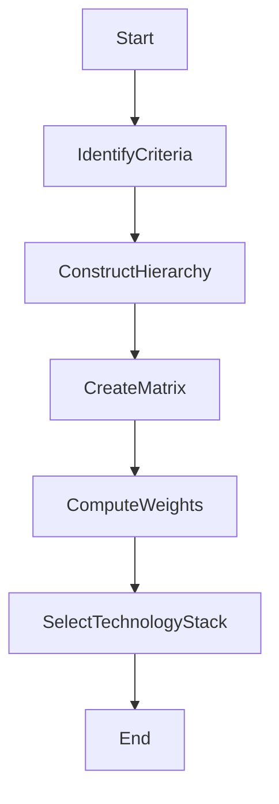
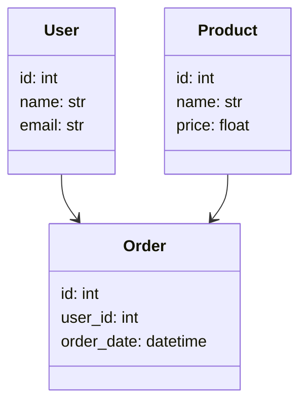
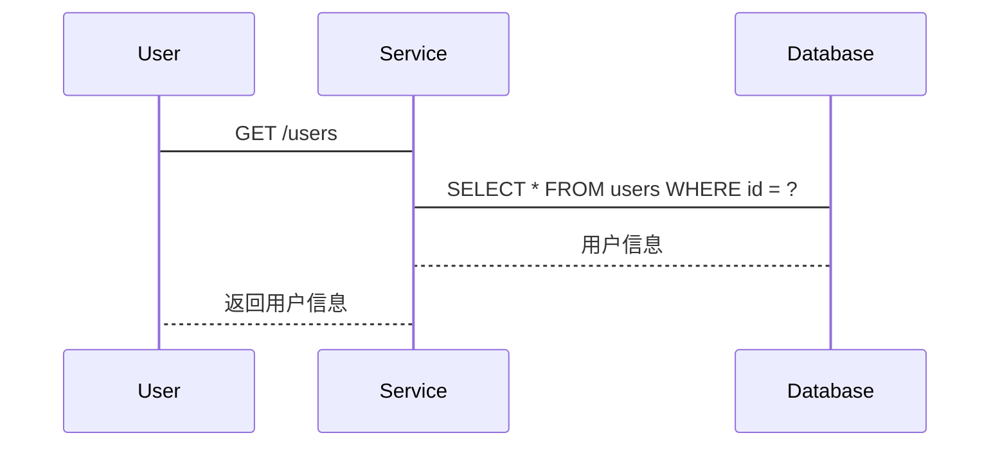

                 


# 技术栈选择与评估

> 关键词：技术栈选择、评估标准、编程语言、框架、工具、系统架构、开发效率、系统性能、安全性、成本效益

> 摘要：  
技术栈的选择与评估是软件开发中的关键环节，直接影响项目的成功与否。本文系统地探讨了技术栈的核心概念、选择标准、评估方法、系统架构设计以及实际案例分析，旨在为读者提供全面的指导，帮助他们在项目中做出明智的技术决策。通过详细分析技术栈的构成要素、评估维度和方法论，结合实际项目案例，本文为技术栈的选择与优化提供了深入的见解和实用的建议。

---

# 目录

1. [技术栈选择与评估的背景与重要性](#技术栈选择与评估的背景与重要性)
   - 1.1 [技术栈的定义与核心要素](#技术栈的定义与核心要素)
   - 1.2 [技术栈选择与评估的必要性](#技术栈选择与评估的必要性)
   - 1.3 [当前技术栈发展的趋势与挑战](#当前技术栈发展的趋势与挑战)
   - 1.4 [本章小结](#本章小结)

2. [技术栈选择与评估的核心概念](#技术栈选择与评估的核心概念)
   - 2.1 [技术栈的选择标准](#技术栈的选择标准)
   - 2.2 [技术栈的评估维度](#技术栈的评估维度)
   - 2.3 [技术栈的生命周期管理](#技术栈的生命周期管理)
   - 2.4 [核心概念对比表](#核心概念对比表)
   - 2.5 [技术栈实体关系图](#技术栈实体关系图)

3. [技术栈选择与评估的算法原理](#技术栈选择与评估的算法原理)
   - 3.1 [层次分析法（AHP）](#层次分析法AHP)
   - 3.2 [评估模型的数学表达](#评估模型的数学表达)
   - 3.3 [算法流程图](#算法流程图)
   - 3.4 [Python代码实现](#Python代码实现)

4. [技术栈选择与评估的系统架构设计](#技术栈选择与评估的系统架构设计)
   - 4.1 [系统功能设计](#系统功能设计)
   - 4.2 [系统架构设计](#系统架构设计)
   - 4.3 [系统接口设计](#系统接口设计)
   - 4.4 [系统交互设计](#系统交互设计)

5. [技术栈选择与评估的项目实战](#技术栈选择与评估的项目实战)
   - 5.1 [项目背景与目标](#项目背景与目标)
   - 5.2 [环境安装与配置](#环境安装与配置)
   - 5.3 [核心代码实现](#核心代码实现)
   - 5.4 [案例分析与结果解读](#案例分析与结果解读)
   - 5.5 [项目总结](#项目总结)

6. [技术栈选择与评估的最佳实践](#技术栈选择与评估的最佳实践)
   - 6.1 [选择技术栈的注意事项](#选择技术栈的注意事项)
   - 6.2 [持续优化与演进](#持续优化与演进)
   - 6.3 [团队协作与知识共享](#团队协作与知识共享)
   - 6.4 [技术生态的关注](#技术生态的关注)

7. [技术栈选择与评估的小结](#技术栈选择与评估的小结)
   - 7.1 [核心内容回顾](#核心内容回顾)
   - 7.2 [未来趋势展望](#未来趋势展望)
   - 7.3 [读者思考与实践](#读者思考与实践)

8. [注意事项与拓展阅读](#注意事项与拓展阅读)
   - 8.1 [常见问题解答](#常见问题解答)
   - 8.2 [推荐书籍与资源](#推荐书籍与资源)
   - 8.3 [进一步学习的方向](#进一步学习的方向)

---

## 详细章节内容

### 1. 技术栈选择与评估的背景与重要性

#### 1.1 技术栈的定义与核心要素

**技术栈**是指在软件开发过程中所使用的一系列技术和工具的组合，包括编程语言、开发框架、数据库、工具链等。技术栈的构成直接影响项目的开发效率、系统性能和维护成本。

- **编程语言**：如Java、Python、JavaScript，是系统实现的基础。
- **开发框架**：如Spring、Django、React，提供代码复用和结构化支持。
- **数据库**：如MySQL、MongoDB、Redis，用于数据存储与管理。
- **工具链**：如Git、Docker、Jenkins，用于版本控制、容器化和CI/CD。

#### 1.2 技术栈选择与评估的必要性

选择合适的技术栈可以提高开发效率、降低维护成本、提升系统性能。然而，技术栈的选择需要综合考虑团队能力、项目需求和未来扩展性。

- **团队能力**：团队是否熟悉某种技术栈直接影响开发效率。
- **项目需求**：不同的项目对性能、可扩展性、安全性有不同的要求。
- **未来扩展性**：技术栈的选择需要考虑未来的技术演进和升级成本。

#### 1.3 当前技术栈发展的趋势与挑战

当前技术栈的发展趋势包括：

- **微服务架构**：提高系统的可扩展性和可维护性。
- **容器化技术**：如Docker，便于部署和管理。
- **云原生技术**：支持云计算环境的开发和部署。

挑战包括：

- **技术更新换代快**：需要持续学习和更新。
- **技术栈的兼容性**：不同技术栈之间的集成和协作。
- **安全性问题**：技术栈的安全性直接影响系统的稳定性。

#### 1.4 本章小结

本章介绍了技术栈的定义和核心要素，探讨了选择技术栈的必要性，分析了当前技术栈的发展趋势和挑战，为后续章节奠定了基础。

---

### 2. 技术栈选择与评估的核心概念

#### 2.1 技术栈的选择标准

选择技术栈时，需要考虑以下几个标准：

- **技术成熟度**：技术是否经过验证，是否有稳定的社区支持。
- **性能**：技术是否满足系统的性能需求。
- **安全性**：技术是否符合安全规范，能否抵御常见的安全攻击。
- **成本**：技术的 licensing 成本和维护成本。

#### 2.2 技术栈的评估维度

评估技术栈时，需要从多个维度进行综合考量：

- **功能需求匹配度**：技术是否满足项目的核心功能需求。
- **开发效率**：技术是否提高开发效率，降低开发成本。
- **系统维护与升级成本**：技术的维护成本和升级难度。
- **未来技术演进的兼容性**：技术是否能够适应未来的技术发展。

#### 2.3 技术栈的生命周期管理

技术栈的选择不是一劳永逸的，需要进行持续的管理：

- **技术选型的决策过程**：结合项目需求、团队能力和预算进行选择。
- **技术评估的方法论**：通过对比分析、试用等方式进行评估。
- **技术栈的迭代与优化**：根据项目反馈和技术发展进行优化。

#### 2.4 核心概念对比表

以下表格对比了不同技术栈的核心要素：

| 技术要素     | Java 技术栈       | Python 技术栈       | JavaScript 技术栈     |
|--------------|-------------------|---------------------|-----------------------|
| 编程语言      | Java              | Python              | JavaScript            |
| 开发框架      | Spring            | Django              | React, Angular        |
| 数据库        | MySQL             | PostgreSQL          | MongoDB               |
| 工具链        | Maven, Jenkins    | pip, virtualenv      | npm, yarn             |

#### 2.5 技术栈实体关系图

以下是一个技术栈的实体关系图：



---

### 3. 技术栈选择与评估的算法原理

#### 3.1 层次分析法（AHP）

层次分析法是一种用于多准则决策的分析方法，适用于技术栈的选择。

- **步骤1**：构建决策层次结构。
- **步骤2**：建立判断矩阵。
- **步骤3**：计算权重。

#### 3.2 评估模型的数学表达

层次分析法的数学模型如下：

$$
A = \begin{bmatrix}
a_{11} & a_{12} & \cdots & a_{1n} \\
a_{21} & a_{22} & \cdots & a_{2n} \\
\vdots & \vdots & \ddots & \vdots \\
a_{n1} & a_{n2} & \cdots & a_{nn}
\end{bmatrix}
$$

其中，$a_{ij}$ 表示第 $i$ 个准则对第 $j$ 个方案的重要性。

#### 3.3 算法流程图

以下是一个层次分析法的流程图：



#### 3.4 Python代码实现

以下是一个简单的层次分析法的Python实现示例：

```python
import numpy as np

def calculate_weights(matrix):
    # 计算权重
    eigenvalues, eigenvectors = np.linalg.eigh(matrix)
    weights = eigenvectors[:, np.argmax(eigenvalues)]
    return weights / np.sum(weights)

# 判断矩阵
matrix = np.array([
    [1, 3, 2],
    [1/3, 1, 2/3],
    [1/2, 3/2, 1]
])

weights = calculate_weights(matrix)
print(weights)
```

---

### 4. 技术栈选择与评估的系统架构设计

#### 4.1 系统功能设计

系统功能设计包括：

- **领域模型**：如电商系统中的订单、用户、商品等。
- **架构图**：如分层架构、微服务架构。

#### 4.2 系统架构设计

以下是一个微服务架构的类图：



#### 4.3 系统接口设计

系统接口设计包括：

- **RESTful API**：如`GET /users`, `POST /orders`。
- **序列图**：描述系统交互过程。

#### 4.4 系统交互设计

以下是一个系统交互的序列图：



---

### 5. 技术栈选择与评估的项目实战

#### 5.1 项目背景与目标

以一个在线教育平台为例，选择合适的技术栈。

#### 5.2 环境安装与配置

安装步骤：

1. 安装Python和JDK。
2. 安装Docker和Kubernetes。
3. 配置开发环境。

#### 5.3 核心代码实现

核心代码实现：

```python
from flask import Flask

app = Flask(__name__)

@app.route('/')
def home():
    return 'Welcome to Online Education Platform!'
```

#### 5.4 案例分析与结果解读

分析代码运行结果，优化性能。

#### 5.5 项目总结

总结项目中的技术选择和评估经验。

---

### 6. 技术栈选择与评估的最佳实践

#### 6.1 选择技术栈的注意事项

- **避免盲目跟风**：选择适合项目需求的技术。
- **考虑团队能力**：选择团队熟悉的技术。

#### 6.2 持续优化与演进

- 定期评估技术栈，进行优化。

#### 6.3 团队协作与知识共享

- 鼓励团队成员分享技术经验。

#### 6.4 技术生态的关注

- 关注技术栈的生态系统和技术支持。

---

### 7. 技术栈选择与评估的小结

#### 7.1 核心内容回顾

总结技术栈选择与评估的核心内容。

#### 7.2 未来趋势展望

预测未来技术栈的发展趋势。

#### 7.3 读者思考与实践

鼓励读者结合实际项目进行思考和实践。

---

### 8. 注意事项与拓展阅读

#### 8.1 常见问题解答

解答读者在技术栈选择与评估中的常见问题。

#### 8.2 推荐书籍与资源

推荐相关的书籍和技术资源。

#### 8.3 进一步学习的方向

建议读者进一步学习技术栈相关的内容。

---

作者：AI天才研究院/AI Genius Institute & 禅与计算机程序设计艺术/Zen And The Art of Computer Programming

---

希望这个目录大纲能满足您的需求。如果需要进一步调整或补充，请随时告知！

