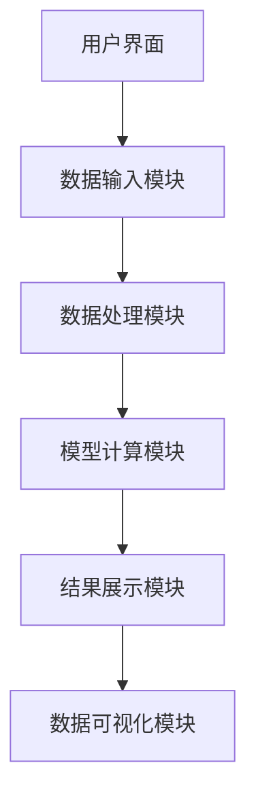
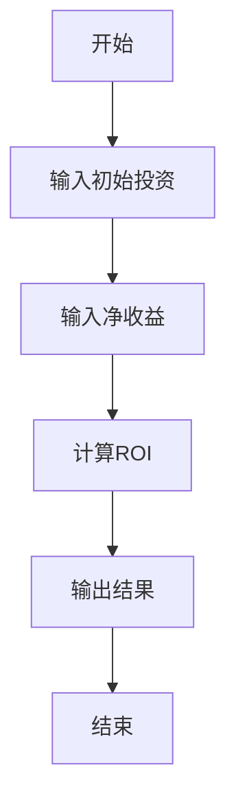

                 


# 投资回报率分析工具

> 关键词：投资回报率（ROI）、财务分析、投资决策、项目评估、数据分析工具、可视化

> 摘要：本文深入探讨投资回报率（ROI）分析工具的原理、实现和应用，结合实际案例，详细讲解如何选择和使用合适的工具进行投资决策，帮助读者掌握ROI分析的核心方法和技巧。

---

## 第一部分: 投资回报率分析工具的背景与基础

### 第1章: 投资回报率（ROI）的基本概念

#### 1.1 ROI的定义与计算方法

##### 1.1.1 ROI的定义
投资回报率（ROI）是衡量投资效率和收益能力的核心指标，表示每单位投资所获得的净收益。其计算公式为：
$$ ROI = \frac{\text{净收益}}{\text{投资成本}} \times 100\% $$

##### 1.1.2 ROI的计算公式与应用场景
 ROI不仅用于财务分析，还可应用于项目评估、资产配置等领域。例如，在评估投资项目时，ROI帮助决策者判断投资的盈利能力。

##### 1.1.3 ROI与NPV的对比
净现值（NPV）衡量的是未来现金流的现值，而ROI关注的是相对回报。两者相辅相成，NPV适用于评估规模，ROI适用于评估效率。

#### 1.2 ROI分析的重要性

##### 1.2.1 投资决策中的关键指标
ROI帮助投资者评估不同项目的风险和收益，是资本预算决策的重要工具。

##### 1.2.2 ROI在财务管理中的作用
ROI不仅用于项目评估，还用于绩效考核和资本分配，是企业优化资源配置的关键指标。

##### 1.2.3 ROI与投资风险的关系
高ROI的项目未必风险低，需结合标准差、贝塔系数等指标全面评估。

#### 1.3 ROI的分析边界与外延

##### 1.3.1 ROI分析的适用范围
适用于资本密集型和技术型项目，尤其适合初创企业评估新项目可行性。

##### 1.3.2 ROI的局限性
ROI未考虑时间价值和风险，无法反映项目的资金流动性，且可能忽视规模差异。

##### 1.3.3 ROI与其他指标的协同作用
结合NPV、IRR等指标，可全面评估项目的经济价值和可行性。

### 第2章: ROI分析工具的核心概念与联系

#### 2.1 ROI分析工具的核心原理

##### 2.1.1 数据输入与处理流程
 ROI分析工具通常接收初始投资、净收益、时间跨度等输入，计算净现值和投资回收期，最终得出ROI。

##### 2.1.2 ROI计算的逻辑框架
工具通过数据处理、模型计算和结果展示，帮助用户快速评估投资价值。

##### 2.1.3 工具的输出结果与可视化
输出包括ROI数值、图表和报告，直观展示分析结果。

#### 2.2 ROI分析工具的核心属性对比

##### 2.2.1 工具类型对比表格
以下是比较不同工具的特性：

```plaintext
| 工具类型 | 界面友好度 | 计算复杂度 | 输出结果 |
|----------|------------|------------|----------|
| Excel    | 较低       | 简单       | 表格/图表|
| Python   | 较低       | 高         | 数据结构|
| 专业软件  | 高         | 高         | 报告/仪表盘|
```

#### 2.3 ROI分析工具的ER实体关系图

以下是一个简化的ER图，展示ROI分析的核心实体关系：

```mermaid
erd
  实体: 投资项目
  实体: 财务数据
  实体: 分析结果
  关系: 投资项目与财务数据（1:1）
  关系: 财务数据与分析结果（1:1）
```

---

## 第二部分: 投资回报率分析工具的分析方法

### 第3章: ROI分析的定性与定量方法

#### 3.1 定性分析方法

##### 3.1.1 项目背景与战略契合度
评估项目是否符合企业战略目标，是否具有市场潜力和竞争优势。

##### 3.1.2 风险评估与缓解策略
分析项目可能面临的技术、市场和运营风险，并制定应对措施。

##### 3.1.3 项目管理能力评估
评估团队的能力和经验，确保项目执行的可行性。

#### 3.2 定量分析方法

##### 3.2.1 投资回收期计算
通过公式：$投资回收期 = \frac{\text{初始投资}}{\text{年均净收益}}$，判断项目回收初始投资所需的时间。

##### 3.2.2 净现值（NPV）计算
使用贴现率计算未来现金流的现值总和，判断项目的价值。

##### 3.2.3 内部收益率（IRR）计算
通过现金流的现值等于零时的贴现率，评估项目吸引力。

### 第4章: ROI分析工具的选择与使用

#### 4.1 工具选择的原则

##### 4.1.1 易用性
界面友好，操作简单，适合非专业用户使用。

##### 4.1.2 功能全面性
支持多种分析方法和数据可视化，满足复杂分析需求。

##### 4.1.3 成本效益
根据预算和需求选择工具，确保性价比高。

#### 4.2 工具的使用步骤

##### 4.2.1 数据准备
收集初始投资、净收益、时间跨度等数据，确保数据准确性和完整性。

##### 4.2.2 模型构建
选择合适的分析模型，配置参数，进行计算。

##### 4.2.3 结果分析
解读计算结果，结合定性分析，评估项目可行性。

---

## 第三部分: 投资回报率分析工具的技术实现

### 第5章: ROI分析工具的技术架构

#### 5.1 系统功能设计

##### 5.1.1 数据输入模块
支持用户输入初始投资、预期收益、时间跨度等数据。

##### 5.1.2 模型计算模块
实现ROI、NPV、IRR等多种计算模型，提供结果输出。

##### 5.1.3 数据可视化模块
通过图表展示分析结果，帮助用户直观理解数据。

#### 5.2 系统架构设计

以下是一个简化的系统架构图：



### 第6章: ROI分析工具的算法实现

#### 6.1 ROI计算算法

##### 6.1.1 算法流程图



##### 6.1.2 Python实现代码

```python
def calculate ROI(initial Investment, net Profit):
    return (net Profit / initial Investment) * 100

# 示例
initial_Investment = 100000
net_Profit = 50000
roi = calculate_ROI(initial_Investment, net_Profit)
print(f"ROI: {roi}%")
```

#### 6.2 NPV计算算法

##### 6.2.1 NPV计算公式

$$ NPV = \sum_{t=1}^{n} \frac{CF_t}{(1 + r)^t} $$

其中，CF_t为第t年的现金流，r为贴现率。

##### 6.2.2 NPV计算的Python实现

```python
def calculate_NPV(cash_flows, discount_rate):
    npv = 0
    for t, cf in enumerate(cash_flows, 1):
        npv += cf / (1 + discount_rate) ** t
    return npv

# 示例
cash_flows = [ -100000, 30000, 30000, 30000, 30000 ]
discount_rate = 0.1
npv = calculate_NPV(cash_flows, discount_rate)
print(f"NPV: {npv}")
```

---

## 第四部分: 投资回报率分析工具的项目实战

### 第7章: 项目实战与案例分析

#### 7.1 项目背景与目标

##### 7.1.1 项目背景
某企业计划投资开发新产品，需评估项目可行性。

##### 7.1.2 项目目标
通过ROI、NPV等指标评估项目盈利能力。

#### 7.2 数据收集与处理

##### 7.2.1 数据来源
包括市场调研、财务报表和行业分析报告。

##### 7.2.2 数据清洗
处理缺失值和异常值，确保数据准确性。

#### 7.3 分析过程与结果

##### 7.3.1 ROI计算
初始投资为100万元，预计年净收益为50万元，ROI为50%。

##### 7.3.2 NPV计算
贴现率为10%，NPV为正，说明项目具有投资价值。

##### 7.3.3 投资回收期
计算得出投资回收期为3年，符合企业预期。

#### 7.4 案例分析与解读

##### 7.4.1 ROI结果解读
50%的ROI表明项目盈利能力强，但需考虑风险因素。

##### 7.4.2 NPV结果解读
正NPV表明项目未来现金流现值超过初始投资，具有投资价值。

##### 7.4.3 综合分析
结合ROI、NPV和投资回收期，全面评估项目可行性。

### 第8章: 项目小结与经验分享

#### 8.1 项目成果
通过分析工具，企业确认项目具有较高的投资回报率和可行性。

#### 8.2 经验总结
选择合适的工具和方法，结合定性与定量分析，全面评估项目风险和收益。

#### 8.3 注意事项
注意数据的准确性和完整性，避免模型假设不合理导致的偏差。

---

## 第五部分: 投资回报率分析工具的最佳实践

### 第9章: 工具使用中的注意事项

#### 9.1 工具选择
根据企业需求和预算，选择适合的工具，确保功能满足分析需求。

#### 9.2 数据验证
通过交叉验证和敏感性分析，确保分析结果的准确性和可靠性。

#### 9.3 风险管理
结合风险评估，制定风险管理策略，降低投资风险。

### 第10章: 总结与展望

#### 10.1 总结
ROI分析工具是投资决策的重要辅助工具，帮助企业优化资源配置，提升投资效率。

#### 10.2 未来展望
随着人工智能和大数据技术的发展，ROI分析将更加智能化和自动化，为企业提供更精准的决策支持。

---

## 作者：AI天才研究院/AI Genius Institute & 禅与计算机程序设计艺术/Zen And The Art of Computer Programming

---

### 注意事项：
1. 本文章内容仅为示例，实际操作中请根据具体情况进行调整。
2. 如需引用，请注明出处。
3. 如有疑问或建议，请联系作者。

---

感谢您的阅读！希望本文能为您提供有价值的投资回报率分析工具的见解和方法。

