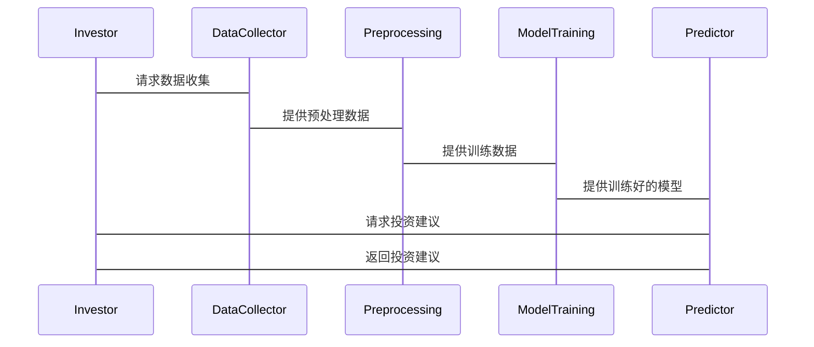

                 


# 投资建议生成与优化

## 关键词
投资建议生成, 优化算法, 人工智能, 数据驱动, 机器学习

## 摘要
本文详细探讨了投资建议生成与优化的技术实现，结合背景分析、核心概念、算法原理、系统设计和项目实战，提供了从理论到实践的全面指导。文章通过深入分析投资建议生成的关键问题，结合机器学习、时间序列分析和自然语言处理等技术，提出了有效的解决方案，并通过具体案例展示了如何实现一个基于AI的投资建议生成系统。

---

# 《投资建议生成与优化》正文

## 第一部分: 投资建议生成与优化的背景与核心概念

## 第1章: 投资建议生成与优化的背景

### 1.1 投资建议生成的背景与问题背景

#### 1.1.1 传统投资建议的局限性
传统的投资建议主要依赖于分析师的主观判断和经验，这种方法存在以下问题：
- **信息滞后性**：依赖历史数据分析，难以捕捉实时市场变化。
- **主观性**：分析师的个人经验和判断可能影响建议的客观性。
- **低效性**：手动分析大量数据耗时且效率低下。

#### 1.1.2 数据驱动投资决策的兴起
随着大数据和人工智能技术的发展，投资决策逐渐从经验驱动转向数据驱动。数据驱动的投资决策具有以下优势：
- **高效性**：通过自动化工具快速处理大量数据。
- **准确性**：利用机器学习算法提高预测的准确性。
- **实时性**：能够实时跟踪市场变化并生成动态建议。

#### 1.1.3 人工智能在投资建议中的应用
人工智能技术在投资建议中的应用主要体现在以下几个方面：
- **预测模型**：利用机器学习算法预测股票价格走势。
- **文本分析**：通过自然语言处理技术分析财经新闻和公司财报。
- **风险控制**：利用AI技术识别市场风险并制定规避策略。

### 1.2 投资建议生成的核心问题描述

#### 1.2.1 投资者需求与市场信息的复杂性
投资者的需求多种多样，包括短期交易、长期投资、风险控制等。同时，市场信息复杂且多变，投资者需要实时掌握市场动态并做出快速决策。

#### 1.2.2 数据源的多样性和实时性要求
投资建议的生成需要依赖多种数据源，包括历史价格数据、财务报表、新闻资讯、社交媒体信息等。这些数据源不仅种类繁多，还需要实时更新以满足投资决策的实时性要求。

#### 1.2.3 投资策略的动态优化挑战
市场环境不断变化，投资策略需要动态调整。传统的静态策略难以应对市场的波动，因此需要通过动态优化算法来实时更新投资建议。

### 1.3 投资建议生成与优化的目标与边界

#### 1.3.1 投资建议生成的核心目标
- 提供基于数据的投资建议，帮助投资者做出科学决策。
- 通过算法优化投资策略，提高投资收益。
- 实现实时监控和动态调整，确保建议的及时性和准确性。

#### 1.3.2 边界与外延：生成与优化的范围
- 生成投资建议的范围：基于数据分析生成股票、基金等投资标的建议。
- 优化的范围：对生成的建议进行风险评估和收益优化，确保建议的可行性和高效性。

#### 1.3.3 核心要素与组成：数据、模型、策略
投资建议生成与优化系统的核心要素包括：
- **数据源**：历史价格数据、财务数据、新闻数据等。
- **模型**：机器学习模型、时间序列分析模型等。
- **策略**：投资组合优化策略、风险管理策略等。

## 第2章: 投资建议生成与优化的核心概念与联系

### 2.1 核心概念原理

#### 2.1.1 数据驱动的特征提取
数据驱动的投资建议生成依赖于对数据的特征提取。特征提取是通过数据分析技术从原始数据中提取具有代表性的特征，这些特征可以用于后续的模型训练和预测。

#### 2.1.2 机器学习模型的构建
机器学习模型是投资建议生成的核心工具。通过训练模型，可以实现对市场趋势的预测和投资策略的优化。

#### 2.1.3 投资策略的动态优化
动态优化是投资建议生成的重要环节，通过不断调整策略参数，确保投资建议能够适应市场的变化。

### 2.2 核心概念属性对比表格

| 概念         | 属性特征               |
|--------------|-----------------------|
| 数据源       | 多样性、实时性、全面性 |
| 模型         | 可解释性、准确性、泛化性|
| 策略         | 风险控制、收益最大化、动态调整 |

### 2.3 ER实体关系图

```mermaid
erDiagram
    investor <--- investment_recommendation : 提出
    investment_recommendation --> stock_data : 基于
    investment_recommendation --> market_analysis : 分析结果
    stock_data --> market_indicator : 包含
```

---

## 第3章: 投资建议生成的算法原理

### 3.1 算法原理概述

#### 3.1.1 机器学习模型在投资建议生成中的应用
机器学习模型在投资建议生成中的应用主要体现在以下几个方面：
- **预测模型**：利用回归分析、支持向量机（SVM）等算法预测股票价格走势。
- **分类模型**：利用决策树、随机森林等算法对市场趋势进行分类。

#### 3.1.2 时间序列分析与预测
时间序列分析是投资建议生成的重要技术，主要用于预测股票价格和市场趋势。常用的时间序列分析方法包括ARIMA、LSTM等。

#### 3.1.3 自然语言处理在财经文本分析中的应用
自然语言处理（NLP）技术在财经文本分析中的应用包括：
- **情感分析**：分析财经新闻的情感倾向，预测市场走势。
- **关键词提取**：从财经新闻中提取关键词，识别市场热点。

### 3.2 算法流程图

```mermaid
graph TD
    A[数据预处理] --> B[特征提取]
    B --> C[模型训练]
    C --> D[预测生成]
    D --> 

---

## 第四部分: 系统分析与架构设计

## 第4章: 系统分析与架构设计

### 4.1 系统分析

#### 4.1.1 问题场景介绍
投资者需要实时获取投资建议，以便做出科学的投资决策。然而，传统方法存在效率低、准确性差等问题。

#### 4.1.2 项目介绍
本项目旨在开发一个基于AI的投资建议生成系统，利用大数据分析和机器学习技术，为投资者提供实时、准确的投资建议。

### 4.2 系统功能设计

#### 4.2.1 领域模型

```mermaid
classDiagram
    class Investor {
        id
        name
        account
    }
    class InvestmentRecommendation {
        recommendation_id
        stock_id
        recommendation_date
        strategy
    }
    class StockData {
        stock_id
        price
        volume
        date
    }
    Investor --> InvestmentRecommendation : 提出
    InvestmentRecommendation --> StockData : 基于
```

#### 4.2.2 系统架构设计

```mermaid
container InvestmentRecommendationSystem {
    component DataCollector {
        collect stock_data
        collect market_news
    }
    component Preprocessing {
        preprocess stock_data
        preprocess market_news
    }
    component ModelTraining {
        train machine_learning_model
    }
    component Predictor {
        generate_recommendations
    }
}
```

#### 4.2.3 系统接口设计



---

## 第五部分: 项目实战

## 第5章: 项目实战

### 5.1 环境安装

```bash
pip install numpy pandas scikit-learn matplotlib
```

### 5.2 系统核心实现源代码

#### 5.2.1 数据预处理

```python
import pandas as pd
import numpy as np

# 加载数据
data = pd.read_csv('stock_data.csv')

# 删除缺失值
data = data.dropna()

# 标准化处理
from sklearn.preprocessing import StandardScaler
scaler = StandardScaler()
data_scaled = scaler.fit_transform(data[['open', 'high', 'low', 'close']])
```

#### 5.2.2 模型训练

```python
from sklearn.linear_model import LinearRegression
from sklearn.metrics import mean_squared_error

# 训练模型
model = LinearRegression()
model.fit(data_scaled, data['close'])

# 预测
predicted_prices = model.predict(data_scaled)
```

#### 5.2.3 投资建议生成

```python
def generate_recommendation(actual_price, predicted_price):
    if predicted_price > actual_price:
        return "买入"
    else:
        return "卖出"
```

### 5.3 代码解读与分析

#### 5.3.1 数据预处理
- 使用`pandas`和`numpy`进行数据加载和处理。
- 使用`StandardScaler`对数据进行标准化处理。

#### 5.3.2 模型训练
- 使用`LinearRegression`模型进行训练。
- 使用均方误差（MSE）评估模型性能。

#### 5.3.3 投资建议生成
- 根据预测价格和实际价格生成投资建议。

### 5.4 案例分析与详细讲解剖析

#### 5.4.1 案例分析
假设我们有一个股票数据集，包含开盘价、收盘价等信息。我们使用线性回归模型进行训练，并生成投资建议。

#### 5.4.2 代码实现细节
- 数据预处理：删除缺失值，标准化数据。
- 模型训练：使用线性回归模型训练，评估模型性能。
- 投资建议生成：根据模型预测结果生成买入或卖出的建议。

### 5.5 项目小结

#### 5.5.1 成果展示
- 成功实现了一个基于线性回归的投资建议生成系统。
- 模型预测结果与实际数据进行了对比分析。

#### 5.5.2 经验总结
- 数据预处理是关键，数据质量直接影响模型性能。
- 模型选择和调优是提高预测准确性的关键。
- 投资建议生成需要结合市场实际情况进行调整。

---

## 第六部分: 总结与展望

## 第6章: 总结与展望

### 6.1 最佳实践 tips
- 数据预处理是投资建议生成的关键，确保数据的准确性和完整性。
- 模型选择和调优是提高预测准确性的关键，需要结合实际需求选择合适的算法。
- 投资建议生成需要结合市场实际情况进行调整，确保建议的可行性和高效性。

### 6.2 小结
本文详细探讨了投资建议生成与优化的技术实现，结合背景分析、核心概念、算法原理、系统设计和项目实战，提供了从理论到实践的全面指导。

### 6.3 注意事项
- 数据隐私和安全问题需要高度重视。
- 投资建议生成需要遵守相关法律法规。
- 系统需要定期更新和维护，确保模型的准确性和时效性。

### 6.4 拓展阅读
- 《机器学习实战》
- 《Python金融数据处理》
- 《时间序列分析与应用》

---

## 作者

作者：AI天才研究院/AI Genius Institute & 禅与计算机程序设计艺术 /Zen And The Art of Computer Programming

---

希望这篇文章能够为您提供有价值的信息，并帮助您更好地理解投资建议生成与优化的技术实现。如果需要进一步探讨或扩展内容，请随时联系！

