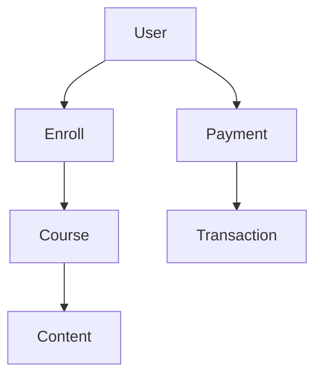
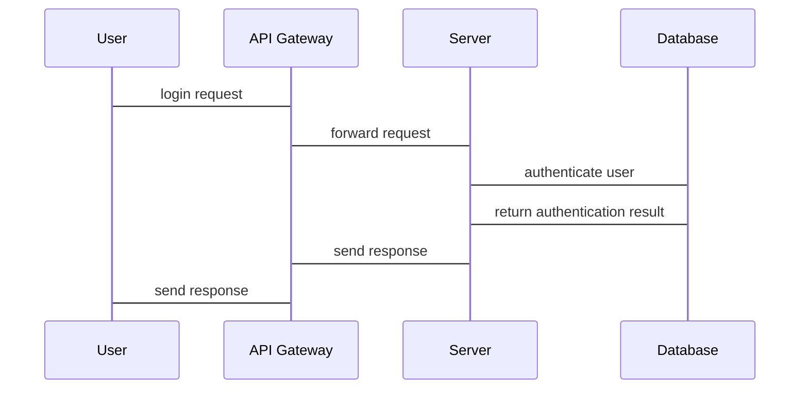

                 


# 《投资理财教育平台的集成》

> 关键词：投资理财教育、平台集成、推荐算法、系统架构、教育技术

> 摘要：本文详细探讨了投资理财教育平台的集成，从背景与目标、核心概念与联系、推荐算法原理、系统架构设计、项目实战到最佳实践，系统性地分析了投资理财教育平台的集成过程与技术实现。通过本文的讲解，读者能够全面理解投资理财教育平台的核心要素、算法原理、系统架构及实际应用案例，为构建高效的投资理财教育平台提供理论与实践指导。

---

# 第一章: 投资理财教育平台的背景与目标

## 1.1 投资理财教育的重要性

### 1.1.1 投资理财教育的核心概念

- **定义**：投资理财教育是指通过教育手段，帮助个人或机构掌握投资理财的基本知识、技能和策略，从而实现财富保值和增值。

- **关键术语**：
  - **投资者教育**：通过教育提升投资者的金融素养。
  - **理财规划**：制定科学的财务计划，实现财务目标。
  - **风险管理**：识别和管理投资中的风险。

### 1.1.2 投资理财教育的现状与挑战

- **现状**：
  - 传统教育模式：依赖线下课程和讲座，覆盖面有限。
  - 信息不对称：投资者难以获取高质量的教育资源。
  - 知识更新慢：金融市场的变化速度快，教育资源难以及时更新。

- **挑战**：
  - 教育资源分散：缺乏统一的平台整合优质教育资源。
  - 用户需求多样化：不同投资者的金融知识水平和需求差异大。
  - 技术支持不足：缺乏智能化的教育工具和个性化学习路径。

### 1.1.3 投资理财教育平台的必要性

- 提供统一的教育资源整合平台，解决信息分散问题。
- 通过智能化技术，实现个性化学习和精准推荐。
- 降低教育成本，扩大教育覆盖范围。

## 1.2 投资理财教育平台的定义与目标

### 1.2.1 平台的定义

- **定义**：投资理财教育平台是一个基于互联网的教育平台，通过整合优质教育资源，结合人工智能和大数据技术，为用户提供个性化的投资理财教育服务。

### 1.2.2 平台的目标与功能

- **目标**：
  - 提供高质量的投资理财教育资源。
  - 实现个性化学习路径。
  - 提供互动交流和实践机会。

- **功能**：
  - 用户注册与登录。
  - 课程推荐与订阅。
  - 在线学习与互动。
  - 成绩评估与反馈。

### 1.2.3 平台的边界与外延

- **边界**：
  - 界定平台的核心功能和范围。
  - 明确与其他系统的接口关系。

- **外延**：
  - 平台可能扩展的功能，如金融模拟交易、投资组合管理等。

## 1.3 本章小结

- 本章介绍了投资理财教育的重要性和必要性，定义了投资理财教育平台的目标与功能，并明确了平台的边界与外延。

---

# 第二章: 投资理财教育平台的核心要素

## 2.1 平台的核心概念

### 2.1.1 用户角色与权限

- **用户角色**：
  - 学生：注册用户，学习课程。
  - 教师：提供课程内容。
  - 管理员：管理平台和用户。

- **权限管理**：
  - 学生权限：访问课程、提交作业。
  - 教师权限：上传课程、管理学生。
  - 管理员权限：系统管理、数据监控。

### 2.1.2 内容模块与功能

- **内容模块**：
  - 课程模块：包括课程列表、课程详情、课程评价。
  - 资料模块：提供学习资料下载和在线阅读。

- **功能模块**：
  - 课程推荐：基于用户行为推荐课程。
  - 学习记录：记录用户的学习进度和成绩。

### 2.1.3 数据流与交互

- **数据流**：
  - 用户注册、登录。
  - 课程订阅、学习。
  - 成绩评估、反馈。

- **交互流程**：
  - 用户登录 → 课程推荐 → 课程订阅 → 学习过程 → 成绩反馈。

## 2.2 核心概念的属性对比

### 2.2.1 用户角色对比表

| 用户角色 | 权限       | 功能           |
|----------|------------|----------------|
| 学生     | 访问课程   | 学习课程       |
| 教师     | 上传课程   | 管理学生       |
| 管理员   | 系统管理   | 数据监控       |

### 2.2.2 内容模块对比表

| 模块     | 功能           | 示例内容         |
|----------|----------------|------------------|
| 课程模块 | 列表、详情、评价 | 投资基础课程     |
| 资料模块 | 下载、阅读     | 投资策略报告     |

## 2.3 ER实体关系图



## 2.4 本章小结

- 本章详细阐述了投资理财教育平台的核心概念，包括用户角色、内容模块和数据流的交互关系。

---

# 第三章: 投资理财教育平台的推荐算法

## 3.1 推荐算法的原理

### 3.1.1 基于协同过滤的推荐算法

- **协同过滤**：
  - 基于用户行为相似性推荐课程。
  - 常见的协同过滤算法有基于用户的协同过滤（UBCF）和基于物品的协同过滤（IBCF）。

### 3.1.2 基于内容的推荐算法

- **内容推荐**：
  - 基于课程内容的相似性推荐。
  - 通过文本挖掘技术提取课程特征。

### 3.1.3 混合推荐算法

- **混合推荐**：
  - 结合协同过滤和内容推荐的优势。
  - 通过加权融合两种算法的结果。

## 3.2 推荐算法的实现

### 3.2.1 用户行为分析

- **行为数据**：
  - 用户点击、浏览、订阅、购买行为。
  - 学习进度和课程完成情况。

### 3.2.2 内容特征提取

- **文本挖掘**：
  - 提取课程标题、描述和关键词。
  - 使用TF-IDF提取特征向量。

### 3.2.3 推荐结果生成

- **算法实现**：
  - 使用协同过滤算法生成推荐列表。
  - 基于内容相似性进行二次筛选。

## 3.3 推荐算法的数学模型

### 3.3.1 协同过滤模型

$$相似度 = \frac{\sum (r_{ui} - \bar{r_u})(r_{vi} - \bar{r_v})}{\sqrt{\sum (r_{ui} - \bar{r_u})^2} \sqrt{\sum (r_{vi} - \bar{r_v})^2}}$$

### 3.3.2 内容推荐模型

$$P(r) = \frac{\sum w_{ik} \cdot w_{kj}}{\sum w_{kj}}$$

## 3.4 本章小结

- 本章详细讲解了投资理财教育平台的推荐算法，包括协同过滤、内容推荐和混合推荐的原理与实现。

---

# 第四章: 投资理财教育平台的系统架构

## 4.1 系统功能设计

### 4.1.1 用户模块

- **功能**：
  - 用户注册与登录。
  - 个人信息管理。
  - 学习记录查看。

### 4.1.2 内容模块

- **功能**：
  - 课程推荐与订阅。
  - 学习资料下载与阅读。

### 4.1.3 交易模块

- **功能**：
  - 课程订阅支付。
  - 交易记录查询。

## 4.2 系统架构设计

### 4.2.1 系统架构图

```mermaid
graph LR
    Client --> API Gateway
    API Gateway --> Database
    Database --> Server
    Server --> Client
```

### 4.2.2 接口设计

- **API接口**：
  - 用户接口：`POST /api/users/login`
  - 内容接口：`GET /api/courses/recommended`
  - 交易接口：`POST /api/payments`

### 4.2.3 交互序列图



## 4.3 本章小结

- 本章详细设计了投资理财教育平台的系统架构，包括功能设计、架构图和交互序列图。

---

# 第五章: 投资理财教育平台的项目实战

## 5.1 环境安装

- **开发环境**：
  - 操作系统：Windows 10/ macOS 12.0以上。
  - 开发工具：IntelliJ IDEA/ PyCharm。
  - 依赖管理：Maven/ npm。

## 5.2 系统核心实现源代码

### 5.2.1 推荐算法实现

```python
class CollaborativeFiltering:
    def __init__(self):
        self.user_similarity = {}

    def calculate_similarity(self, user1, user2):
        # 计算用户相似度
        pass

    def recommend(self, user_id):
        # 基于协同过滤推荐
        pass
```

### 5.2.2 接口设计实现

```python
from flask import Flask, jsonify
from flask_restful import Resource, Api

app = Flask(__name__)
api = Api(app)

class CourseRecommendation(Resource):
    def get(self):
        # 返回推荐课程
        return jsonify({"courses": ["课程1", "课程2"]})

api.add_resource(CourseRecommendation, '/api/courses/recommended')

if __name__ == '__main__':
    app.run(debug=True)
```

## 5.3 案例分析与详细解读

- **案例分析**：
  - 用户A登录后，系统基于其行为推荐投资基础课程。
  - 用户完成课程后，系统记录学习进度并提供证书。

## 5.4 本章小结

- 本章通过实际案例分析，详细讲解了投资理财教育平台的环境安装和核心代码实现。

---

# 第六章: 投资理财教育平台的最佳实践

## 6.1 最佳实践 Tips

- **技术实现**：
  - 使用高效的推荐算法。
  - 优化系统架构，提升性能。

- **用户体验**：
  - 提供个性化的学习路径。
  - 优化界面设计，提升用户体验。

## 6.2 注意事项

- **数据安全**：
  - 加强用户数据保护。
  - 防止数据泄露和滥用。

## 6.3 拓展阅读

- **推荐书籍**：
  - 《Head First 设计模式》。
  - 《机器学习实战》。

## 6.4 本章小结

- 本章总结了投资理财教育平台的最佳实践，包括技术实现、用户体验和注意事项。

---

# 第七章: 小结

## 7.1 本文总结

- 本文详细探讨了投资理财教育平台的集成，从背景与目标、核心概念、推荐算法、系统架构到项目实战，全面分析了投资理财教育平台的实现过程。

## 7.2 未来展望

- 未来可以进一步研究更高效的推荐算法，优化系统架构，提升平台的智能化水平。

---

# 作者：AI天才研究院/AI Genius Institute & 禅与计算机程序设计艺术 /Zen And The Art of Computer Programming

