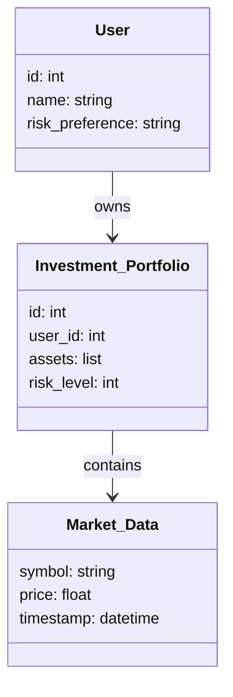
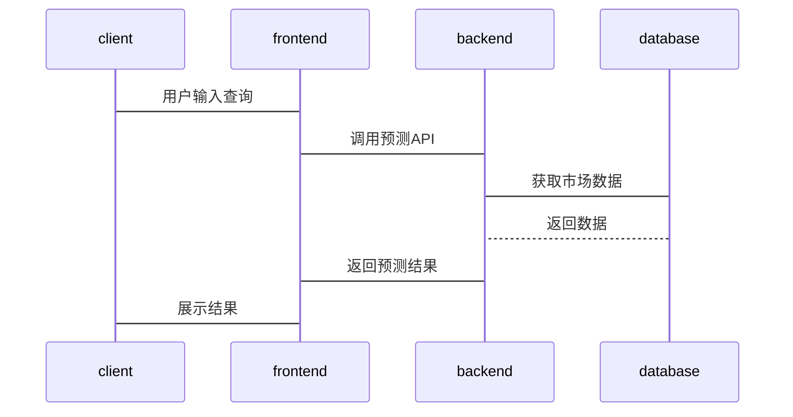

                 


# 投资理财智能助手的前端开发最佳实践

---

## 关键词：投资理财，智能助手，前端开发，用户交互，算法优化，系统架构

---

## 摘要：  
本文深入探讨了投资理财智能助手的前端开发最佳实践，从背景分析、核心概念到系统架构、算法实现，再到项目实战和最佳实践，全面解析如何构建高效、用户友好的投资理财智能助手。文章通过详细的理论分析和实际案例，结合前沿技术，为读者提供了从设计到实现的完整指南。

---

# 第一部分: 投资理财智能助手的背景与核心概念

## 第1章: 投资理财智能助手的背景与问题描述

### 1.1 投资理财智能助手的背景

#### 1.1.1 投资理财行业的数字化转型
近年来，随着金融科技的迅速发展，投资理财行业正在经历一场数字化转型。传统的投资理财服务逐渐被智能化、个性化的工具所取代，用户期望通过智能助手获取实时数据、个性化建议和便捷的操作体验。

#### 1.1.2 智能助手在投资理财中的作用
智能助手通过整合大数据、机器学习和自然语言处理技术，为用户提供个性化的投资建议、风险评估和市场分析。前端开发在其中扮演了关键角色，确保用户界面的直观性和交互的流畅性。

#### 1.1.3 前端开发在智能助手中的重要性
前端开发决定了用户与智能助手交互的第一印象。高效的前端架构、响应式设计和动态交互技术能够提升用户体验，增强用户粘性，进而提高投资理财工具的市场竞争力。

### 1.2 问题背景与描述

#### 1.2.1 投资者需求分析
投资者需要实时市场数据、个性化的投资组合建议、风险评估和便捷的操作工具。然而，传统投资工具往往缺乏个性化的支持，且界面复杂，难以满足用户需求。

#### 1.2.2 当前投资理财工具的痛点
- 数据更新延迟
- 用户界面复杂，操作不便
- 个性化建议不足
- 缺乏实时互动功能

#### 1.2.3 智能助手解决的核心问题
智能助手通过实时数据处理、个性化算法和自然语言理解，解决了传统工具的痛点，提供了更高效、更个性化的投资服务。

### 1.3 问题解决与边界定义

#### 1.3.1 智能助手的功能边界
智能助手的核心功能包括：实时市场数据获取、投资组合优化建议、风险评估和投资计划定制。此外，还包括用户身份验证、数据同步和交互日志记录。

#### 1.3.2 投资理财助手的核心目标
通过智能化算法，为用户提供最优的投资组合建议，实时监控市场动态，降低投资风险，提高投资收益。

#### 1.3.3 边界与外延分析
智能助手的边界包括前端交互、后端数据处理和第三方API调用。外延则涉及用户数据隐私保护、法律法规合规性和系统扩展性。

### 1.4 核心概念与组成

#### 1.4.1 智能助手的核心要素
- 数据采集与处理：实时获取市场数据，分析用户需求
- 个性化算法：基于用户风险偏好，生成投资建议
- 前端交互：直观展示数据，便捷操作

#### 1.4.2 前端开发的关键组成部分
- 用户界面设计：直观展示数据
- 动态交互技术：响应用户操作
- 性能优化：提升加载速度和响应时间

#### 1.4.3 核心概念的结构化分析
通过结构化分析，智能助手的前端部分包括数据可视化、用户交互和性能优化三个主要模块。

---

## 第2章: 投资理财智能助手与前端开发的关系

### 2.1 核心概念的原理

#### 2.1.1 智能助手的工作原理
智能助手通过分析用户输入和历史数据，调用后端服务生成投资建议，并通过前端界面展示结果。

#### 2.1.2 前端开发在智能助手中的角色
前端开发负责用户界面设计、交互逻辑实现和数据可视化，确保用户能够高效地与智能助手进行互动。

#### 2.1.3 两者结合的实现机制
前端与后端通过API进行数据交互，前端接收数据后进行处理和展示，实现智能化的投资建议生成。

### 2.2 核心概念的对比分析

#### 2.2.1 智能助手与传统投资工具的对比
智能助手通过智能化算法和实时数据处理，提供更精准和个性化的服务，而传统工具往往依赖人工操作，缺乏个性化。

#### 2.2.2 前端开发与后端开发的对比
前端开发关注用户体验和界面设计，而后端开发关注数据处理和业务逻辑实现。两者相辅相成，共同构建完整的投资理财工具。

#### 2.2.3 交互设计与用户体验的对比
优秀的交互设计能够显著提升用户体验，降低用户操作难度，从而提高用户满意度和工具的使用频率。

### 2.3 数据流与实体关系分析

#### 2.3.1 数据流的分析
数据从后端服务流向前端界面，前端处理用户输入并发送到后端进行处理，最终将结果反馈给用户。

#### 2.3.2 实体关系图的构建
通过构建ER图，明确用户、投资组合、市场数据等实体之间的关系，确保数据流的高效处理。

#### 2.3.3 数据模型的优化
通过优化数据模型，减少数据冗余，提高查询效率，确保智能助手的高效运行。

---

## 第3章: 前端开发在智能助手中的算法原理

### 3.1 算法原理概述

#### 3.1.1 基于决策树的投资组合优化算法
决策树是一种常用的分类算法，适用于投资组合优化问题。通过分析用户的风险偏好和市场数据，生成最优的投资组合。

#### 3.1.2 机器学习模型的实现
机器学习模型用于预测市场趋势和评估投资风险，前端通过调用后端服务获取预测结果，并展示给用户。

#### 3.1.3 算法实现的流程
数据预处理 → 特征提取 → 模型训练 → 模型预测 → 结果展示

### 3.2 算法实现的详细步骤

#### 3.2.1 数据预处理
对市场数据进行清洗和标准化处理，确保数据质量。

#### 3.2.2 特征提取
从历史数据中提取相关特征，如收益率、波动率等，用于模型训练。

#### 3.2.3 模型训练
使用机器学习算法（如随机森林、支持向量机）对数据进行训练，生成投资建议。

#### 3.2.4 模型预测
基于当前市场数据，预测未来市场趋势，生成投资组合建议。

#### 3.2.5 结果展示
将预测结果通过前端界面展示给用户，包括可视化图表和建议列表。

### 3.3 数学模型与公式

#### 3.3.1 投资组合收益公式
$$ R = \sum_{i=1}^{n} w_i \cdot r_i $$
其中，$w_i$是第i个资产的权重，$r_i$是第i个资产的收益率。

#### 3.3.2 风险评估公式
$$ \sigma = \sqrt{\sum_{i=1}^{n} w_i^2 \cdot \sigma_i^2} $$
其中，$\sigma_i$是第i个资产的收益率波动率。

### 3.4 算法实现的代码示例

```python
# 示例代码：基于决策树的投资组合优化
import numpy as np
from sklearn.tree import DecisionTreeRegressor

# 数据预处理
data = np.array([[0.1, 0.2], [0.3, 0.4], [0.5, 0.6]])
X = data[:, 0]
y = data[:, 1]

# 模型训练
model = DecisionTreeRegressor()
model.fit(X.reshape(-1, 1), y)

# 模型预测
new_X = np.array([[0.7]])
predicted_y = model.predict(new_X.reshape(-1, 1))
print(predicted_y)
```

---

## 第4章: 系统分析与架构设计方案

### 4.1 项目介绍

#### 4.1.1 项目背景
本项目旨在开发一个投资理财智能助手，通过前端界面为用户提供个性化的投资建议和市场分析。

### 4.2 系统功能设计

#### 4.2.1 领域模型类图


#### 4.2.2 系统架构设计
```mermaid
client --> frontend: 用户请求
frontend --> backend: 调用API
backend --> database: 获取数据
database --> Market_Data: 数据存储
backend <-- frontend: 返回结果
frontend <-- client: 展示结果
```

#### 4.2.3 接口设计
- `/api/portfolio`: 获取用户投资组合
- `/api/predict`: 预测市场趋势
- `/api/risk_assessment`: 评估投资风险

#### 4.2.4 交互序列图


---

## 第5章: 项目实战

### 5.1 环境安装

#### 5.1.1 安装必要的工具
- 安装Python、Jupyter Notebook、Git、Node.js、npm、React、Docker、PostgreSQL、Redis、Nginx

#### 5.1.2 安装前端开发框架
```bash
npm install -g create-react-app
```

### 5.2 核心代码实现

#### 5.2.1 后端代码实现
```python
from flask import Flask, request, jsonify
import requests

app = Flask(__name__)

@app.route('/api/portfolio', methods=['POST'])
def get_portfolio():
    data = request.json
    # 调用决策树模型进行预测
    response = requests.post('http://localhost:8000/predict', json=data)
    return jsonify(response.json())

if __name__ == '__main__':
    app.run(debug=True)
```

#### 5.2.2 前端代码实现
```javascript
import React, { useState, useEffect } from 'react';

function InvestmentAdvisor() {
    const [input, setInput] = useState('');
    const [result, setResult] = useState('');

    const handleSubmit = async (e) => {
        e.preventDefault();
        const response = await fetch('/api/portfolio', {
            method: 'POST',
            headers: {
                'Content-Type': 'application/json',
            },
            body: JSON.stringify({ input })
        });
        const data = await response.json();
        setResult(data.result);
    };

    return (
        <div>
            <form onSubmit={handleSubmit}>
                <input
                    type="text"
                    value={input}
                    onChange={(e) => setInput(e.target.value)}
                    placeholder="请输入您的投资金额"
                />
                <button type="submit">获取建议</button>
            </form>
            <div>结果: {result}</div>
        </div>
    );
}

export default InvestmentAdvisor;
```

#### 5.2.3 后端服务调用
```python
import requests

def predict_investment(amount):
    response = requests.post('http://localhost:8000/predict', json={'amount': amount})
    return response.json()
```

### 5.3 代码应用解读与分析

#### 5.3.1 后端代码解读
后端代码通过Flask框架提供API接口，接收前端请求，调用决策树模型进行预测，并返回结果。

#### 5.3.2 前端代码解读
前端代码使用React框架构建用户界面，接收用户输入，调用后端API，展示预测结果。

### 5.4 实际案例分析

#### 5.4.1 案例背景
假设用户输入投资金额为10万元，风险偏好为中风险。

#### 5.4.2 数据处理与分析
后端接收请求，调用决策树模型，生成投资组合建议，包括资产分配和风险评估。

#### 5.4.3 系统实现
前端展示结果，包括各类资产的分配比例和风险等级。

### 5.5 项目小结

#### 5.5.1 项目总结
通过本项目，我们实现了投资理财智能助手的前端开发，完成了从用户输入到结果展示的完整流程。

#### 5.5.2 项目经验
- 前端开发需要与后端服务紧密配合
- 代码实现需要考虑性能优化和用户体验
- 项目实施需要团队协作和良好的项目管理

---

## 第6章: 最佳实践

### 6.1 小结

#### 6.1.1 项目总结
本文详细介绍了投资理财智能助手的前端开发过程，从背景分析到系统实现，全面解析了开发中的关键点。

### 6.2 注意事项

#### 6.2.1 开发注意事项
- 确保前后端接口设计合理
- 注重用户体验和界面设计
- 定期进行性能优化

#### 6.2.2 安全注意事项
- 保护用户隐私数据
- 防止API接口被恶意调用
- 定期进行安全漏洞扫描

### 6.3 拓展阅读

#### 6.3.1 推荐书籍
- 《投资学基础》
- 《前端开发实战》
- 《机器学习算法解析》

#### 6.3.2 推荐课程
- 前端开发高级课程
- 机器学习与投资组合优化
- 金融科技与智能投顾

---

## 作者：AI天才研究院/AI Genius Institute & 禅与计算机程序设计艺术 /Zen And The Art of Computer Programming

---

**注意：以上内容为示例，实际文章需要根据具体需求进行调整和补充，以确保内容的完整性和准确性。**

