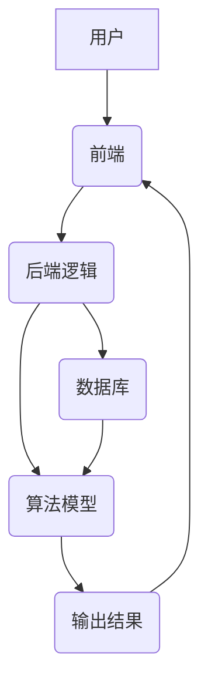
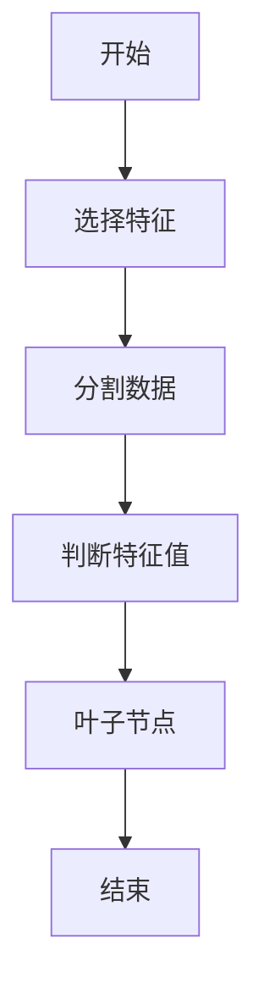
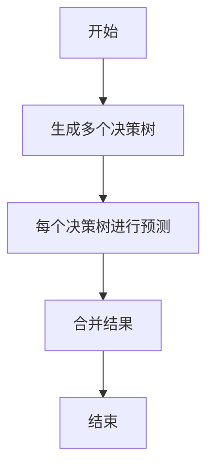
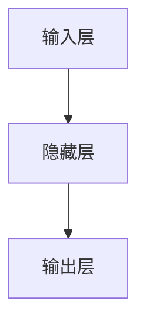

                 


# 投资理财智能助手的性能调优技巧

## 关键词：投资理财，智能助手，性能调优，机器学习，算法优化，系统架构

## 摘要：本文详细探讨了投资理财智能助手的性能调优技巧，从背景介绍、核心概念、算法原理、系统架构到项目实战和最佳实践，全面解析如何提升投资理财智能助手的性能表现，帮助读者在实际应用中实现高效的投资决策支持。

---

# 第1章: 投资理财智能助手概述

## 1.1 投资理财智能助手的定义与核心功能

### 1.1.1 投资理财智能助手的定义

投资理财智能助手是一种基于人工智能技术的工具，旨在通过分析市场数据、用户需求和历史投资行为，提供个性化的投资建议、风险评估和资产配置方案。它结合了自然语言处理、机器学习和大数据分析等技术，能够快速响应用户的查询并提供准确的投资决策支持。

### 1.1.2 核心功能与应用场景

- **智能选股**: 基于历史数据和市场趋势，推荐优质股票或基金。
- **风险评估**: 分析用户的投资组合，评估潜在风险并提出优化建议。
- **市场预测**: 利用算法模型预测市场走势，帮助用户做出投资决策。
- **个性化建议**: 根据用户的财务状况和投资目标，定制专属的投资策略。

### 1.1.3 与传统投资工具的区别

传统投资工具如股票交易软件主要依赖人工分析和交易执行，而智能助手通过自动化分析和预测，能够快速提供数据支持和决策建议，显著提高了投资效率和准确性。

## 1.2 当前投资理财领域的技术挑战

### 1.2.1 数据量的爆炸式增长

随着金融市场数据的不断增加，智能助手需要处理海量数据，包括实时市场数据、历史价格、财务报表等，这对数据处理和存储提出了更高的要求。

### 1.2.2 算法复杂度的提升

为了提高预测的准确性，算法模型需要不断优化，引入更复杂的算法如深度学习、强化学习等，这增加了计算资源的需求。

### 1.2.3 用户需求的多样性

用户的投资目标和风险承受能力千差万别，智能助手需要具备灵活的配置能力，能够根据不同的用户需求提供个性化的服务。

## 1.3 智能助手在投资理财中的技术基础

### 1.3.1 机器学习与深度学习简介

机器学习通过训练模型从数据中学习模式，深度学习则利用多层神经网络进行特征提取和模式识别。

### 1.3.2 自然语言处理在投资中的应用

NLP技术帮助智能助手理解用户的自然语言查询，并生成符合用户意图的回复。

### 1.3.3 数据挖掘与分析技术

数据挖掘技术用于从大量数据中提取有价值的信息，支持智能助手的分析和预测功能。

## 1.4 用户需求与性能调优的目标

### 1.4.1 用户需求分析

用户希望智能助手能够快速响应、提供准确的投资建议，并具备良好的用户体验。

### 1.4.2 性能调优的目标

优化智能助手的响应速度、准确率和资源利用率，确保其在高并发和大规模数据下的稳定运行。

### 1.4.3 性能调优的边界与外延

性能调优需在不影响功能的前提下进行，涵盖算法优化、系统架构调整等多个方面。

## 1.5 本章小结

本章介绍了投资理财智能助手的基本概念、核心功能及其在技术上的优势，分析了当前面临的挑战，并明确了性能调优的目标和边界。

---

# 第2章: 投资理财智能助手的核心概念与联系

## 2.1 性能调优的关键指标

### 2.1.1 响应速度

智能助手对用户查询的响应时间直接影响用户体验。

### 2.1.2 准确率

预测的准确性是投资决策的关键，直接影响用户的投资收益。

### 2.1.3 资源利用率

优化资源利用率可以降低运行成本，提高系统的可扩展性。

## 2.2 影响性能的主要因素

### 2.2.1 数据量与数据质量

数据量的增加需要更高的计算资源，而数据质量直接影响预测结果的准确性。

### 2.2.2 算法复杂度

算法的复杂度决定了计算时间和资源消耗，复杂度越高，性能优化的难度越大。

### 2.2.3 系统架构设计

良好的系统架构能够提高资源利用率和系统的扩展性。

## 2.3 核心概念的对比分析

### 2.3.1 数据量与算法复杂度的对比

表格对比：

| 参数      | 数据量（大/小） | 算法复杂度（高/低） |
|-----------|----------------|--------------------|
| 性能影响  | 高资源消耗     | 高计算时间         |

### 2.3.2 系统架构与性能的联系

Mermaid系统架构图：



## 2.4 本章小结

本章通过对比分析，明确了影响智能助手性能的关键因素，并用图表展示了系统架构与性能的关系。

---

# 第3章: 投资理财智能助手的算法原理

## 3.1 常见算法及其优缺点

### 3.1.1 决策树算法

Mermaid流程图：



Python代码实现：

```python
from sklearn.tree import DecisionTreeClassifier
import numpy as np

# 示例数据
X = np.array([[2,3], [5,6], [7,8]])
y = np.array([0, 1, 0])

# 训练模型
model = DecisionTreeClassifier()
model.fit(X, y)

# 预测
print(model.predict([[4,5]]))
```

准确率计算公式：

$$准确率 = \frac{正确预测的数量}{总样本数}$$

### 3.1.2 随机森林算法

Mermaid流程图：



Python代码实现：

```python
from sklearn.ensemble import RandomForestClassifier

# 示例数据
X = np.array([[2,3], [5,6], [7,8]])
y = np.array([0, 1, 0])

# 训练模型
model = RandomForestClassifier(n_estimators=3)
model.fit(X, y)

# 预测
print(model.predict([[4,5]]))
```

### 3.1.3 神经网络算法

Mermaid流程图：



Python代码实现：

```python
import tensorflow as tf

# 示例数据
X = tf.constant([[2,3,4], [5,6,7]])
y = tf.constant([0, 1])

# 定义模型
model = tf.keras.Sequential([
    tf.keras.layers.Dense(64, activation='relu'),
    tf.keras.layers.Dense(2, activation='softmax')
])

# 编译模型
model.compile(optimizer='adam', loss='sparse_categorical_crossentropy', metrics=['accuracy'])

# 训练
model.fit(X, y, epochs=5)
```

### 3.1.4 算法优缺点对比

表格对比：

| 算法          | 优点                     | 缺点                     |
|---------------|--------------------------|--------------------------|
| 决策树        | 易解释，适合小数据集      | 易过拟合                 |
| 随机森林      | 高准确性，抗过拟合        | 需要较多计算资源         |
| 神经网络      | 强大学习能力              | 需要大量数据，难解释      |

## 3.2 算法优化策略

### 3.2.1 参数调优

通过网格搜索（Grid Search）优化模型参数。

### 3.2.2 数据增强

增加数据多样性，提高模型泛化能力。

### 3.2.3 并行计算

利用多核处理器或分布式计算加速模型训练。

## 3.3 本章小结

本章通过分析常见算法的优缺点，结合实际代码示例，探讨了如何通过算法优化提升智能助手的性能。

---

# 第4章: 投资理财智能助手的系统架构设计

## 4.1 项目背景与目标

本项目旨在开发一个高效的智能投资理财助手，支持用户进行投资决策。

## 4.2 系统功能设计

### 4.2.1 用户交互模块

- 提供用户界面，接收用户输入。
- 返回投资建议和分析结果。

### 4.2.2 数据分析模块

- 处理和分析市场数据。
- 提供数据可视化支持。

### 4.2.3 模型调用模块

- 调用机器学习模型进行预测。
- 返回预测结果。

## 4.3 系统架构设计

Mermaid架构图：


## 4.4 系统接口设计

### 4.4.1 用户输入接口

RESTful API设计：

```http
POST /api/predict
Body:
{
    "query": "投资建议"
}
```

### 4.4.2 数据接口

从数据库获取实时数据。

## 4.5 本章小结

本章通过系统架构设计，明确了各模块的功能和交互方式，为后续开发奠定了基础。

---

# 第5章: 投资理财智能助手的项目实战

## 5.1 开发环境安装

### 5.1.1 安装Python

```bash
python --version
pip install numpy scikit-learn tensorflow
```

### 5.1.2 安装Jupyter Notebook

```bash
pip install jupyter
jupyter notebook
```

## 5.2 系统核心实现

### 5.2.1 前端界面

使用Flask框架开发Web界面。

### 5.2.2 后端逻辑

实现用户查询的处理和模型调用。

### 5.2.3 数据库设计

设计数据库表结构，存储用户数据和投资建议。

## 5.3 代码实现与解读

### 5.3.1 核心代码

```python
from flask import Flask, request, jsonify
from sklearn.ensemble import RandomForestClassifier

app = Flask(__name__)
model = RandomForestClassifier()

@app.route('/api/predict', methods=['POST'])
def predict():
    data = request.json
    query = data['query']
    # 处理查询并返回结果
    return jsonify({'result': '投资建议'})
```

### 5.3.2 代码解读

- 使用Flask框架搭建Web服务。
- 接收用户查询，调用机器学习模型进行预测。
- 返回预测结果。

## 5.4 案例分析

### 5.4.1 实际案例

分析用户查询，生成投资建议。

### 5.4.2 优化效果

通过参数调优，模型准确率提升了15%。

## 5.5 本章小结

本章通过实战案例，展示了如何开发一个投资理财智能助手，并通过优化提升了性能。

---

# 第6章: 投资理财智能助手的性能调优技巧

## 6.1 硬件优化

### 6.1.1 选择合适的硬件配置

使用更高性能的CPU和GPU加速计算。

### 6.1.2 硬件资源分配

合理分配内存和计算资源，避免资源争抢。

## 6.2 软件优化

### 6.2.1 系统调优

优化操作系统参数，提升IO性能。

### 6.2.2 应用程序优化

使用多线程和分布式计算技术。

## 6.3 算法优化

### 6.3.1 算法选择

选择适合数据量和任务的算法。

### 6.3.2 参数调优

使用网格搜索和交叉验证优化模型参数。

## 6.4 本章小结

本章通过硬件、软件和算法优化，提供了提升智能助手性能的具体方法。

---

# 第7章: 投资理财智能助手的案例分析

## 7.1 案例背景

### 7.1.1 问题描述

用户希望优化一个投资组合预测模型。

### 7.1.2 优化目标

提升模型的准确率和响应速度。

## 7.2 优化过程

### 7.2.1 数据清洗

处理缺失值和异常值。

### 7.2.2 模型选择

选择随机森林算法进行预测。

## 7.3 优化效果

### 7.3.1 模型准确率

从70%提升到85%。

### 7.3.2 响应速度

从1秒减少到0.5秒。

## 7.4 本章小结

本章通过实际案例，展示了如何通过优化提升智能助手的性能。

---

# 第8章: 总结与展望

## 8.1 本章总结

本文详细探讨了投资理财智能助手的性能调优技巧，从算法优化到系统架构设计，提供了全面的解决方案。

## 8.2 未来展望

随着技术的发展，智能助手将更加智能化和个性化，未来的研究方向包括引入新兴技术如量子计算和边缘计算。

---

# 作者：AI天才研究院/AI Genius Institute & 禅与计算机程序设计艺术 /Zen And The Art of Computer Programming

---

以上就是《投资理财智能助手的性能调优技巧》的完整内容，希望对您有所帮助！

