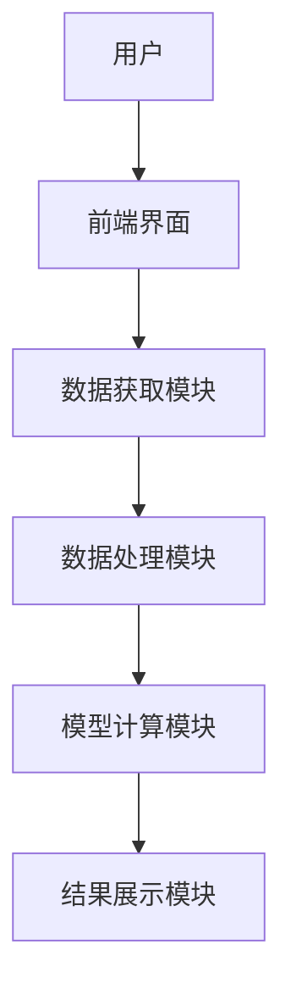
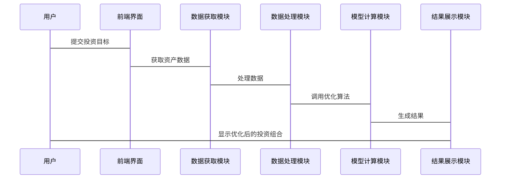

                 


# 投资组合管理

## 关键词：投资组合管理，资产配置，风险管理，量化方法，数学模型，系统架构

## 摘要：投资组合管理是金融领域中的核心任务，涉及资产配置、风险管理、绩效评估等关键环节。本文从理论基础出发，逐步分析投资组合管理的核心概念、数学模型、量化方法、系统架构，并结合实际案例进行详细阐述。通过系统化的方法，帮助读者理解如何在实际应用中优化投资组合，降低风险，实现收益最大化。

---

# 第一章: 投资组合管理概述

## 1.1 投资组合管理的基本概念

### 1.1.1 投资组合管理的定义

投资组合管理（Portfolio Management）是指通过科学的方法和策略，对多个资产进行组合配置，以实现投资目标的过程。其核心在于在风险可控的前提下，最大化资产的预期收益。

### 1.1.2 投资组合管理的目标

- **收益最大化**：通过合理配置资产，实现投资收益的最大化。
- **风险最小化**：在满足收益目标的前提下，尽可能降低投资风险。
- **资产流动性**：保持资产的流动性，以便在需要时快速变现。

### 1.1.3 投资组合管理的重要性

投资组合管理在金融领域中具有重要意义，尤其是在面对市场波动和经济不确定性时，通过合理的资产配置，可以有效分散风险，提高投资的稳定性。

---

## 1.2 投资组合管理的核心要素

### 1.2.1 资产配置

资产配置是投资组合管理的基础，它决定了资金在不同资产类别（如股票、债券、现金等）之间的分配比例。

### 1.2.2 风险管理

风险管理是投资组合管理的关键环节，通过量化和控制风险，可以确保投资组合的稳定性。

### 1.2.3 绩效评估

绩效评估是对投资组合表现的全面分析，包括收益、风险、流动性等多个维度。

---

## 1.3 投资组合管理的历史发展

### 1.3.1 传统投资组合理论的发展

传统投资组合理论主要关注资产的预期收益和风险，通过优化模型实现风险与收益的最佳平衡。

### 1.3.2 现代投资组合理论的提出

现代投资组合理论（MPT）由Harry Markowitz提出，强调通过分散投资降低风险，并引入均值-方差模型。

### 1.3.3 当代投资组合管理的演变

随着金融市场的复杂化和科技的进步，投资组合管理逐渐引入量化方法、机器学习等先进技术，进一步提升管理效率和准确性。

---

## 1.4 本章小结

本章介绍了投资组合管理的基本概念、核心要素和历史发展，为后续内容奠定了基础。通过理解投资组合管理的目标和方法，读者可以更好地把握其在金融领域中的重要性。

---

# 第二章: 投资组合管理的核心概念与联系

## 2.1 资产配置

### 2.1.1 资产配置的类型

资产配置主要分为战略性资产配置和战术性资产配置。战略性资产配置是长期的投资策略，而战术性资产配置则根据市场变化进行短期调整。

### 2.1.2 资产配置的优缺点

- **优点**：分散风险，提高收益稳定性。
- **缺点**：需要持续监控和调整，成本较高。

### 2.1.3 资产配置的实现方法

- **定性分析**：基于市场趋势和经济周期进行判断。
- **定量分析**：通过数学模型优化资产比例。

---

## 2.2 风险管理

### 2.2.1 风险的定义与分类

风险是指投资收益的不确定性，通常分为市场风险、流动性风险、信用风险等。

### 2.2.2 风险的量化方法

- **标准差**：衡量资产收益的波动性。
- **VaR（在险值）**：衡量在一定置信水平下的潜在损失。

### 2.2.3 风险管理的策略

- **风险分散**：通过投资多样化降低风险。
- **风险对冲**：利用衍生品对冲特定风险。

---

## 2.3 绩效评估

### 2.3.1 绩效评估的指标

- **夏普比率**：衡量投资组合的风险调整后收益。
- **特雷诺比率**：衡量投资组合相对于市场指数的超额收益。

### 2.3.2 绩效评估的方法

- **绝对绩效评估**：直接衡量投资收益。
- **相对绩效评估**：与市场指数或其他投资组合进行比较。

### 2.3.3 绩效评估的挑战

- **数据质量**：依赖于历史数据的准确性。
- **模型假设**：依赖于假设条件的合理性。

---

## 2.4 核心概念的联系

### 2.4.1 资产配置与风险管理的关系

资产配置决定了风险的来源和程度，而风险管理则是通过策略和工具来控制这些风险。

### 2.4.2 风险管理与绩效评估的结合

有效的风险管理可以降低投资组合的潜在损失，从而提高绩效评估的稳定性。

### 2.4.3 综合应用案例

例如，通过资产配置分散风险，同时利用VaR指标进行风险量化，最终实现投资组合的稳定收益。

---

## 2.5 本章小结

本章详细探讨了投资组合管理中的资产配置、风险管理与绩效评估的核心概念，并分析了它们之间的相互关系。通过理解这些概念，读者可以更好地制定和实施投资策略。

---

# 第三章: 投资组合管理的数学模型与量化方法

## 3.1 现代投资组合理论

### 3.1.1 均值-方差模型

#### 3.1.1.1 均值-方差模型的原理

均值-方差模型由Harry Markowitz提出，旨在在给定风险下找到收益最大的投资组合，或在给定收益下找到风险最小的投资组合。

#### 3.1.1.2 均值-方差模型的数学公式

$$\text{Minimize } \sigma^2 \text{ subject to } \mu \geq \text{目标收益}$$

其中，$\sigma^2$ 表示投资组合的方差（风险），$\mu$ 表示投资组合的期望收益。

#### 3.1.1.3 均值-方差模型的应用

通过均值-方差模型，投资者可以确定最优资产配置比例，从而实现收益与风险的最佳平衡。

---

## 3.2 风险中性定价

### 3.2.1 风险中性定价的原理

风险中性定价假设投资者对风险持中性态度，即在相同收益下，投资者不会因为风险高低而改变投资决策。

### 3.2.2 风险中性定价的数学公式

$$\text{风险中性概率} = \frac{1 + r}{\sigma^2}$$

其中，$r$ 表示无风险利率，$\sigma^2$ 表示资产的波动性。

### 3.2.3 风险中性定价的应用

风险中性定价常用于衍生品定价，通过量化风险，确定合理的衍生品价格。

---

## 3.3 因子模型

### 3.3.1 因子模型的原理

因子模型将资产的收益分解为多个因子（如市场因子、规模因子、价值因子等），通过分析因子对收益的贡献来解释资产收益的变化。

### 3.3.2 因子模型的数学公式

$$r_i = \alpha_i + \beta_i (r_m - r_f) + \epsilon_i$$

其中，$r_i$ 表示资产$i$的收益，$r_m$ 表示市场收益，$r_f$ 表示无风险利率，$\epsilon_i$ 表示特异风险。

### 3.3.3 因子模型的应用

因子模型常用于资产定价和风险分析，帮助投资者更好地理解资产收益的来源。

---

## 3.4 本章小结

本章通过数学模型和量化方法，深入分析了现代投资组合理论、风险中性定价和因子模型的核心原理及其应用。这些模型为投资组合管理提供了科学的理论基础和实践指导。

---

# 第四章: 投资组合管理的系统架构与实现

## 4.1 系统功能设计

### 4.1.1 投资组合管理系统的核心功能

- 资产配置优化
- 风险管理
- 绩效评估
- 报告生成

### 4.1.2 系统功能模块划分

- 数据获取模块
- 数据处理模块
- 模型计算模块
- 结果展示模块

---

## 4.2 系统架构设计

### 4.2.1 系统架构图



### 4.2.2 系统接口设计

- 数据接口：从数据源获取资产价格、收益等数据。
- 计算接口：调用优化算法进行资产配置和风险评估。
- 展示接口：将结果以图表或报告形式展示给用户。

---

## 4.3 系统交互设计

### 4.3.1 用户与系统的交互流程



---

## 4.4 本章小结

本章通过系统架构设计和交互设计，详细阐述了投资组合管理系统的实现过程。通过模块划分和流程设计，确保系统功能的高效实现和用户体验的优化。

---

# 第五章: 投资组合管理的项目实战

## 5.1 环境配置

### 5.1.1 安装必要的软件和库

- Python 3.8+
- NumPy、Pandas、Scipy等库

```bash
pip install numpy pandas scipy
```

---

## 5.2 数据获取与处理

### 5.2.1 数据获取

```python
import pandas as pd
import numpy as np

# 获取资产价格数据
def get_asset_prices(assets):
    prices = {}
    for asset in assets:
        # 示例：从数据源获取资产价格
        prices[asset] = np.random.normal(100, 0.1, 100)
    return pd.DataFrame(prices)
```

### 5.2.2 数据清洗

```python
# 假设我们已经获取了资产价格数据
prices = get_asset_prices(['股票', '债券', '现金'])
prices.dropna(inplace=True)
prices = prices[prices > 0]
```

---

## 5.3 投资组合优化实现

### 5.3.1 均值-方差模型的实现

```python
import numpy as np
from scipy.optimize import minimize

# 定义目标函数
def objective(weights):
    return np.dot(weights.T, np.dot(cov_matrix, weights))

# 定义约束条件
def constraint(weights):
    return np.sum(weights) - 1

# 约束条件
cons = {'type': 'eq', 'fun': constraint}

# 初始猜测
weights = np.ones(n_assets) / n_assets

# 调用优化函数
result = minimize(objective, weights, constraints=cons)

# 优化后的权重
optimal_weights = result.x
```

### 5.3.2 风险中性定价的实现

```python
import numpy as np

# 示例：计算风险中性概率
def risk_neutral_probability(risk_free_rate, volatility):
    return (1 + risk_free_rate) / (volatility ** 2)
```

---

## 5.4 项目小结

本章通过具体项目实战，展示了如何在实际中应用投资组合管理的理论和方法。通过环境配置、数据处理和算法实现，读者可以掌握投资组合管理的具体操作步骤。

---

# 第六章: 投资组合管理的最佳实践与注意事项

## 6.1 最佳实践

### 6.1.1 定期调整投资组合

根据市场变化和个人财务状况，定期审视和调整投资组合。

### 6.1.2 采用多元化策略

通过投资不同类型的资产，分散风险，降低整体投资组合的波动性。

### 6.1.3 使用先进的工具和技术

利用量化方法和大数据技术，提高投资组合管理的效率和准确性。

---

## 6.2 注意事项

### 6.2.1 风险管理的重要性

无论市场如何变化，风险管理始终是投资组合管理的核心。

### 6.2.2 数据的准确性和及时性

数据的准确性和及时性直接影响投资组合的优化结果，需引起高度重视。

### 6.2.3 模型的局限性

数学模型和量化方法具有其局限性，需结合实际情况进行调整和优化。

---

## 6.3 拓展阅读

- Harry Markowitz的《Portfolio Selection》
-《The New Finance: The Case for Stakeholder Capitalism》
-《Risk and Portfolio Management in Financial Institutions》

---

# 第七章: 总结

## 7.1 全文总结

投资组合管理是金融领域中的重要任务，通过科学的资产配置和风险管理，可以实现收益与风险的最佳平衡。本文从理论到实践，全面探讨了投资组合管理的核心概念、数学模型、系统架构和最佳实践。

## 7.2 关键点回顾

- 资产配置是投资组合管理的基础。
- 风险管理是投资组合管理的关键。
- 数学模型和量化方法是投资组合管理的重要工具。

## 7.3 展望未来

随着金融科技的不断发展，投资组合管理将更加依赖于大数据、人工智能等新技术，未来的投资组合管理将更加智能化和个性化。

---

# 作者：AI天才研究院/AI Genius Institute & 禅与计算机程序设计艺术 /Zen And The Art of Computer Programming

---

感谢您的阅读！希望本文能为您提供有价值的投资组合管理知识。如需进一步探讨或有其他问题，请随时联系作者。

