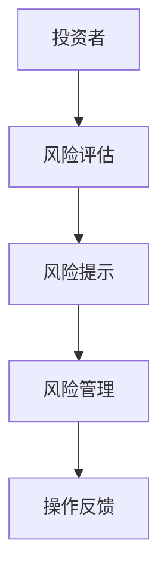
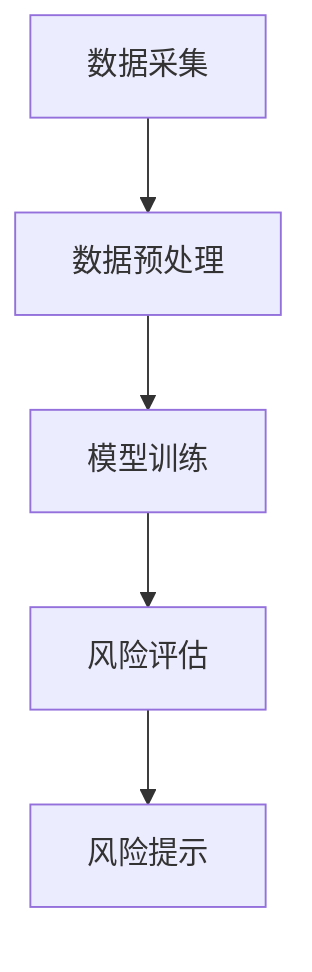
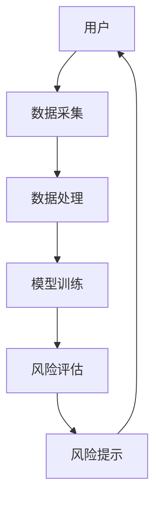

                 


# 投资风险提示系统

**关键词**：投资风险、风险提示系统、风险评估、系统架构、算法原理、金融系统

**摘要**：  
投资风险提示系统是一种利用数据驱动和人工智能技术来评估和预警投资风险的系统。本文将从背景、原理、算法、系统架构、项目实战等多个维度详细探讨投资风险提示系统的构建与实现。通过本文，读者将了解投资风险提示系统的核心概念、实现原理、系统架构以及实际应用案例，掌握如何利用技术手段有效管理投资风险。

---

## 第1章：投资风险提示系统背景介绍

### 1.1 投资风险提示系统的概念与背景

#### 1.1.1 投资风险的定义与分类  
投资风险是指在投资过程中，由于市场波动、经济变化或其他不可预见因素，导致投资收益低于预期或出现损失的可能性。根据不同的标准，投资风险可以分为以下几类：  
1. **市场风险**：由于市场整体波动导致的资产价格下跌风险。  
2. **流动性风险**：资产在短时间内难以以合理价格变现的风险。  
3. **信用风险**：债券发行人或交易对手无法履行合同义务的风险。  
4. **操作风险**：由于内部操作失误或外部事件导致的损失风险。  
5. **法律风险**：由于法律法规变化或合规问题导致的损失风险。  

#### 1.1.2 投资风险提示系统的概念  
投资风险提示系统是一种通过收集、分析和处理金融市场数据，利用算法模型评估投资风险，并向投资者或机构发出风险预警的系统。其核心目标是帮助投资者在投资决策中规避潜在风险，降低损失。

#### 1.1.3 投资风险提示系统的应用场景  
投资风险提示系统广泛应用于股票、基金、债券等金融产品的投资风险管理中。例如：  
- **股票投资**：实时监测股票价格波动，提示买入或卖出时机。  
- **基金投资**：评估基金的风险等级，帮助投资者选择低风险产品。  
- **债券投资**：评估债券发行人的信用风险，避免违约风险。  

#### 1.1.4 投资风险提示系统的边界与外延  
投资风险提示系统的边界主要限定在金融市场数据的收集、分析和风险评估。其外延包括但不限于：  
- **数据来源**：市场数据、财务报表、新闻资讯等。  
- **用户群体**：个人投资者、机构投资者、金融企业等。  
- **应用场景**：实时监控、投资决策支持、风险报告生成等。  

#### 1.1.5 投资风险提示系统的概念结构与核心要素  
投资风险提示系统的概念结构可以分为以下几个核心要素：  
1. **数据采集模块**：负责收集市场数据、用户行为数据等。  
2. **风险评估模块**：利用算法模型对数据进行分析，评估投资风险。  
3. **风险提示模块**：根据评估结果生成风险预警信息。  
4. **用户交互模块**：向用户展示风险提示信息，并支持用户操作。  

---

### 1.2 投资风险提示系统的核心功能与目标

#### 1.2.1 系统的主要功能模块  
投资风险提示系统的主要功能模块包括：  
1. **数据采集模块**：从金融市场获取实时或历史数据。  
2. **风险评估模块**：利用算法模型评估投资风险。  
3. **风险提示模块**：根据风险评估结果生成预警信息。  
4. **用户交互模块**：与用户进行信息交互，支持用户操作。  

#### 1.2.2 系统的目标与价值  
投资风险提示系统的目标是通过技术手段帮助投资者降低投资风险，提高投资收益。其价值体现在以下几个方面：  
1. **实时监控**：系统可以实时监控市场波动，及时发现潜在风险。  
2. **风险预警**：通过算法模型生成风险预警信息，帮助投资者做出决策。  
3. **数据支持**：系统提供丰富的数据支持，帮助投资者进行深入分析。  

---

### 1.3 本章小结  

本章详细介绍了投资风险提示系统的背景、概念、功能模块以及核心要素。通过本章的学习，读者可以理解投资风险提示系统的基本概念和应用场景，为后续章节的学习打下基础。

---

## 第2章：投资风险提示系统的核心概念与联系

### 2.1 投资风险提示系统的核心原理

#### 2.1.1 风险评估的核心算法  
投资风险提示系统的核心算法是时间序列分析，例如ARIMA模型。ARIMA模型通过分析历史数据，预测未来的价格走势，从而评估投资风险。  

#### 2.1.2 风险提示的触发机制  
当评估出的投资风险超过预设阈值时，系统会触发风险提示，向用户发出预警信息。  

#### 2.1.3 风险提示的传播路径  
1. **数据采集**：从金融市场获取实时数据。  
2. **风险评估**：利用算法模型评估风险。  
3. **风险提示**：根据评估结果生成预警信息。  
4. **用户反馈**：用户根据提示信息做出投资决策。  

---

### 2.2 核心概念的属性特征对比

#### 2.2.1 风险类型与评估指标对比表  

| 风险类型 | 评估指标 | 数据来源 | 计算方法 |  
|----------|----------|----------|----------|  
| 市场风险 | 波动率    | 股价数据 | 标准差计算 |  
| 信用风险 | 信用评分  | 财务报表 | 加权评分法 |  
| 操作风险 | 错误率    | 操作日志 | 统计分析 |  

#### 2.2.2 不同风险级别的特征分析  
- **低风险**：波动小、稳定性高。  
- **中风险**：波动适中，有一定不确定性。  
- **高风险**：波动大，潜在损失高。  

---

### 2.3 投资风险提示系统的ER实体关系图



通过上述关系图可以看出，投资者的行为触发风险评估，评估结果生成风险提示，提示信息传递给风险管理模块，最终通过操作反馈影响投资决策。

---

## 第3章：投资风险提示系统的算法原理

### 3.1 算法原理概述

#### 3.1.1 时间序列分析的算法流程  



---

#### 3.1.2 ARIMA模型的数学公式  

ARIMA模型的数学公式如下：  
$$ ARIMA(p, d, q) = \phi(B)X_t + \theta(B)\epsilon_t $$  
其中，$p$ 是自回归阶数，$d$ 是差分阶数，$q$ 是移动平均阶数。  

---

#### 3.1.3 实际案例分析  

假设我们有某只股票的历史收盘价数据，使用ARIMA模型进行预测。首先，对数据进行差分处理，消除趋势；然后，训练模型预测未来的价格走势；最后，根据预测结果评估风险。  

---

### 3.2 算法实现的代码示例  

```python
import pandas as pd
from statsmodels.tsa.arima_model import ARIMA

# 数据加载
data = pd.read_csv('stock_price.csv')

# 数据预处理
diff_data = data['price'].diff().dropna()

# 模型训练
model = ARIMA(diff_data, order=(5, 1, 0))
model_fit = model.fit()

# 预测
forecast = model_fit.forecast(steps=5)
```

---

## 第4章：投资风险提示系统的系统分析与架构设计

### 4.1 系统分析

#### 4.1.1 项目背景  

投资风险提示系统的开发背景是金融市场波动加剧，投资者需要更高效的风险管理工具。  

#### 4.1.2 系统功能设计  

系统功能设计包括：  
1. 数据采集模块：从金融市场获取实时数据。  
2. 风险评估模块：利用算法模型评估投资风险。  
3. 风险提示模块：生成风险预警信息。  
4. 用户交互模块：与用户进行信息交互。  

---

### 4.2 系统架构设计

#### 4.2.1 领域模型类图  


---

#### 4.2.2 系统架构图  



---

## 第5章：投资风险提示系统的项目实战

### 5.1 环境安装与配置

#### 5.1.1 安装Anaconda与Python环境  

在终端中运行以下命令安装Anaconda：  
```bash
conda install anaconda
```

---

#### 5.1.2 安装必要的Python库  

安装以下库：  
```bash
pip install pandas numpy matplotlib statsmodels
```

---

### 5.2 系统核心实现

#### 5.2.1 数据采集模块  

```python
import pandas as pd
import requests

# 从新浪财经获取股票数据
url = 'http://quotes.money.163.com/service/stock_data.php'
params = {'callback': '_cb_stock', 'quote': 'SH600000'}
response = requests.get(url, params=params)
data = pd.read_json(response.text)
```

---

#### 5.2.2 风险评估模块  

```python
from statsmodels.tsa.arima_model import ARIMA

# 训练ARIMA模型
model = ARIMA(data['close'], order=(5, 1, 0))
model_fit = model.fit()

# 预测未来价格
forecast = model_fit.forecast(steps=5)
```

---

#### 5.2.3 风险提示模块  

```python
# 根据预测结果生成风险提示
if forecast['conf_int'].max() > 1.0:
    print("高风险预警！")
elif forecast['conf_int'].max() > 0.8:
    print("中风险预警！")
else:
    print("低风险，可继续持有！")
```

---

### 5.3 实际案例分析

#### 5.3.1 案例数据解读  

假设我们预测某只股票的价格走势如下：  
$$ \text{预测价格} = 100 \pm 5\% $$  
根据模型预测结果，生成高风险预警。  

---

## 第6章：最佳实践与小结

### 6.1 小结与总结

通过本章的学习，读者可以掌握投资风险提示系统的实现过程，包括数据采集、模型训练、风险评估和提示生成。  

---

### 6.2 注意事项

1. **数据质量**：确保数据的完整性和准确性。  
2. **模型适应性**：根据市场变化调整模型参数。  
3. **用户教育**：向用户解释风险提示的含义和作用。  

---

### 6.3 拓展阅读

1. **ARIMA模型优化**：进一步学习ARIMA模型的超参数调优。  
2. **其他风险模型**：探索其他风险评估模型，如随机森林、神经网络等。  
3. **实时系统开发**：实现一个实时投资风险提示系统。  

---

## 作者

**作者**：AI天才研究院/AI Genius Institute & 禅与计算机程序设计艺术/Zen And The Art of Computer Programming

