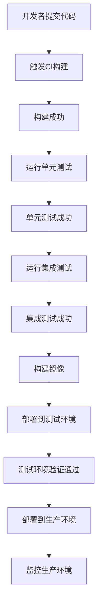
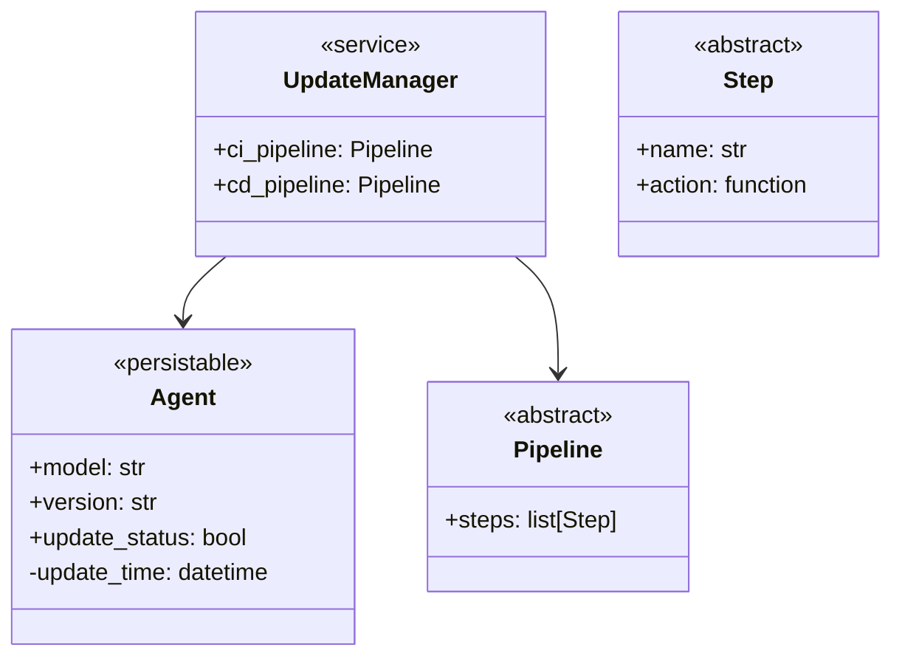

                 


# 持续集成/持续部署：自动化AI Agent的更新流程

## 关键词：持续集成, 持续部署, 自动化AI Agent, CI/CD管道, AI更新流程, DevOps

## 摘要：  
本文深入探讨了如何利用持续集成/持续部署（CI/CD）技术实现AI代理的自动化更新流程。通过结合CI/CD的核心概念、算法原理、系统架构设计以及实际项目案例，文章详细介绍了如何构建高效可靠的AI代理更新系统。从理论到实践，本文为技术从业者提供了全面的指导和实用的建议。

---

## 第1章：CI/CD概述与AI代理更新背景

### 1.1 持续集成的基本概念  
- **定义**：持续集成是一种软件开发实践，通过频繁地将代码合并到主分支，并自动执行构建、测试和验证，以确保代码的健康性。  
- **目标**：快速发现和修复集成问题，减少集成风险，提高开发效率。  
- **特点**：自动化、频繁集成、持续反馈。  

### 1.2 持续部署的核心概念  
- **定义**：持续部署是CI/CD的延伸，指将代码从测试环境自动部署到生产环境，确保每个代码变更都能以最小的代价快速交付。  
- **特点**：自动化、蓝绿部署、回滚机制。  

### 1.3 AI代理更新的背景  
- **AI代理的特点**：AI代理通常运行在生产环境中，需要实时更新模型或逻辑以保持性能。  
- **更新挑战**：更新过程需要保证稳定性，不能中断服务，且更新后需要快速验证和回滚。  
- **CI/CD的作用**：通过CI/CD实现自动化更新，确保AI代理的更新过程高效、可靠且可追溯。  

---

## 第2章：CI/CD的核心概念与实现原理

### 2.1 CI/CD的实现流程  
#### 2.1.1 持续集成的流程  
1. 代码提交：开发者将代码推送到版本控制仓库。  
2. 自动化构建：CI工具（如Jenkins、GitHub Actions）触发构建过程。  
3. 测试执行：运行单元测试、集成测试和端到端测试。  
4. 结果反馈：测试结果通知开发者，发现问题并修复。  

#### 2.1.2 持续部署的流程  
1. 构建镜像：将代码打包成容器镜像（如Docker）。  
2. 部署环境准备：配置生产环境，划分蓝绿部署空间。  
3. 自动化部署：使用工具（如Kubernetes、Ansible）将镜像部署到生产环境。  
4. 监控与回滚：实时监控部署后的表现，发现问题时回滚到上一个版本。  

### 2.2 CI/CD的关键技术  
- **版本控制**：使用Git进行代码管理，确保每次提交可追溯。  
- **CI工具**：Jenkins、GitHub Actions、CircleCI等。  
- **CD工具**：Kubernetes、Docker、Ansible等。  

---

## 第3章：CI/CD的算法原理与实现

### 3.1 CI/CD管道的流程图  


### 3.2 Python代码实现CI/CD流程  
```python
import subprocess

def run_command(command):
    try:
        output = subprocess.check_output(command, shell=True, text=True)
        return output
    except subprocess.CalledProcessError as e:
        print(f"Error: {e}")
        return None

# 持续集成部分
def ci_pipeline():
    # 提交代码到Git仓库
    run_command("git add . && git commit -m '更新代码'")
    run_command("git push origin main")

    # 触发Jenkins构建
    run_command("curl -X POST http://jenkins-server/job/my_job/build")

    # 等待构建完成
    status = run_command("curl http://jenkins-server/job/my_job/lastBuildStatus")
    if "success" in status:
        print("构建成功")
    else:
        print("构建失败")

# 持续部署部分
def cd_pipeline():
    # 构建Docker镜像
    run_command("docker build -t my_agent .")
    # 部署到Kubernetes
    run_command("kubectl apply -f deployment.yaml")

if __name__ == "__main__":
    ci_pipeline()
    cd_pipeline()
```

---

## 第4章：系统架构设计与实现

### 4.1 系统功能设计  
- **领域模型**：定义AI代理的组件，如模型加载模块、业务逻辑模块、数据处理模块等。  
- **交互流程**：从代码提交到生产部署的完整流程。  

#### 领域模型类图  


---

## 第5章：项目实战与案例分析

### 5.1 项目背景  
我们以一个AI聊天机器人为案例，展示CI/CD在AI代理更新中的应用。  

### 5.2 环境配置  
- **开发环境**：Python 3.8+, Git, Docker, Jenkins  
- **生产环境**：Kubernetes集群，Docker registry  

### 5.3 代码实现  
```python
import logging

class AIChatRobot:
    def __init__(self, model_path):
        self.model_path = model_path
        self.model = self.load_model()

    def load_model(self):
        try:
            # 加载模型逻辑
            return "model_loaded"
        except Exception as e:
            logging.error(f"加载模型失败：{e}")
            raise

    def update_model(self, new_model_path):
        self.model_path = new_model_path
        self.model = self.load_model()
```

### 5.4 测试用例  
```python
import unittest

class TestAIChatRobot(unittest.TestCase):
    def setUp(self):
        self.robot = AIChatRobot("models/current")

    def test_update_model(self):
        self.robot.update_model("models/latest")
        self.assertEqual(self.robot.model_path, "models/latest")

    def test_load_model_failure(self):
        with self.assertRaises(Exception):
            self.robot.update_model("models/broken")

if __name__ == "__main__":
    unittest.main()
```

### 5.5 部署流程  
1. 打包代码为Docker镜像：  
   ```dockerfile
   FROM python:3.8-slim
   WORKDIR /app
   COPY requirements.txt .
   RUN pip install -r requirements.txt
   COPY . .
   CMD ["python", "app.py"]
   ```
2. 部署到Kubernetes：  
   ```yaml
   apiVersion: apps/v1
   kind: Deployment
   metadata:
     name: ai-chat-robot
   spec:
     replicas: 3
     selector:
       matchLabels:
         app: ai-chat-robot
     template:
       metadata:
         labels:
           app: ai-chat-robot
       spec:
         containers:
         - name: ai-chat-robot
           image: my_agent:latest
           ports:
           - containerPort: 5000
   ```

---

## 第6章：最佳实践与总结

### 6.1 最佳实践  
- **自动化测试**：确保每个代码变更都有对应的测试用例。  
- **蓝绿部署**：降低部署风险，确保快速回滚。  
- **监控与日志**：实时监控生产环境，及时发现并解决问题。  

### 6.2 项目小结  
通过CI/CD实现AI代理的自动化更新，能够显著提高开发效率，降低风险，并确保更新过程的可靠性。  

### 6.3 注意事项  
- **代码质量管理**：确保代码符合规范，避免技术债务积累。  
- **团队协作**：明确职责，确保每个环节有人负责。  

### 6.4 拓展阅读  
- 《持续交付：发布可靠软件的系统性方法》  
- 《DevOps 指南：从新手到专家》  

---

## 作者：AI天才研究院 & 禅与计算机程序设计艺术

