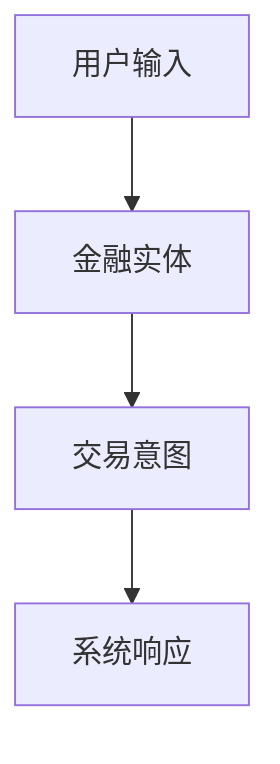
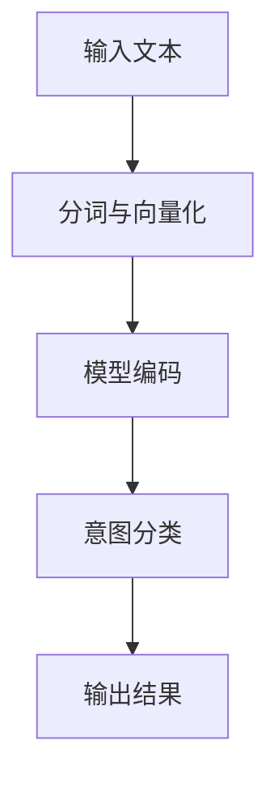
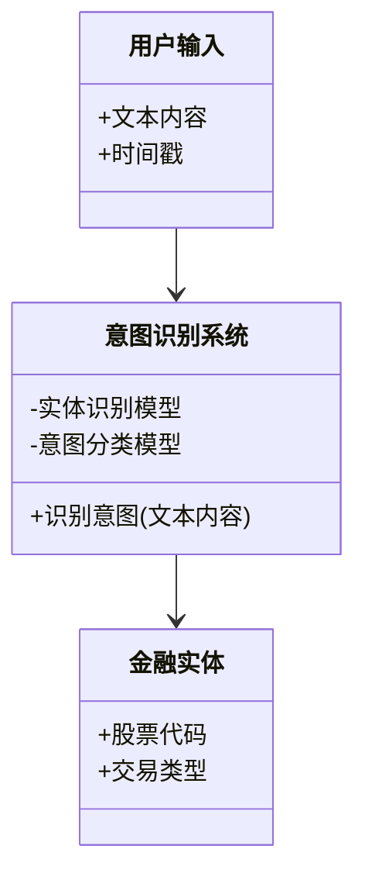
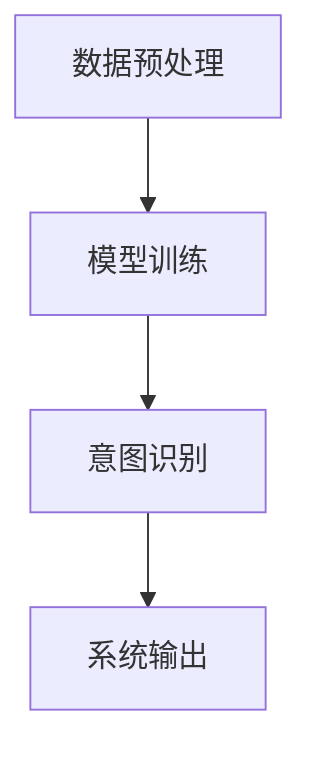
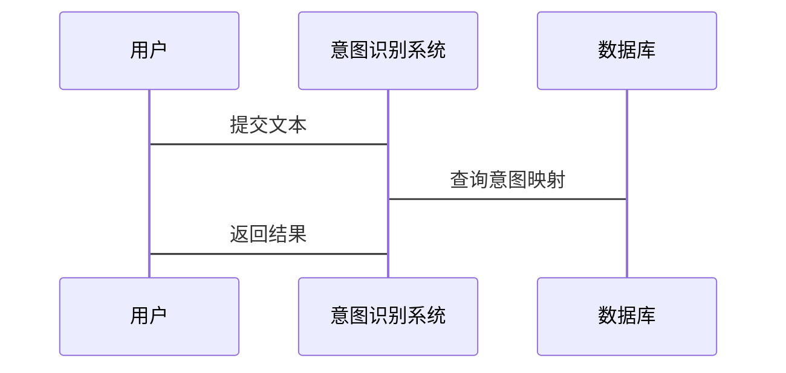

                 


# 提升金融领域语义理解与意图识别的准确性

## 关键词：金融NLP，意图识别，语义理解，深度学习，自然语言处理

## 摘要：  
在金融领域，语义理解与意图识别的准确性对于高效、可靠的金融服务至关重要。随着金融交易的复杂性和多样性的增加，传统的自然语言处理技术已难以满足需求。本文从背景、核心概念、算法原理、数学模型、系统架构设计、项目实战和最佳实践等多个方面，详细探讨了如何提升金融领域语义理解与意图识别的准确性。通过对比分析、流程图示、代码示例和实际案例，为读者提供了一套系统化的解决方案，帮助他们在实际应用中优化模型性能，提高用户体验。

---

# 正文

## 第一部分: 金融领域语义理解与意图识别的背景

### 第1章: 问题背景与重要性

#### 1.1 问题背景  
金融领域的语义理解与意图识别是自然语言处理（NLP）技术的重要应用之一。金融数据的复杂性、多样性和专业性使得传统的NLP技术难以有效处理。例如，金融领域的文本可能包含复杂的金融术语、多义词和隐含意图，这些都需要模型具备高度的语义理解和上下文分析能力。

#### 1.2 问题描述  
意图识别的目的是从文本中提取用户的意图，例如“查询股票价格”、“进行外汇交易”等。在金融领域，意图识别的准确性直接影响用户体验和交易效率。例如，如果模型错误地将“查询账户余额”识别为“转账”，可能会导致严重的财务错误。

#### 1.3 提升准确性的必要性  
- **用户需求多样性**：金融用户可能涉及个人投资者、机构投资者、交易员等多种角色，每个角色的需求和意图有所不同。
- **数据稀疏性**：金融领域的某些意图可能数据量较少，导致模型难以准确学习。
- **领域专业性**：金融领域的术语和语境具有高度的专业性，通用NLP模型可能无法有效应对。

### 第2章: 核心概念与联系

#### 2.1 核心概念  
- **语义理解**：通过对文本的深度分析，理解其含义和上下文关系。
- **意图识别**：基于语义理解，识别用户的具体意图或目标。

#### 2.2 核心概念对比分析  
| 对比维度         | 传统NLP               | 深度学习NLP            |
|------------------|-----------------------|------------------------|
| 处理方式         | 基于规则和特征工程     | 基于端到端模型          |
| 精度             | 较低，依赖人工规则     | 更高，自动学习特征      |
| 适用场景         | 简单任务，如关键词提取   | 复杂任务，如意图识别     |

#### 2.3 ER实体关系图  


---

## 第二部分: 算法原理与数学模型

### 第3章: 意图识别的算法原理

#### 3.1 基于深度学习的意图识别模型  
- **Transformer架构**：通过自注意力机制捕捉文本中的长距离依赖关系。  
- **BERT模型**：预训练语言模型，在金融领域进行微调以适应特定任务。

#### 3.2 意图分类算法流程图  


#### 3.3 算法实现代码示例  
```python
import torch
class IntentClassifier(torch.nn.Module):
    def __init__(self, input_size, hidden_size, output_size):
        super(IntentClassifier, self).__init__()
        self.fc1 = torch.nn.Linear(input_size, hidden_size)
        self.relu = torch.nn.ReLU()
        self.fc2 = torch.nn.Linear(hidden_size, output_size)
    
    def forward(self, x):
        x = self.fc1(x)
        x = self.relu(x)
        x = self.fc2(x)
        return x
```

### 第4章: 数学模型与公式

#### 4.1 词嵌入模型  
- **词嵌入公式**：  
  $$ \text{嵌入向量} = \text{输入文本} \times \text{嵌入矩阵} $$
  
#### 4.2 注意力机制  
- **自注意力公式**：  
  $$ \text{注意力权重} = \text{softmax}(\frac{QK^T}{\sqrt{d_k}}) $$
  其中，$Q$ 是查询矩阵，$K$ 是键矩阵，$d_k$ 是维度。

#### 4.3 模型训练流程  
1. **输入文本**：通过分词和向量化处理。
2. **编码层**：利用Transformer编码层提取特征。
3. **分类层**：通过全连接层进行意图分类。

---

## 第三部分: 系统分析与架构设计

### 第5章: 系统功能设计

#### 5.1 功能模块  
- **数据预处理模块**：对金融文本进行清洗、分词和向量化。
- **模型训练模块**：基于预处理的数据训练意图识别模型。
- **意图识别模块**：接收用户输入，输出意图结果。

#### 5.2 系统功能设计图  


### 第6章: 系统架构设计

#### 6.1 模块化架构图  


#### 6.2 接口设计  
- **输入接口**：接收用户文本输入。
- **输出接口**：返回意图识别结果。

#### 6.3 系统交互流程图  


---

## 第四部分: 项目实战

### 第7章: 项目实现与分析

#### 7.1 环境安装  
```bash
pip install torch
pip install transformers
pip install numpy
pip install pandas
```

#### 7.2 核心代码实现  
```python
from transformers import BertTokenizer, BertModel
import torch
import numpy as np

# 数据预处理
def preprocess(text):
    tokenizer = BertTokenizer.from_pretrained('bert-base-uncased')
    inputs = tokenizer(text, return_tensors='np')
    return inputs

# 模型训练
class IntentClassifier(torch.nn.Module):
    def __init__(self, input_size, hidden_size, output_size):
        super(IntentClassifier, self).__init__()
        self.fc1 = torch.nn.Linear(input_size, hidden_size)
        self.relu = torch.nn.ReLU()
        self.fc2 = torch.nn.Linear(hidden_size, output_size)
    
    def forward(self, x):
        x = self.fc1(x)
        x = self.relu(x)
        x = self.fc2(x)
        return x

# 模型训练与评估
def train_model(model, inputs, labels, epochs=10):
    criterion = torch.nn.CrossEntropyLoss()
    optimizer = torch.optim.Adam(model.parameters(), lr=0.001)
    for epoch in range(epochs):
        outputs = model(inputs)
        loss = criterion(outputs, labels)
        loss.backward()
        optimizer.step()
        optimizer.zero_grad()
```

#### 7.3 实际案例分析  
以股票市场为例，分析如何通过模型识别用户的意图，如“查询股票价格”、“查看历史走势”等。

#### 7.4 项目小结  
总结项目实现的经验与教训，强调数据质量、模型调优和持续学习的重要性。

---

## 第五部分: 最佳实践与总结

### 第8章: 最佳实践

#### 8.1 数据质量优化  
- 确保数据的多样性和代表性。
- 处理金融领域的专业术语和多义词。

#### 8.2 模型调优技巧  
- 调整超参数，如学习率、批次大小。
- 使用早停法防止过拟合。

#### 8.3 持续学习与优化  
- 定期更新模型，适应金融市场的变化。
- 结合领域知识优化模型性能。

### 第9章: 小结与展望

#### 9.1 小结  
- 提升金融领域语义理解与意图识别的准确性需要结合领域知识和深度学习技术。
- 数据质量、模型优化和系统架构是关键因素。

#### 9.2 展望  
- 随着NLP技术的不断进步，金融领域的语义理解与意图识别将更加智能化和精准化。

### 第10章: 注意事项

- 数据偏差可能导致模型性能下降。
- 模型的泛化能力需要持续优化。
- 确保系统的安全性和稳定性。

### 第11章: 拓展阅读

- 推荐阅读《深度学习》（Deep Learning, Ian Goodfellow著）。
- 推荐研究论文《BERT: Pre-training of Deep Bidirectional Transformers for NLP》。

---

# 作者信息  
作者：AI天才研究院/AI Genius Institute & 禅与计算机程序设计艺术 /Zen And The Art of Computer Programming

---

以上是文章的完整结构和内容，确保每一部分都详细展开，涵盖背景、算法、系统设计、项目实战和最佳实践。

