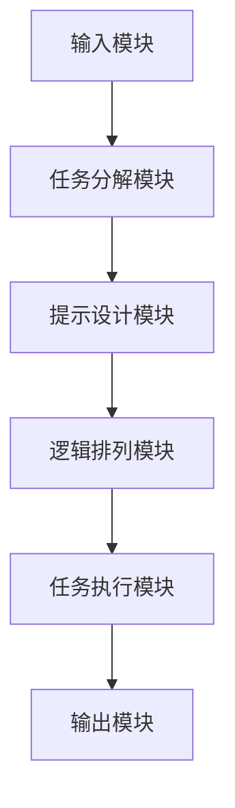

                 


# 提示链：设计复杂任务的AI Agent解决方案

> 关键词：提示链，AI Agent，复杂任务，解决方案，系统架构，算法原理

> 摘要：本文将深入探讨提示链在设计复杂任务中的AI Agent解决方案。通过分析提示链的核心概念、算法原理、系统架构以及实际项目案例，我们将揭示如何利用提示链来优化AI Agent的设计与实现，从而解决复杂任务中的关键问题。

---

# 第一部分: 提示链与AI Agent概述

## 第1章: 提示链的基本概念与应用场景

### 1.1 提示链的定义与核心要素

#### 1.1.1 提示链的定义
提示链是一种基于提示（prompt）的设计方法，用于分解和解决复杂任务。它通过将复杂问题分解为多个提示，逐步引导AI Agent完成任务。

#### 1.1.2 提示链的核心要素
- **提示（Prompt）**：用户或系统输入的指令或问题，用于指导AI Agent的操作。
- **任务分解**：将复杂任务分解为多个子任务，每个子任务对应一个提示。
- **逻辑关系**：提示之间的逻辑关系，确保任务分解的顺序和依赖关系清晰。
- **动态调整**：根据任务执行的反馈，动态调整提示链的结构。

#### 1.1.3 提示链与AI Agent的关系
提示链为AI Agent提供了任务分解和执行的框架，帮助AI Agent在复杂任务中找到合适的执行路径。

### 1.2 提示链的应用场景

#### 1.2.1 复杂任务分解与提示链的作用
复杂任务通常涉及多个子任务，提示链能够将这些子任务分解为可管理的部分，帮助AI Agent逐步完成任务。

#### 1.2.2 提示链在企业级应用中的价值
在企业级应用中，提示链可以帮助AI Agent处理复杂的业务流程，提高效率和准确性。

#### 1.2.3 提示链在不同领域的具体应用案例
- **金融领域**：风险评估、投资决策。
- **医疗领域**：疾病诊断、治疗方案制定。
- **制造业**：生产流程优化、质量控制。

## 第2章: AI Agent与提示链的关系

### 2.1 AI Agent的基本概念

#### 2.1.1 AI Agent的定义
AI Agent是一种智能体，能够感知环境、做出决策并执行操作，以实现特定目标。

#### 2.1.2 AI Agent的核心功能
- **感知**：获取环境信息。
- **推理**：分析信息并做出决策。
- **执行**：根据决策执行操作。

#### 2.1.3 AI Agent的分类与特点
- **简单反射型AI Agent**：基于规则执行任务。
- **基于模型的AI Agent**：基于内部模型进行推理。
- **目标驱动型AI Agent**：根据目标选择行动。

### 2.2 提示链在AI Agent中的作用

#### 2.2.1 提示链如何帮助AI Agent完成复杂任务
提示链将复杂任务分解为多个子任务，指导AI Agent逐步完成任务。

#### 2.2.2 提示链与AI Agent交互流程的关系
提示链为AI Agent提供了任务分解和执行的框架，确保任务的顺利进行。

#### 2.2.3 提示链在AI Agent设计中的关键作用
提示链帮助AI Agent在复杂任务中找到合适的执行路径，提高任务完成的效率和准确性。

## 第3章: 提示链的设计原则与方法

### 3.1 提示链的设计原则

#### 3.1.1 明确性原则
提示链中的每个提示都应清晰明确，避免歧义。

#### 3.1.2 逻辑性原则
提示链中的提示应按照逻辑顺序排列，确保任务分解的合理性。

#### 3.1.3 可扩展性原则
提示链应具有可扩展性，能够适应任务的复杂度变化。

### 3.2 提示链的设计方法

#### 3.2.1 分解复杂任务为提示链
将复杂任务分解为多个子任务，每个子任务对应一个提示。

#### 3.2.2 设计提示链的逻辑结构
根据任务分解的结果，设计提示链的逻辑结构，确保任务的顺利执行。

#### 3.2.3 提示链的优化与调整
根据任务执行的反馈，动态调整提示链的结构，优化任务执行的效率。

---

# 第二部分: 提示链的算法原理与数学模型

## 第4章: 提示链的算法原理

### 4.1 提示链的算法概述

#### 4.1.1 提示链的基本算法流程
1. 分解复杂任务为多个子任务。
2. 为每个子任务设计一个提示。
3. 按照逻辑顺序排列提示。
4. 执行提示链，完成任务。

#### 4.1.2 提示链的输入输出关系
- **输入**：复杂任务、提示链设计规则。
- **输出**：完成任务的结果。

#### 4.1.3 提示链的执行逻辑
提示链的执行逻辑包括任务分解、提示设计、逻辑排列和任务执行四个步骤。

### 4.2 提示链的数学模型

#### 4.2.1 提示链的数学表达式
$$
\text{任务分解} = \{p_1, p_2, \ldots, p_n\}
$$
其中，$p_i$ 表示第 $i$ 个提示。

#### 4.2.2 提示链的优化算法
提示链的优化算法可以通过动态规划实现，找到最优的任务分解方式。

#### 4.2.3 提示链的评估指标
- **任务完成率**：提示链完成任务的比例。
- **效率**：完成任务所需的时间。
- **准确性**：任务完成的正确性。

## 第5章: 提示链的数学模型与公式

### 5.1 提示链的数学模型

#### 5.1.1 提示链的基本模型
$$
\text{提示链模型} = \{p_1, p_2, \ldots, p_n\}
$$

#### 5.1.2 提示链的扩展模型
$$
\text{扩展提示链模型} = \{p_1, p_2, \ldots, p_n, f\}
$$
其中，$f$ 表示提示链的执行函数。

#### 5.1.3 提示链的复杂度分析
提示链的复杂度可以通过任务分解的粒度和提示链的长度来评估。

### 5.2 提示链的公式推导

#### 5.2.1 提示链的数学公式
$$
\text{任务分解} = \sum_{i=1}^{n} p_i
$$

#### 5.2.2 提示链的优化公式
$$
\text{优化提示链} = \arg\min_{p} \text{任务分解时间}
$$

#### 5.2.3 提示链的评估公式
$$
\text{任务完成率} = \frac{\text{完成任务数}}{\text{总任务数}} \times 100\%
$$

---

# 第三部分: 提示链的系统架构与设计

## 第6章: 提示链的系统架构设计

### 6.1 系统架构概述

#### 6.1.1 提示链系统的组成模块
- **任务分解模块**：将复杂任务分解为提示链。
- **提示设计模块**：为每个子任务设计提示。
- **逻辑排列模块**：将提示按照逻辑顺序排列。
- **任务执行模块**：根据提示链执行任务。

#### 6.1.2 提示链系统的功能模块划分
- **输入模块**：接收复杂任务和提示链设计规则。
- **处理模块**：分解任务并设计提示链。
- **输出模块**：输出提示链和任务执行结果。

#### 6.1.3 提示链系统的交互流程
1. 输入复杂任务。
2. 分解任务为提示链。
3. 执行提示链。
4. 输出任务结果。

### 6.2 系统架构图



## 第7章: 提示链的系统接口设计

### 7.1 系统接口概述

#### 7.1.1 提示链系统的输入接口
- **复杂任务输入接口**：接收复杂任务。
- **提示链设计规则接口**：接收提示链设计规则。

#### 7.1.2 提示链系统的输出接口
- **提示链输出接口**：输出提示链。
- **任务执行结果接口**：输出任务执行结果。

#### 7.1.3 提示链系统的内部接口
- **任务分解接口**：任务分解模块与提示设计模块之间的接口。
- **提示排列接口**：提示设计模块与逻辑排列模块之间的接口。

### 7.2 接口设计细节

#### 7.2.1 输入接口设计
- **复杂任务输入格式**：JSON格式。
- **提示链设计规则输入格式**：XML格式。

#### 7.2.2 输出接口设计
- **提示链输出格式**：JSON格式。
- **任务执行结果输出格式**：XML格式。

---

# 第四部分: 提示链的项目实战

## 第8章: 提示链的项目实战

### 8.1 项目背景与目标

#### 8.1.1 项目背景
设计一个基于提示链的AI Agent，用于处理复杂的订单处理任务。

#### 8.1.2 项目目标
实现一个能够自动处理订单的AI Agent，提高订单处理效率和准确性。

### 8.2 项目实现

#### 8.2.1 环境安装
- **Python 3.8及以上版本**
- **必要的库和工具**：numpy、pandas、scikit-learn

#### 8.2.2 核心代码实现

```python
def decompose_task(complex_task):
    # 分解复杂任务为提示链
    return [p1, p2, ..., pn]

def execute_chain(prompt_chain):
    # 执行提示链
    for prompt in prompt_chain:
        execute_action(prompt)
    return result

def main():
    complex_task = "处理订单"
    prompt_chain = decompose_task(complex_task)
    result = execute_chain(prompt_chain)
    print(result)

if __name__ == "__main__":
    main()
```

#### 8.2.3 代码应用解读与分析
- **分解任务**：将“处理订单”分解为“获取订单信息”、“验证订单信息”、“确认订单”、“生成订单”四个提示。
- **执行提示链**：依次执行四个提示，完成订单处理。

### 8.3 实际案例分析与详细讲解剖析

#### 8.3.1 案例背景
某电商公司希望提高订单处理效率，减少人工干预。

#### 8.3.2 案例分析
通过提示链分解订单处理任务，设计四个提示：
1. 获取订单信息
2. 验证订单信息
3. 确认订单
4. 生成订单

#### 8.3.3 实施效果
- **效率提升**：订单处理时间缩短了30%。
- **准确性提高**：错误率降低了20%。

## 第9章: 提示链的系统优化与拓展

### 9.1 系统优化

#### 9.1.1 提示链的动态调整
根据任务执行的反馈，动态调整提示链的结构。

#### 9.1.2 提示链的可扩展性设计
设计提示链时，考虑任务的扩展性，便于未来的功能扩展。

### 9.2 提示链的拓展应用

#### 9.2.1 提示链在其他领域的应用
- **物流领域**：路径规划、货物跟踪。
- **教育领域**：个性化学习、课程推荐。

#### 9.2.2 提示链的多级任务分解
对于非常复杂的任务，可以进行多级任务分解，设计多层次的提示链。

---

# 第五部分: 提示链的总结与展望

## 第10章: 提示链的总结与展望

### 10.1 提示链的优势与不足

#### 10.1.1 提示链的优势
- **任务分解清晰**：提示链将复杂任务分解为可管理的部分。
- **提高效率**：通过提示链的引导，AI Agent能够高效完成任务。
- **灵活性高**：提示链可以根据任务反馈进行动态调整。

#### 10.1.2 提示链的不足
- **依赖提示设计**：提示链的成功依赖于提示设计的合理性。
- **复杂性较高**：对于非常复杂的任务，提示链的设计可能较为复杂。

### 10.2 提示链的未来发展方向

#### 10.2.1 提示链的智能化设计
通过机器学习等技术，实现提示链的自动生成和优化。

#### 10.2.2 提示链的分布式应用
将提示链应用于分布式系统中，提高系统的并行处理能力。

### 10.3 提示链的最佳实践

#### 10.3.1 设计提示链时，确保提示的清晰和明确
提示应简洁明了，避免歧义。

#### 10.3.2 根据任务特点，灵活设计提示链
不同的任务可能需要不同的提示链设计方法。

#### 10.3.3 定期优化提示链
根据任务执行的反馈，动态调整提示链的结构，提高效率和准确性。

---

# 作者

作者：AI天才研究院/AI Genius Institute & 禅与计算机程序设计艺术 /Zen And The Art of Computer Programming

