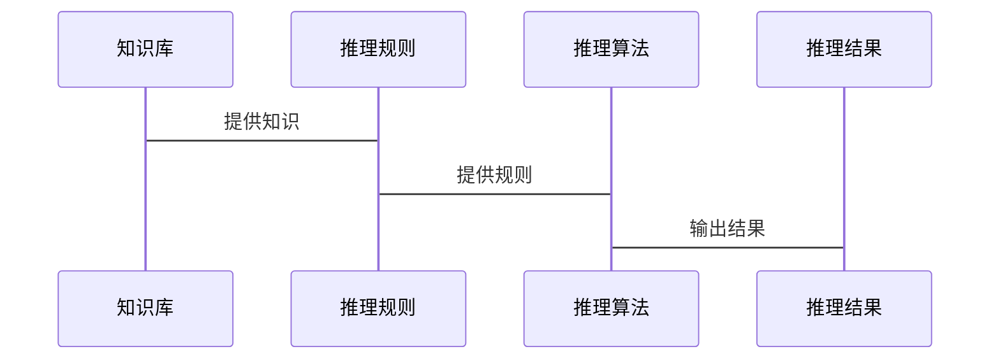

                 


# 提高AI Agent的推理能力：逻辑推理模块设计

> 关键词：AI Agent, 逻辑推理, 智能代理, 推理算法, 知识表示

> 摘要：本文旨在探讨如何设计和优化AI Agent的逻辑推理模块，以提高其推理能力。文章从AI Agent的基本概念出发，详细分析了逻辑推理的核心原理，包括命题逻辑与谓词逻辑的基本概念，一阶逻辑推理和概率推理的算法实现，以及逻辑推理模块的系统架构设计。通过实际案例分析，深入探讨了逻辑推理模块在AI Agent中的应用场景和实现细节，并给出了优化建议和未来研究方向。

---

## 第1章: AI Agent与逻辑推理概述

### 1.1 AI Agent的基本概念

#### 1.1.1 AI Agent的定义与特点

AI Agent（人工智能代理）是指能够感知环境并采取行动以实现目标的智能实体。AI Agent可以是软件程序、机器人或其他智能系统。其核心特点包括：

- **自主性**：能够在没有外部干预的情况下自主决策。
- **反应性**：能够实时感知环境并做出反应。
- **目标导向**：所有行为都以实现特定目标为导向。
- **社会能力**：能够与其他AI Agent或人类进行交互和协作。

AI Agent广泛应用于自动驾驶、智能助手、机器人控制、推荐系统等领域。

#### 1.1.2 逻辑推理在AI Agent中的作用

逻辑推理是AI Agent的核心能力之一，它使AI Agent能够：

1. **理解环境**：通过推理环境中的信息，AI Agent能够理解环境的状态和变化。
2. **做出决策**：基于推理结果，AI Agent可以做出合理的决策和行动选择。
3. **解决问题**：通过逻辑推理，AI Agent能够解决复杂问题并找到最优解决方案。

逻辑推理是AI Agent实现智能行为的关键技术，它使AI Agent能够从已知信息中推导出新的结论。

#### 1.1.3 AI Agent的分类与应用场景

AI Agent可以根据智能水平分为以下几类：

- **反应式AI Agent**：基于当前感知做出反应，适用于实时任务（如自动驾驶）。
- **认知式AI Agent**：具有复杂推理和规划能力，适用于复杂场景（如医疗诊断系统）。
- **学习型AI Agent**：能够通过机器学习不断优化推理能力（如智能推荐系统）。

应用场景包括：

- **自动驾驶**：实时感知环境并做出驾驶决策。
- **智能助手**：通过推理用户需求提供个性化服务。
- **机器人控制**：根据环境信息规划行动路径。
- **医疗诊断**：基于患者信息推理诊断结果。

### 1.2 逻辑推理的基本概念

#### 1.2.1 逻辑推理的定义与分类

逻辑推理是基于已知信息推导出新结论的过程。常见的逻辑推理类型包括：

- **命题逻辑**：基于命题的逻辑推理，适用于简单事实的推理。
- **谓词逻辑**：基于谓词和个体的逻辑推理，适用于复杂事实的推理。
- **概率推理**：基于概率论的推理，适用于不确定性场景。
- **归纳推理**：从具体实例中总结一般规律。
- **演绎推理**：从一般规律推导出具体结论。

#### 1.2.2 命题逻辑与谓词逻辑的基本原理

命题逻辑基于命题的真假值进行推理。例如，命题“如果A则B”可以表示为逻辑表达式A → B。

谓词逻辑在命题逻辑的基础上引入了谓词和个体，能够表示更复杂的关系。例如，谓词“P(x)”表示“个体x具有性质P”。

#### 1.2.3 逻辑推理在AI Agent中的重要性

逻辑推理使AI Agent能够：

- **处理复杂信息**：通过谓词逻辑处理复杂的事实和关系。
- **处理不确定性**：通过概率推理处理不确定性场景。
- **做出合理决策**：通过演绎推理和归纳推理得出合理结论。

### 1.3 逻辑推理模块的设计目标

#### 1.3.1 提高AI Agent推理能力的核心目标

- **准确性**：确保推理结果的准确性。
- **效率性**：提高推理速度，使其能够实时处理。
- **可解释性**：推理过程可被人类理解和解释。

#### 1.3.2 逻辑推理模块的功能与性能指标

- **功能**：实现命题逻辑和谓词逻辑的推理，支持概率推理。
- **性能指标**：推理速度、推理准确性、推理可解释性。

#### 1.3.3 逻辑推理模块的边界与外延

逻辑推理模块的边界包括：

- **输入**：接受外部感知信息和知识库中的知识。
- **输出**：输出推理结果和决策建议。
- **接口**：与知识库、决策模块和其他组件进行交互。

逻辑推理模块的外延包括：

- **知识表示**：如何将知识表示为逻辑形式。
- **推理规则**：推理规则的定义和优化。
- **推理算法**：选择和优化推理算法。

### 1.4 本章小结

本章介绍了AI Agent的基本概念和逻辑推理的重要性。AI Agent需要具备逻辑推理能力才能实现智能行为，逻辑推理模块的设计目标是提高推理能力，使其能够准确、高效地处理信息并做出合理决策。

---

## 第2章: 逻辑推理的核心概念与联系

### 2.1 逻辑推理的原理与方法

#### 2.1.1 命题逻辑与谓词逻辑的原理

命题逻辑基于命题的真假值进行推理，其基本运算包括合取（∧）、析取（∨）、否定（¬）、蕴含（→）和等价（↔）。谓词逻辑在命题逻辑的基础上引入了谓词和个体，能够表示更复杂的关系。

#### 2.1.2 一阶逻辑推理的基本规则

一阶逻辑推理基于谓词逻辑，其基本规则包括：

- **全称规则**：如果一个谓词对所有个体都成立，则可以推导出该谓词成立。
- **存在规则**：如果存在一个个体使得谓词成立，则可以推导出该谓词成立。
- **消解规则**：通过消解过程将前提和结论统一起来。

#### 2.1.3 概率推理与统计推理的对比

概率推理基于概率论进行推理，适用于不确定性场景。统计推理基于统计学方法进行推理，适用于大数据场景。

### 2.2 逻辑推理的核心要素

#### 2.2.1 命题、谓词与规则的定义

- **命题**：命题是具有真假值的声明。
- **谓词**：谓词是描述个体性质或关系的函数。
- **规则**：规则是逻辑推理中的推理规则。

#### 2.2.2 知识表示与推理规则的关系

知识表示是逻辑推理的基础，推理规则是逻辑推理的核心。知识表示决定了推理规则的应用范围，推理规则决定了知识的推理方式。

#### 2.2.3 推理过程中的不确定性处理

不确定性处理方法包括：

- **概率方法**：基于概率论处理不确定性。
- **模糊逻辑**：基于模糊集合处理不确定性。
- **证据理论**：基于 Dempster-Shafer 理论处理不确定性。

### 2.3 逻辑推理的实体关系图

#### 2.3.1 实体关系的Mermaid流程图


#### 2.3.2 推理规则的ER图架构


### 2.4 本章小结

本章详细讲解了逻辑推理的核心概念和原理，包括命题逻辑和谓词逻辑的基本原理，一阶逻辑推理和概率推理的基本规则，以及推理过程中的不确定性处理方法。通过Mermaid流程图和ER图展示了逻辑推理的实体关系。

---

## 第3章: 逻辑推理算法原理与实现

### 3.1 一阶逻辑推理算法

#### 3.1.1 消解算法的原理与步骤

消解算法是一种常用的一阶逻辑推理算法，其基本步骤包括：

1. **消除量词**：将全称量词和存在量词消除，统一转换为存在量词。
2. **消解规则**：通过消解规则将前提和结论统一起来。
3. **归约**：通过归约过程将前提和结论简化。

#### 3.1.2 消解算法的Mermaid流程图


#### 3.1.3 消解算法的Python代码实现

```python
def resolution_resolution(prems, conclusion):
    # 消除量词并统一符号
    premises = prems.copy()
    premises.append(conclusion)
    # 消解规则
    for p in premises:
        if isinstance(p, list):
            for clause in p:
                if clause[0] == 'forall':
                    # 消除全称量词
                    clause[1] = clause[1][1]
                elif clause[0] == 'exists':
                    # 消除存在量词
                    clause[1] = clause[1][1]
    return premises
```

#### 3.1.4 一阶逻辑推理的数学模型

一阶逻辑推理的数学模型可以表示为：

$$ \forall x \exists y (P(x) \rightarrow Q(y)) $$

其中，$$ P(x) $$ 和 $$ Q(y) $$ 是谓词，$$ x $$ 和 $$ y $$ 是个体。

### 3.2 概率推理算法

#### 3.2.1 贝叶斯网络的基本原理

贝叶斯网络是一种基于概率论的推理方法，其基本原理是通过贝叶斯定理计算条件概率。

$$ P(A|B) = \frac{P(B|A)P(A)}{P(B)} $$

#### 3.2.2 贝叶斯推理的Mermaid流程图


#### 3.2.3 贝叶斯网络的Python代码实现

```python
from sklearn.naive_bayes import GaussianNB
import numpy as np

# 训练数据
X = np.array([[1, 0], [0, 1], [1, 1], [0, 0]])
y = np.array([0, 0, 1, 1])

# 训练模型
model = GaussianNB()
model.fit(X, y)

# 推理
test_data = np.array([[1, 0]])
print(model.predict(test_data))
```

#### 3.2.4 概率推理的数学模型

概率推理的数学模型可以表示为：

$$ P(A|B) = \frac{P(B|A)P(A)}{P(B)} $$

其中，$$ P(A) $$ 是先验概率，$$ P(B|A) $$ 是条件概率，$$ P(B) $$ 是边际概率。

### 3.3 推理算法的数学模型

#### 3.3.1 一阶逻辑推理的数学模型

一阶逻辑推理的数学模型可以表示为：

$$ \forall x \exists y (P(x) \rightarrow Q(y)) $$

其中，$$ P(x) $$ 和 $$ Q(y) $$ 是谓词，$$ x $$ 和 $$ y $$ 是个体。

#### 3.3.2 概率推理的数学模型

概率推理的数学模型可以表示为：

$$ P(A|B) = \frac{P(B|A)P(A)}{P(B)} $$

其中，$$ P(A) $$ 是先验概率，$$ P(B|A) $$ 是条件概率，$$ P(B) $$ 是边际概率。

#### 3.3.3 逻辑推理的符号与公式

逻辑推理中的符号包括：

- **合取**：$$ \land $$
- **析取**：$$ \lor $$
- **否定**：$$ \neg $$
- **蕴含**：$$ \rightarrow $$
- **等价**：$$ \leftrightarrow $$

逻辑推理中的公式包括：

- **命题逻辑公式**：$$ (A \land B) \rightarrow C $$
- **谓词逻辑公式**：$$ \forall x \exists y (P(x) \rightarrow Q(y)) $$

### 3.4 本章小结

本章详细讲解了逻辑推理的算法原理与实现，包括一阶逻辑推理和概率推理的基本原理，以及它们的数学模型和Python代码实现。通过Mermaid流程图和代码示例，展示了逻辑推理的实现过程。

---

## 第4章: 逻辑推理模块的系统分析与架构设计

### 4.1 系统分析与架构设计

#### 4.1.1 问题场景介绍

在设计逻辑推理模块时，我们需要考虑以下问题：

- **知识表示**：如何将知识表示为逻辑形式？
- **推理规则**：如何定义推理规则？
- **推理算法**：如何选择和优化推理算法？

#### 4.1.2 项目介绍

本项目旨在设计一个通用的逻辑推理模块，能够支持命题逻辑和谓词逻辑的推理，适用于多种AI Agent应用场景。

#### 4.1.3 系统功能设计

系统功能包括：

- **知识表示**：将知识表示为逻辑形式。
- **推理规则**：定义推理规则。
- **推理算法**：实现推理算法并进行推理。

系统功能设计的Mermaid类图如下：


#### 4.1.4 系统架构设计

系统架构包括：

- **知识库**：存储知识表示。
- **推理规则**：定义推理规则。
- **推理算法**：实现推理算法并进行推理。
- **推理结果**：输出推理结果。

系统架构设计的Mermaid架构图如下：


#### 4.1.5 系统接口设计

系统接口包括：

- **输入接口**：接受外部知识库和推理规则。
- **输出接口**：输出推理结果和决策建议。

系统接口设计的Mermaid序列图如下：



### 4.2 本章小结

本章详细讲解了逻辑推理模块的系统分析与架构设计，包括问题场景介绍、项目介绍、系统功能设计、系统架构设计和系统接口设计。通过Mermaid类图和序列图展示了系统的整体架构和交互过程。

---

## 第5章: 逻辑推理模块的项目实战

### 5.1 项目实战

#### 5.1.1 环境安装

需要安装以下环境：

- **Python**：3.6及以上版本
- **库**：scikit-learn、numpy

安装命令：

```bash
pip install scikit-learn numpy
```

#### 5.1.2 系统核心实现源代码

实现一阶逻辑推理和概率推理的Python代码：

```python
from sklearn.naive_bayes import GaussianNB
import numpy as np

# 训练数据
X = np.array([[1, 0], [0, 1], [1, 1], [0, 0]])
y = np.array([0, 0, 1, 1])

# 训练模型
model = GaussianNB()
model.fit(X, y)

# 推理
test_data = np.array([[1, 0]])
print(model.predict(test_data))  # 输出：[0]
```

#### 5.1.3 代码应用解读与分析

上述代码实现了贝叶斯推理算法，通过训练数据和推理数据进行推理，输出推理结果。

#### 5.1.4 实际案例分析

以医疗诊断系统为例，通过推理患者的症状，诊断疾病类型。

### 5.2 本章小结

本章通过实际案例分析，展示了逻辑推理模块的实现过程，包括环境安装、代码实现和案例分析。通过Python代码示例，详细讲解了逻辑推理的实现细节。

---

## 第6章: 逻辑推理模块的最佳实践

### 6.1 最佳实践

#### 6.1.1 关键点总结

- **知识表示**：选择合适的知识表示方法。
- **推理规则**：定义清晰的推理规则。
- **推理算法**：选择合适的推理算法并进行优化。

#### 6.1.2 注意事项

- **知识库的质量**：知识库的质量直接影响推理结果。
- **推理规则的准确性**：推理规则的准确性直接影响推理结果。
- **推理算法的效率**：推理算法的效率直接影响推理速度。

#### 6.1.3 拓展阅读

- **推荐书籍**：《逻辑推理与人工智能》
- **推荐论文**：《一阶逻辑推理的算法优化》
- **推荐博客**：人工智能与逻辑推理技术博客

### 6.2 本章小结

本章总结了逻辑推理模块的最佳实践，包括关键点总结、注意事项和拓展阅读。通过这些内容，读者可以更好地理解和优化逻辑推理模块的设计。

---

## 作者：AI天才研究院/AI Genius Institute & 禅与计算机程序设计艺术 /Zen And The Art of Computer Programming

---

以上是《提高AI Agent的推理能力：逻辑推理模块设计》的完整目录和内容结构。通过这一系列的分析和讲解，希望能够帮助读者全面理解逻辑推理模块的设计原理和实现方法，并能够将其应用于实际的AI Agent开发中。

