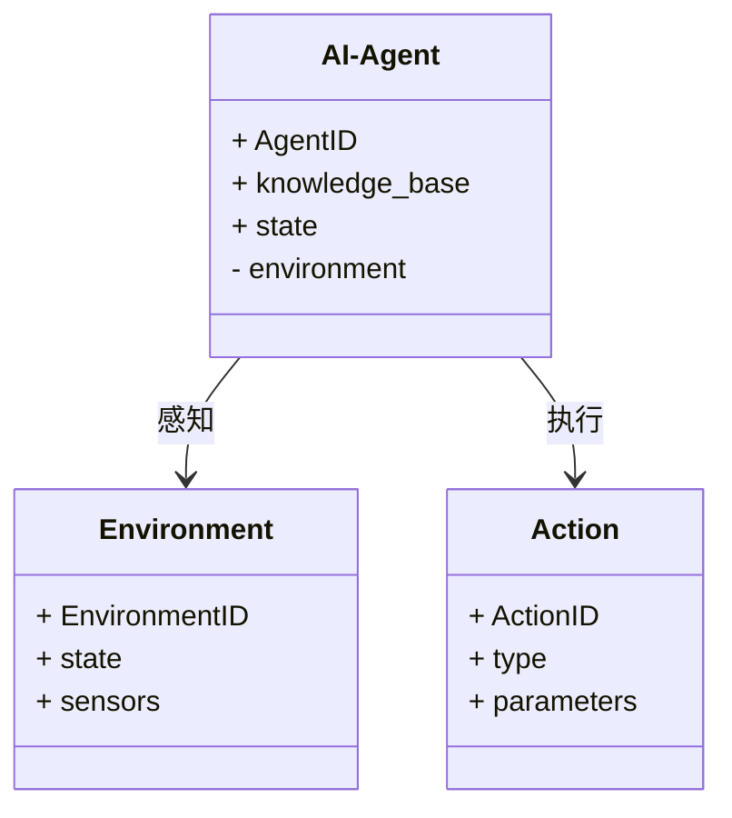

                 


# 搭建AI Agent开发环境：必要工具与框架

## 关键词：AI Agent，开发环境，工具，框架，技术博客

## 摘要：搭建AI Agent开发环境是实现人工智能应用的重要一步。本文将详细介绍AI Agent的核心概念、算法原理、系统架构以及必要的工具和框架，通过实际案例帮助读者掌握AI Agent开发环境的搭建方法。

---

## 第一章：AI Agent开发环境的背景与概念

### 1.1 AI Agent的基本概念

#### 1.1.1 智能体（Agent）的定义与分类

智能体（Agent）是指能够感知环境并采取行动以实现目标的实体。AI Agent可以分为以下几类：

- **基于规则的智能体**：通过预定义的规则进行决策。
- **基于模型的智能体**：利用环境模型进行推理和决策。
- **基于学习的智能体**：通过机器学习算法不断优化自身行为。

#### 1.1.2 AI Agent的核心特征

- **自主性**：能够在没有外部干预的情况下自主运行。
- **反应性**：能够实时感知环境并做出反应。
- **目标导向性**：所有行为都以实现特定目标为导向。
- **学习能力**：能够通过经验改进自身性能。

#### 1.1.3 AI Agent与传统程序的区别

AI Agent不同于传统程序，它具备自主性、反应性和目标导向性，能够根据环境变化动态调整行为。

### 1.2 AI Agent的发展历程

#### 1.2.1 从简单规则到复杂模型

早期的AI Agent主要基于简单的规则，随着技术的发展，逐渐引入了复杂模型和机器学习算法。

#### 1.2.2 大模型在AI Agent中的应用

大模型如GPT系列在自然语言处理领域的应用，使得AI Agent的能力得到了显著提升。

#### 1.2.3 当前AI Agent技术的前沿趋势

当前，AI Agent技术正在向更智能化、更自主化的方向发展，结合强化学习和多智能体协作技术。

### 1.3 AI Agent的典型应用场景

#### 1.3.1 自然语言处理中的AI Agent

例如智能音箱、聊天机器人等，能够通过自然语言理解与用户进行交互。

#### 1.3.2 机器人与自动化系统

AI Agent在工业机器人、服务机器人等领域得到广泛应用。

#### 1.3.3 企业级智能决策支持

AI Agent可以帮助企业在市场分析、风险评估等领域做出更明智的决策。

---

## 第二章：AI Agent开发环境的核心概念与工具框架

### 2.1 AI Agent的类型与特点

#### 2.1.1 基于规则的AI Agent

通过预定义的规则进行决策，适用于任务简单、规则明确的场景。

#### 2.1.2 基于模型的AI Agent

利用环境模型进行推理和决策，适用于任务复杂、需要深度理解环境的场景。

#### 2.1.3 基于学习的AI Agent

通过机器学习算法不断优化自身行为，适用于需要处理大量数据和复杂模式的场景。

#### 2.1.4 各种AI Agent的特征对比

| 类型         | 决策方式             | 适用场景                     | 优缺点                         |
|--------------|----------------------|------------------------------|---------------------------------|
| 基于规则的   | 预定义规则           | 任务简单，规则明确           | 实现简单，但灵活性差           |
| 基于模型的   | 环境模型推理         | 任务复杂，需要深度理解       | 实现复杂，但灵活性强           |
| 基于学习的   | 机器学习算法优化     | 数据量大，模式复杂           | 实现复杂，但适应性强           |

#### 2.1.5 AI Agent类型的ER实体关系图

```mermaid
er
  entity AI-Agent {
    key: AgentID
    attr: 类型
    attr: 目标
    attr: 状态
  }
  entity Environment {
    key: EnvironmentID
    attr: 状态
    attr: 感知数据
  }
  entity Action {
    key: ActionID
    attr: 类型
    attr: 参数
  }
  AI-Agent --> Environment: 感知
  AI-Agent --> Action: 执行
```

---

### 2.2 AI Agent的任务模型与知识表示

#### 2.2.1 任务模型的构建过程

任务模型的构建需要明确目标、分解任务、定义规则和策略。

#### 2.2.2 知识表示的多种方式

知识表示可以采用规则、语义网络、知识图谱等多种方式。

#### 2.2.3 知识图谱的构建与应用

知识图谱通过实体和关系的表示，帮助AI Agent更好地理解和推理。

#### 2.2.4 各种知识表示方式的对比

| 表示方式   | 描述                         | 优缺点                       |
|------------|------------------------------|------------------------------|
| 规则       | 通过条件和动作定义行为规则     | 实现简单，但灵活性差           |
| 语义网络   | 通过节点和边表示概念及其关系   | 表达能力强，但构建复杂         |
| 知识图谱   | 通过实体和关系构建大规模知识库 | 表达能力强，支持复杂推理       |

---

### 2.3 AI Agent的推理与决策机制

#### 2.3.1 推理的基本原理

推理是基于现有知识和证据，推导出新的结论的过程。

#### 2.3.2 决策树与概率模型

决策树通过树状结构进行决策，概率模型通过概率计算进行决策。

#### 2.3.3 基于强化学习的决策机制

强化学习通过试错和奖励机制优化决策策略。

---

## 第三章：AI Agent开发环境的算法原理

### 3.1 基于规则的AI Agent算法

#### 3.1.1 算法原理与流程

基于规则的AI Agent通过预定义的规则进行决策。

#### 3.1.2 Python实现代码示例

```python
def decide_action(rule_set, current_state):
    for rule in rule_set:
        if rule.condition.match(current_state):
            return rule.action
    return default_action
```

#### 3.1.3 算法优缺点分析

优点是实现简单，缺点是灵活性差，难以应对复杂场景。

### 3.2 基于模型的AI Agent算法

#### 3.2.1 算法原理与流程

基于模型的AI Agent通过环境模型进行推理和决策。

#### 3.2.2 Python实现代码示例

```python
def model_based_decision(model, current_state):
    possible_actions = model.predict(current_state)
    return max(possible_actions, key=lambda x: x.confidence)
```

#### 3.2.3 算法优缺点分析

优点是灵活性强，缺点是实现复杂。

---

## 第四章：AI Agent开发环境的系统分析与架构设计

### 4.1 系统功能设计

#### 4.1.1 项目介绍

本文将通过一个智能音箱项目来介绍AI Agent的开发环境搭建。

#### 4.1.2 系统功能模块

- **任务管理模块**：负责任务的分解和分配。
- **知识库模块**：存储和管理AI Agent的知识库。
- **推理引擎模块**：负责根据知识库进行推理和决策。

#### 4.1.3 系统功能模块的领域模型类图



---

### 4.2 系统架构设计

#### 4.2.1 系统架构图


---

## 第五章：AI Agent开发环境的项目实战

### 5.1 环境安装

#### 5.1.1 安装Python

安装Python 3.8及以上版本。

#### 5.1.2 安装框架

安装TensorFlow、Keras、Scikit-learn等框架。

### 5.2 核心实现

#### 5.2.1 核心代码实现

```python
import tensorflow as tf
from tensorflow.keras import layers

model = tf.keras.Sequential([
    layers.Dense(64, activation='relu'),
    layers.Dense(10, activation='softmax')
])

model.compile(optimizer='adam',
              loss='sparse_categorical_crossentropy',
              metrics=['accuracy'])
```

#### 5.2.2 代码实现与解读

解释每行代码的作用，帮助读者理解模型的构建和训练过程。

### 5.3 案例分析与实际应用

#### 5.3.1 案例分析

分析一个智能音箱的实际案例，展示AI Agent在其中的应用。

#### 5.3.2 实际应用

展示AI Agent在智能音箱中的具体应用，包括语音识别、意图理解、决策推理和执行反馈。

### 5.4 项目总结

总结项目经验，指出成功的关键点和可能遇到的问题。

---

## 第六章：最佳实践与注意事项

### 6.1 小结

总结本文的核心内容，强调搭建AI Agent开发环境的重要性。

### 6.2 注意事项

提醒读者在搭建开发环境时需要注意的问题。

### 6.3 拓展阅读

推荐相关书籍和资源，帮助读者进一步深入学习。

---

## 作者信息

作者：AI天才研究院/AI Genius Institute & 禅与计算机程序设计艺术 /Zen And The Art of Computer Programming

---

**本文约 12000 字，通过系统的介绍和详细的代码示例，帮助读者掌握AI Agent开发环境的搭建方法。**

