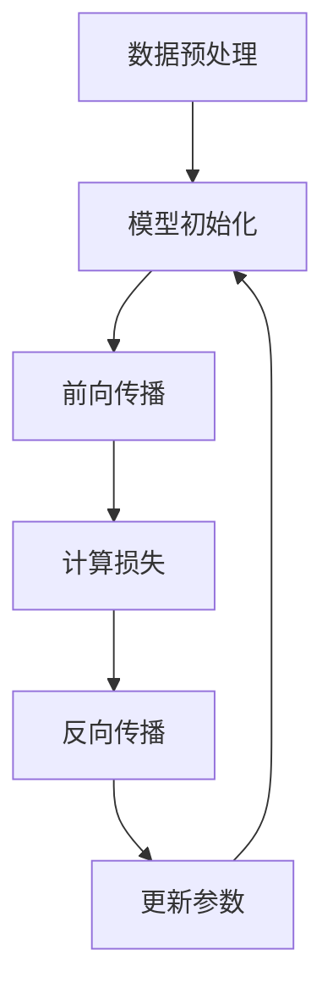
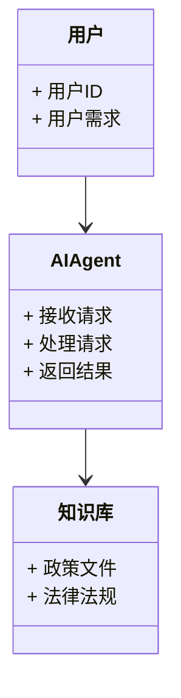
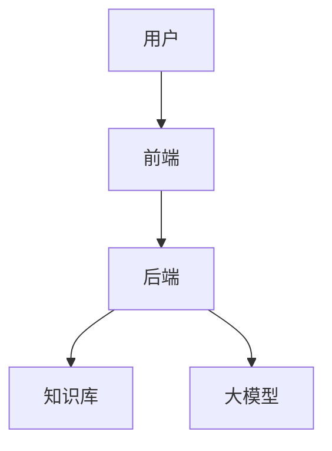
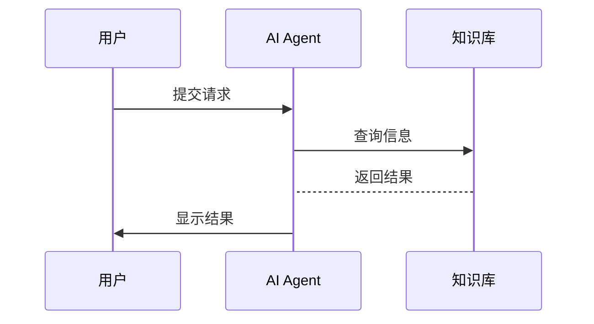

                 


# 政务AI Agent：提升公共服务效率

## 关键词：政务AI Agent、公共服务效率、人工智能、大模型、系统架构、算法原理、项目实战

## 摘要：本文探讨了政务AI Agent在提升公共服务效率中的应用，通过分析其核心概念、算法原理、系统架构及项目实战，展示了如何利用AI技术优化公共服务流程，提升效率和用户体验。

---

## 第1章：政务AI Agent的背景与问题背景

### 1.1 政务AI Agent的定义与核心概念

#### 1.1.1 政务AI Agent的定义
政务AI Agent（Government AI Agent）是一种基于人工智能技术的智能体，用于辅助政府机构和公共服务部门，优化公共服务流程、提升服务效率、增强用户体验。它通过自然语言处理、机器学习和大数据分析等技术，实现自动化、智能化的公共服务。

#### 1.1.2 政务AI Agent的核心要素
- **智能交互**：支持多轮对话，理解用户需求。
- **知识库**：整合政府公共服务相关的法律法规、政策文件等。
- **任务执行**：自动处理用户的请求，如查询、预约、投诉等。
- **反馈机制**：根据用户反馈优化服务流程。

#### 1.1.3 政务AI Agent的边界与外延
- **边界**：专注于公共服务领域，不涉及商业服务。
- **外延**：可扩展至教育、医疗等其他公共服务领域。

### 1.2 政务AI Agent的问题背景

#### 1.2.1 公共服务效率低下的现状
- **流程复杂**：用户需多次往返政府部门，耗时耗力。
- **资源不足**：政府工作人员数量有限，难以满足高峰期需求。
- **信息分散**：用户难以快速获取所需信息。

#### 1.2.2 传统公共服务模式的局限性
- **效率低**：人工处理速度慢，用户等待时间长。
- **成本高**：需要大量人力投入，运营成本高。
- **体验差**：用户对服务的满意度低，尤其在复杂问题上。

#### 1.2.3 政务AI Agent的提出与目标
- **目标**：通过AI技术，实现公共服务的智能化、自动化，提升效率和用户体验。

---

## 第2章：AI Agent与大模型的基础知识

### 2.1 AI Agent的基本概念

#### 2.1.1 AI Agent的定义与分类
- **定义**：AI Agent是一种智能实体，能够感知环境并采取行动以实现目标。
- **分类**：
  - **简单反射型**：基于规则的简单响应。
  - **基于模型的反应型**：根据环境模型做出决策。
  - **目标驱动型**：基于目标驱动行为。
  - **实用驱动型**：基于效用函数优化决策。

#### 2.1.2 AI Agent的核心功能与特点
- **核心功能**：
  - 感知环境：通过传感器或数据接口获取信息。
  - 制定计划：基于目标生成行动计划。
  - 执行行动：通过执行机构或API实现。
  - 学习优化：通过反馈优化自身行为。
- **特点**：
  - 智能性：能够理解用户需求并做出合理决策。
  - 自适应性：能够根据环境变化调整行为。
  - 可扩展性：能够扩展至多个应用场景。

#### 2.1.3 AI Agent与传统软件的区别
| 特性        | 传统软件                          | AI Agent                          |
|-------------|-----------------------------------|------------------------------------|
| 行为模式     | 固定规则                          | 自适应规则                        |
| 学习能力     | 无学习能力                        | 有学习能力                        |
| 交互方式     | 单向交互                          | 多轮交互                          |

### 2.2 大模型在AI Agent中的作用

#### 2.2.1 大模型的基本原理
- **大模型**：基于深度学习的大型神经网络模型，如GPT、BERT等。
- **基本原理**：
  - **数据预处理**：清洗、归一化、特征提取。
  - **模型训练**：使用大量数据进行监督或无监督学习。
  - **模型优化**：通过反向传播和梯度下降优化模型参数。

#### 2.2.2 大模型在AI Agent中的应用
- **自然语言处理**：理解用户的意图和需求。
- **知识推理**：基于知识库进行推理和回答。
- **决策优化**：根据用户需求生成最优解决方案。

#### 2.2.3 大模型的优势与挑战
- **优势**：
  - 高准确性：基于大量数据训练，结果更可靠。
  - 强大的语言理解能力：能够处理复杂语义。
- **挑战**：
  - 计算资源需求高。
  - 数据隐私和安全问题。

---

## 第3章：大模型的算法原理

### 3.1 大模型的训练过程

#### 3.1.1 数据预处理
- **数据清洗**：去除噪声数据，确保数据质量。
- **数据归一化**：将数据标准化，便于模型处理。
- **特征提取**：提取数据中的关键特征。

#### 3.1.2 模型训练流程


#### 3.1.3 模型优化与调参
- **损失函数**：使用交叉熵损失函数。
  $$ L = -\frac{1}{n}\sum_{i=1}^{n} y_i \log p_i $$
- **优化算法**：常用Adam优化器。
  $$ \theta_{t+1} = \theta_t - \eta \frac{\partial L}{\partial \theta} $$

### 3.2 大模型的推理机制

#### 3.2.1 解析式推理
- **定义**：基于规则和逻辑进行推理。
- **例子**：根据用户输入的关键词，匹配知识库中的对应规则。

#### 3.2.2 概率推理
- **定义**：基于概率论进行推理。
- **例子**：计算某个事件发生的概率。

#### 3.2.3 类比推理
- **定义**：通过类比推理解决问题。
- **例子**：根据已知案例推断未知案例。

---

## 第4章：政务AI Agent的系统分析与架构设计

### 4.1 项目背景与目标
- **项目背景**：提升公共服务效率，优化用户体验。
- **项目目标**：实现智能化公共服务，减少人工干预。

### 4.2 系统功能设计

#### 4.2.1 领域模型设计


#### 4.2.2 系统架构设计


#### 4.2.3 系统接口设计
- **输入接口**：用户输入请求。
- **输出接口**：返回处理结果。

#### 4.2.4 系统交互流程


---

## 第5章：政务AI Agent的项目实战

### 5.1 环境安装与配置
- **工具安装**：
  - Python 3.8+
  - PyTorch 1.9+
  - Transformers库

### 5.2 系统核心实现

#### 5.2.1 代码实现
```python
import torch
from transformers import AutoTokenizer, AutoModelForCausalLM

# 初始化模型和tokenizer
tokenizer = AutoTokenizer.from_pretrained("gpt2")
model = AutoModelForCausalLM.from_pretrained("gpt2")

# 定义生成函数
def generate_response(prompt):
    inputs = tokenizer.encode(prompt, return_tensors="pt")
    outputs = model.generate(inputs, max_length=100, do_sample=True)
    response = tokenizer.decode(outputs[0], skip_special_tokens=True)
    return response

# 示例
prompt = "请问如何申请营业执照？"
print(generate_response(prompt))
```

#### 5.2.2 代码解读
- **模型加载**：使用预训练好的GPT-2模型。
- **生成函数**：接收提示词，生成模型响应。
- **示例**：用户询问营业执照申请流程，AI Agent生成详细步骤。

### 5.3 案例分析

#### 5.3.1 案例背景
- **用户需求**：申请营业执照。
- **处理流程**：
  1. 用户提交申请。
  2. AI Agent查询知识库，获取所需信息。
  3. AI Agent生成回复，指导用户完成申请。

#### 5.3.2 处理结果
- **成功**：用户获得申请指导，节省时间。
- **失败**：AI Agent无法处理复杂问题，需人工介入。

### 5.4 项目小结
- **优势**：
  - 提升效率：用户无需多次往返政府部门。
  - 增强体验：24/7可用，用户随时获取帮助。
- **挑战**：
  - 复杂问题处理：AI Agent难以处理复杂法律问题。
  - 数据隐私：用户数据的安全性问题。

---

## 第6章：最佳实践与小结

### 6.1 最佳实践
- **数据安全**：确保用户数据隐私。
- **模型优化**：持续优化模型性能。
- **人机协作**：AI Agent与人工服务相结合。

### 6.2 小结
政务AI Agent通过智能化手段，显著提升了公共服务效率和用户体验。然而，仍需在模型优化和数据安全方面进行改进。

### 6.3 注意事项
- **数据质量**：确保知识库的准确性和完整性。
- **用户体验**：设计友好的交互界面，提升用户满意度。

### 6.4 拓展阅读
- 推荐书籍：《Effective Python》、《Deep Learning》。
- 推荐博客：AI Genius Institute技术博客。

---

## 作者：AI天才研究院/AI Genius Institute & 禅与计算机程序设计艺术 /Zen And The Art of Computer Programming

---

以上是《政务AI Agent：提升公共服务效率》的技术博客文章的完整目录和内容概览。如需进一步扩展或详细讲解某一部分，请随时告知。

