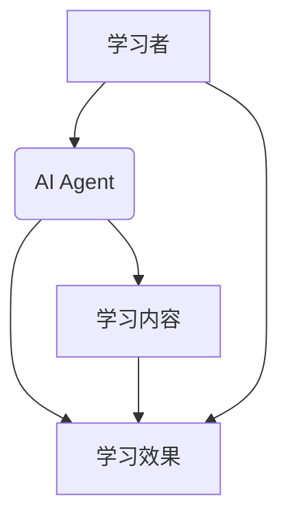
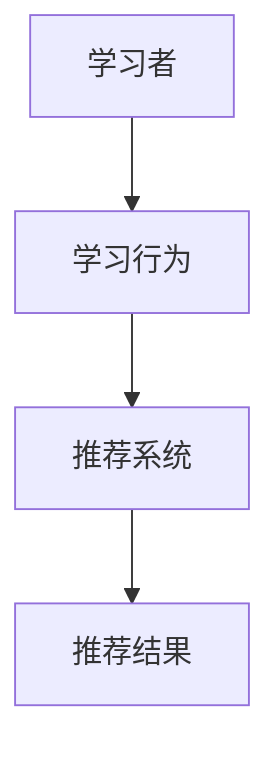
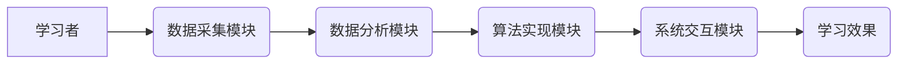
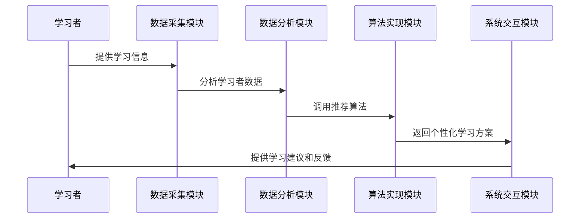

                 


# 教育领域AI Agent的个性化学习方案

> 关键词：AI Agent，个性化学习，教育，推荐系统，深度学习，教育技术

> 摘要：本文详细探讨了教育领域中AI Agent如何通过个性化学习方案提升学习效果。从背景介绍、核心概念、算法原理到系统架构设计，再到项目实战和最佳实践，系统地分析了AI Agent在教育中的应用。本文旨在为教育技术从业者、研究人员以及教育用户提供理论指导和实践参考。

---

## 第一部分：教育领域AI Agent的背景与核心概念

### 第1章：AI Agent与个性化学习概述

#### 1.1 AI Agent的基本概念

##### 1.1.1 AI Agent的定义
人工智能代理（AI Agent）是指能够感知环境、执行任务并做出决策的智能体。在教育领域，AI Agent通常以软件或应用程序的形式存在，能够通过数据驱动的方式为学习者提供个性化支持。

##### 1.1.2 AI Agent的核心特征
- **自主性**：能够独立执行任务。
- **反应性**：能够实时感知并响应环境变化。
- **目标导向**：以实现特定目标为导向。
- **学习能力**：能够通过数据和反馈不断优化自身行为。

##### 1.1.3 教育领域中的AI Agent应用
AI Agent在教育领域的应用广泛，包括智能推荐、学习路径规划、实时反馈、个性化辅导等。

---

#### 1.2 个性化学习的需求与挑战

##### 1.2.1 个性化学习的定义
个性化学习是指根据学习者的个性特点、学习需求和学习进度，量身定制的学习方案。

##### 1.2.2 当前教育中的个性化学习现状
传统教育模式多为标准化教学，难以满足每个学习者的个性化需求。个性化学习在教育中的应用仍处于起步阶段，存在以下问题：
- 数据不足或不准确。
- 算法复杂性高，难以实时调整。
- 个性化学习方案缺乏系统性和连贯性。

##### 1.2.3 个性化学习的主要挑战
- 学习者数据的采集和处理难度大。
- 算法模型的复杂性和计算成本高。
- 个性化学习方案的可解释性和可操作性不足。

---

#### 1.3 教育领域AI Agent的优势

##### 1.3.1 AI Agent在教育中的独特价值
- 提供实时、动态的学习支持。
- 根据学习者特点优化学习路径。
- 提供个性化的学习资源推荐。

##### 1.3.2 AI Agent如何实现个性化学习
通过数据采集、分析和建模，AI Agent能够根据学习者的特点和需求，实时调整学习方案。

##### 1.3.3 AI Agent的教育应用场景
- 智能推荐系统：根据学习者的兴趣和能力推荐学习资源。
- 学习路径规划：为学习者定制个性化的学习计划。
- 实时反馈：根据学习者的进度提供实时反馈和指导。

---

### 第2章：教育领域AI Agent的核心概念与联系

#### 2.1 核心概念原理

##### 2.1.1 AI Agent的核心算法原理
AI Agent的核心算法包括推荐系统、自然语言处理和强化学习等。在教育领域，推荐系统是最常用的算法之一。

##### 2.1.2 个性化学习的数学模型
个性化学习的数学模型通常基于统计学习和机器学习，如协同过滤、矩阵分解和深度学习模型。

##### 2.1.3 教育数据的特征分析
教育数据通常包括学习者的特征（如兴趣、能力、学习风格）和学习内容的特征（如难度、知识点、资源类型）。

---

#### 2.2 核心概念对比表

| 对比维度 | AI Agent | 传统教学工具 | 个性化学习 |
|----------|-----------|--------------|------------|
| 定义     | 智能体，通过数据驱动提供个性化支持 | 工具，用于辅助教学活动 | 根据学习者需求定制学习方案 |
| 功能     | 实时反馈、个性化推荐、自适应调整 | 提供固定资源、单向传授知识 | 灵活调整学习路径 |
| 优势     | 高度个性化、动态调整、数据驱动 | 简单易用、适用范围广 | 高度定制化、满足个体需求 |

---

#### 2.3 实体关系图



---

## 第三部分：教育领域AI Agent的算法原理

### 第3章：教育领域AI Agent的算法原理

#### 3.1 推荐系统算法

##### 3.1.1 协同过滤算法
协同过滤是一种基于用户行为相似性的推荐算法。在教育领域，协同过滤可以用于推荐学习资源。



##### 3.1.2 深度学习算法
深度学习算法在教育领域的应用越来越广泛。例如，基于神经网络的推荐系统可以更准确地预测学习者的需求。

---

#### 3.2 深度学习算法

##### 3.2.1 基于神经网络的推荐系统
```python
import numpy as np

class NeuralNetwork:
    def __init__(self, input_size, hidden_size, output_size):
        self.weights_input_hidden = np.random.randn(input_size, hidden_size)
        self.weights_hidden_output = np.random.randn(hidden_size, output_size)
    
    def forward(self, X):
        self.hidden = np.dot(X, self.weights_input_hidden)
        self.predictions = np.dot(self.hidden, self.weights_hidden_output)
        return self.predictions
    
    def backward(self, y, learning_rate):
        delta_output = (y - self.predictions) * learning_rate
        delta_hidden = np.dot(delta_output, self.weights_hidden_output.T)
        self.weights_input_hidden += np.dot(X.T, delta_hidden)
        self.weights_hidden_output += np.dot(self.hidden.T, delta_output)
```

##### 3.2.2 Transformer模型在教育中的应用
Transformer模型广泛应用于自然语言处理领域，但在教育领域也可以用于学习内容的生成和推荐。

---

### 第4章：教育领域AI Agent的数学模型与公式

#### 4.1 推荐系统的数学模型

##### 4.1.1 矩阵分解模型
矩阵分解是一种常用的推荐算法，其公式如下：

$$R_{u,i} = q_u^T p_i + b_u + b_i + \epsilon_{u,i}$$

其中：
- $R_{u,i}$ 表示学习者 $u$ 对资源 $i$ 的评分。
- $q_u$ 表示学习者 $u$ 的特征向量。
- $p_i$ 表示资源 $i$ 的特征向量。
- $b_u$ 表示学习者 $u$ 的偏置项。
- $b_i$ 表示资源 $i$ 的偏置项。
- $\epsilon_{u,i}$ 表示噪声项。

---

## 第四部分：教育领域AI Agent的系统分析与架构设计

### 第5章：教育领域AI Agent的系统架构设计

#### 5.1 问题场景介绍
在教育领域，AI Agent需要解决的核心问题是为学习者提供个性化的学习方案。这需要结合学习者的特征、学习目标和学习内容等多个因素。

#### 5.2 项目介绍
本项目旨在设计一个教育领域AI Agent系统，通过个性化学习方案的推荐和实施，提升学习者的学习效果。

#### 5.3 系统功能设计
系统功能模块包括：
- 数据采集模块：采集学习者的基本信息、学习行为和学习结果。
- 数据分析模块：分析学习者数据，提取特征并构建学习者画像。
- 算法实现模块：基于机器学习算法生成个性化学习方案。
- 系统交互模块：通过人机交互界面与学习者互动，实时反馈学习效果。

#### 5.4 系统架构设计

##### 5.4.1 系统架构图


##### 5.4.2 系统接口设计
系统接口主要包括：
- 数据采集接口：用于采集学习者的基本信息和学习行为数据。
- 算法调用接口：用于调用推荐算法生成个性化学习方案。
- 用户交互接口：用于与学习者进行实时互动和反馈。

##### 5.4.3 系统交互流程


---

## 第五部分：教育领域AI Agent的项目实战

### 第6章：项目实战

#### 6.1 环境配置

##### 6.1.1 环境需求
- Python 3.8+
- TensorFlow 2.0+
- scikit-learn 1.0+

#### 6.2 核心代码实现

##### 6.2.1 数据采集与预处理
```python
import pandas as pd

# 读取数据
data = pd.read_csv('learning_data.csv')

# 数据预处理
data['timestamp'] = pd.to_datetime(data['timestamp'])
data.sort_values('timestamp', inplace=True)
```

##### 6.2.2 算法实现
```python
from sklearn.model_selection import train_test_split
from sklearn.metrics import accuracy_score

# 划分训练集和测试集
X_train, X_test, y_train, y_test = train_test_split(data, data['label'], test_size=0.2)

# 训练模型
model = RandomForestClassifier()
model.fit(X_train, y_train)

# 预测结果
y_pred = model.predict(X_test)
print("Accuracy:", accuracy_score(y_test, y_pred))
```

#### 6.3 功能解读与分析

##### 6.3.1 功能解读
- 数据采集模块：负责采集学习者的基本信息、学习行为和学习结果。
- 数据分析模块：对学习者数据进行特征提取和分析，构建学习者画像。
- 算法实现模块：基于机器学习算法生成个性化学习方案。
- 系统交互模块：与学习者进行实时互动，提供个性化学习建议和反馈。

##### 6.3.2 功能分析
通过以上功能模块的实现，系统能够根据学习者的特点和需求，实时调整学习方案，提升学习效果。

#### 6.4 实际案例分析

##### 6.4.1 案例背景
假设我们有一个数学学习辅导系统，目标是为学习者提供个性化的数学学习方案。

##### 6.4.2 案例分析
通过数据分析模块，系统发现某个学习者在代数方面存在较大的困难。算法实现模块会推荐相关的代数练习题和教学视频，并通过系统交互模块实时跟踪学习者的学习进度，提供针对性的反馈。

---

## 第六部分：教育领域AI Agent的最佳实践

### 第7章：最佳实践

#### 7.1 小结
通过本篇文章的分析和实践，我们可以看到，AI Agent在教育领域的应用前景广阔。通过个性化学习方案的推荐和实施，能够显著提升学习者的学习效果。

#### 7.2 注意事项
- 数据隐私和安全问题需要特别注意。
- 算法的可解释性和透明度需要进一步提升。
- 系统的实时性和响应速度需要优化。

#### 7.3 拓展阅读
- 《推荐系统实践》
- 《深度学习在教育中的应用》
- 《个性化学习的理论与实践》

---

## 作者：AI天才研究院 & 禅与计算机程序设计艺术

作者简介：AI天才研究院（AI Genius Institute）专注于人工智能技术的研究与应用，致力于推动AI技术在教育、医疗、金融等领域的创新应用。禅与计算机程序设计艺术（Zen And The Art of Computer Programming）旨在探索计算机程序设计的本质与美学，追求技术与艺术的完美结合。

