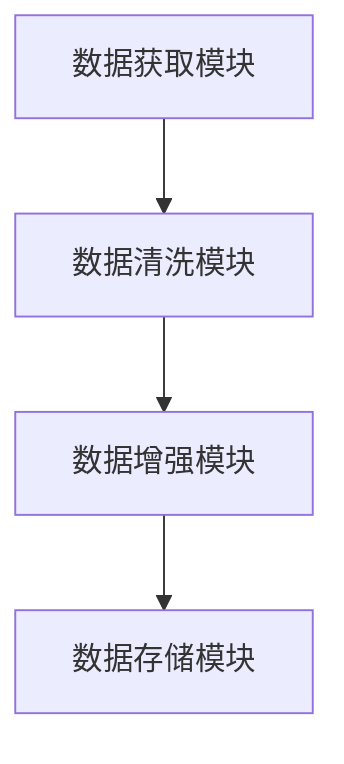

                 


# 数据收集策略：为AI Agent打造高质量数据集

**关键词**：数据收集策略，AI Agent，数据集构建，数据清洗，数据增强，数据安全

**摘要**：  
在人工智能（AI）快速发展的今天，数据是AI Agent的核心燃料。高质量的数据集是AI Agent性能和决策能力的基础。本文将深入探讨数据收集策略，从背景介绍到系统架构设计，再到实战案例，全面解析如何为AI Agent打造高质量数据集。通过详细讲解数据收集的核心概念、算法原理、系统架构设计以及最佳实践，本文将为读者提供一份实用的指南，帮助他们掌握数据收集的关键技术与方法。

---

## 第1章：数据收集的背景与重要性

### 1.1 数据收集的背景介绍
数据是AI Agent的核心输入，决定了其输出的质量和准确性。随着AI技术的普及，数据收集的范围和复杂性也在不断增加。

#### 1.1.1 数据在AI Agent中的核心作用
AI Agent依赖数据进行推理、学习和决策。高质量的数据能够显著提升AI Agent的性能，使其更好地服务于用户。

#### 1.1.2 数据收集的基本概念
数据收集是指从各种来源（如数据库、API、传感器等）获取数据的过程。数据可以是结构化、半结构化或非结构化的。

#### 1.1.3 数据收集的必要性与挑战
数据收集是AI Agent训练和推理的基础。然而，数据收集面临数据稀疏性、噪声干扰和隐私保护等挑战。

### 1.2 AI Agent与数据收集的关系
AI Agent的性能高度依赖于数据的质量和多样性。数据收集策略直接影响AI Agent的学习能力和应用场景。

#### 1.2.1 AI Agent的基本概念
AI Agent是能够感知环境、自主决策的智能实体。它依赖数据进行推理和决策。

#### 1.2.2 数据收集在AI Agent中的作用
数据收集为AI Agent提供训练数据和实时输入，确保其能够准确感知环境并做出合理决策。

#### 1.2.3 数据质量对AI Agent性能的影响
高质量的数据能够提升AI Agent的准确性和鲁棒性，而低质量的数据可能导致错误决策。

### 1.3 数据收集的常见挑战
数据收集过程中面临数据来源多样性、数据质量保障和数据安全等挑战。

#### 1.3.1 数据来源的多样性
数据可以来自数据库、API、传感器、日志文件等多种来源，每种来源都有其特点和难点。

#### 1.3.2 数据质量的保障
数据清洗和数据增强是提升数据质量的关键步骤，确保数据准确、完整和一致。

#### 1.3.3 数据收集的法律与伦理问题
数据收集必须遵守相关法律法规，保护用户隐私，避免数据滥用。

### 1.4 本章小结
数据收集是AI Agent的核心环节，其质量和策略直接影响AI Agent的性能。下一章将深入探讨数据收集的核心概念与联系。

---

## 第2章：数据收集的核心概念与联系

### 2.1 数据类型与特征
数据的类型和特征是数据收集的基础，决定了数据的处理方式和应用场景。

#### 2.1.1 数据类型的分类
- **结构化数据**：如表格数据（CSV、JSON）。
- **半结构化数据**：如日志文件。
- **非结构化数据**：如文本、图像。

#### 2.1.2 数据特征的分类
- **类别特征**：如性别、职业。
- **数值特征**：如年龄、收入。
- **文本特征**：如评论、描述。

#### 2.1.3 数据质量的评估指标
- 准确性：数据是否真实反映现实。
- 完整性：数据是否完整无缺失。
- 一致性：数据是否格式统一。

#### 2.1.4 数据特征与AI Agent的需求
AI Agent需要多样化的数据特征来提升其泛化能力。

### 2.2 数据收集的策略分类
数据收集策略的选择直接影响数据的质量和收集效率。

#### 2.2.1 数据收集的主动与被动方式
- **主动收集**：如爬虫主动抓取数据。
- **被动收集**：如用户主动提交数据。

#### 2.2.2 数据收集的定量与定性方式
- **定量收集**：如数值数据的统计。
- **定性收集**：如文本数据的分类。

#### 2.2.3 数据收集的实时与批量方式
- **实时收集**：如传感器实时数据。
- **批量收集**：如定期批量导出数据。

#### 2.2.4 数据收集策略的优缺点对比
| 策略类型 | 优点 | 缺点 |
|----------|------|------|
| 主动收集 | 数据精准 | 成本高 |
| 被动收集 | 成本低 | 数据质量低 |

### 2.3 数据安全与隐私保护
数据安全是数据收集过程中不可忽视的重要环节。

#### 2.3.1 数据收集中的隐私问题
- 数据收集必须遵守GDPR等隐私保护法规。
- 数据匿名化处理是保护隐私的重要手段。

#### 2.3.2 数据加密与匿名化处理
- 数据在传输和存储过程中必须加密。
- 匿名化处理可以有效保护用户隐私。

#### 2.3.3 数据安全的法律规范
- 遵守数据保护相关法律法规，如GDPR。

### 2.4 数据收集的核心要素
数据收集的核心要素包括数据来源、数据格式、数据质量和数据安全。

#### 2.4.1 数据来源的多样性
多样化的数据来源能够提升数据的代表性和鲁棒性。

#### 2.4.2 数据格式的统一性
统一的数据格式能够简化数据处理流程，提升效率。

#### 2.4.3 数据质量的保障
数据清洗和数据增强是提升数据质量的关键步骤。

#### 2.4.4 数据安全的保障
数据加密、匿名化处理和访问控制是保障数据安全的重要措施。

### 2.5 数据收集的流程
数据收集的流程包括数据获取、数据清洗、数据增强和数据存储。

#### 2.5.1 数据获取
从各种来源获取数据，如爬虫、API调用、传感器采集等。

#### 2.5.2 数据清洗
去除噪声数据，填补缺失值，消除重复数据。

#### 2.5.3 数据增强
通过数据增强技术提升数据的多样性和鲁棒性，如图像旋转、文本同义词替换等。

#### 2.5.4 数据存储
将处理后的数据存储到数据库或数据仓库中，方便后续使用。

### 2.6 数据收集的挑战与解决方案
数据收集过程中面临数据稀疏性、噪声干扰和隐私保护等挑战。

#### 2.6.1 数据稀疏性
- 数据稀疏性是指某些数据点的缺失或不足，导致模型无法有效学习。
- 解决方案：通过数据增强技术生成更多数据，或使用迁移学习技术。

#### 2.6.2 数据噪声干扰
- 数据噪声是指数据中的错误或不一致，影响模型的性能。
- 解决方案：通过数据清洗技术去除噪声，或使用鲁棒的模型训练方法。

#### 2.6.3 数据隐私保护
- 数据隐私保护是数据收集过程中必须考虑的重要问题。
- 解决方案：采用数据匿名化处理、数据加密传输等技术。

### 2.7 数据收集的核心目标
数据收集的核心目标是为AI Agent提供高质量、多样化的数据，支持其高效运行和决策。

#### 2.7.1 数据的多样性
多样化的数据能够提升AI Agent的泛化能力，使其能够应对更多场景。

#### 2.7.2 数据的准确性
准确的数据能够提升AI Agent的决策能力和预测精度。

#### 2.7.3 数据的完整性
完整的数据能够提供更全面的信息，支持AI Agent做出更合理的决策。

#### 2.7.4 数据的实时性
实时数据能够支持AI Agent进行实时决策和动态调整。

### 2.8 数据收集的关键成功因素
数据收集的成功取决于数据来源的多样性、数据质量的保障和数据安全的保护。

#### 2.8.1 数据来源的多样性
多样化的数据来源能够提供更全面的信息，支持AI Agent的决策。

#### 2.8.2 数据质量的保障
高质量的数据能够提升AI Agent的性能和准确率。

#### 2.8.3 数据安全的保护
数据安全是数据收集过程中不可忽视的重要环节，能够保护用户隐私和数据机密。

### 2.9 本章小结
数据收集的核心概念包括数据类型、数据特征、数据策略和数据安全。下一章将深入探讨数据收集的算法原理。

---

## 第3章：数据收集的算法原理

### 3.1 数据收集的算法概述
数据收集的算法是实现高效数据收集的关键。

#### 3.1.1 数据收集算法的基本概念
数据收集算法是用于从各种来源获取数据的算法。

#### 3.1.2 数据收集算法的分类
- 网络爬虫算法。
- 数据库查询算法。
- 传感器数据采集算法。

### 3.2 网络爬虫算法
网络爬虫是数据收集的重要手段，广泛应用于网页数据抓取。

#### 3.2.1 网络爬虫的基本原理
网络爬虫通过模拟浏览器的行为，从网页中抓取数据。

#### 3.2.2 网络爬虫的实现步骤
1. 发送HTTP请求到目标网页。
2. 解析响应内容，提取所需数据。
3. 存储提取的数据。

#### 3.2.3 网络爬虫的代码实现
以下是Python代码示例：

```python
import requests
from bs4 import BeautifulSoup

url = 'https://example.com'
response = requests.get(url)
html_content = response.text
soup = BeautifulSoup(html_content, 'html.parser')
data = soup.find_all('div', class_='data-item')
# 提取数据并存储
```

### 3.3 数据库查询算法
通过数据库查询获取数据是另一种常见的数据收集方式。

#### 3.3.1 数据库查询的基本原理
通过SQL查询从数据库中获取数据。

#### 3.3.2 数据库查询的实现步骤
1. 连接数据库。
2. 执行查询语句。
3. 获取查询结果。
4. 处理结果数据。

#### 3.3.3 数据库查询的代码实现
以下是Python代码示例：

```python
import sqlite3

conn = sqlite3.connect('database.db')
cursor = conn.cursor()
query = 'SELECT * FROM table_name'
cursor.execute(query)
results = cursor.fetchall()
# 处理结果数据
```

### 3.4 传感器数据采集算法
传感器数据采集是另一种重要的数据收集方式。

#### 3.4.1 传感器数据采集的基本原理
通过传感器采集物理世界的数据，如温度、湿度等。

#### 3.4.2 传感器数据采集的实现步骤
1. 连接传感器设备。
2. 读取传感器数据。
3. 处理数据并存储。

#### 3.4.3 传感器数据采集的代码实现
以下是Python代码示例：

```python
import serial

ser = serial.Serial('COM3', 9600)
data = ser.readline().decode('utf-8')
# 处理数据并存储
```

### 3.5 数据收集算法的优化
为了提高数据收集的效率和准确性，可以采取以下优化措施。

#### 3.5.1 数据收集的并行化
通过并行化技术同时从多个来源获取数据，提高效率。

#### 3.5.2 数据收集的缓存机制
通过缓存机制避免重复获取相同数据，减少网络请求次数。

#### 3.5.3 数据收集的错误处理
通过错误处理机制，确保数据收集过程的健壮性。

### 3.6 数据收集算法的数学模型
数据收集算法的数学模型可以用于优化数据收集过程。

#### 3.6.1 数据收集的数学模型概述
数据收集算法的数学模型可以帮助我们更好地理解数据收集过程。

#### 3.6.2 数据收集的数学模型示例
以下是一个简单的数据收集模型：

$$
\text{数据质量} = \sum_{i=1}^{n} \text{特征}_i \times \text{权重}_i
$$

其中，$\text{特征}_i$ 是数据的第$i$个特征，$\text{权重}_i$ 是该特征的权重。

### 3.7 数据收集算法的性能评估
数据收集算法的性能评估是优化数据收集过程的重要环节。

#### 3.7.1 数据收集的性能指标
- 数据获取速度。
- 数据准确性。
- 数据完整性。

#### 3.7.2 数据收集算法的性能优化
通过分析性能指标，优化数据收集算法，提高数据收集效率和质量。

### 3.8 数据收集算法的实现细节
数据收集算法的实现细节直接影响数据收集的效果。

#### 3.8.1 数据收集的代码实现
以下是Python代码示例：

```python
import requests
import time

def collect_data(url):
    try:
        response = requests.get(url)
        return response.json()
    except Exception as e:
        print(f'Error collecting data: {e}')
        return None

# 循环收集数据
while True:
    data = collect_data('https://example.com/api')
    if data:
        process_data(data)
    time.sleep(60)
```

#### 3.8.2 数据收集的错误处理
在数据收集过程中，需要处理各种可能出现的错误，如网络错误、数据格式错误等。

#### 3.8.3 数据收集的日志记录
通过日志记录数据收集过程中的关键信息，便于调试和优化。

### 3.9 数据收集算法的案例分析
以下是数据收集算法在实际应用中的案例分析。

#### 3.9.1 网络爬虫案例
- **场景**：从电商网站爬取商品信息。
- **实现**：使用网络爬虫技术获取商品价格、评价等信息。
- **代码示例**：

```python
import requests
from bs4 import BeautifulSoup

url = 'https://example.com/products'
response = requests.get(url)
html_content = response.text
soup = BeautifulSoup(html_content, 'html.parser')
products = soup.find_all('div', class_='product-item')
for product in products:
    title = product.find('h3').text
    price = product.find('span', class_='price').text
    print(f'Product: {title}, Price: {price}')
```

#### 3.9.2 数据库查询案例
- **场景**：从用户数据库中查询用户信息。
- **实现**：使用SQL查询语句获取用户信息。
- **代码示例**：

```python
import sqlite3

conn = sqlite3.connect('users.db')
cursor = conn.cursor()
query = 'SELECT * FROM users WHERE age > 25'
cursor.execute(query)
results = cursor.fetchall()
for user in results:
    print(f'Username: {user[0]}, Age: {user[1]}')
```

#### 3.9.3 传感器数据采集案例
- **场景**：从温度传感器中采集温度数据。
- **实现**：使用串口通信技术读取温度数据。
- **代码示例**：

```python
import serial

ser = serial.Serial('COM3', 9600)
data = ser.readline().decode('utf-8')
temperature = float(data.split(',')[0])
print(f'Temperature: {temperature}°C')
```

### 3.10 本章小结
数据收集的算法原理包括网络爬虫、数据库查询和传感器数据采集等技术。下一章将深入探讨数据收集的系统分析与架构设计。

---

## 第4章：数据收集的系统分析与架构设计

### 4.1 系统分析
数据收集系统的分析是构建高质量数据集的重要环节。

#### 4.1.1 系统分析的基本概念
系统分析是指对数据收集系统的需求、功能和性能进行分析。

#### 4.1.2 系统分析的步骤
1. 明确需求。
2. 分析功能需求。
3. 分析性能需求。

#### 4.1.3 系统分析的工具
- 需求分析工具：如JIRA、Trello。
- 问题分析工具：如鱼骨图、因果图。

### 4.2 系统功能设计
数据收集系统的功能设计是构建高质量数据集的关键。

#### 4.2.1 系统功能需求
- 数据获取模块。
- 数据清洗模块。
- 数据增强模块。
- 数据存储模块。

#### 4.2.2 系统功能设计的详细说明
- **数据获取模块**：负责从各种来源获取数据。
- **数据清洗模块**：负责去除噪声数据，填补缺失值。
- **数据增强模块**：负责通过数据增强技术提升数据的多样性和鲁棒性。
- **数据存储模块**：负责将处理后的数据存储到数据库或数据仓库中。

### 4.3 系统架构设计
数据收集系统的架构设计是构建高质量数据集的基础。

#### 4.3.1 系统架构设计的基本概念
系统架构设计是指对系统的整体结构、功能模块和接口进行设计。

#### 4.3.2 系统架构设计的步骤
1. 确定系统目标。
2. 分析系统功能。
3. 设计系统架构。
4. 优化系统架构。

#### 4.3.3 系统架构设计的工具
- 架构设计工具：如Lucidchart、Draw.io。
- 代码生成工具：如JHipster、Spring Initializr。

### 4.4 系统架构图
以下是数据收集系统的系统架构图：



### 4.5 系统接口设计
数据收集系统的接口设计是实现数据收集的关键。

#### 4.5.1 系统接口的基本概念
系统接口是指系统与其他模块或外部系统的交互界面。

#### 4.5.2 系统接口的设计步骤
1. 确定接口的功能。
2. 定义接口的参数。
3. 设计接口的调用方式。

#### 4.5.3 系统接口的实现
以下是Python代码示例：

```python
class DataCollector:
    def collect_data(self):
        # 收集数据
        pass

    def clean_data(self):
        # 清洗数据
        pass

    def enhance_data(self):
        # 增强数据
        pass

    def store_data(self):
        # 存储数据
        pass
```

### 4.6 系统交互流程
数据收集系统的交互流程是实现数据收集的关键。

#### 4.6.1 系统交互的基本概念
系统交互是指系统与用户、其他系统或设备之间的互动。

#### 4.6.2 系统交互的步骤
1. 用户发起数据收集请求。
2. 系统接收请求并处理。
3. 系统返回处理结果。

#### 4.6.3 系统交互的代码实现
以下是Python代码示例：

```python
def collect_data():
    # 收集数据
    pass

def process_data():
    # 处理数据
    pass

def main():
    collect_data()
    process_data()

if __name__ == '__main__':
    main()
```

### 4.7 系统架构的优化
数据收集系统的架构优化是提升数据收集效率和质量的重要手段。

#### 4.7.1 系统架构的优化步骤
1. 优化数据获取模块。
2. 优化数据清洗模块。
3. 优化数据增强模块。
4. 优化数据存储模块。

#### 4.7.2 系统架构的优化工具
- 性能优化工具：如Profiler、Pylint。
- 架构优化工具：如Django、Spring。

### 4.8 数据收集系统的实现细节
数据收集系统的实现细节直接影响数据收集的效果。

#### 4.8.1 数据收集的代码实现
以下是Python代码示例：

```python
import requests
import sqlite3
from bs4 import BeautifulSoup

def collect_data(url):
    response = requests.get(url)
    html_content = response.text
    soup = BeautifulSoup(html_content, 'html.parser')
    data = []
    for item in soup.find_all('div', class_='data-item'):
        data.append({
            'id': item.find('id').text,
            'name': item.find('name').text,
            'value': item.find('value').text
        })
    return data

def clean_data(data):
    cleaned_data = []
    for item in data:
        if item['value']:
            cleaned_data.append(item)
    return cleaned_data

def enhance_data(data):
    enhanced_data = data.copy()
    for item in enhanced_data:
        item['source'] = '爬虫'
    return enhanced_data

def store_data(data):
    conn = sqlite3.connect('data.db')
    cursor = conn.cursor()
    cursor.execute('CREATE TABLE IF NOT EXISTS dataset (id TEXT PRIMARY KEY, name TEXT, value TEXT, source TEXT)')
    for item in data:
        cursor.execute('INSERT INTO dataset VALUES (?, ?, ?, ?)',
                       (item['id'], item['name'], item['value'], item['source']))
    conn.commit()
    conn.close()

def main():
    url = 'https://example.com/data'
    data = collect_data(url)
    cleaned_data = clean_data(data)
    enhanced_data = enhance_data(cleaned_data)
    store_data(enhanced_data)
    print('数据收集完成！')

if __name__ == '__main__':
    main()
```

#### 4.8.2 数据收集的错误处理
在数据收集过程中，需要处理各种可能出现的错误，如网络错误、数据格式错误等。

#### 4.8.3 数据收集的日志记录
通过日志记录数据收集过程中的关键信息，便于调试和优化。

### 4.9 数据收集系统的案例分析
以下是数据收集系统的案例分析。

#### 4.9.1 网络爬虫案例
- **场景**：从电商网站爬取商品信息。
- **实现**：使用网络爬虫技术获取商品价格、评价等信息。
- **代码示例**：

```python
import requests
from bs4 import BeautifulSoup

def collect_product_info(url):
    response = requests.get(url)
    html_content = response.text
    soup = BeautifulSoup(html_content, 'html.parser')
    products = soup.find_all('div', class_='product-item')
    data = []
    for product in products:
        title = product.find('h3').text
        price = product.find('span', class_='price').text
        data.append({'title': title, 'price': price})
    return data

def main():
    url = 'https://example.com/products'
    data = collect_product_info(url)
    print('Product Information:')
    for item in data:
        print(f'标题: {item["title"]}, 价格: {item["price"]}')

if __name__ == '__main__':
    main()
```

#### 4.9.2 数据库查询案例
- **场景**：从用户数据库中查询用户信息。
- **实现**：使用SQL查询语句获取用户信息。
- **代码示例**：

```python
import sqlite3

def query_users():
    conn = sqlite3.connect('users.db')
    cursor = conn.cursor()
    query = 'SELECT * FROM users WHERE age > 25'
    cursor.execute(query)
    results = cursor.fetchall()
    users = []
    for row in results:
        users.append({'id': row[0], 'name': row[1], 'age': row[2]})
    return users

def main():
    users = query_users()
    print('符合条件的用户:')
    for user in users:
        print(f'ID: {user["id"]}, 姓名: {user["name"]}, 年龄: {user["age"]}')

if __name__ == '__main__':
    main()
```

#### 4.9.3 传感器数据采集案例
- **场景**：从温度传感器中采集温度数据。
- **实现**：使用串口通信技术读取温度数据。
- **代码示例**：

```python
import serial

def collect_temperature():
    ser = serial.Serial('COM3', 9600)
    data = ser.readline().decode('utf-8')
    temperature = float(data.split(',')[0])
    return temperature

def main():
    temp = collect_temperature()
    print(f'当前温度: {temp}°C')

if __name__ == '__main__':
    main()
```

### 4.10 本章小结
数据收集的系统分析与架构设计是构建高质量数据集的重要环节。下一章将深入探讨数据收集的项目实战。

---

## 第5章：数据收集的项目实战

### 5.1 项目环境安装
数据收集项目的环境安装是实现数据收集的第一步。

#### 5.1.1 项目环境的安装步骤
1. 安装Python。
2. 安装必要的库，如requests、BeautifulSoup、pymysql、serial等。

#### 5.1.2 项目环境的配置
- 配置Python路径。
- 配置环境变量。

#### 5.1.3 项目环境的测试
- 测试网络连接。
- 测试库的安装。

### 5.2 项目核心代码实现
数据收集项目的核心代码实现是实现数据收集的关键。

#### 5.2.1 数据获取模块的实现
以下是Python代码示例：

```python
import requests

def collect_data(url):
    try:
        response = requests.get(url)
        return response.json()
    except Exception as e:
        print(f'Error collecting data: {e}')
        return None
```

#### 5.2.2 数据清洗模块的实现
以下是Python代码示例：

```python
def clean_data(data):
    cleaned_data = []
    for item in data:
        if item['value']:
            cleaned_data.append(item)
    return cleaned_data
```

#### 5.2.3 数据增强模块的实现
以下是Python代码示例：

```python
def enhance_data(data):
    enhanced_data = data.copy()
    for item in enhanced_data:
        item['source'] = '爬虫'
    return enhanced_data
```

#### 5.2.4 数据存储模块的实现
以下是Python代码示例：

```python
import sqlite3

def store_data(data):
    conn = sqlite3.connect('data.db')
    cursor = conn.cursor()
    cursor.execute('CREATE TABLE IF NOT EXISTS dataset (id TEXT PRIMARY KEY, name TEXT, value TEXT, source TEXT)')
    for item in data:
        cursor.execute('INSERT INTO dataset VALUES (?, ?, ?, ?)',
                       (item['id'], item['name'], item['value'], item['source']))
    conn.commit()
    conn.close()
```

### 5.3 项目核心代码实现细节
数据收集项目的实现细节直接影响数据收集的效果。

#### 5.3.1 数据获取模块的实现细节
- 网络请求的超时设置。
- 数据解析的正则表达式。

#### 5.3.2 数据清洗模块的实现细节
- 缺失值的处理方法。
- 重复数据的处理方法。

#### 5.3.3 数据增强模块的实现细节
- 数据增强的具体方法。
- 数据增强的实现步骤。

#### 5.3.4 数据存储模块的实现细节
- 数据库的连接方式。
- 数据存储的表结构设计。

### 5.4 项目案例分析
以下是数据收集项目的案例分析。

#### 5.4.1 网络爬虫案例
- **场景**：从电商网站爬取商品信息。
- **实现**：使用网络爬虫技术获取商品价格、评价等信息。
- **代码示例**：

```python
import requests
from bs4 import BeautifulSoup

def collect_product_info(url):
    response = requests.get(url)
    html_content = response.text
    soup = BeautifulSoup(html_content, 'html.parser')
    products = soup.find_all('div', class_='product-item')
    data = []
    for product in products:
        title = product.find('h3').text
        price = product.find('span', class_='price').text
        data.append({'title': title, 'price': price})
    return data

def main():
    url = 'https://example.com/products'
    data = collect_product_info(url)
    print('Product Information:')
    for item in data:
        print(f'标题: {item["title"]}, 价格: {item["price"]}')

if __name__ == '__main__':
    main()
```

#### 5.4.2 数据库查询案例
- **场景**：从用户数据库中查询用户信息。
- **实现**：使用SQL查询语句获取用户信息。
- **代码示例**：

```python
import sqlite3

def query_users():
    conn = sqlite3.connect('users.db')
    cursor = conn.cursor()
    query = 'SELECT * FROM users WHERE age > 25'
    cursor.execute(query)
    results = cursor.fetchall()
    users = []
    for row in results:
        users.append({'id': row[0], 'name': row[1], 'age': row[2]})
    return users

def main():
    users = query_users()
    print('符合条件的用户:')
    for user in users:
        print(f'ID: {user["id"]}, 姓名: {user["name"]}, 年龄: {user["age"]}')

if __name__ == '__main__':
    main()
```

#### 5.4.3 传感器数据采集案例
- **场景**：从温度传感器中采集温度数据。
- **实现**：使用串口通信技术读取温度数据。
- **代码示例**：

```python
import serial

def collect_temperature():
    ser = serial.Serial('COM3', 9600)
    data = ser.readline().decode('utf-8')
    temperature = float(data.split(',')[0])
    return temperature

def main():
    temp = collect_temperature()
    print(f'当前温度: {temp}°C')

if __name__ == '__main__':
    main()
```

### 5.5 项目小结
数据收集项目的实现是构建高质量数据集的关键。通过实际案例分析，我们可以更好地理解数据收集的实现细节和应用方法。

---

## 第6章：数据收集的最佳实践与注意事项

### 6.1 数据收集的最佳实践
数据收集的最佳实践是提升数据收集效率和质量的重要手段。

#### 6.1.1 数据收集的规划
- 明确数据收集目标。
- 制定数据收集计划。
- 设计数据收集流程。

#### 6.1.2 数据收集的工具选择
- 网络爬虫工具：如Scrapy、BeautifulSoup。
- 数据库查询工具：如ORM框架。
- 传感器数据采集工具：如Serial通信库。

#### 6.1.3 数据收集的团队协作
- 分工合作。
- 使用版本控制工具，如Git。
- 使用项目管理工具，如JIRA。

### 6.2 数据收集的注意事项
数据收集过程中需要注意以下几点。

#### 6.2.1 数据收集的合法性
- 遵守相关法律法规，如GDPR。
- 尊重用户隐私。

#### 6.2.2 数据收集的稳定性
- 确保数据收集过程的稳定性。
- 设计容错机制。

#### 6.2.3 数据收集的可扩展性
- 设计可扩展的系统架构。
- 使用模块化设计。

### 6.3 数据收集的优化建议
数据收集的优化建议是提升数据收集效率和质量的重要手段。

#### 6.3.1 数据收集的并行化
通过并行化技术同时从多个来源获取数据，提高效率。

#### 6.3.2 数据收集的缓存机制
通过缓存机制避免重复获取相同数据，减少网络请求次数。

#### 6.3.3 数据收集的错误处理
通过错误处理机制，确保数据收集过程的健壮性。

### 6.4 数据收集的未来发展
数据收集的未来发展是随着技术的进步而不断演进的。

#### 6.4.1 数据收集的智能化
随着人工智能技术的发展，数据收集将更加智能化和自动化。

#### 6.4.2 数据收集的实时化
实时数据收集将成为数据收集的重要趋势，支持实时数据分析和决策。

#### 6.4.3 数据收集的分布式化
分布式数据收集将成为大规模数据收集的重要方式，支持海量数据的高效收集。

### 6.5 数据收集的总结
数据收集是构建高质量数据集的关键环节，其质量和策略直接影响AI Agent的性能。

---

## 结论

数据收集是构建高质量数据集的关键环节，其质量和策略直接影响AI Agent的性能和决策能力。通过本文的详细讲解，我们了解了数据收集的核心概念、算法原理、系统架构设计和项目实战。希望本文能够为读者提供一份实用的指南，帮助他们掌握数据收集的关键技术与方法。

---

**作者：AI天才研究院/AI Genius Institute & 禅与计算机程序设计艺术 /Zen And The Art of Computer Programming**

