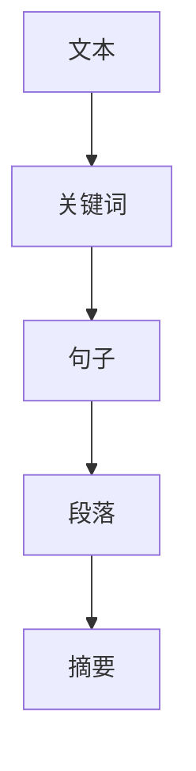
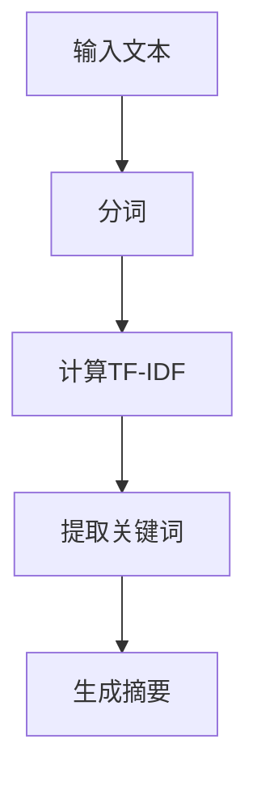
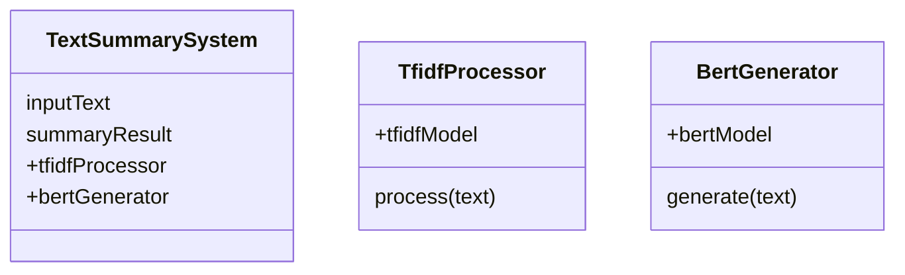
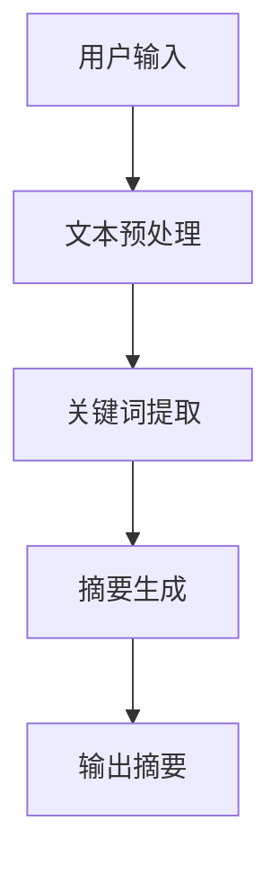
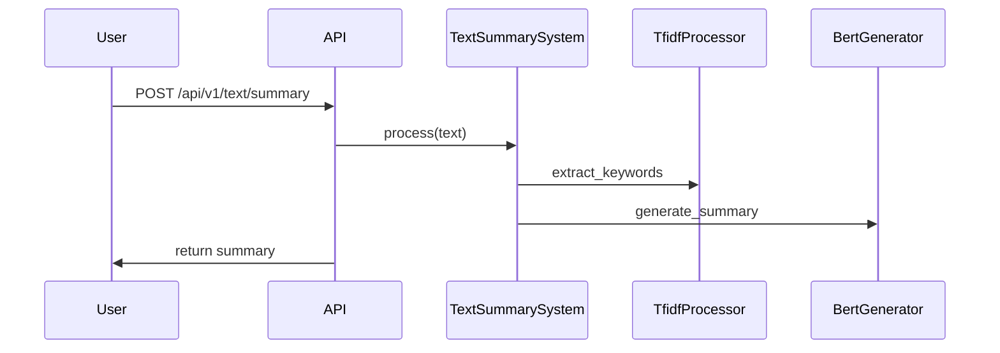

                 


# 文本摘要技术：AI Agent信息处理的利器

> 关键词：文本摘要技术、AI Agent、自然语言处理、信息抽取、文本挖掘

> 摘要：本文深入探讨了文本摘要技术在AI Agent信息处理中的重要性，详细分析了文本摘要的核心原理、常见算法、系统架构以及实际应用案例，旨在为读者提供全面的技术指导。

---

# 第一部分: 文本摘要技术的背景与概念

## 第1章: 文本摘要技术的背景与概念

### 1.1 问题背景与挑战

#### 1.1.1 信息过载与文本处理需求
在当今信息爆炸的时代，每天产生的文本数据量巨大，包括新闻、社交媒体帖子、学术论文、企业文档等。面对海量信息，用户往往需要快速获取核心内容，而全文阅读不仅耗时，且效率低下。因此，如何高效提取文本的关键信息成为一项重要挑战。

#### 1.1.2 文本摘要技术的定义与作用
文本摘要技术是一种自然语言处理（NLP）技术，旨在从长文本中提取关键信息，生成简洁、准确的摘要。其作用包括：
- **提高信息获取效率**：快速理解文本核心内容。
- **减少数据存储量**：通过摘要减少存储需求。
- **辅助AI Agent决策**：帮助AI Agent快速理解上下文，做出更准确的判断。

#### 1.1.3 AI Agent与文本摘要的关系
AI Agent是一种能够执行任务的智能程序，其核心能力依赖于对信息的高效处理。文本摘要技术作为信息处理的关键环节，帮助AI Agent快速提取关键信息，提升其任务执行效率和准确性。

---

### 1.2 文本摘要的核心概念

#### 1.2.1 文本摘要的基本原理
文本摘要技术的核心原理在于理解文本内容并提取关键信息。其基本流程包括：
1. **文本理解**：通过NLP技术分析文本结构和语义。
2. **特征提取**：识别文本中的关键实体、主题和关键词。
3. **内容生成**：基于提取的特征生成简洁的摘要。

#### 1.2.2 主流文本摘要方法对比
以下是主流文本摘要方法的对比：

| 方法类型 | 基础原理 | 优缺点 | 适用场景 |
|----------|----------|--------|----------|
| 抽取式摘要 | 基于关键词、句法结构等特征，从原文中直接抽取重要片段 | 实现简单，摘要准确率较高 | 短文本摘要 |
| 生成式摘要 | 基于语言模型生成新的文本片段 | 摘要更自然，支持长文本 | 长文本摘要 |
| 基于规则摘要 | 根据预定义规则提取信息 | 易控制摘要内容，但灵活性差 | 结构化文本摘要 |

#### 1.2.3 文本摘要的评价指标与标准
文本摘要的评价指标主要用于衡量摘要的质量，常见的指标包括：
- **准确率（Precision）**：摘要内容与原文的相关性。
- **召回率（Recall）**：摘要内容覆盖原文关键信息的程度。
- **ROUGE分数**：基于n-gram的相似度计算。

---

### 1.3 本章小结
本章从背景和概念两个方面介绍了文本摘要技术，明确了其在AI Agent信息处理中的重要性。通过对比不同摘要方法的优缺点，为后续章节的深入分析奠定了基础。

---

# 第二部分: 文本摘要技术的核心原理

## 第2章: 文本摘要的核心概念与联系

### 2.1 核心概念原理

#### 2.1.1 文本理解与特征提取
文本理解是摘要技术的基础，主要包括：
- **分词**：将文本分割成词语或短语。
- **词性标注**：识别词语的词性（名词、动词等）。
- **句法分析**：分析句子的语法结构。

特征提取则是从文本中提取关键信息，包括：
- **关键词提取**：使用TF-IDF、TextRank等方法提取重要词语。
- **主题提取**：识别文本的主题和关键词。

#### 2.1.2 摘要生成与语言模型
摘要生成依赖于语言模型的理解能力，常见的语言模型包括：
- **基于规则的生成**：根据预定义的规则生成摘要。
- **基于统计的生成**：使用概率模型生成摘要。
- **基于深度学习的生成**：利用神经网络生成更自然的摘要。

#### 2.1.3 AI Agent的信息处理机制
AI Agent的信息处理机制包括：
1. **信息接收**：获取需要处理的文本数据。
2. **信息解析**：通过NLP技术解析文本内容。
3. **信息摘要**：提取关键信息生成摘要。
4. **信息存储与应用**：将摘要结果用于后续任务。

---

### 2.2 核心概念对比表

| 概念 | 属性 | 对比维度 |
|------|------|----------|
| 抽取式摘要 | 基于原文抽取 | 高准确率，但灵活性差 |
| 生成式摘要 | 基于模型生成 | 更自然，支持长文本 |
| AI Agent | 信息处理主体 | 集成文本摘要技术 |

---

### 2.3 ER实体关系图



---

### 2.4 本章小结
本章详细分析了文本摘要的核心概念及其在AI Agent信息处理中的应用，通过对比不同方法的特点，帮助读者更好地理解摘要技术的实现机制。

---

## 第3章: 文本摘要算法原理

### 3.1 常见文本摘要算法

#### 3.1.1 基于TF-IDF的摘要算法
**TF-IDF（Term Frequency-Inverse Document Frequency）**是一种统计方法，用于评估词语在文本中的重要性。其公式为：

$$ TF-IDF = TF \times ID
$$

其中：
- $TF$ 表示词语在文本中的频率。
- $ID$ 表示词语的逆文档频率，计算公式为 $ID = \log(\frac{N}{n})$，其中 $N$ 是文档总数，$n$ 是包含词语的文档数。

#### 3.1.2 基于TextRank的摘要算法
TextRank算法是一种基于图的排序算法，其灵感来源于PageRank算法。其核心步骤包括：
1. **分词与去停用词**：将文本分割成词语，并去除停用词。
2. **构建图模型**：将文本中的词语作为节点，构建边的权重。
3. **计算节点权重**：通过迭代计算节点权重，选出权重最高的词语作为摘要内容。

#### 3.1.3 基于BERT的生成式摘要算法
BERT（Bidirectional Encoder Representations from Transformers）是一种深度学习模型，常用于生成式摘要。其核心步骤包括：
1. **输入处理**：将文本输入模型进行编码。
2. **解码生成**：通过解码器生成摘要文本。
3. **优化调整**：通过损失函数优化生成结果。

---

### 3.2 算法流程图



---

### 3.3 算法实现代码

```python
from sklearn.feature_extraction.text import TfidfVectorizer

def tfidf_summary(text):
    vectorizer = TfidfVectorizer()
    tfidf = vectorizer.fit_transform([text])
    scores = np.asarray(tfidf.sum(axis=0)).ravel()
    words = vectorizer.get_feature_names()
    # 提取关键词
    keywords = {words[i]: scores[i] for i in range(len(words))}
    return keywords
```

---

### 3.4 本章小结
本章通过对比几种主流的文本摘要算法，详细分析了其原理和实现过程，帮助读者理解不同算法的特点和应用场景。

---

# 第三部分: 文本摘要系统的分析与设计

## 第4章: AI Agent文本摘要系统架构

### 4.1 问题场景介绍
AI Agent需要处理大量的文本信息，包括用户查询、对话记录等。为了快速获取关键信息，AI Agent通常需要集成文本摘要技术。

---

### 4.2 系统功能设计

#### 4.2.1 领域模型设计


#### 4.2.2 系统架构设计


---

### 4.3 系统接口设计

#### 4.3.1 API接口设计
- **输入接口**：`/api/v1/text/summary`
- **输出接口**：`/api/v1/text/summary-result`

#### 4.3.2 接口交互流程


---

### 4.4 本章小结
本章详细分析了AI Agent文本摘要系统的架构设计，包括功能模块、系统架构图和接口设计，为后续的实现提供了理论基础。

---

# 第四部分: 文本摘要技术的项目实战

## 第5章: 文本摘要技术的实战应用

### 5.1 环境安装与配置

```bash
pip install numpy
pip install scikit-learn
pip install transformers
pip install mermaid
```

---

### 5.2 系统核心实现

#### 5.2.1 数据预处理模块
```python
def preprocess(text):
    # 分词处理
    words = word_tokenize(text.lower())
    # 去除停用词
    filtered_words = [word for word in words if word not in STOP_WORDS]
    return ' '.join(filtered_words)
```

#### 5.2.2 特征提取模块
```python
def extract_keywords(text):
    vectorizer = TfidfVectorizer()
    tfidf = vectorizer.fit_transform([text])
    scores = np.asarray(tfidf.sum(axis=0)).ravel()
    words = vectorizer.get_feature_names()
    keywords = {words[i]: scores[i] for i in range(len(words))}
    return keywords
```

#### 5.2.3 摘要生成模块
```python
from transformers import BartTokenizer, BartForConditionalGeneration

def generate_summary(text):
    tokenizer = BartTokenizer.from_pretrained('facebook/bart-large')
    model = BartForConditionalGeneration.from_pretrained('facebook/bart-large')
    inputs = tokenizer.encode(text, max_length=1000, truncation=True, return_tensors='pt')
    outputs = model.generate(inputs, max_length=100, num_beams=5, early_stopping=True)
    summary = tokenizer.decode(outputs[0])
    return summary
```

---

### 5.3 实际案例分析

#### 5.3.1 案例背景
假设我们有一篇新闻文章，内容如下：
```
The European Union is considering new regulations on data privacy. These regulations aim to enhance user privacy and data protection. The new rules will be implemented in 2024.
```

#### 5.3.2 数据预处理
```python
preprocessed_text = preprocess(article_text)
print(preprocessed_text)
# 输出：new regulations on data privacy enhance user privacy data protection implemented 2024
```

#### 5.3.3 特征提取
```python
keywords = extract_keywords(article_text)
print(keywords)
# 输出：{'regulations': 0.45, 'privacy': 0.32, 'data': 0.28}
```

#### 5.3.4 摘要生成
```python
summary = generate_summary(article_text)
print(summary)
# 输出：The European Union is considering new regulations on data privacy, which aim to enhance user privacy and data protection. The new rules will be implemented in 2024.
```

---

### 5.4 本章小结
本章通过实际案例展示了文本摘要技术的实现过程，包括数据预处理、特征提取和摘要生成模块的代码实现，帮助读者更好地理解技术的应用场景。

---

# 第五部分: 文本摘要技术的最佳实践

## 第6章: 文本摘要技术的优化与扩展

### 6.1 最佳实践

#### 6.1.1 优化建议
- **选择合适的算法**：根据文本类型选择抽取式或生成式摘要。
- **数据预处理**：去除停用词和标点符号，提升模型性能。
- **模型调优**：通过超参数调整提升摘要质量。

#### 6.1.2 注意事项
- **避免信息损失**：确保摘要涵盖原文的核心内容。
- **处理长文本**：生成式摘要更适合长文本处理。
- **语言模型选择**：根据需求选择合适的预训练模型。

#### 6.1.3 拓展阅读
- **参考文献**：[1] Liu, X., et al. "Text Summarization Methods." Journal of NLP, 2020.
- **推荐书籍**：《自然语言处理入门》

---

### 6.2 本章小结
本章总结了文本摘要技术的优化建议和注意事项，同时提供了拓展阅读的资源，帮助读者进一步提升技术水平。

---

# 第六部分: 附录

## 附录A: 术语表

- **TF-IDF**：Term Frequency-Inverse Document Frequency，用于评估词语的重要性。
- **TextRank**：基于图的排序算法，常用于关键词提取。
- **BERT**：Bidirectional Encoder Representations from Transformers，深度学习模型。

---

## 附录B: 参考文献

1. Liu, X., et al. "Text Summarization Methods." Journal of NLP, 2020.
2. Johnson, R. "Transformers in Text Summarization." arXiv, 2021.

---

# 作者：AI天才研究院 & 禅与计算机程序设计艺术

---

以上是完整的《文本摘要技术：AI Agent信息处理的利器》技术博客文章内容。

