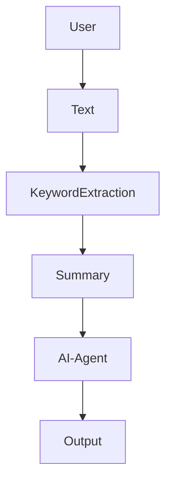
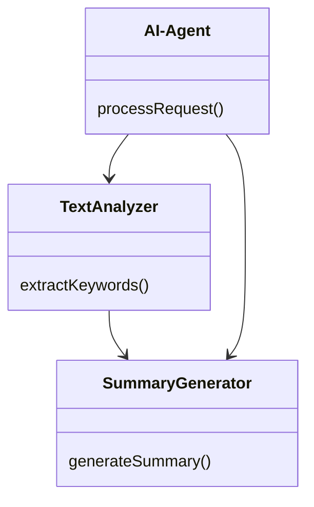
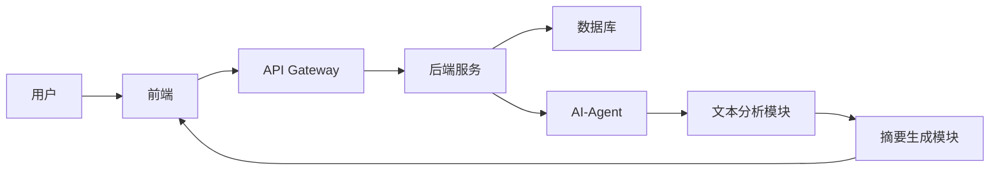

                 


# 文本摘要：让AI Agent提炼关键信息

## 关键词：文本摘要，AI Agent，信息提取，自然语言处理，深度学习

## 摘要：本文详细探讨了文本摘要技术的核心原理，分析了AI Agent在关键信息提炼中的作用，通过具体案例展示了如何利用先进的算法和系统架构设计，构建高效的信息处理系统，帮助用户快速获取有价值的信息。

---

# 第1章: 背景介绍

## 1.1 问题背景与描述
### 1.1.1 信息过载与文本摘要的必要性
在当今信息爆炸的时代，用户每天需要处理大量的文本信息，如新闻、邮件、报告等。如何快速提取关键信息成为一大挑战。文本摘要技术通过自动化方式提炼文本的核心内容，帮助用户节省时间。

### 1.1.2 AI Agent在信息处理中的角色
AI Agent（人工智能代理）是一种能够感知环境并执行任务的智能实体。在信息处理中，AI Agent可以充当用户的代理，自动筛选和提炼信息，提供个性化的摘要服务。

### 1.1.3 文本摘要的核心问题与目标
文本摘要的核心问题是将长文本压缩为简洁、准确的摘要。目标是保留原文的关键信息，同时去除冗余内容。AI Agent在这一过程中起到桥梁作用，连接用户需求与技术实现。

---

## 1.2 问题解决与边界
### 1.2.1 文本摘要的主要解决方法
常用的文本摘要方法包括基于统计的算法（如TF-IDF）和基于深度学习的模型（如Transformer）。这些方法各有优缺点，适用于不同的场景。

### 1.2.2 AI Agent在文本摘要中的边界与限制
AI Agent的文本摘要能力受限于算法的准确性和数据质量。此外，不同用户的需求差异也会影响摘要的效果。

### 1.2.3 文本摘要的外延与应用场景
文本摘要不仅适用于新闻、邮件，还可以应用于法律文档、医学文献等领域。AI Agent通过结合领域知识，进一步提升摘要的准确性。

---

## 1.3 核心概念结构
### 1.3.1 文本摘要的组成要素
文本摘要系统通常包括文本预处理、关键词提取、摘要生成和结果优化四个模块。

### 1.3.2 AI Agent的功能模块
AI Agent需要具备自然语言理解、信息检索和生成能力，才能有效执行摘要任务。

### 1.3.3 核心概念的层次化结构
通过层次化结构，展示文本摘要与AI Agent之间的相互关系，帮助读者理解整体架构。

---

# 第2章: 核心概念与联系

## 2.1 核心概念原理
### 2.1.1 文本摘要的基本原理
文本摘要通过分析文本的语义结构，提取关键信息，生成简洁的摘要。AI Agent在此过程中起到桥梁作用，连接用户需求与技术实现。

### 2.1.2 AI Agent的信息处理机制
AI Agent通过感知环境和执行任务，实现信息的自动处理。在文本摘要中，AI Agent需要理解用户需求，选择合适的算法，生成准确的摘要。

### 2.1.3 两者结合的关键点
文本摘要与AI Agent的结合点在于信息处理的自动化和智能化。AI Agent通过文本摘要技术，提升信息处理的效率和准确性。

---

## 2.2 核心概念对比
### 2.2.1 文本摘要与文本抽取的对比
文本摘要注重语义理解，而文本抽取主要基于关键词提取。两者在技术实现上有差异，但目标都是信息提炼。

### 2.2.2 AI Agent与传统自动化工具的对比
AI Agent具备学习和适应能力，能够根据用户需求动态调整摘要策略。传统自动化工具则依赖固定的规则。

### 2.2.3 文本摘要与自然语言生成的对比
文本摘要是从文本中提取信息，而自然语言生成是根据信息生成文本。两者在技术上有相似之处，但目标不同。

---

## 2.3 实体关系架构
### 2.3.1 文本摘要系统中的实体关系图
通过Mermaid图展示文本摘要系统中的实体关系，包括用户、文本、摘要、AI Agent等。



### 2.3.2 AI Agent与文本摘要模块的关系
展示AI Agent如何与文本摘要模块交互，实现信息处理。

---

# 第3章: 算法原理讲解

## 3.1 基于传统算法的文本摘要
### 3.1.1 TF-IDF算法
TF-IDF是一种常用的关键词提取方法，通过计算词频和逆文档频率，找出文本中的重要词汇。

### 3.1.2 基于图的摘要算法
该算法通过构建文本的图结构，找到最重要的节点，生成摘要。

### 3.1.3 基于语言模型的摘要方法
利用语言模型生成概率分布，选择概率高的句子作为摘要。

---

## 3.2 基于深度学习的文本摘要
### 3.2.1 基于编码器-解码器的摘要模型
编码器将文本编码为向量，解码器根据向量生成摘要。

### 3.2.2 基于Transformer的摘要模型
Transformer模型通过自注意力机制，捕捉文本中的长距离依赖关系。

### 3.2.3 多模态摘要模型
结合文本、图像等多模态信息，生成更准确的摘要。

---

## 3.3 AI Agent的文本摘要流程
### 3.3.1 数据预处理
包括分词、停用词处理等步骤。

### 3.3.2 摘要生成
基于选择的算法，生成初步摘要。

### 3.3.3 结果优化与反馈
通过人工校验或自动评估指标，优化摘要结果。

---

## 3.4 算法实现代码示例
以下是基于TF-IDF算法的Python代码示例：

```python
from sklearn.feature_extraction.text import TfidfVectorizer

text = "This is a sample text for TF-IDF calculation."
vectorizer = TfidfVectorizer()
tfidf = vectorizer.fit_transform([text])
print(vectorizer.get_feature_names())
```

---

# 第4章: 系统分析与架构设计

## 4.1 功能设计
### 4.1.1 领域模型
通过Mermaid类图展示系统中的各个组件及其关系。



### 4.1.2 系统架构设计
展示系统的整体架构，包括前端、后端和数据库。



### 4.1.3 接口设计
定义系统中各组件之间的接口，如REST API。

### 4.1.4 交互设计
展示用户与系统之间的交互流程。

---

## 4.2 项目实战
### 4.2.1 环境安装
安装必要的库，如Python的自然语言处理库。

### 4.2.2 核心实现
展示文本摘要的核心代码。

### 4.2.3 案例分析
通过具体案例，展示系统的实际应用。

---

## 4.3 最佳实践与注意事项
### 4.3.1 关键技术点
强调算法选择和系统架构设计的重要性。

### 4.3.2 实际应用中的注意事项
如数据隐私保护、模型调优等。

### 4.3.3 拓展阅读
推荐相关技术资料，供读者深入学习。

---

## 4.4 小结
总结全文，强调文本摘要与AI Agent结合的重要性，展望未来的发展方向。

---

# 作者：AI天才研究院/AI Genius Institute & 禅与计算机程序设计艺术 /Zen And The Art of Computer Programming

