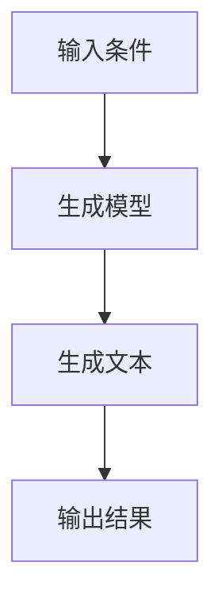
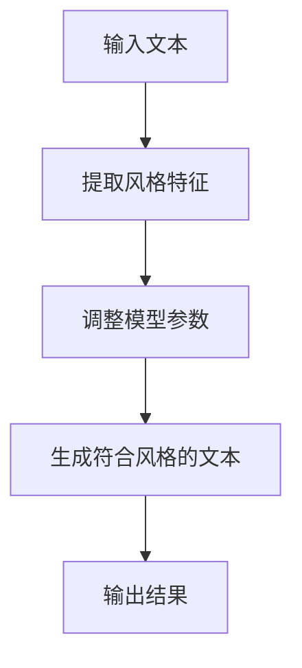

                 


# 文本生成控制：调节AI Agent的输出风格和长度

---

## 关键词：文本生成控制、AI Agent、自然语言处理、生成模型、风格调节、长度控制

---

## 摘要：本文深入探讨了如何调节AI Agent的文本生成输出风格和长度，从背景、核心概念到算法原理、系统架构，再到实际案例，全面解析了文本生成控制的技术细节。通过数学模型、mermaid流程图和Python代码示例，详细阐述了实现方法，最后总结了最佳实践和未来发展方向。

---

# 第一部分: 文本生成控制的背景与核心概念

## 第1章: 文本生成控制的背景与问题描述

### 1.1 什么是文本生成控制

#### 1.1.1 文本生成的基本概念
文本生成是自然语言处理（NLP）中的重要任务，涉及通过算法生成符合特定要求的文本。文本生成控制是指对生成文本的风格、长度等属性进行调节的过程，使其满足特定需求。

#### 1.1.2 文本生成控制的定义
文本生成控制是指在生成文本的过程中，通过调整模型参数或引入控制机制，使得生成的文本符合特定的风格和长度要求。

#### 1.1.3 文本生成控制的重要性
在实际应用中，文本生成控制能够提升生成文本的质量和适用性。例如，在客服系统中，生成的回复需要简洁明了；在文学创作中，生成的内容需要符合特定的文学风格。

---

### 1.2 文本生成控制的应用场景

#### 1.2.1 自然语言处理中的文本生成
- 机器翻译
- 文本摘要
- 对话生成

#### 1.2.2 人机交互中的文本生成控制
- 智能客服
- 智能音箱
- 聊天机器人

#### 1.2.3 个性化文本生成的需求
- 根据用户偏好生成个性化推荐
- 根据场景生成合适的文本

---

### 1.3 问题背景与挑战

#### 1.3.1 文本生成中的风格多样性
- 不同场景下，文本风格需求差异大
- 如何量化和控制风格多样性是挑战

#### 1.3.2 长度控制的复杂性
- 文本长度与内容质量密切相关
- 如何在保持内容完整性的同时控制长度

#### 1.3.3 用户需求的多样性与动态变化
- 用户需求复杂且动态变化
- 如何实时调整生成文本以满足需求

---

## 第2章: 文本生成控制的核心概念与联系

### 2.1 文本生成模型的原理

#### 2.1.1 生成模型的分类
- 基于规则的生成模型
- 统计生成模型
- 基于深度学习的生成模型

#### 2.1.2 基于概率分布的生成模型
- 生成模型通过概率分布生成文本
- 常见概率分布：二项分布、多项分布

#### 2.1.3 常见的文本生成模型
- GPT系列
- Transformer模型
- LSTM模型

---

### 2.2 文本风格与长度的定义

#### 2.2.1 文本风格的多维度分析
- 风格维度：正式、口语化、技术性等
- 风格量化：通过词频、句式复杂度等指标

#### 2.2.2 文本长度的量化方法
- 字数控制
- 句子数量控制
- 平均句子长度控制

#### 2.2.3 风格与长度的相互影响
- 风格影响内容表达的复杂度
- 长度影响内容的详尽程度

---

### 2.3 核心概念的联系

#### 2.3.1 文本生成与用户需求的关联
- 用户需求驱动生成文本的风格和长度
- 需求变化要求生成模型具备灵活性

#### 2.3.2 风格控制与模型参数的关系
- 风格控制通过调整模型参数实现
- 不同风格对应不同的参数设置

#### 2.3.3 长度控制与生成过程的优化
- 长度控制影响生成过程中的步骤
- 长度优化需要平衡生成效率和内容质量

---

# 第二部分: 文本生成控制的算法原理与实现

## 第3章: 文本生成控制的算法原理

### 3.1 基于概率分布的生成模型

#### 3.1.1 最大似然估计的基本原理
- 最大似然估计（MLE）用于训练生成模型
- 目标是使生成的数据的概率最大化

#### 3.1.2 贝叶斯推断在文本生成中的应用
- 贝叶斯推断用于估计生成模型的参数
- 常见的概率分布模型：二项分布、多项分布

#### 3.1.3 常见的文本生成模型
- GPT系列
- Transformer模型
- LSTM模型

---

### 3.2 风格控制的算法实现

#### 3.2.1 基于条件的文本生成
- 通过引入条件（如主题标签）控制生成风格
- 示例：生成指定主题的文本

#### 3.2.2 风格向量的构建与应用
- 构建风格向量表示不同风格特征
- 将风格向量输入生成模型，控制输出风格

#### 3.2.3 风格转移的实现方法
- 利用预训练模型进行风格转移
- 通过调整模型参数实现风格转换

---

### 3.3 长度控制的算法实现

#### 3.3.1 基于位置的长度控制
- 在生成过程中，根据位置信息调整生成长度
- 示例：生成固定长度的文本

#### 3.3.2 基于概率的长度调节
- 在生成过程中，动态调整生成概率以控制长度
- 示例：生成较短或较长的文本

#### 3.3.3 增量式生成方法
- 分阶段生成文本，逐步调整长度
- 示例：先生成摘要，再扩展成完整文本

---

## 第4章: 文本生成控制的数学模型与公式

### 4.1 文本生成的概率模型

#### 4.1.1 最大似然估计的公式推导
$$
\text{目标函数} = \sum_{i=1}^{n} \log P(x_i | x_{<i})
$$

#### 4.1.2 贝叶斯推断的数学表达
$$
P(\theta | D) = \frac{P(D | \theta) P(\theta)}{P(D)}
$$

#### 4.1.3 常见概率分布的数学公式
- 二项分布：
$$
P(k) = C(n, k) p^k (1-p)^{n-k}
$$

---

### 4.2 风格控制的数学模型

#### 4.2.1 风格向量的构建公式
$$
s = f_{\text{extract}}(x)
$$
其中，$s$ 是风格向量，$x$ 是输入文本。

#### 4.2.2 风格转移的数学表达
$$
y = f_{\text{transfer}}(s, x)
$$
其中，$y$ 是生成文本，$s$ 是目标风格向量。

---

### 4.3 长度控制的数学模型

#### 4.3.1 基于概率的长度调节
$$
P(\text{length}=L) = \prod_{i=1}^{L} P(w_i | w_{<i})
$$

---

## 第5章: 文本生成控制的算法流程图

### 5.1 基于条件的文本生成流程图



---

### 5.2 风格控制的算法流程图



---

## 第6章: 项目实战——文本生成控制的实现

### 6.1 环境安装

```bash
pip install numpy tensorflow transformers
```

---

### 6.2 系统核心实现源代码

#### 6.2.1 风格控制实现代码

```python
import tensorflow as tf
from transformers import GPT2Tokenizer, GPT2ModelWithLMHead

tokenizer = GPT2Tokenizer.from_pretrained('gpt2')
model = GPT2ModelWithLMHead.from_pretrained('gpt2')

def generate_text(prompt, style_vector):
    # 根据风格向量调整生成参数
    inputs = tokenizer.encode(prompt, return_tensors='tf')
    # 假设style_vector是一个调整后的温度参数
    temperature = 1.0 + style_vector['temperature']
    outputs = model.generate(inputs, temperature=temperature)
    return tokenizer.decode(outputs[0], skip_special_tokens=True)
```

---

#### 6.2.2 长度控制实现代码

```python
def control_length(prompt, max_length):
    inputs = tokenizer.encode(prompt, return_tensors='tf')
    outputs = model.generate(inputs, max_length=max_length)
    return tokenizer.decode(outputs[0], skip_special_tokens=True)
```

---

### 6.3 代码应用解读与分析

- 风格控制代码通过调整生成参数（如温度）影响生成文本的风格。
- 长度控制代码通过设置`max_length`参数直接控制生成文本的长度。

---

### 6.4 实际案例分析和详细讲解剖析

#### 6.4.1 案例1：生成不同风格的文本
- 输入：`"写一段关于AI的介绍"`
- 风格向量：`{'temperature': 0.7}`（偏向创造性）
- 输出：一段富有创造性的AI介绍。

#### 6.4.2 案例2：生成固定长度的文本
- 输入：`"解释机器学习的基本概念"`
- max_length：150
- 输出：一段150字左右的机器学习基本概念解释。

---

## 第7章: 总结与展望

### 7.1 总结

- 文本生成控制是实现高质量文本生成的重要技术。
- 通过调整模型参数和引入控制机制，可以有效调节生成文本的风格和长度。

---

### 7.2 展望

- 随着NLP技术的发展，文本生成控制将更加智能化和个性化。
- 未来的研究方向包括更精细的风格控制和动态长度调节。

---

## 第8章: 最佳实践 tips、小结、注意事项、拓展阅读

### 8.1 最佳实践 tips

- 根据具体需求选择合适的生成模型。
- 通过实验调整生成参数，找到最佳效果。
- 定期更新模型，适应变化的需求。

---

### 8.2 小结

- 文本生成控制是一个复杂的任务，但通过合理的算法和模型调整，可以实现高质量的文本生成。

---

### 8.3 注意事项

- 避免过度调节，导致生成文本不自然。
- 定期监控生成效果，及时优化模型。

---

### 8.4 拓展阅读

- 《生成式预训练模型的研究与应用》
- 《自然语言处理中的文本生成技术》

---

## 作者：AI天才研究院/AI Genius Institute & 禅与计算机程序设计艺术 /Zen And The Art of Computer Programming

---

**感谢您的耐心阅读，希望本文能为您提供有价值的见解和启发！**

