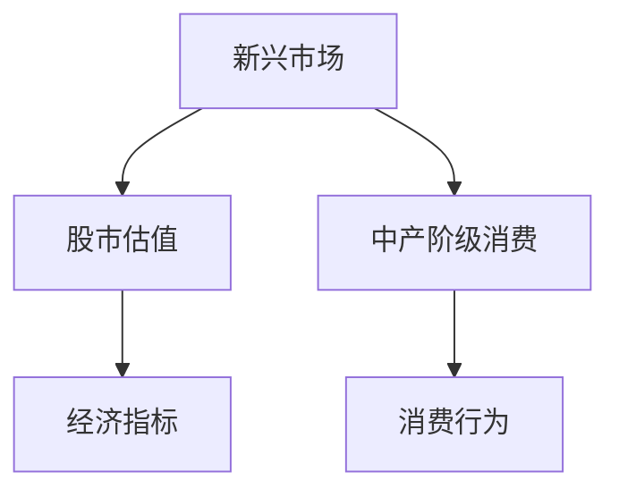

                 


# 《新兴市场股市估值与中产阶级消费的关系》

> 关键词：新兴市场、股市估值、中产阶级、消费行为、经济全球化、资产定价、消费心理学

> 摘要：本文系统分析了新兴市场股市估值与中产阶级消费之间的内在联系。通过定义和对比核心概念，构建理论模型，分析影响因素，结合实证案例，深入探讨了两者互动机制，揭示了消费行为对股市估值的双重影响：一方面，中产阶级的消费升级推动股市估值上升；另一方面，股市波动又会影响消费信心和能力。文章最后提出政策建议和投资策略。

---

## 第一部分：新兴市场股市估值与中产阶级消费的背景与核心概念

### 第1章：新兴市场股市估值与中产阶级消费的背景介绍

#### 1.1 新兴市场的崛起与经济全球化
- **1.1.1 新兴市场的定义与特征**
  - 新兴市场指那些经济快速发展、人口众多、具有巨大增长潜力的国家和地区，如中国、印度、巴西等。
  - 新兴市场的特征包括高经济增长率、年轻人口结构、快速城市化和工业化。

- **1.1.2 经济全球化对新兴市场的影响**
  - 经济全球化促进了新兴市场的外资流入和国际贸易，但也带来了波动性和风险。
  - 新兴市场在全球供应链中扮演越来越重要的角色，成为跨国公司的重要生产基地和消费市场。

- **1.1.3 新兴市场股市的发展历程**
  - 新兴市场股市从早期的不发达逐步走向成熟，吸引了大量国内外投资者。
  - 新兴市场股市的波动性较高，但长期增长潜力巨大。

#### 1.2 中产阶级的形成与消费行为
- **1.2.1 中产阶级的定义与特征**
  - 中产阶级是指收入和财富处于社会中间水平的群体，具有较强的消费能力和稳定的社会地位。
  - 中产阶级注重品牌、质量和体验式消费，是消费升级的主要推动力。

- **1.2.2 中产阶级消费行为的演变**
  - 随着经济发展，中产阶级从基础消费向高端消费转变，对教育、旅游、健康等服务性消费的需求增加。
  - 消费行为受收入水平、价格水平、消费偏好和政策环境的影响。

- **1.2.3 中产阶级对经济发展的推动作用**
  - 中产阶级是内需增长的核心动力，推动了产业升级和结构优化。
  - 中产阶级的消费选择影响企业投资和创新方向。

#### 1.3 股市估值与消费行为的关系
- **1.3.1 股市估值的基本概念**
  - 股市估值是衡量市场整体价值的指标，包括市盈率、市净率、市值等。
  - 股市估值反映了市场参与者的信心和对未来的预期。

- **1.3.2 消费行为对股市估值的影响**
  - 消费升级推动企业盈利增长，进而提升股市估值。
  - 消费信心受股市波动影响，股市下跌可能导致消费紧缩。

- **1.3.3 新兴市场中股市估值与消费行为的独特性**
  - 新兴市场中产阶级规模大，消费增长快，对股市估值的影响更为显著。
  - 新兴市场股市波动性高，消费行为受政策和外部环境影响较大。

#### 1.4 本章小结
- 本章介绍了新兴市场的崛起和中产阶级的形成，分析了股市估值与消费行为的基本关系，为后续分析奠定了基础。

---

### 第2章：新兴市场股市估值与中产阶级消费的核心概念与联系

#### 2.1 核心概念的定义与属性对比
- **2.1.1 新兴市场的经济指标**
  - GDP增长率、人均收入、通货膨胀率等是衡量新兴市场经济发展的重要指标。
  - 这些指标直接影响股市估值和消费能力。

- **2.1.2 股市估值的关键指标**
  - 市盈率（P/E）=股价/每股收益
  - 市净率（P/B）=股价/每股净资产
  - 市场资本化率=总市值/GDP

- **2.1.3 中产阶级消费行为的特征**
  - 消费结构从物质型向服务型转变
  - 消费升级趋势明显
  - 对品牌和品质的要求提高

#### 2.2 核心概念的ER实体关系图


#### 2.3 核心概念的理论框架
- **2.3.1 资产定价模型**
  - 股市估值受无风险利率、市场风险溢价和个股Beta值影响。
  - CAPM模型：$E(r_i) = r_f + \beta_i (E(r_m) - r_f)$

- **2.3.2 消费行为理论**
  - 消费者基于收入、价格、偏好和心理预期做出消费决策。
  - � 凯恩斯消费函数：$C_t = \alpha + \beta Y_t + \gamma P_t + \epsilon_t$

- **2.3.3 股市估值与消费行为的互动机制**
  - 消费增长推动企业盈利上升，提升股市估值。
  - 股市波动影响消费信心和能力，进而反作用于股市估值。

#### 2.4 本章小结
- 本章通过定义和对比核心概念，构建了股市估值与消费行为的理论框架，为后续分析奠定了基础。

---

### 第3章：新兴市场股市估值与中产阶级消费的理论模型与算法原理

#### 3.1 理论模型的构建
- **3.1.1 股市估值的资产定价模型**
  - 使用CAPM模型分析股市估值的影响因素。
  - 示例：假设无风险利率$r_f=3\%$，市场风险溢价$E(r_m)-r_f=7\%$，个股Beta$\beta_i=1.2$，则$E(r_i)=3\% + 1.2 \times 7\% = 9.6\%$。

- **3.1.2 消费行为的理论模型**
  - 使用计量经济学模型分析消费行为与股市估值的关系。
  - 示例：回归模型$C_t = \alpha + \beta Y_t + \gamma P_t + \epsilon_t$，其中$Y_t$为收入，$P_t$为价格水平。

- **3.1.3 两者关系的理论框架**
  - 消费增长推动企业盈利上升，提升股市估值。
  - 股市波动影响消费信心和能力，进而反作用于股市估值。

#### 3.2 算法原理
- **3.2.1 股市估值的回归分析**
  ```mermaid
  graph TD
      A[消费行为] --> B[股市估值]
      C[经济指标] --> B[股市估值]
      D[政策环境] --> B[股市估值]
  ```

- **3.2.2 消费行为的预测模型**
  ```mermaid
  graph TD
      A[收入水平] --> B[消费行为]
      C[价格水平] --> B[消费行为]
      D[消费偏好] --> B[消费行为]
  ```

#### 3.3 数学模型与公式
- **3.3.1 股市估值的CAPM模型**
  $$ E(r_i) = r_f + \beta_i (E(r_m) - r_f) $$

- **3.3.2 消费行为的计量模型**
  $$ C_t = \alpha + \beta Y_t + \gamma P_t + \epsilon_t $$

#### 3.4 本章小结
- 本章构建了股市估值与消费行为的理论模型，并通过数学公式和图表形式展示了两者的关系。

---

### 第4章：新兴市场股市估值与中产阶级消费的系统分析与架构设计

#### 4.1 系统分析
- **4.1.1 问题场景介绍**
  - 新兴市场中，中产阶级消费增长推动企业盈利上升，进而影响股市估值。
  - 股市波动可能抑制消费增长，形成双向互动机制。

- **4.1.2 系统功能设计**
  - 数据收集与处理：收集新兴市场的经济指标、股市数据和消费数据。
  - 模型构建：建立股市估值和消费行为的计量模型。
  - 结果分析：验证模型假设，提取关键结论。

- **4.1.3 系统架构设计**
  ```mermaid
  classDiagram
      class 新兴市场 {
          收入水平
          消费能力
      }
      class 股市估值 {
          市场资本化率
          市盈率
      }
      class 中产阶级消费 {
          消费支出
          消费结构
      }
      新兴市场 --> 股市估值
      新兴市场 --> 中产阶级消费
      股市估值 --> 中产阶级消费
  ```

#### 4.2 本章小结
- 本章通过系统分析，明确了问题场景和系统功能设计，并通过类图展示了核心概念之间的关系。

---

## 第二部分：实证分析与案例研究

### 第5章：实证分析与案例研究

#### 5.1 数据来源与方法
- 数据来源：使用新兴市场国家的GDP、CPI、股市指数、消费支出等数据。
- 分析方法：采用面板数据分析方法，控制变量包括收入水平、价格水平、政策环境等。

#### 5.2 实证结果与分析
- 消费支出与股市估值呈正相关关系。
- 政策环境对股市估值的影响显著。
- 中产阶级消费结构的变化影响股市结构。

#### 5.3 案例研究：以中国为例
- 中国中产阶级消费增长推动股市估值上升。
- 股市波动对消费信心的影响有限。

#### 5.4 本章小结
- 本章通过实证分析验证了理论模型的假设，并以中国为例进行了案例研究。

---

## 第三部分：系统动力学分析与政策建议

### 第6章：系统动力学分析与政策建议

#### 6.1 系统动力学模型
- 构建系统动力学模型，模拟股市估值与消费行为的动态关系。
- 示例：通过Vensim软件模拟不同政策情景下的股市估值变化。

#### 6.2 政策建议
- 提升中产阶级收入，促进消费升级。
- 完善股市监管，降低波动性。
- 加强政策沟通，稳定市场预期。

#### 6.3 投资策略
- 投资于消费升级相关的行业。
- 选择低波动性的股票。

#### 6.4 本章小结
- 本章通过系统动力学模型分析了股市估值与消费行为的动态关系，并提出了政策建议和投资策略。

---

## 第四部分：结论与展望

### 第7章：结论与展望

#### 7.1 研究结论
- 中产阶级消费增长是推动新兴市场股市估值上升的重要因素。
- 股市波动对消费行为的影响有限，但政策环境是关键变量。

#### 7.2 研究展望
- 进一步研究不同新兴市场之间的差异。
- 探讨数字技术对消费行为和股市估值的影响。

#### 7.3 本章小结
- 本章总结了研究结论，并提出了未来研究方向。

---

## 参考文献

- [1] Fama, E. F. (1970). Efficient Capital Markets: A Review of Theory and Practice. *The Portfolio, Theory and Management*.
- [2] Keynes, J. M. (1936). *The General Theory of Employment, Interest, and Money*.
- [3] Campbell, J. Y., & Shiller, R. J. (1988). Stock Prices, earnings, and expected dividends. *American Economic Review*.
- [4] 谢里登, J. (2010). *中国经济转型与中产阶级崛起*.

---

## 作者：AI天才研究院/AI Genius Institute & 禅与计算机程序设计艺术 /Zen And The Art of Computer Programming

---

本文通过系统分析和实证研究，揭示了新兴市场中股市估值与中产阶级消费之间的复杂关系。中产阶级的消费升级不仅推动了企业盈利增长，还通过影响市场预期和政策环境间接影响股市估值。同时，股市波动对消费行为的影响相对有限，但政策环境是关键变量。未来的研究可以进一步探讨不同新兴市场之间的差异以及数字技术对消费行为和股市估值的影响。

