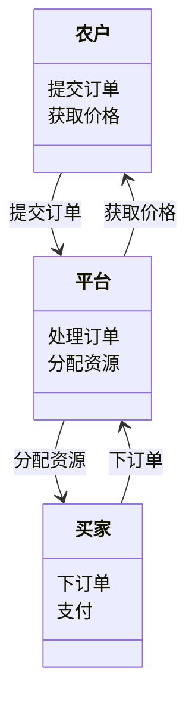
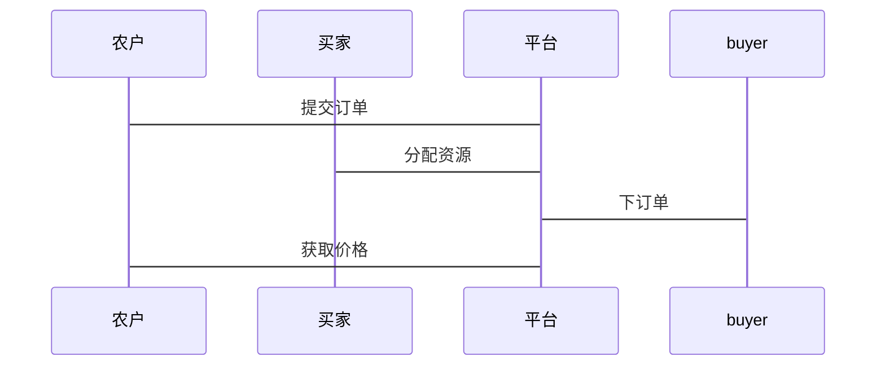

                 


# 《新兴市场股市估值与智慧农业产销对接平台的互动》

---

## 关键词  
新兴市场，股市估值，智慧农业，产销对接，数据驱动，人工智能，大数据

---

## 摘要  
本文深入探讨新兴市场股市估值与智慧农业产销对接平台的互动关系，结合数据驱动的技术手段，分析智慧农业平台如何优化股市估值模型，并通过实际案例展示其应用价值。文章从理论到实践，结合算法原理和系统架构设计，为读者提供全面的技术视角。

---

# 第一部分：引言

## 1.1 问题背景与研究意义  

### 1.1.1 新兴市场股市的特点  
新兴市场的股市具有波动性大、参与者多样性、政策影响显著等特点。与成熟市场相比，新兴市场的股市估值受宏观经济环境、政策变化和行业特性的影响更为复杂。  

### 1.1.2 智慧农业的发展趋势  
智慧农业通过大数据、人工智能、物联网等技术手段，实现农业生产的智能化、精准化和高效化。产销对接平台作为智慧农业的重要组成部分，能够优化农业供应链，降低交易成本，提升生产效率。  

### 1.1.3 股市估值与农业产销对接的互动关系  
股市估值与农业产销对接的互动关系主要体现在：  
1. 农业产销数据能够为股市估值提供新的信息维度。  
2. 股市资金流动能够为农业产业提供融资支持，推动农业产销对接平台的建设。  

---

## 1.2 研究目标与方法  

### 1.2.1 核心问题的提出  
本文的核心问题是：如何通过智慧农业产销对接平台的数据，优化新兴市场的股市估值模型，实现两者的良性互动？  

### 1.2.2 研究方法与技术路线  
1. **理论分析**：从金融学和农业经济的角度，分析股市估值与农业产销对接的关系。  
2. **技术实现**：基于数据驱动的方法，设计智慧农业产销对接平台，并构建股市估值模型。  
3. **案例分析**：结合实际案例，验证模型的可行性和有效性。  

---

# 第二部分：股市估值的核心概念与分析框架  

## 2.1 股市估值的基本理论  

### 2.1.1 股票估值的定义与方法  
股票估值是通过对企业财务状况、市场环境和行业前景的分析，估算其内在价值的过程。常用的估值方法包括市盈率（P/E）、市净率（P/B）等。  

### 2.1.2 新兴市场的特殊性与挑战  
新兴市场的股市估值受政策、经济波动和信息不对称等因素的影响较大，因此需要结合本地化的经济指标和行业特点进行调整。  

---

## 2.2 股市估值的关键影响因素  

### 2.2.1 宏观经济指标  
GDP增速、通货膨胀率、利率水平等宏观经济指标对股市估值有直接影响。  

### 2.2.2 行业基本面分析  
行业内的竞争格局、利润率、增长潜力等因素是影响股市估值的重要因素。  

### 2.2.3 市场情绪与投资者行为  
市场情绪通过投资者行为反映在股市估值中，例如市场恐慌可能导致股票估值偏离其基本面。  

---

## 2.3 股市估值模型与应用  

### 2.3.1 常用估值模型概述  
常用的估值模型包括：  
1. **绝对估值模型**：如股息贴现模型（DDM）。  
2. **相对估值模型**：如市盈率模型、市净率模型。  

### 2.3.2 新兴市场的估值模型调整  
在新兴市场中，需要考虑以下调整：  
1. 考虑政策风险和经济波动的敏感性。  
2. 结合本地化的行业数据和市场指标。  

### 2.3.3 案例分析：某新兴市场的股市估值实践  
以某新兴市场为例，通过分析其宏观经济指标和行业数据，构建估值模型，并与实际市场表现进行对比。  

---

# 第三部分：智慧农业产销对接平台的核心要素  

## 3.1 智慧农业的概念与技术支撑  

### 3.1.1 智慧农业的定义与特点  
智慧农业是通过物联网、人工智能、大数据等技术手段，实现农业生产、销售、物流等环节的智能化管理。  

### 3.1.2 人工智能、大数据在农业中的应用  
1. **数据采集**：通过传感器和物联网技术，实时采集农业数据。  
2. **数据分析**：利用机器学习算法，分析数据并提供决策支持。  
3. **智能优化**：通过预测模型优化农业生产计划和销售策略。  

---

## 3.2 产销对接平台的功能与架构  

### 3.2.1 平台的核心功能模块  
1. **数据采集模块**：采集农业生产数据、市场供需数据。  
2. **数据分析模块**：基于数据驱动的分析，提供产销建议。  
3. **对接模块**：实现农户与买家的直接对接，优化供应链。  

### 3.2.2 平台的技术架构设计  
1. **前端架构**：采用响应式设计，支持多终端访问。  
2. **后端架构**：采用微服务架构，支持高并发和大规模数据处理。  
3. **数据库设计**：使用关系型数据库和非关系型数据库的结合。  

---

## 3.3 产销对接平台的数据流与信息共享  

### 3.3.1 数据采集与处理  
通过传感器、API接口等方式采集农业生产数据，并进行清洗和预处理。  

### 3.3.2 数据分析与决策支持  
基于机器学习算法，分析数据并生成产销建议，例如最优种植方案、价格预测等。  

### 3.3.3 平台的开放性与可扩展性  
平台设计应具备开放接口，支持与其他系统（如金融系统）的对接，同时具备良好的扩展性，能够适应未来业务需求的变化。  

---

# 第四部分：股市估值与智慧农业产销对接的互动机制  

## 4.1 数据驱动的互动关系  

### 4.1.1 农业产销数据对股市估值的影响  
农业产销数据能够为股市估值提供新的信息维度，例如农产品价格波动、供需变化等。  

### 4.1.2 股市资金流动对农业产业的反哺作用  
股市资金的流入能够为农业企业提供融资支持，推动农业产销对接平台的建设。  

---

## 4.2 智慧农业平台对股市估值的优化作用  

### 4.2.1 提高信息透明度与市场效率  
通过智慧农业平台，投资者能够更及时地获取农业产销数据，提高市场信息的透明度和效率。  

### 4.2.2 数据驱动的精准估值模型  
基于智慧农业平台的数据，构建精准的股市估值模型，优化估值结果。  

---

# 第五部分：系统分析与架构设计方案  

## 5.1 问题场景介绍  

### 5.1.1 问题场景  
假设某新兴市场存在农产品供需失衡的问题，通过智慧农业产销对接平台优化农业供应链，提升农业生产效率。  

## 5.2 项目介绍  

### 5.2.1 项目目标  
构建智慧农业产销对接平台，优化农业供应链，提升农业生产效率和市场竞争力。  

## 5.3 系统功能设计  

### 5.3.1 领域模型（Mermaid 类图）  


## 5.4 系统架构设计  

### 5.4.1 系统架构（Mermaid 架构图）  
```mermaid
client
    ----
    |   | 
    client <----> 中间件 <----> 服务层
    ----
        | 
        数据库
```

## 5.5 系统接口设计  

### 5.5.1 接口设计  
1. 农户提交订单接口  
2. 买家支付订单接口  
3. 平台分配资源接口  

## 5.6 系统交互（Mermaid 序列图）  



---

# 第六部分：项目实战  

## 6.1 环境安装  

### 6.1.1 环境要求  
1. Python 3.8+  
2. Flask 框架  
3. PostgreSQL 数据库  

## 6.2 核心代码实现  

### 6.2.1 代码实现  
```python
from flask import Flask, request, jsonify
from sqlalchemy import create_engine

app = Flask(__name__)
engine = create_engine('postgresql://localhost:5432/agriculture')

@app.route('/submit_order', methods=['POST'])
def submit_order():
    data = request.json
    # 处理订单数据
    return jsonify({'status': 'success'})

@app.route('/get_price', methods=['GET'])
def get_price():
    # 查询数据库中的价格数据
    return jsonify({'price': 1.5})
```

### 6.2.2 代码解读  
1. 代码实现了一个简单的API接口，农户可以通过提交订单数据，平台根据数据生成价格建议。  
2. 使用Flask框架构建Web服务，并通过PostgreSQL数据库存储数据。  

## 6.3 案例分析  

### 6.3.1 实际案例  
以某新兴市场的农产品价格预测为例，通过平台提供的数据，构建机器学习模型，预测未来价格走势，并优化股市估值模型。  

---

# 第七部分：结论  

## 7.1 最佳实践  

### 7.1.1 数据安全与隐私保护  
在智慧农业平台中，需注意数据的隐私保护，防止数据泄露和滥用。  

### 7.1.2 技术更新与优化  
随着技术的进步，需不断优化平台功能和估值模型，提升系统的性能和用户体验。  

---

## 7.2 未来研究方向  

### 7.2.1 更复杂的数据分析方法  
探索更先进的机器学习算法，提升模型的预测精度。  

### 7.2.2 平台的国际化扩展  
研究如何将平台推广到更多新兴市场，实现跨市场的数据对接与优化。  

---

## 作者：AI天才研究院/AI Genius Institute & 禅与计算机程序设计艺术 /Zen And The Art of Computer Programming  

---

**本文为AI天才研究院原创文章，转载请注明出处。**

