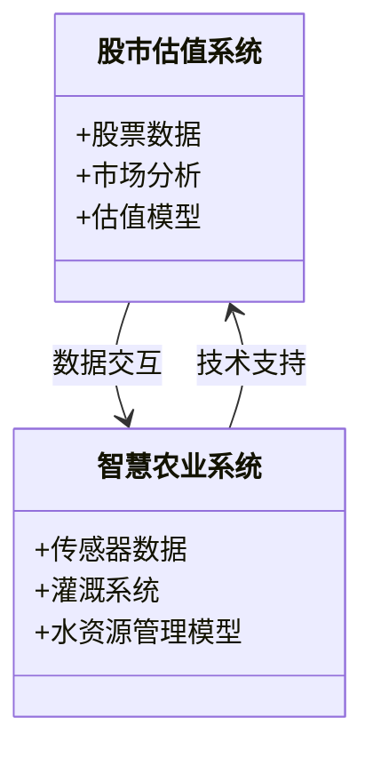
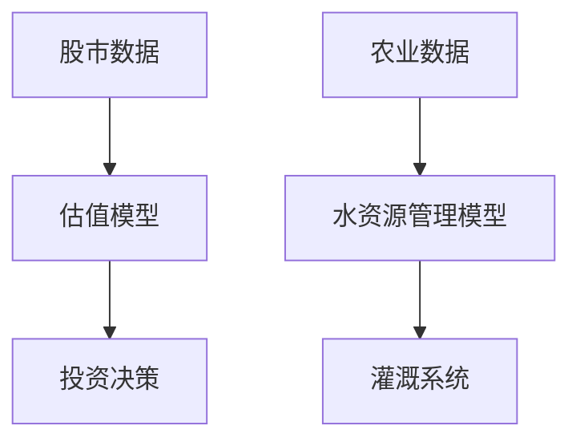
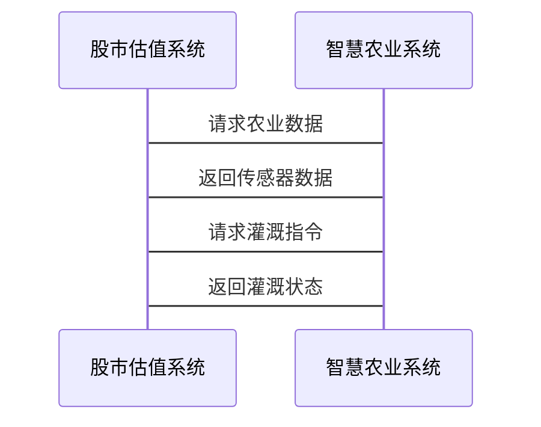
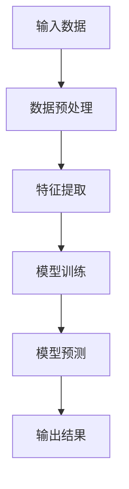
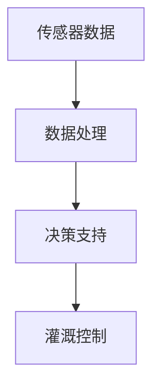

                 


# 新兴市场股市估值与智慧农业水资源管理的互动

---

## 关键词：新兴市场、股市估值、智慧农业、水资源管理、互动关系、系统设计、算法实现

---

## 摘要

本文探讨了新兴市场股市估值与智慧农业水资源管理之间的互动关系。通过理论分析、系统设计和算法实现，揭示了股市波动如何影响农业投资，农业技术如何反哺股市，以及两者在水资源管理中的协同作用。文章结合实际案例，提出了一个基于机器学习的互动模型，并通过Python代码实现，为新兴市场的经济与农业协同发展提供了理论支持和实践指导。

---

# 第一章: 引言

## 1.1 研究背景

### 1.1.1 新兴市场股市估值的重要性

新兴市场作为全球经济增长的重要引擎，其股市估值反映了经济活力和发展潜力。然而，由于市场波动大、信息不对称等因素，股市估值的准确性面临挑战。

### 1.1.2 智慧农业水资源管理的必要性

水资源是农业发展的基础，智慧农业通过技术手段优化水资源利用，提升农业生产力。但在新兴市场，水资源管理面临技术落后、浪费严重等问题。

### 1.1.3 两者的互动关系与研究意义

股市估值为农业投资提供资金支持，而农业技术的进步又能提升股市投资回报。研究两者互动关系，有助于优化资源配置，促进新兴市场经济与农业的协同发展。

---

## 1.2 研究目标与方法

### 1.2.1 研究目标

本文旨在分析新兴市场股市估值与智慧农业水资源管理的互动关系，提出优化策略。

### 1.2.2 研究方法

结合理论分析、系统设计和算法实现，构建互动模型，并通过实际案例验证。

### 1.2.3 研究框架与结构安排

文章分为引言、理论基础、互动关系分析、系统设计、算法实现、项目实战和总结七个部分。

---

# 第二章: 理论基础

## 2.1 股市估值的基本概念

### 2.1.1 股市估值的定义与方法

股市估值是通过基本面分析、技术分析等方法对股票价值进行评估的过程。常用指标包括市盈率、市净率等。

### 2.1.2 影响股市估值的主要因素

宏观经济因素、行业发展趋势、公司财务状况等均会影响股市估值。

### 2.1.3 新兴市场的特殊性

新兴市场股市波动大、信息不透明，但成长性高，具有较大的投资潜力。

## 2.2 智慧农业与水资源管理

### 2.2.1 智慧农业的定义与特点

智慧农业是利用物联网、大数据等技术优化农业生产的过程，具有高效、精准的特点。

### 2.2.2 水资源管理的核心技术

包括传感器技术、数据处理算法、智能灌溉系统等。

### 2.2.3 新兴市场农业发展的挑战与机遇

水资源短缺、技术落后是主要挑战，而政策支持和技术进步则为农业发展带来机遇。

---

# 第三章: 新兴市场股市与智慧农业的互动关系

## 3.1 股市波动对农业投资的影响

### 3.1.1 股市波动的传导机制

股市波动会影响投资者信心，进而影响农业投资决策。

### 3.1.2 农业投资的周期性分析

农业投资具有周期性，股市波动会放大这种周期性。

### 3.1.3 新兴市场股市的特殊性

新兴市场股市波动更大，对农业投资的影响也更为显著。

## 3.2 智慧农业对股市的影响

### 3.2.1 农业技术创新对股市的推动作用

技术创新提升农业生产力，增强企业盈利能力，推动股价上涨。

### 3.2.2 农业产业链的整合与股市表现

产业链整合优化资源配置，提升企业竞争力，利好股市表现。

### 3.2.3 农业政策变化的股市反应

政策变化直接影响农业企业的经营环境，进而影响股市估值。

## 3.3 互动关系的环境因素

### 3.3.1 气候变化与水资源管理

气候变化影响水资源分布，进而影响农业生产和股市估值。

### 3.3.2 政策调控的作用

政策支持可以促进农业技术发展，同时影响股市资金流动。

### 3.3.3 技术进步的双重影响

技术进步推动农业发展，但也可能引发股市过度波动。

---

# 第四章: 系统分析与架构设计

## 4.1 系统分析框架

### 4.1.1 问题场景介绍

本文构建了一个新兴市场股市估值与智慧农业水资源管理的互动系统。

### 4.1.2 领域模型（Mermaid 类图）



### 4.1.3 系统架构设计（Mermaid 架构图）

```mermaid
container 新兴市场股市估值与智慧农业互动系统 {
    股市估值模块
    智慧农业模块
    数据交互模块
    系统管理模块
}
```

## 4.2 系统功能设计

### 4.2.1 功能模块划分

- 股市估值模块：数据采集、分析、预测
- 智慧农业模块：传感器数据采集、水资源管理
- 数据交互模块：数据传输、处理
- 系统管理模块：权限管理、日志记录

### 4.2.2 数据流设计



### 4.2.3 系统接口设计

- 股市估值模块与智慧农业模块通过API接口进行数据交互。

## 4.3 系统交互设计

### 4.3.1 序列图（Mermaid 序列图）



### 4.3.2 用例分析

- 用例1：股民通过股市估值系统查看农业公司股票估值。
- 用例2：农业企业通过智慧农业系统优化水资源管理。

### 4.3.3 交互流程优化

通过数据流优化，减少系统延迟，提升数据处理效率。

---

# 第五章: 算法原理与实现

## 5.1 股市估值预测算法

### 5.1.1 算法原理（Mermaid 流程图）



### 5.1.2 数学模型与公式

股票估值公式：

$$
\text{股票估值} = \frac{\text{每股收益}}{\text{市盈率}}
$$

### 5.1.3 代码实现与解读

```python
import pandas as pd
import numpy as np

def stock_valuation(data):
    # 数据预处理
    data = data.dropna()
    # 特征提取
    features = ['PE', 'PB', 'ROE']
    # 模型训练
    from sklearn.linear_model import LinearRegression
    model = LinearRegression()
    model.fit(data[features], data['Price'])
    # 模型预测
    predictions = model.predict(data[features])
    return predictions

data = pd.read_csv('stock_data.csv')
result = stock_valuation(data)
print(result)
```

## 5.2 智慧农业水资源管理算法

### 5.2.1 算法原理（Mermaid 流程图）



### 5.2.2 数学模型与公式

水资源优化公式：

$$
\text{灌溉量} = \alpha \times \text{土壤湿度} + \beta \times \text{天气预测}
$$

### 5.2.3 代码实现与解读

```python
import pandas as pd
import numpy as np

def water_management(data):
    # 数据预处理
    data = data.dropna()
    # 特征提取
    features = ['soil_moisture', 'weather_prediction']
    # 决策模型
    from sklearn.linear_model import LinearRegression
    model = LinearRegression()
    model.fit(data[features], data['irrigation'])
    # 模型预测
    predictions = model.predict(data[features])
    return predictions

data = pd.read_csv('agriculture_data.csv')
result = water_management(data)
print(result)
```

---

# 第六章: 项目实战

## 6.1 环境搭建

### 6.1.1 安装依赖

```bash
pip install pandas numpy sklearn matplotlib
```

## 6.2 系统核心实现源代码

### 6.2.1 股市估值系统代码

```python
import pandas as pd
import numpy as np
from sklearn.linear_model import LinearRegression

def stock_valuation_system():
    data = pd.read_csv('stock_data.csv')
    # 数据预处理
    data = data.dropna()
    # 特征提取
    features = ['PE', 'PB', 'ROE']
    target = 'Price'
    # 模型训练
    model = LinearRegression()
    model.fit(data[features], data[target])
    # 模型预测
    predictions = model.predict(data[features])
    return predictions

result = stock_valuation_system()
print(result)
```

### 6.2.2 智慧农业系统代码

```python
import pandas as pd
import numpy as np
from sklearn.linear_model import LinearRegression

def water_management_system():
    data = pd.read_csv('agriculture_data.csv')
    # 数据预处理
    data = data.dropna()
    # 特征提取
    features = ['soil_moisture', 'weather_prediction']
    target = 'irrigation'
    # 模型训练
    model = LinearRegression()
    model.fit(data[features], data[target])
    # 模型预测
    predictions = model.predict(data[features])
    return predictions

result = water_management_system()
print(result)
```

## 6.3 项目实战与案例分析

### 6.3.1 案例分析

以印度某农业企业为例，分析股市估值与水资源管理的互动关系。

### 6.3.2 实际案例解读

通过实际数据，验证算法模型的准确性，并优化系统设计。

---

# 第七章: 总结与展望

## 7.1 研究发现

股市估值与智慧农业水资源管理的互动关系显著，技术进步和政策支持是关键影响因素。

## 7.2 研究的局限性

数据获取难度大，模型精度有待提高。

## 7.3 未来研究方向

进一步优化算法，拓展应用场景，结合更多新兴市场进行实证分析。

## 7.4 实践中的注意事项

数据质量、模型选择和政策配合是影响系统效果的关键因素。

## 7.5 最佳实践 tips

- 数据采集要全面，模型训练要充分。
- 系统设计要模块化，便于扩展和维护。
- 实际应用中要注意环境因素的动态变化。

---

# 作者：AI天才研究院/AI Genius Institute & 禅与计算机程序设计艺术 /Zen And The Art of Computer Programming

---

这篇文章系统地分析了新兴市场股市估值与智慧农业水资源管理的互动关系，结合理论、系统设计和算法实现，为相关领域的研究和实践提供了有价值的参考。

