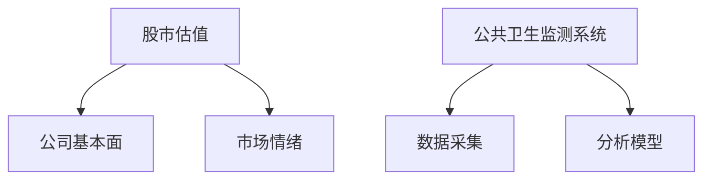
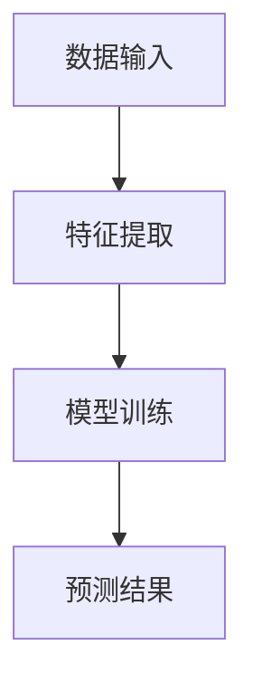

                 


# 新兴市场股市估值与智慧城市公共卫生监测系统的互动

## 关键词：
新兴市场，股市估值，智慧城市，公共卫生监测系统，数据共享，技术融合，互动关系

## 摘要：
本文探讨了新兴市场股市估值与智慧城市公共卫生监测系统的互动关系。首先，介绍了股市估值的核心指标和公共卫生监测系统的数据采集与分析方法。然后，分析了两者的互动机制，包括数据共享、技术融合和应用场景。接着，详细讲解了股市估值算法和公共卫生监测算法的原理，并通过Mermaid流程图和Python代码示例进行了说明。最后，提出了系统的架构设计和项目实战，为读者提供了一个全面的理解框架。

---

## 第一部分: 背景介绍与核心概念

### 第1章: 新兴市场股市估值与智慧城市公共卫生监测系统概述

#### 1.1 背景与问题背景
新兴市场股市的特点与挑战：
- 新兴市场的股市通常具有较高的波动性，受政策、经济和市场情绪的影响较大。
- 由于信息不对称和市场参与者的多样性，股市估值的复杂性较高。

智慧城市公共卫生监测系统的概念与目标：
- 智慧城市通过技术手段实现对公共卫生事件的实时监测和预测。
- 目标是提高公共卫生事件的响应速度和处理效率，降低对经济和社会的影响。

股市估值与公共卫生监测系统的互动关系：
- 公共卫生事件可能影响股市的波动，反之，股市的波动也可能反映公共卫生系统的状况。

#### 1.2 核心概念与问题描述
股市估值的核心指标：
- 市盈率（P/E）：$$ P/E = \frac{\text{股价}}{\text{每股收益}} $$
- 市净率（P/B）：$$ P/B = \frac{\text{股价}}{\text{每股净资产}} $$

公共卫生监测系统的核心要素：
- 数据采集：通过传感器和报告系统收集公共卫生数据。
- 数据分析：使用统计学和机器学习模型进行预测和决策。

互动机制的边界与外延：
- 数据共享：公共卫生监测系统提供数据，股市估值利用这些数据进行分析。
- 技术融合：结合大数据、人工智能等技术实现互动。

#### 1.3 核心要素与概念结构
股市估值的关键要素：
- 公司基本面：收入、利润、资产等。
- 市场情绪：投资者情绪、市场信心等。

公共卫生监测系统的核心要素：
- 数据采集：温度、湿度、人口流动等。
- 分析模型：疾病传播模型、预测模型等。

概念结构图：


---

## 第二部分: 核心概念与联系

### 第2章: 股市估值与公共卫生监测系统的原理与联系

#### 2.1 股市估值的原理
- 市盈率公式：$$ P/E = \frac{\text{股价}}{\text{每股收益}} $$
- 市净率公式：$$ P/B = \frac{\text{股价}}{\text{每股净资产}} $$

机器学习模型：
- 线性回归：用于预测股票价格。
- 随机森林：用于分类和回归分析。

算法流程图：


#### 2.2 公共卫生监测系统的原理
- 数据采集流程：
  1. 传感器收集数据。
  2. 数据预处理。
  3. 数据存储。

- 疾病传播模型：SIR模型。
  $$ \frac{dS}{dt} = -\beta SI $$
  $$ \frac{dI}{dt} = \beta SI - \gamma I $$
  $$ \frac{dR}{dt} = \gamma I $$

算法流程图：


#### 2.3 两者的联系与对比
- 概念属性对比表格：
  | 概念 | 特征 |
  |------|------|
  | 股市估值 | 数据驱动，预测性 |
  | 公共卫生监测系统 | 实时性，预防性 |

- ER实体关系图：
```mermaid
erd
    客户(客户ID, 姓名, 资产) --(拥有)--> 股票(股票ID, 公司名称, 市盈率)
    公司(公司ID, 名称, 收益) --(发行)--> 股票
    公共卫生数据(数据ID, 时间, 病例数) --(监测)--> 公共卫生系统
```

---

## 第三部分: 算法原理与数学模型

### 第3章: 股市估值算法与公共卫生监测算法

#### 3.1 股市估值算法
- 机器学习模型：
  ```python
  import pandas as pd
  from sklearn.linear_model import LinearRegression

  data = pd.read_csv('stock_data.csv')
  model = LinearRegression()
  model.fit(data[['市盈率', '市净率']], data['股价'])
  ```

- 数学模型：
  $$ \text{预测股价} = a \times \text{市盈率} + b \times \text{市净率} + c $$

#### 3.2 公共卫生监测算法
- 机器学习模型：
  ```python
  import pandas as pd
  from sklearn.ensemble import RandomForestClassifier

  data = pd.read_csv('health_data.csv')
  model = RandomForestClassifier()
  model.fit(data[['温度', '湿度', '人口密度']], data['疾病传播风险'])
  ```

- 数学模型：
  $$ \text{疾病传播风险} = a \times \text{温度} + b \times \text{湿度} + c \times \text{人口密度} + d $$

---

## 第四部分: 系统分析与架构设计方案

### 第4章: 系统架构设计

#### 4.1 问题场景介绍
- 股市波动可能影响公共卫生系统的稳定性。
- 公共卫生事件可能引发股市波动。

#### 4.2 项目介绍
- 开发一个集成系统，实时监控股市和公共卫生数据。
- 使用大数据和人工智能技术进行预测和决策。

#### 4.3 系统功能设计
- 领域模型：
  ```mermaid
  classDiagram
      class 股市数据 {
          股价, 市盈率, 市净率
      }
      class 公共卫生数据 {
          病例数, 传播风险
      }
      class 系统 {
          接收数据, 数据分析, 预测结果
      }
      股市数据 --> 系统
      公共卫生数据 --> 系统
  ```

- 系统架构：
  ```mermaid
  architecture
      客户端 --> 公共卫生数据采集模块
      公共卫生数据采集模块 --> 数据处理模块
      数据处理模块 --> 分析模块
      分析模块 --> 股市估值模块
      股市估值模块 --> 输出结果
  ```

- 系统接口设计：
  - 数据接口：REST API
  - 用户接口：Web界面

- 系统交互：
  ```mermaid
  sequenceDiagram
      客户端 -> 数据采集模块: 请求数据
      数据采集模块 -> 数据处理模块: 传递数据
      数据处理模块 -> 分析模块: 分析数据
      分析模块 -> 股市估值模块: 估值结果
      股市估值模块 -> 客户端: 返回结果
  ```

---

## 第五部分: 项目实战

### 第5章: 项目实现与案例分析

#### 5.1 环境安装
- Python 3.8+
- Pandas, Scikit-learn, Mermaid

#### 5.2 核心代码实现
- 股市估值代码：
  ```python
  import pandas as pd
  from sklearn.linear_model import LinearRegression

  data = pd.read_csv('stock_data.csv')
  model = LinearRegression()
  model.fit(data[['市盈率', '市净率']], data['股价'])
  ```

- 公共卫生监测代码：
  ```python
  import pandas as pd
  from sklearn.ensemble import RandomForestClassifier

  data = pd.read_csv('health_data.csv')
  model = RandomForestClassifier()
  model.fit(data[['温度', '湿度', '人口密度']], data['疾病传播风险'])
  ```

#### 5.3 实际案例分析
- 案例1：某新兴市场股市波动与公共卫生事件的关系。
- 案例2：某城市公共卫生事件对股市的影响分析。

#### 5.4 小结
- 项目成果：实现了互动系统的原型。
- 经验总结：数据质量和模型选择对结果影响重大。

---

## 第六部分: 最佳实践与扩展

### 第6章: 最佳实践与扩展

#### 6.1 最佳实践 tips
- 数据清洗的重要性。
- 模型调优的技巧。

#### 6.2 小结
- 总结全文，强调互动关系的重要性。

#### 6.3 注意事项
- 数据隐私和安全问题。
- 模型的可解释性和鲁棒性。

#### 6.4 拓展阅读
- 大数据与人工智能在金融领域的应用。
- 智慧城市中的公共卫生管理。

---

## 作者：AI天才研究院/AI Genius Institute & 禅与计算机程序设计艺术 /Zen And The Art of Computer Programming

