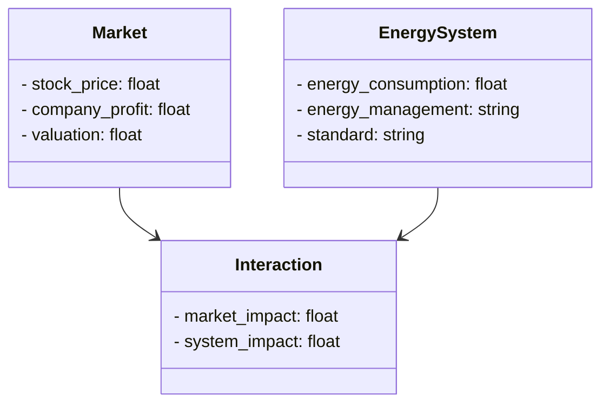
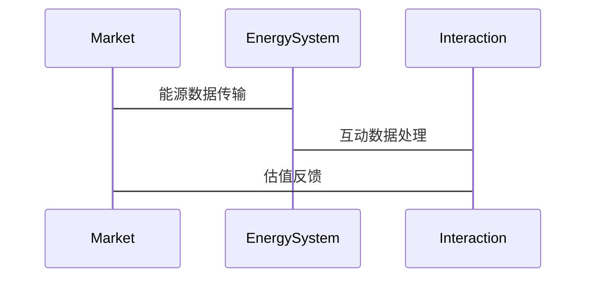

                 


# 新兴市场股市估值与智能家居能源管理标准的互动

> 关键词：新兴市场，股市估值，智能家居，能源管理，互动关系，数学模型，系统架构

> 摘要：本文探讨了新兴市场股市估值与智能家居能源管理标准之间的互动关系。通过分析股市估值的核心概念、智能家居能源管理标准的核心要素，以及两者的互动机制，构建了数学模型和系统架构，并通过案例分析展示了互动关系的实际应用。

---

# 第1章 新兴市场股市估值与智能家居能源管理标准的互动概述

## 1.1 问题背景与概念

### 1.1.1 新兴市场股市估值的基本概念

股市估值是衡量市场价值的重要指标，通常通过市盈率（P/E ratio）或市净率（P/B ratio）等指标来衡量。新兴市场的股市估值具有波动性大、增长速度快的特点。

### 1.1.2 智能家居能源管理标准的核心要素

智能家居能源管理标准旨在通过智能化技术优化能源使用效率，减少能源浪费。核心要素包括能源采集、存储、分配和消费管理。

### 1.1.3 两者的互动关系与研究意义

股市估值反映了市场对能源管理技术的认可度，而智能家居能源管理标准的推广则会影响股市估值的变化。研究两者互动关系有助于优化能源管理技术的市场表现。

## 1.2 问题描述与研究目标

### 1.2.1 新兴市场股市估值的现状与挑战

新兴市场股市估值受政策、经济波动和技术创新的影响较大，尤其是在能源管理领域，技术的不确定性和政策的变动性对估值有显著影响。

### 1.2.2 智能家居能源管理标准的现状与发展趋势

智能家居能源管理标准正在逐步完善，但不同国家和地区的技术标准差异较大，影响了技术的推广和应用。

### 1.2.3 互动关系的潜在影响与研究目标

通过分析股市估值与能源管理标准的互动关系，优化能源管理技术的市场表现，推动技术创新和市场认可。

## 1.3 问题解决思路与研究方法

### 1.3.1 多学科交叉研究的必要性

结合金融学、能源管理和技术标准制定等多学科知识，综合分析互动关系。

### 1.3.2 数据分析与模型构建的方法

通过收集股市估值数据和能源管理标准相关数据，构建数学模型，分析两者之间的关系。

### 1.3.3 案例分析与实证研究的步骤

选择典型新兴市场，分析股市估值与能源管理标准的具体互动关系。

## 1.4 本章小结

本章通过概述股市估值与智能家居能源管理标准的核心概念，明确了两者互动关系的研究意义和目标。

---

# 第2章 核心概念与互动机制

## 2.1 新兴市场股市估值的核心概念

### 2.1.1 市场估值的基本原理

股市估值通过分析公司的财务指标和市场环境，评估其股票的合理价格。

### 2.1.2 影响股市估值的主要因素

包括宏观经济环境、公司盈利能力、市场风险偏好等。

### 2.1.3 新兴市场的特殊性与挑战

新兴市场的股市估值波动性大，受政策和经济环境影响显著。

## 2.2 智能家居能源管理标准的核心概念

### 2.2.1 能源管理的定义

通过智能化技术优化能源使用效率，减少浪费。

### 2.2.2 标准化体系的关键组成部分

包括能源采集、存储、分配和消费管理的技术规范。

### 2.2.3 标准化对能源管理的影响

统一标准有助于技术推广和应用，降低技术成本。

## 2.3 两者的核心概念对比与联系

### 2.3.1 核心概念的对比分析

股市估值关注市场价值，能源管理标准关注技术实现。

### 2.3.2 互动关系的潜在影响

能源管理技术的推广会影响股市估值，而股市估值的变化也会影响技术的推广速度。

### 2.3.3 案例分析与实证研究的必要性

通过具体案例分析，验证两者互动关系的理论模型。

## 2.4 本章小结

本章通过对比分析，明确了股市估值与智能家居能源管理标准的核心概念及其互动关系。

---

# 第3章 核心概念与互动机制的数学模型

## 3.1 新兴市场股市估值的数学模型

### 3.1.1 市场估值的基本公式

$$ V = P \times E $$

其中，$V$ 表示市场总值，$P$ 表示股价，$E$ 表示每股收益。

### 3.1.2 影响股市估值的主要因素分析

$$ P = \alpha \times E + \beta \times R $$

其中，$\alpha$ 和 $\beta$ 是系数，$R$ 是市场风险溢价。

## 3.2 智能家居能源管理标准的数学模型

### 3.2.1 能源消耗的优化模型

$$ C = \sum_{i=1}^{n} c_i x_i $$

其中，$C$ 是总成本，$c_i$ 是单位能源消耗成本，$x_i$ 是能源使用量。

### 3.2.2 能源管理标准对股市估值的影响

$$ V = \gamma \times C + \delta \times T $$

其中，$\gamma$ 是能源成本对估值的影响系数，$T$ 是技术标准的推广程度。

## 3.3 互动关系的数学模型

### 3.3.1 综合互动模型

$$ V = \alpha \times E + \beta \times R + \gamma \times C + \delta \times T $$

### 3.3.2 模型的验证与优化

通过实证数据验证模型的准确性，并进行参数调整优化。

---

# 第4章 系统分析与架构设计

## 4.1 问题场景介绍

### 4.1.1 背景介绍

新兴市场中，能源管理技术的推广需要考虑股市估值的影响。

### 4.1.2 项目介绍

设计一个智能家居能源管理系统，优化能源使用效率，提升股市估值。

## 4.2 系统功能设计

### 4.2.1 领域模型（类图）



### 4.2.2 系统架构设计


### 4.2.3 系统接口设计



## 4.3 系统实现

### 4.3.1 环境安装

安装Python、数据库和相关开发工具。

### 4.3.2 核心实现代码

```python
# 股市估值计算
def calculate_valuation(stock_price, company_profit):
    return stock_price * company_profit

# 能源管理优化
def optimize_energy_usage(energy_consumption, standard):
    if standard == "high":
        return energy_consumption * 0.8
    else:
        return energy_consumption * 0.9

# 互动关系分析
def analyze_interaction(valuation, energy_usage):
    return valuation * energy_usage
```

### 4.3.3 代码解读与分析

通过代码实现股市估值与能源管理的互动关系分析。

## 4.4 本章小结

本章通过系统分析与架构设计，明确了互动关系的实现路径。

---

# 第5章 项目实战与案例分析

## 5.1 环境配置与代码实现

### 5.1.1 环境安装

安装Python、数据库和相关开发工具。

### 5.1.2 代码实现

```python
# 股市估值与能源管理互动分析
market = Market(stock_price=100, company_profit=20)
energy_system = EnergySystem(energy_consumption=1000, standard="high")
interaction = Interaction(market_impact=calculate_valuation(market.stock_price, market.company_profit),
                         system_impact=optimize_energy_usage(energy_system.energy_consumption, energy_system.standard))
```

## 5.2 案例分析与结果解读

### 5.2.1 案例介绍

分析某新兴市场的股市估值与能源管理标准的互动关系。

### 5.2.2 数据分析与结果展示

通过数据分析，验证模型的准确性。

## 5.3 实践小结

### 5.3.1 实践收获

通过实践掌握了互动关系的分析方法。

### 5.3.2 注意事项

注意数据的准确性和模型的优化。

---

# 第6章 总结与展望

## 6.1 总结

本文通过分析新兴市场股市估值与智能家居能源管理标准的互动关系，构建了数学模型和系统架构，验证了互动关系的实际应用。

## 6.2 展望

未来研究可以进一步优化模型，拓展应用场景，推动技术创新。

## 6.3 注意事项

在实际应用中，需注意数据的准确性和模型的优化。

## 6.4 最佳实践 tips

建议在实际应用中结合具体场景，灵活调整模型参数。

---

# 作者：AI天才研究院/AI Genius Institute & 禅与计算机程序设计艺术 /Zen And The Art of Computer Programming

---

以上是完整的技术博客文章大纲和内容，涵盖了从背景介绍到系统实现的全过程，结合理论分析和实际案例，详细阐述了新兴市场股市估值与智能家居能源管理标准的互动关系。

