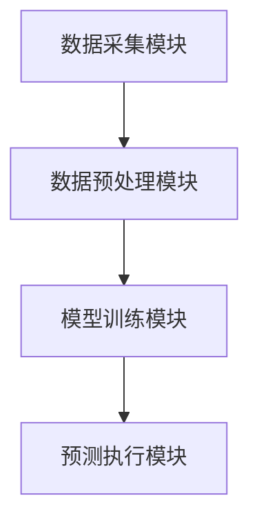
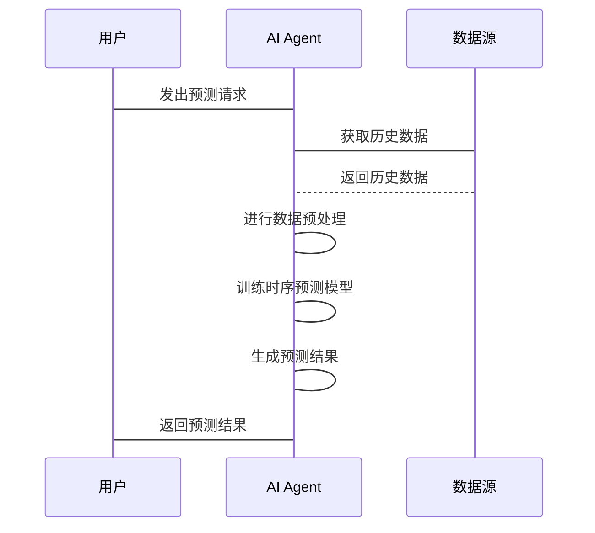

                 

# 时序预测：赋予AI Agent预测未来的能力

## 关键词：时序预测、AI Agent、时间序列、机器学习、深度学习

## 摘要：  
时序预测是人工智能领域中的一个重要分支，它通过分析时间序列数据，帮助AI Agent预测未来的趋势和变化。本文从时序预测的基本概念、核心算法、系统架构到实际应用案例，全面探讨如何赋予AI Agent预测未来的能力。我们将深入分析ARIMA、Prophet和LSTM等经典算法的原理与实现，并结合实际案例，展示如何将时序预测应用于股票价格预测项目中。通过本文，读者将能够理解时序预测的核心思想，并掌握如何在实际项目中应用这些技术。

---

# 第1章：时序预测概述

## 1.1 时序预测的定义与背景

### 1.1.1 时序预测的定义  
时序预测（Time Series Forecasting）是一种通过分析历史数据，预测未来趋势的技 术。它利用时间序列数据中的模式和规律，帮助AI Agent做出智能决策。

### 1.1.2 时序预测的应用场景  
时序预测广泛应用于多个领域：  
1. **金融领域**：股票价格预测、汇率预测。  
2. **气象领域**：天气预测、气候分析。  
3. **工业领域**：设备故障预测、生产优化。  
4. **交通领域**：交通流量预测、路线优化。  

### 1.1.3 时序预测的核心问题  
1. 数据的时序特性：趋势、季节性、周期性。  
2. 数据的不确定性：噪声、异常值。  
3. 模型的选择与优化。  

---

## 1.2 时序预测的核心概念

### 1.2.1 时间序列的基本特征  
时间序列数据具有以下基本特征：  
1. **趋势**：数据长期的上升或下降趋势。  
2. **季节性**：数据在特定周期内重复出现的模式。  
3. **周期性**：数据在更长周期内的重复模式。  
4. **随机性**：数据中的噪声和不确定性。  

### 1.2.2 时序预测的数学模型  
时序预测的数学模型可以分为以下几类：  
1. **线性模型**：如ARIMA（AutoRegressive Integrated Moving Average）。  
2. **非线性模型**：如LSTM（Long Short-Term Memory）。  
3. **基于统计的方法**：如Prophet。  

### 1.2.3 时序预测的评价指标  
常用的评价指标包括：  
1. **均方误差（MSE）**：预测值与真实值的平方差的平均值。  
2. **平均绝对误差（MAE）**：预测值与真实值的绝对差的平均值。  
3. **R²（决定系数）**：衡量模型拟合数据的能力。  

---

# 第2章：时序预测的经典算法原理

## 2.1 经典时序预测算法概述  

### 2.1.1 ARIMA算法  
ARIMA（AutoRegressive Integrated Moving Average）是一种经典的时序预测算法。它通过自回归（AR）和移动平均（MA）的组合，捕捉数据中的趋势和季节性。

### 2.1.2 Prophet算法  
Prophet是由Facebook开源的时序预测算法，特别适用于具有明确时间依赖性的数据。它基于贝叶斯回归和时间序列分解的方法，能够自动处理缺失值和异常值。

### 2.1.3 LSTM算法  
LSTM（Long Short-Term Memory）是一种基于递归神经网络（RNN）的算法，特别适合处理长序列数据。它通过记忆单元（Cell）和门控机制（Gate）来捕捉时间序列中的长期依赖关系。

---

## 2.2 ARIMA算法原理  

### 2.2.1 ARIMA算法的基本原理  
ARIMA算法的核心思想是将时间序列分解为趋势、季节性和随机性三部分，并通过AR和MA模型分别建模。

### 2.2.2 ARIMA算法的数学模型  
ARIMA模型的数学表达式为：  
$$ y_t = \phi_1 y_{t-1} + \phi_2 y_{t-2} + \dots + \phi_p y_{t-p} + \theta_1 \epsilon_{t-1} + \dots + \theta_q \epsilon_{t-q} + \epsilon_t $$  

### 2.2.3 ARIMA算法的实现步骤  
1. 数据预处理：检查数据的平稳性。  
2. 参数选择：确定AR和MA的阶数。  
3. 模型训练：拟合ARIMA模型。  
4. 模型预测：使用训练好的模型进行预测。  

---

## 2.3 Prophet算法原理  

### 2.3.1 Prophet算法的基本原理  
Prophet算法基于时间序列分解，将数据分解为趋势、季节性和余项三部分，并通过贝叶斯回归进行建模。

### 2.3.2 Prophet算法的数学模型  
Prophet的数学模型可以表示为：  
$$ y_t = g(t) + s(t) + \epsilon_t $$  
其中，$g(t)$表示趋势，$s(t)$表示季节性，$\epsilon_t$表示余项。

### 2.3.3 Prophet算法的实现步骤  
1. 数据预处理：确保数据格式符合要求。  
2. 模型训练：使用Prophet库训练模型。  
3. 模型预测：生成预测结果并可视化。  

---

## 2.4 LSTM算法原理  

### 2.4.1 LSTM算法的基本原理  
LSTM通过记忆单元和门控机制来捕捉时间序列中的长期依赖关系。它的核心组件包括输入门、遗忘门和输出门。

### 2.4.2 LSTM算法的数学模型  
LSTM的核心运算包括：  
1. 遗忘门：$$ f_t = \sigma(W_f x_t + U_f h_{t-1} + b_f) $$  
2. 输入门：$$ i_t = \sigma(W_i x_t + U_i h_{t-1} + b_i) $$  
3. 记忆单元：$$ g_t = \tanh(W_g x_t + U_g h_{t-1} + b_g) $$  
4. 输出门：$$ o_t = \sigma(W_o x_t + U_o h_{t-1} + b_o) $$  
5. 当前状态：$$ h_t = o_t \cdot \tanh(g_t) $$  

### 2.4.3 LSTM算法的实现步骤  
1. 数据预处理：将时间序列数据转换为输入格式。  
2. 模型构建：定义LSTM网络结构。  
3. 模型训练：使用训练数据拟合模型。  
4. 模型预测：生成预测结果并评估性能。  

---

# 第3章：时序预测与AI Agent的结合

## 3.1 AI Agent的时序预测需求  

### 3.1.1 AI Agent的核心功能  
AI Agent需要具备感知环境、分析数据、做出决策和执行任务的能力。时序预测是其分析数据的重要组成部分。

### 3.1.2 时序预测在AI Agent中的应用  
1. **智能助手**：预测用户行为，优化交互流程。  
2. **自动驾驶**：预测交通流量，优化行驶路线。  
3. **智能交易**：预测股票价格，优化投资策略。  

---

## 3.2 时序预测在AI Agent中的系统架构  

### 3.2.1 系统功能设计  
AI Agent的时序预测系统包括数据采集、数据预处理、模型训练和预测执行四个模块。

### 3.2.2 系统架构设计  
以下是系统的架构图：  

### 3.2.3 系统接口设计  
1. 数据采集接口：接收外部数据源的输入。  
2. 数据预处理接口：处理数据并生成训练数据。  
3. 模型训练接口：训练时序预测模型。  
4. 预测执行接口：输出预测结果。  

---

## 3.3 时序预测系统的交互流程  

### 3.3.1 交互流程设计  
以下是系统的交互流程图：  

---

# 第4章：时序预测的项目实战

## 4.1 股票价格预测项目介绍  

### 4.1.1 项目背景  
股票价格预测是一个典型的时序预测问题。通过分析历史股价数据，预测未来的价格走势。

### 4.1.2 数据来源与预处理  
1. 数据来源：获取某只股票的历史股价数据。  
2. 数据预处理：清洗数据、处理缺失值、归一化处理。  

---

## 4.2 模型训练与优化  

### 4.2.1 模型选择  
选择合适的时序预测模型，如ARIMA、Prophet或LSTM。

### 4.2.2 模型训练  
使用训练数据拟合模型，调整模型参数以优化预测效果。

### 4.2.3 模型评估  
通过均方误差（MSE）、平均绝对误差（MAE）等指标评估模型性能。

---

## 4.3 结果分析与可视化  

### 4.3.1 预测结果分析  
分析模型的预测结果，判断其与真实值的偏差。

### 4.3.2 结果可视化  
将真实值和预测值绘制在同一图表中，直观展示预测效果。

---

# 第5章：总结与展望

## 5.1 时序预测的核心思想  
时序预测的核心思想是通过分析时间序列数据中的模式和规律，预测未来的趋势。

## 5.2 时序预测的未来展望  
随着深度学习技术的不断发展，时序预测算法将更加智能化和高效化。未来，时序预测将在更多领域得到广泛应用。

## 5.3 最佳实践 Tips  
1. 数据预处理是时序预测的关键步骤。  
2. 模型选择应根据数据特性进行。  
3. 模型评估需结合业务需求。  

---

# 作者：AI天才研究院 & 禅与计算机程序设计艺术

